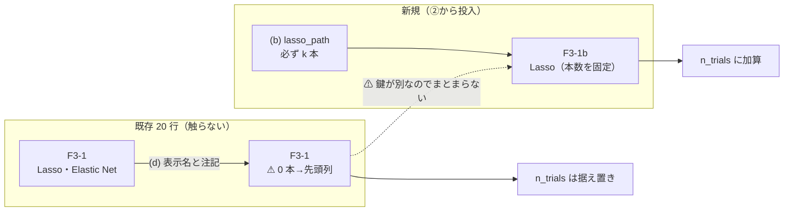
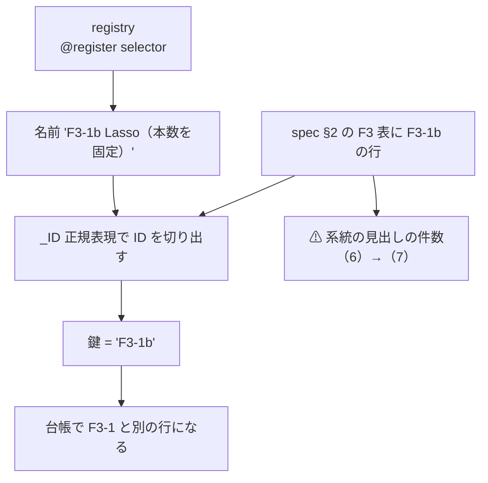

# F3-1 Lasso の裁定の反映 ＋ LightGBM × 断面 × 閾値売買

⚠ **2 タスクで 1 プラン。** ①の裁定が②の config の中身（どの選別を入れるか）を決めるので、分けると②のプランが①待ちで書けない。先例: [edge-drift-bias.md](archive/edge-drift-bias.md)。

- ① [TODO](../../TODO.md) 「F3-1 Lasso の「本数 1.0」行は選別ではなくフォールバックだった」
- ② [TODO](../../TODO.md) 「LightGBM × 断面（own cs rel ll）× 閾値売買」（親: 「GPU 系を閾値売買でも回せるようにする」）

## 0. 目的と背景

### 0-1. ①の中身

`ail/selectors/embedded.py:22-26` の `F3-1 Lasso` は `k` を受け取りながら使っておらず、`LassoCV` が選ぶ α が強すぎて **35 本すべての係数が厳密に 0** になったとき、`keep or X.columns[argsort(-|coef|)][:1]` の `or` が発火して **列の並び順どおり先頭の 1 本**を返していた【実測 2026-09-13。同じ表で `LassoCV` を直接叩いて再現】。

⚠ **台帳の行は数字としては正しいが、名前が中身と合っていない。**

台帳 §2 の F3-1 行は **20 行**【実測 2026-09-13】:

| 本数（fold 平均） | 行数 | 中身 |
| ---: | ---: | --- |
| **1.0** | **11** | ⚠ **5 fold とも係数が全部 0 → フォールバック。選別していない** |
| 1.2〜1.6 | 4 | 一部の fold だけフォールバック |
| 2.2 / 5.0 / 6.2 | 5 | 本来の選別が働いている |

判定の内訳は **保留 8・落とす 12・採る 0**。⚠ **この不具合が「採る」の判断を動かした行は 1 つも無い**（別に §5 の配線の検査に 11 行）。

### 0-2. 利用者の裁定（2026-09-13）

**(d)＋(b) 併用。**

| | 中身 |
| --- | --- |
| **(d)** 既存 20 行 | ⚠ **実装を変えず、表示名と注記だけ正直に直す。** ⚠ **数字は 1 つも動かさない・`n_trials` も動かさない**（[rules.md 14-10 規約 5](../specs/experiments/feature-discovery/rules.md)「既存行は再計算しない」） |
| **(b)** 新実装 | `lasso_path` で **必ず k 本残す**選別を ⚠ **別 ID の新手法**として足す。②の実行から投入し、⚠ **新規の試行として数える** |

この図の主張: ⚠ **既存行と新実装は交わらない。** 別 ID なので台帳の鍵が割れ、同じ行にまとまらない。



### 0-3. ②の中身

閾値売買に **`own cs rel ll`（断面）の層が 1 本も無い**。`gpu_lgbm_cs`（毎日往復）と同じ表・同じ選別で閾値売買を回し、差を**検証方式だけの差**として読む（[rules.md 13-8](../specs/experiments/feature-discovery/rules.md) の橋渡し）。

⚠ **表は作り直さない。** `data/features/gpu_lgbm_cs/d.parquet`（**96,769 行 × 134 列**）と `_leak` の両方が既にある【実測 2026-09-13】ので `features_from` で借りる。

## 1. 対応方針

### Phase 1 —（d）既存 20 行の表示名と注記

⚠ **触るのはカタログの 1 行だけ。** 台帳 `ledger.md` は生成物（`cli/report.py --catalog`）なので直接編集しない。

- `docs/specs/experiments/feature-discovery.md` §2 の **F3-1 行**
  - 手法: `Lasso・Elastic Net` → ⚠ **`Lasso・Elastic Net（⚠ 0 本→先頭列）`**
  - 見どころ: ⚠ **不具合の事実と、どの行がそれに当たるか（本数 1.0）を 1 文で足す**
- ⚠ **`[method.F3-1]` の `next` は書かない**（`catalog_notes.toml` は**未実施**の手法の欄。F3-1 は実装済み）

### Phase 2 —（b）新 ID `F3-1b` の実装

この図の主張: ⚠ **ID を新しくしないと既存行と同じ鍵にまとまる。** 鍵はカタログ ID である（`catalog.canonical`）。



| 触るもの | 中身 |
| --- | --- |
| `ail/selectors/embedded.py` | `F3-1b Lasso（本数を固定）` を追加（`lasso_path`） |
| `ail/catalog.py` | ⚠ **`_ID` を `^(F\d-\d+[a-z]?)\b` に**（いまは `F3-1b` が `F3-1` に化ける…ではなく **1 文字も一致しない**） |
| `docs/specs/experiments/feature-discovery.md` | §2 F3 表に F3-1b の行 ／ 見出し `（6）`→`（7）` ／ §2 見出しと §7 の `25 件`→`26 件` |
| `tests/test_catalog.py` | ⚠ **25 → 26・F3 の 6 → 7・実装済み ID の一覧**（⚠ **この検査は「黙って減ったら気づく」ための仕掛けなので、意図して直す**） |
| `ail/catalog.py` の docstring / `cli/ledger.py` の図のラベル | `25 件` の記述 3 か所 |
| `tests/` | ⚠ **F3-1b の新規テスト**（後述の受け入れ条件） |

**実装の中身（⚠ 回す前に固定する。[rules.md 13-3 規約 4](../specs/experiments/feature-discovery/rules.md)）**

1. `lasso_path(X, y, n_alphas=100)` を α の**強い側から**辿る
2. ⚠ **非ゼロ係数が k 本以上になった最初の α** を採り、そこで `|coef|` の大きい順に **ちょうど k 本**返す
3. ⚠ **どの α でも k 本に届かない場合は、届いた本数だけ返す**（k に満たない本数をそのまま返す）
   - ⚠ **返す本数そのものを信号にする。** 台帳の「本数」が k を下回って見えるので、⚠ **F3-1 の穴を見つけたのと同じ場所に出る**
   - ⚠ **新しい配線は足さない**（`ctx` に書いても読む側がいない。⚠ **読まれない記録は無いのと同じ**）
4. ⚠ **経路のどこでも 0 本なら止める**（`SystemExit`）。⚠ **黙って代わりの列は返さない** — それが本タスクの主題である
5. ⚠ **`k` は config が渡す値をそのまま使う**（②では 32）。`n_alphas=100` も事前固定
6. 決定性: `lasso_path` は座標降下で乱数を使わない。⚠ **`ctx["seed"]` は使わない**（使わないことを明示する）

⚠ **`lasso_path` には `n_alphas` を渡す**（`alphas` は配列しか受けない）。⚠ **1.7 で非推奨になったのは `LassoCV` の `n_alphas` のほうで、`lasso_path` ではない**【実測 2026-09-13。scikit-learn 1.7.2】。

### Phase 3 — ②の config

`config/experiment/trade_cs_lgbm_a.toml` を **1 本だけ**足す。

| key | 値 | 根拠 |
| --- | --- | --- |
| `features_from` | `"gpu_lgbm_cs"` | ⚠ **表を作り直さない**（13-8）。`targets = "company"` は表に焼き込み済み |
| `feature_layers` | `["own","cs","rel","ll"]` | `gpu_lgbm_cs` と同じ |
| `model` / `k` | `LightGBM` / `32` | 同上 |
| `selectors` | 既存 4 本 **＋ `F3-1b`** | ⚠ **既存 4 本で橋渡しが成立する。** F3-1b は**上乗せの 1 列**で、橋渡しを壊さない |
| `[trading]` | `style="threshold"` / `thresholds=[50,55,60]` / `form="shared"` | ⚠ **(A) 共通だけ**。先例 `sel_lgbm_two`・比較相手の既存行が (A) にしか無い |
| `validation.split` | `walk_forward_dates` | 閾値売買は日付で fold を切る（13-6 の 1） |
| `validation.embargo_bars` | **1**（`gpu_lgbm_cs` と同じ） | ✅ **決めた（2026-09-13）**: ⚠ **embargo は断面の層の性質であって検証方式ではない** — `cs` / `rel` は**同じ時刻の他銘柄**を見るので境目を 1 本空ける。`ail/validation/splits.py:72-73` は訓練の切り口を `horizon_min + embargo_bars × bar_minutes` 分だけ手前に引くだけで、⚠ **日付 fold でもそのまま効く**。⚠ **0 にすると橋渡しに 2 つ目の差が入る** |

⚠ **`evaluate_trading` は `validation.split` を読まない**（必ず `folds_by_dates`。13-6 の 1）。⚠ **`split` を書くのは記録のためで、効くのは `embargo_bars` のほう**【実測 2026-09-13。`cli/run.py:120,128`】。

✅ **config の差は機械で突き合わせた**（`tomllib` で全 key）: 差は `features_from` ／ `name` ／ `selectors`（＋F3-1b の 1 本だけ）／ `[trading]` 3 key ／ `validation.split` の **7 つだけ**。⚠ **`embargo_bars`・`k`・`model`・`feature_layers` は 1 文字も違わない。**

⚠ **F3-1（壊れているほう）も残す。** 同じ実行・同じ fold で F3-1 と F3-1b が並ぶので、⚠ **「フォールバックが効いていたのか」が直接読める対照になる**。

### Phase 4 — 実行

```bash
python3 -m cli.run --experiment trade_cs_lgbm_a --ignore-gate
python3 -m cli.run --experiment trade_cs_lgbm_a --leak --ignore-gate   # ⚠ 対照は毎回通す（14-10 規約 6）
```

⚠ **`--ignore-gate` は必須である**（⚠ **1 度目に付け忘れて回し直した**）。⚠ **[14-10 規約 2](../specs/experiments/feature-discovery/rules.md) で門は診断に降格した**（値は記録するが、回すかどうかを門で決めない）のに、⚠ **`cli/run.py` の `apply_gate` はいまも門で止める**。⚠ **規約と実装が食い違っており、付け忘れると黙って 1 行も回らずに終わる。**

⚠ **この層は 4 手法とも門前だった**【実測 2026-09-13】。⚠ **だから「回さない」ではない**（14-10 規約 1）:

| 手法 | holdout AUC（門は 0.52） | 買い% 幅（門は 20 点） |
| --- | ---: | ---: |
| 全部使う（基準） | 0.496 | 0.70 |
| F3-3 並べ替え(MDA) | 0.508 | 3.23 |
| F3-1 Lasso | 0.486 | 2.50 |
| **F3-1b Lasso（本数を固定）** | 0.472 | ⚠ **14.70** |

⚠ **既にここで (b) の効きが見えている**: ⚠ **F3-1b の買い% 幅は F3-1 の 5.9 倍**（14.70 対 2.50）。⚠ **先頭列 1 本では予測が動かなかったということである。** ⚠ **ただし AUC は逆に下がっている**（0.486 → 0.472）ので、⚠ **「幅が出た ＝ 当たる」ではない。**

⚠ **中断した 1 度目の 2 ディレクトリは消した**（`runs/2026-09-13T12-05-52_trade_cs_lgbm_a` と `_leak`）。⚠ **結果を 1 行も出しておらず、既存 103 実行はどれも `result.csv` を持っている**（門前で止まった記録を残した先例が無い）ため。⚠ **消したこと自体はここに残す。**

⚠ **費用の見積り【推測】: 本番 ＋ leak で 10〜25 分。** 根拠は `sel_lgbm_two`（35 列・1 分 44 秒）に対し ⚠ **MDA が 134 列で約 4 倍**になること。⚠ **見積りは 3 回続けて外している**（MLP は 1 桁過大・`sel_lgbm_two` も過大）ので、⚠ **回すときに実測して記録に残す**。

### Phase 5 — 台帳・検算・記録

- `python3 -m cli.report --catalog` で台帳を作り直す
- ⚠ **検算**（過去 3 回と同じ形）
  - 既存の行で **消えた鍵 0・数字が変わった鍵 0**
  - **leak 対照が跳ねること**
  - 表の指紋が `gpu_lgbm_cs` と一致すること
  - 基準線が既存の閾値売買の行と一致すること
  - `pytest -q tests`（いま 276 件）
- 記録を `docs/specs/experiments/lasso-fix-cs-threshold.md` に残す

## 2. 影響範囲

| 触る | 触らない |
| --- | --- |
| `ail/selectors/embedded.py`（追加のみ） | ⚠ **既存 `sel_lasso` の中身**（(d) の約束） |
| `ail/catalog.py` の `_ID` | 判定式・`is_trial`・`KEY` |
| spec §2 のカタログ表 | ⚠ **`runs/` の既存 103 ディレクトリ**（1 バイトも触らない） |
| `config/experiment/` に 1 本追加 | 既存の config |
| `tests/test_catalog.py` ほか | — |

⚠ **`n_trials` は 427 → 434 前後【推測】**（②の 5 選別 × 3 閾値のうち基準線 2 本を除く ＝ ＋9 の見込み。⚠ **確定値は回してから**）。

## 3. テスト方針

| # | 何を確かめるか |
| ---: | --- |
| 1 | ⚠ **F3-1b が必ず k 本返す**（人工データ。α が強くても 0 本にならない） |
| 2 | ⚠ **F3-1b が決定的**（2 回呼んで同じ列） |
| 3 | ⚠ **k 本に届かないとき黙らない**（記録が立つ） |
| 4 | `_ID` が `F3-1b` を `F3-1b` として切り出す ／ ⚠ **`F3-1` を `F3-1b` と取り違えない** |
| 5 | カタログが 26 件・F3 が 7 件で読める |
| 6 | ⚠ **既存の台帳の行が 1 つも変わらない**（Phase 5 の検算） |

## 4. やらないこと

- ⚠ **既存 20 行の再計算**（14-10 規約 5）
- ⚠ **F3-1 を使っている他の config の書き換え**（②以外は触らない。必要なら別タスク）
- ⚠ **(a) α の下限を切る / (c) 行を落とす**（裁定で採らなかった）
- ⚠ **GAN 増強 3 種 × 閾値売買**（親タスクの残件。手間「大」なので別タスク）
