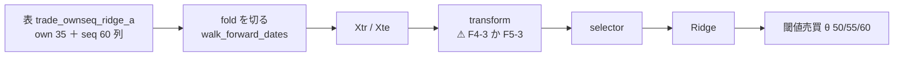
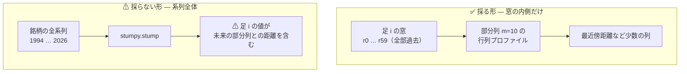
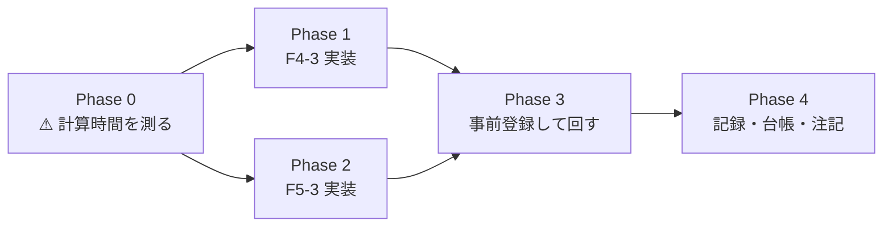

# 台帳の空白「大」2 件 — F4-3 tsfresh の総当たり ／ F5-3 行列プロファイル

作成日: 2026-09-16。派生元: [TODO](../../TODO.md) の「台帳の空白を埋める」。
利用者の選択（2026-09-16）: **候補 4 つのうち A1（台帳の空白 2 件）を選んだ。**

> ⚠ **これで「カタログの未実施」のうち、実施可能なものが 0 件になる。** 残るのは見送り 3 件（F4-2・F5-2・F2-4）だけ。

## 0. 目的と背景

### 0-1. なぜこの 2 件か

[台帳 §3](../specs/experiments/feature-discovery/ledger.md) の未実施 5 件のうち、**試さないと決めた 3 件を除いた残り全部**がこの 2 件である。
⚠ **回す理由は「効くはず」ではない。** ⚠ **「未実施」を「効かなかった」と読ませないために埋める**（[rules.md 14-10 規約 4](../specs/experiments/feature-discovery/rules.md)）。

| ID | 手法 | 系統 | 拠 | ⚠ カタログの見どころ |
| --- | --- | --- | :-: | --- |
| F4-3 | tsfresh の総当たり（794 特徴量） | F4 生成型 | 強 | ⚠ **生成と選別が対になっている唯一の実装**（F1-5 と対）。Christ ら (2018) の FRESH |
| F5-3 | 行列プロファイル（モチーフ） | F5 表現学習型 | 中 | E8 の E5・G3 と同じ道具。⚠ **先読みが入りやすい** |

### 0-2. ⚠ 2 件を 1 本のプランにまとめた理由 — 依存が同じだった

⚠ **`tsfresh` 0.21.2 は `stumpy>=1.11.1` に依存している**【実測 2026-09-16。wheel の METADATA】。
⚠ **つまり F5-3 用の `stumpy` は、F4-3 のために `tsfresh` を入れた時点で付いてくる。** 別々に進めると install を 2 度考えることになる。

`pip install --dry-run` の結果【実測 2026-09-16】: ⚠ **既存の固定版は 1 つも動かない。**

| | 版 |
| --- | --- |
| 据え置き（確認済み） | numpy 2.4.2 ／ pandas 2.3.3 ／ scipy 1.17.1 ／ scikit-learn 1.7.2 ／ numba 0.67.0 ／ llvmlite 0.49.0 ／ PyWavelets 1.10.0 |
| 新規に入る 7 つ | tsfresh 0.21.2 ／ stumpy 1.14.1 ／ statsmodels 0.15.0 ／ patsy 1.0.3 ／ formulaic 1.2.2 ／ interface_meta 2.0.1 ／ tqdm 4.70.1 |

⚠ **2026-09-15 に PyWavelets でやった確認と同じ形**（[ledger-blanks-six.md](../specs/experiments/ledger-blanks-six.md) §0-1）。

### 0-3. 前提 — 表は作り直さない

⚠ **`own` ＋ `seq` の表（`trade_ownseq_ridge_a`）は既にある**【実測】: **135,962 行 × 101 列**（35 own ＋ 60 seq ＋ ラベル）・63 銘柄・2018-01-31〜2026-09-04。`_leak` の双子もある。
⚠ **両方ともこの表を `features_from` で読む。** 表の差を処置に混ぜない（[rules.md 13-8](../specs/experiments/feature-discovery/rules.md)）。

## 1. 設計 — 2 件とも `transform` の口に載せる

> この図の主張: ⚠ **2 件とも「窓 60 列 → 新しい列」の変換**であり、2026-09-12 に足した `transform` の口にそのまま乗る。⚠ **表も `cli/run.py` も作り直さない。**

### 1-1. ⚠ 台帳の「次の一手」から変えたこと（理由つき）

[catalog_notes.toml](../../experiments/feature-discovery/config/catalog_notes.toml) は 2 件とも **feature 層（`ail/features/*.py` ＋ `bootstrap.py` に 1 行）**と書いてある。⚠ **`transform` に変える。** 理由は 2 つ。

| # | 理由 | ⚠ 根拠 |
| ---: | --- | --- |
| 1 | ⚠ **feature 層にすると台帳が「未実施」のままになる** | `catalog.implemented()` が見るのは `selector` と `transform` の registry 名だけ（`ail/catalog.py:131`）。⚠ **層の名前に ID は付かない** ＝ ⚠ **回したのに空白が埋まらない**（同関数の注記が名指しで警告している） |
| 2 | ⚠ **F5-4 ウェーブレットが同じ形で先に通っている** | `tf_wavelet` は `seq` の窓 60 列を読んで係数の列に置き換える（`ail/selectors/representation.py:61`）。⚠ **同じ口・同じ契約に揃える** |

⚠ **「次の一手」は人が書く注記であって規約ではない**（[ledger.md §3](../specs/experiments/feature-discovery/ledger.md) の但し書き）。⚠ **変えた以上、Phase 4 で `catalog_notes.toml` の当該 2 件を書き換える。**

### 1-2. ⚠ 選別は 1 本だけにする（台帳の鍵が ID で潰れるため）

⚠ **`canonical()` は名前の先頭の ID だけで寄せる**（`ail/catalog.py:588`）。
⚠ **だから「F4-3 … ＋ 全部使う（基準）」と「F4-3 … ＋ F1-5 検定+FDR」は同じ鍵 `F4-3` に潰れ、1 行の中で数字が食い違う。**
⚠ **`trade_own_poly_a.toml` と `trade_own_gp_a.toml` が踏んだ穴と同じ**（あちらは「乱択（基準）」で踏んだ）。

| 実行 | 選別 | ⚠ 理由 |
| --- | --- | --- |
| F4-3 | **F1-5 検定+FDR** 1 本 | ⚠ **カタログが「F1-5 と対」と書いている組**（FRESH の設計そのもの）。⚠ **794 列を絞るのは手法の一部であって、後付けの選別ではない** |
| F5-3 | **全部使う（基準）** 1 本 | ⚠ **出る列が少数**（§2-2）なので絞る意味が無い。F5-4 ウェーブレットと同じ扱い |

## 2. 先読みの扱い — ⚠ F5-3 の唯一の難所

> この図の主張: ⚠ **窓（`seq` 層）はすべて `shift(k≥0)` で作られている**ので、その中だけで計算するかぎり**未来に触れる経路が無い**。⚠ **系列全体に `stumpy.stump` を当てると、そこが壊れる。**

### 2-1. ⚠ 窓の内側に閉じると、先読みは構造的に消える

`ail/features/seq.py` の窓は `r.shift(k)`（k = 0 … 59）だけで作られている。⚠ **`shift(-k)` を 1 つも使わない**と明記されている層である。
⚠ **その 60 列しか読まない変換は、定義から未来に触れられない。** カタログが F5-3 に付けた「先読みが入りやすい」は、**系列全体に当てる素朴な使い方**に対する警告であり、⚠ **窓に閉じた実装では当たらない**。

⚠ **それでも `--leak` の対照は通す**（[rules.md 14-10 規約 6](../specs/experiments/feature-discovery/rules.md)。⚠ **切らない**）。

### 2-2. F5-3 が作る列（⚠ 事前固定）

⚠ **部分列の長さ `m` を振ると、振った数だけ n_trials が増える**（14-9）。⚠ **回す前に 1 通りに決める。**

| 決めごと | 値 | ⚠ 理由 |
| --- | --- | --- |
| 部分列の長さ `m` | **10**（営業日 2 週間） | ⚠ **窓 60 に対して profile が 51 点**取れる。60 の 1/6 で、短すぎず窓を使い切らない |
| 出す列 | 最近傍距離の **最小・中央値・最大・最後の点**、最近傍までの **時間差（`|i − j|`）の中央値**、の 5 本 | ⚠ **生の profile 51 列を全部出すと「モチーフの効果」ではなく「窓をもう 1 度渡した」ことになる**（F5-4 が生の窓を落としたのと同じ理屈） |
| 生の窓 60 列 | ⚠ **落とす** | 同上 |
| `own` の 35 列 | ⚠ **残す** | 比較の相手が「own だけ」なので、足した分だけを処置にする |

## 3. 事前登録（⚠ 回す前に決める・結果を見て動かさない）

| 項目 | 値 |
| --- | --- |
| 実行 | 本番 2 ＋ `--leak` 対照 2 ＝ **4 実行**（キュー 1 本） |
| 手法の行 | F4-3 ＋ F1-5 が 1 本 ／ F5-3 ＋ 全部使う が 1 本 |
| θ | **50・55・60 の 3 水準**（既存と同じ。⚠ **増やさない**） |
| **n_trials** | **598 → 604（＋6 ＝ 2 手法 × 3 水準）** |
| 判定 | 対 B&H 上乗せの符号（[13-7](../specs/experiments/feature-discovery/rules.md)）。**B&H ＝ ＋1,652.02bp/fold** |
| モデル | **Ridge**（⚠ **F4-1 記号回帰・F5-4 ウェーブレットと揃える**。振らない） |
| 形式・分割・種 | (A) 銘柄共通 ／ `walk_forward_dates` 5 fold ／ purge あり ／ 種 0（全部据え置き） |

⚠ **打ち切りは 3 つとも先に書く**（[14-9](../specs/experiments/feature-discovery/rules.md)）: キュー全体 **7,200 秒** ／ 連続失敗 **3 本** ／ ⚠ **Phase 0 の実測が §7 の上限を超えたら回さずに設計へ戻る**。

## 4. 影響範囲

| 場所 | 変更 | ⚠ 注意 |
| --- | --- | --- |
| `requirements.txt` | `tsfresh` ＋ `stumpy`（依存 5 つは自動） | ⚠ **既存の固定版を動かさないことは dry-run 済み**（§0-2） |
| `ail/features/tsfresh.py` | **新規**。`@register("transform", "F4-3 …")` | ⚠ **重いので別ファイル。** 層ではなく変換 |
| `ail/selectors/representation.py` | F5-3 を足す（20 行前後） | ⚠ **F5 の 4 件はここに揃っている**（冒頭の docstring が 4 件を名指ししている） |
| `ail/bootstrap.py` | import を 1 行 | ⚠ **足し忘れると「registry に無い」で止まる** |
| `config/experiment/` | 2 本（`trade_ownseq_tsf_a` ／ `trade_ownseq_mp_a`） | ⚠ **`features_from = "trade_ownseq_ridge_a"`**（表は作り直さない） |
| `config/queue/` | 1 本（`blank_large2`） | ⚠ **`leak = true` を切らない** |
| `tests/` | 先読み・決定性・列数の検査 | §6 |
| `config/catalog_notes.toml` | 2 件の「次の一手」を実績に書き換える | §1-1 の 2 |
| `docs/specs/experiments/` | 記録 1 ファイル（`ledger-blanks-large-two.md`） | 成果物 |

⚠ **`cli/run.py`・`cli/build.py`・`ail/validation/` は 1 行も触らない**（触ったら leak 対照の意味が薄れる）。

## 5. Phase

> この図の主張: ⚠ **計算時間を測るのが先**（台帳の「次の一手」）。⚠ **測る前に実装を書かない** — 実装の形（毎 fold 計算か、1 度作って使い回すか）が測定で決まるから。

### Phase 0: ⚠ 計算時間を先に測る

1. `pip install tsfresh`（`stumpy` は依存で入る）→ ⚠ **入った後に既存 352 件のテストを通す**（版が動いていないことの検算）
2. **1 銘柄（約 2,158 行）の窓 60 に tsfresh の `ComprehensiveFCParameters` を当てて実測する**
3. 63 銘柄・135,962 行へ外挿し、§7 の上限と突き合わせる
4. ⚠ **`stumpy` も同じ場で測る**（窓 60・m=10 を 135,962 回）

⚠ **ここで決まること**: 変換を **fold ごとに素で計算する**か、⚠ **行ごとに 1 度だけ計算して使い回す**か。
⚠ **ウォークフォワードは訓練が伸びるので、素で回すと同じ行を 3〜4 度計算する。**

### Phase 1: F4-3 の実装

- `ail/features/tsfresh.py`: 窓 60 列 →（古い → 新しいに並べ替え）→ tsfresh → 794 列
- ⚠ **`own` 35 列は残し、生の窓 60 列は落とす**（F5-4 と同じ）
- ⚠ **NaN・定数列の始末を決めて書く**（tsfresh は窓が短いと NaN を返す計算子がある）

### Phase 2: F5-3 の実装

- `ail/selectors/representation.py` に `tf_matrixprofile`
- ⚠ **`stumpy.stump` を窓の内側にだけ当てる**（§2）。系列全体には当てない
- ⚠ **出す列は §2-2 の 5 本に固定**

### Phase 3: 事前登録して回す

- config 2 本 ＋ キュー 1 本 → `python3 -m cli.queue --config blank_large2 --dry-run` で並びを見てから回す
- ⚠ **本番 2 ＋ leak 2 の 4 実行。** ⚠ **leak が跳ねなければ配線が壊れている**（そのときは結果を読まない）

### Phase 4: 記録・台帳・注記

- 記録 `docs/specs/experiments/ledger-blanks-large-two.md`（判定・費用の実測・限界）
- 台帳を吐き直し、⚠ **n_trials が事前登録どおり 604 か**を検算
- `catalog_notes.toml` の F4-3・F5-3 を実績に書き換える（§1-1 の 2）
- `TODO.md` → `DONE.md`、プランは `docs/plans/archive/` へ

## 6. テスト方針

| # | 検査 | ⚠ 何が壊れたら気づくか |
| ---: | --- | --- |
| 1 | ⚠ **先読み**: 窓の列を**未来側に 1 本ずらした表**を食わせると出力が変わる／ ⚠ **行を並べ替えても各行の出力が変わらない** | ⚠ **行をまたいで情報が漏れていない**こと（F5-3 の急所） |
| 2 | ⚠ **決定性**: 同じ入力で 2 度呼ぶとビット単位で同じ | seed・並列の非決定性 |
| 3 | **列数**: F4-3 は `own` 35 ＋ tsfresh の本数 ／ F5-3 は `own` 35 ＋ 5 | ⚠ **黙って列が欠ける**（`seq` 層の `window_columns` と同じ思想で、欠けたら止める） |
| 4 | **窓の並び**: 古い → 新しいに直してから渡している | ⚠ **`r0` が最新**なので、そのまま渡すと時間が逆になる |
| 5 | 既存 **352 件が通る** | 依存を入れたことで既存が壊れていないこと |

## 7. Phase 0 の実測（2026-09-16）と、そこから決めたこと

⚠ **測ってから実装を書いた。** 環境: 32 コア・メモリ 30GB・CPU のみ（GPU は使わない）。

### 7-1. 計算時間【実測 2026-09-16】

⚠ **1 実行で変換を通る行は 452,615 行**（表 135,962 行の **3.33 倍**）。ウォークフォワードは訓練が伸びるので、同じ行を何度も通る。

| fold | 訓練 | 検証 |
| ---: | ---: | ---: |
| 1 | 22,461 | 22,680 |
| 2 | 45,141 | 22,739 |
| 3 | 67,880 | 22,596 |
| 4 | 90,476 | 22,680 |
| 5 | 113,219 | 22,743 |

| 変換 | 1 行あたり | 1 実行 | 本番 ＋ leak |
| --- | ---: | ---: | ---: |
| F4-3 tsfresh（`n_jobs=16`） | **3.03 ms** | **22.9 分** | 45.8 分 |
| F5-3 stumpy（逐次） | ⚠ 10.44 ms | ⚠ **78.8 分** | ⚠ **157.6 分 ＝ 予算超過** |
| F5-3 stumpy（joblib 16 分割） | **1.06 ms** | **8.0 分** | 16.0 分 |

⚠ **合計 約 62 分 ＜ 打ち切り 7,200 秒。** ✅ **§7-4 の逃げ道（`EfficientFCParameters` に落とす）は要らない。**

- ⚠ **行ごとのキャッシュは作らない**（3.33 倍の無駄は残る）。⚠ **`cli/run.py` は `StandardScaler` の後に索引を振り直す**ので、fold をまたいで行を同一視する鍵が無い。⚠ **内容ハッシュで持つ手はあるが、予算内に収まった以上、当たらない仕掛けを足さない**
- ⚠ **F5-3 は必ず並列で回す。** 逐次だと 1 実行で予算の 2/3 を使う

### 7-2. tsfresh が実際に出した列【実測 2026-09-16・3,000 窓】

⚠ **カタログの「794 特徴量」は出なかった。実際は 783 列。** ⚠ **記録と手法名では実数を書く**（794 は tsfresh の宣伝値で、入力によって変わる）。

| | 列数 | ⚠ 中身 |
| --- | ---: | --- |
| `ComprehensiveFCParameters` の出力 | **783** | |
| ⚠ 全部 NaN | **277** | ⚠ **窓が 60 しかないので出ない計算子**（例: `fft_coefficient` の coeff 31 以上。tsfresh は 100 まで要求する） |
| ⚠ 一部だけ NaN | ✅ **0** | ⚠ **補完が要らない**。これが分かったので `fitted` に中央値を持たせる設計をやめた |
| 定数列（NaN を除いて） | **60** | |
| ✅ **残る列** | **446** | ⚠ **NaN 率 0.000000** |

### 7-3. ⚠ 列の始末（回す前に決めた）

| # | 規約 | ⚠ 理由 |
| ---: | --- | --- |
| 1 | ⚠ **落とす列は訓練分割だけで決め、同じ列名を検証分割に当てる** | [rules.md 3 章 B](../specs/experiments/feature-discovery/rules.md)。⚠ **検証分割を見て決めたら選別を外でやったことになる** |
| 2 | 全部 NaN の列と定数列を落とす（訓練で判定） | 情報が無い。⚠ **定数列は `pearsonr` が NaN を返し、F1-5 が `fillna(1.0)` で拾う**ので、残しても害はないが数だけ増える |
| 3 | ⚠ **残った NaN は 0 で埋める**（検証分割にだけ出る可能性への保険） | ⚠ **訓練 3,000 窓では 0 件だったが、出たときに黙って落ちないようにする** |
| 4 | ⚠ **生成した 446 列は訓練分割で標準化する** | ⚠ **tsfresh の列は桁が揃っていない**（`sum_values` と `autocorrelation` が同じ表に並ぶ）。⚠ **Ridge の L2 罰則は尺度に依存する**ので、揃えないと「手法の効果」ではなく「桁の効果」を見ることになる |
| 5 | ⚠ **`own` 35 列はそのまま残し、生の窓 60 列は落とす** | F5-4 ウェーブレットと同じ（足した分だけを処置にする） |

⚠ **1〜4 は F5-4 には無かった段である。** ⚠ **無かったのは F5-4 の出力が NaN も桁違いも作らなかったからで、規約が変わったわけではない。**

### 7-4. 残りの見積り【推測】

| | 見積り | ⚠ 根拠 |
| --- | --- | --- |
| ✅ Phase 0 | **済**（約 40 分） | install ＋ 実測 4 本 |
| Phase 1・2 | 半日 | F5-4 ウェーブレット（20 行）が先例。⚠ **F4-3 は §7-3 の列の始末で膨らむ** |
| Phase 3 の実行 | **約 62 分**（4 実行） | §7-1 |
| Phase 4 | 半日 | 記録と台帳 |

⚠ **逃げ道を使う条件（結局使わずに済んだ）**: 1 実行が 4 時間を超えるなら `EfficientFCParameters` に落とし、⚠ **手法名に「総当たりではない」ことを明記する**。
⚠ **窓を短くする・銘柄を間引く・期間を削る、で逃げない**（検証の力が落ち、他の実行と比べられなくなる）。
