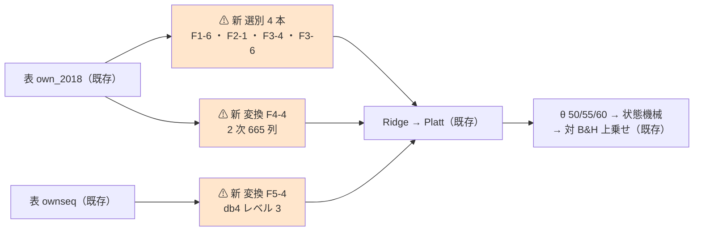
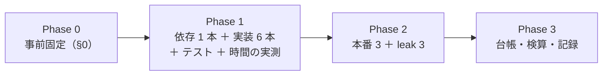

# 台帳の空白 6 件（F1-6・F2-1・F3-4・F3-6・F4-4・F5-4）を埋める

親タスク: 「台帳の空白を埋める」（[ledger.md §3](../../specs/experiments/feature-discovery/ledger.md) の未実施 12 件のうち「手間 中」の 6 件）
利用者の指示（2026-09-15）: **今着手できるものを全て順番にやって**
規約: [rules.md 14-10](../../specs/experiments/feature-discovery/rules.md)（空白は積極的に埋める）／ [13 章](../../specs/experiments/feature-discovery/rules.md)（閾値売買）／ [3 章 B](../../specs/experiments/feature-discovery/rules.md)（fit は訓練分割の内側）
台帳: 着手時点 **n_trials 571**・落とす 493 行・保留 78 行 ／ テスト **313 件 pass**【実測 2026-09-15】
先例: [selectors-seven-threshold.md](../../specs/experiments/selectors-seven-threshold.md)（7 選別を 1 実行に相乗り）／ [selectors-small-four.md](../../specs/experiments/selectors-small-four.md)（`transform` の口）

---

## 0. 目的と背景

⚠ **カタログ 25 件のうち 12 件が「まだ試していない」。** そのうち ⚠ **手間「中」の 6 件**をまとめて埋める。
⚠ **回す理由は「効くはず」ではない。** ⚠ **「未実施」を「効かなかった」と読ませないため**（[14-10 規約 4](../../specs/experiments/feature-discovery/rules.md)）。

| ID | カタログの正式名 | 系統 | 種類 | ⚠ 一次情報 |
| --- | --- | --- | --- | --- |
| F1-6 | 距離相関・HSIC | F1 フィルタ型 | selector | Székely ら 2007。⚠ **任意の依存を捉えるが計算量が標本の 2 乗** |
| F2-1 | 前進選択・後退除去 | F2 ラッパー型 | selector | ⚠ **試行回数が特徴量の数だけ増える ＝ 多重検定の温床** |
| F3-4 | SHAP | F3 埋め込み型 | selector | Lundberg-Lee 2017。⚠ **Kumar ら 2020 が「重要度としては数学的に問題がある」と指摘。説明であって因果ではない** |
| F3-6 | Model-X knockoffs | F3 埋め込み型 | selector | Candès ら 2018。⚠ **有限標本で偽発見率を厳密に制御できる唯一の枠。ただし特徴量の分布を仮定する** |
| F4-4 | 多項式・交互作用の展開 | F4 生成型 | transform | ⚠ **次元が組み合わせで爆発し、相関も強くなる** |
| F5-4 | ウェーブレット・スペクトル | F5 表現学習型 | transform | ⚠ **基底と窓の選択で結果が動く** |

⚠ **F4 生成型はこれが初めての実施である**（4 件中 0 件だった）。⚠ **「特徴量を選ぶ」側は 13 手法回して全滅しているが、「作る」側はまるごと空だった。**

### 0-1. ⚠ 依存を増やさない（回す前に確かめた）

⚠ **aeon で numpy が巻き添えで下がりかけた**（2026-09-15）。⚠ **今回は入れる前に `pip install --dry-run` で確かめた**【実測 2026-09-15】。

| 候補 | 連れてくるもの | 判断 |
| --- | --- | --- |
| `shap` | slicer・tqdm | ⚠ **入れない。** LightGBM の `predict(..., pred_contrib=True)` が ⚠ **厳密な TreeSHAP** を返す（4.7.0 で動作確認済み） |
| `knockpy` | ⚠ **cvxpy ほか 11 個**（clarabel・osqp・scs・Cython…） | ⚠ **入れない。** ガウス model-X の等相関構成は 40 行で書ける（Candès ら 2018 の式そのまま） |
| `dcor` | array-api-compat | ⚠ **入れない。** 距離相関は二重中心化した距離行列の内積で、20 行で書ける |
| **PyWavelets** | ⚠ **無し**（1.10.0 単体） | ✅ **入れる。** ⚠ **基底を自前で書くと「どの基底か」が曖昧になる**ので、一次情報どおりの実装を使う |

### 0-2. ⚠ 回す前に固定すること（結果を見てから決めない）

| 固定するもの | 値 | ⚠ 理由 |
| --- | --- | --- |
| 実行 | **3 本**（＋ leak 3 本）: **A** 選別 4 件の相乗り ／ **B** F4-4 ／ **C** F5-4 | ⚠ **`transform` は 1 実行に 1 本しか指定できない**（[prep.py](../../../experiments/feature-discovery/ail/validation/prep.py)）ので、変換 2 件は実行を分ける |
| 表 | A・B は **`own_2018`**（`features_from`）／ C は **`trade_ownseq_ridge_a`**（own ＋ seq 60 日窓） | ⚠ **A は `trade_own_ridge_sel7_a` と同じ表**なので、先行 7 選別と並べられる（13-8）。⚠ **C はウェーブレットを掛ける窓が要る** |
| 選別 | A: F1-6・F2-1・F3-4・F3-6 ＋ 基準線 2 本 ／ B・C: ⚠ **「全部使う（基準）」1 本だけ** | ⚠ **変換の実行に「乱択」を入れると手法名が「F4-4 ＋ 乱択（基準）」になり、台帳が基準線と見分けられず試行に数える**（`pca_1995.toml` の教訓） |
| モデル ／ k ／ θ ／ fold ／ 種 ／ 形式 | Ridge ／ 16 ／ 50・55・60 ／ 5 ／ 0 ／ (A) 共通 | ⚠ **動かす軸は選別と変換だけ** |
| **F1-6** | **距離相関**（HSIC は回さない）。⚠ **部分標本 5,000 行**（fold ごと・種 0 で抽く）。上位 k = 16 本 | ⚠ **計算量が標本の 2 乗**（11.3 万行では 128 億対）。⚠ **標本の大きさは事前固定**（結果を見て増やさない）。HSIC を足すと 2 手法ぶん数えることになる |
| **F2-1** | **前進選択のみ**（後退除去は回さない）。`SequentialFeatureSelector`（前進・k=16・cv 3・推定器 Ridge α=1） | ⚠ **前進と後退の両方を回すと 2 手法**。⚠ **推定器は本体と同じ Ridge**（F2-2 RFE と同じ約束） |
| **F3-4** | LightGBM を訓練分割で学習 → ⚠ **`pred_contrib` の平均 `|SHAP|` 上位 k** | ⚠ **木は既存の `LightGBM` モデルと同じ水準**（`trees.py` の既定。振らない） |
| **F3-6** | ガウス model-X（**等相関構成**）＋ Lasso の係数差 W ＋ **knockoff+ フィルタ・目標 FDR q = 0.1** | ⚠ **q は事前固定**（結果を見て緩めない）。⚠ **共分散は訓練分割だけで推定**（3 章 B） |
| **F4-4** | `PolynomialFeatures(degree=2, include_bias=False)`（35 列 → **665 列**）。⚠ **own だけ** | カタログの「次の一手」どおり。⚠ **断面を足すと列が爆発する** |
| **F5-4** | **db4 ・ レベル 3 ・ 対称拡張**（pywt の既定）。60 日窓 → 係数。⚠ **基底も窓もこの 1 通りだけ** | ⚠ **基底と窓を振ると多重検定が増える**（カタログの注意）。⚠ **振るなら回す前に数える** |
| 数え方 | **n_trials 571 → 589**（＋18 ＝ 選別 4 × 3 θ ＋ 変換 2 × 3 θ） | 13-9。⚠ **基準線は数えない** |
| 判定 | **対 B&H 上乗せ**の符号と t（13-7） | |
| ⚠ **「効く」と言う条件** | 13-7 の「採る」に加えて、⚠ **同じ表の「全部使う（基準）」を 3 θ すべてで上回る** | 先行 7 選別と同じ事前条件（[selectors-seven-threshold §0](../../specs/experiments/selectors-seven-threshold.md)） |
| 門（14-5） | ⚠ **記録するだけ** | 14-10 規約 2 |

### 0-3. ⚠ 判断が要った点

| # | 判断 | 理由 |
| ---: | --- | --- |
| 1 | ⚠ **`shap`・`knockpy`・`dcor` を入れず自前で書く** | §0-1。⚠ **依存 1 本ごとに、版の巻き添えと「宣言の外で使う」問題が増える** |
| 2 | ⚠ **F1-6 は距離相関だけ・F2-1 は前進選択だけ** | ⚠ **カタログの 1 行 ＝ 1 手法として数える。** 中に 2 つ入れると、数えるのは 2 試行になる |
| 3 | ⚠ **F5-4 は `seq` 層（60 日窓）に掛ける** | ⚠ **`transform` が受け取るのは標準化済みの表**で、own 35 列にウェーブレットを掛けても意味が無い。⚠ **時系列分類器のために作った `seq` 層がそのまま使える** |
| 4 | ⚠ **F5-4 は生の窓（`own_seq60_*` 60 列）を落として係数に置き換える** | ⚠ **残すと同じ情報を 2 度渡すことになり、「ウェーブレットの効果」ではなくなる** |
| 5 | ⚠ **選別 4 件は 1 実行に相乗りさせる** | ⚠ **同じ表・同じ fold・同じ基準線で測れる**（先例 sel7）。⚠ **実行を分けても数える試行は同じだが、基準線の行が増えるだけ無駄** |

---

## 1. 対応方針

> この図の主張: ⚠ **新しく書くのは「選別 4 本」と「変換 2 本」だけで、表・較正・シミュレータ・判定は既存のまま。**



| 部品 | 書き方 |
| --- | --- |
| `ail/selectors/filter.py` | **F1-6 距離相関・HSIC**（距離相関を numpy で。部分標本 5,000） |
| `ail/selectors/wrapper.py` | **F2-1 前進選択・後退除去**（`SequentialFeatureSelector`・前進・cv 3） |
| `ail/selectors/embedded.py` | **F3-4 SHAP**（LightGBM の `pred_contrib`）／ **F3-6 Model-X knockoffs**（等相関構成 ＋ knockoff+） |
| `ail/selectors/representation.py` | **F4-4 多項式・交互作用の展開** ／ **F5-4 ウェーブレット・スペクトル**（`transform` 2 本） |
| `config/experiment/` | `trade_own_ridge_sel4_a.toml` ／ `trade_own_poly_a.toml` ／ `trade_ownseq_wave_a.toml` |
| `requirements.txt` | `PyWavelets==1.10.0` の 1 行 |
| `tests/test_ledger_blanks6.py`（新規） | §4 |

---

## 2. 影響範囲

| 触るもの | 中身 |
| --- | --- |
| `ail/selectors/{filter,wrapper,embedded,representation}.py` | ⚠ **追記だけ。既存の関数は 1 行も変えない**（変えると台帳の既存行が別物になる） |
| `config/experiment/`（3 本） ／ `requirements.txt`（1 行） ／ `tests/`（新規 1 本） | 新規 |
| `docs/specs/experiments/ledger-blanks-six.md` | **新規**。記録 |
| `docs/specs/experiments/feature-discovery/ledger.md` | ⚠ **生成物。吐き直す** |

| ⚠ 触らないもの | 理由 |
| --- | --- |
| `cli/` ・ `ail/validation/` ・ `ail/models/` ・ 既存の選別と変換 | ⚠ **既存の全実行の経路** |
| 表（`data/features/`） ・ 既存の `runs/` ・ 台帳の既存行 | 14-10 規約 5 |

---

## 3. Phase 構成



### Phase 1
1. `PyWavelets==1.10.0` を入れ、⚠ **numpy ほかの版が動かないことを確かめてから** 313 件 pass を再確認
2. 選別 4 本・変換 2 本・テストを書く
3. ⚠ **F2-1 と F1-6 の 1 fold あたりの時間を先に測る**（カタログの「次の一手」の要求）。⚠ **1 実行が 3 時間を超える見込みなら止めて相談する**

### Phase 2
```bash
cd experiments/feature-discovery
for e in trade_own_ridge_sel4_a trade_own_poly_a trade_ownseq_wave_a; do
  ./.venv/bin/python -m cli.run --experiment $e
  ./.venv/bin/python -m cli.run --experiment $e --leak
done
```

### Phase 3
`cli.report --catalog` → 検算（§4）→ 記録 → TODO / DONE → プランを archive へ。

---

## 4. テスト方針・検算

| # | 検算 | ⚠ 落ちたら |
| ---: | --- | --- |
| 1 | `pytest -q tests` 全件 pass（着手時点 **313** ＋ 新規） | 配線が壊れている |
| 2 | ⚠ **依存を入れた直後、コードを変える前に 313 件 pass ＋ numpy/scipy/sklearn/torch/lightgbm の版が不変** | 依存の追加だけで既存が壊れた |
| 3 | 選別の契約: 返すのは `X` にある列名だけ・k 本以内（k を使わない手法は本数を記録） | 契約違反 |
| 4 | ⚠ **距離相関が既知の非線形依存を拾う**（y = |x| のような相関 0 の関係で、線形相関より高く出る） | 実装が誤っている |
| 5 | ⚠ **SHAP の順位が LightGBM の `feature_importances_` と一致しすぎない**（別の量であること）／ 平均 `|SHAP|` が既知の効く列を 1 位にする | 実装が誤っている |
| 6 | ⚠ **knockoffs の偽発見率**: 効く列 5 本 ＋ 雑音 30 本の合成データで、⚠ **選ばれた中の雑音の割合が q=0.1 の近傍に収まる** | 枠が機能していない |
| 7 | F4-4 の列数が **665**（35 → 2 次）／ F5-4 の係数の数が固定（db4・レベル 3） | 水準が事前固定どおりでない |
| 8 | ⚠ **変換の fit が訓練分割だけ**（検証の行を半分にしても残りの出力が変わらない） | 先読み |
| 9 | ⚠ **leak 対照が 3 本とも跳ねる**（既存は ＋16,108〜25,131bp） | ⚠ **本番の数字を読まない** |
| 10 | **n_trials 571 → 589**（＋18） | 数え落とし |
| 11 | ⚠ **台帳の既存行の数字と判定が変わらない** ／ 較正が `std` ／ ⚠ **A の基準線 2 本が `trade_own_ridge_a` と一致** | 配線か表が違う |

---

## 5. 費用の見積り【推測】

| 項目 | 見込み | 根拠 |
| --- | --- | --- |
| 実装 ＋ テスト | 半日〜1 日 | 6 本 ＋ テスト |
| 本番 A（選別 4） | ⚠ **10 分〜2 時間** | ⚠ **F2-1 が支配的**（k=16 まで前進 ＝ 1 fold で約 440 回 × cv 3 の Ridge）。⚠ **Phase 1 で測る** |
| 本番 B（F4-4） | 5〜20 分 | Ridge 665 列 × 13.6 万行 |
| 本番 C（F5-4） | 5〜20 分 | 列数は 100 前後 |
| leak 3 本 | 同程度 | |

⚠ **見積りは過去 8 回過大に外している。** ⚠ **今回も「先に 1 fold を測ってから掛け算する」**（PatchTST でうまくいった方法）。

---

## 6. ⚠ 先に書く失敗モードと限界

| # | 起こりうること | ⚠ そのときどうするか |
| ---: | --- | --- |
| 1 | ⚠ **F2-1 が遅すぎる**（1 fold で数十分） | ⚠ **k を下げない**（水準の変更 ＝ 別の試行）。⚠ **部分標本で回すなら事前固定に足してから**。3 時間を超えるなら止めて相談 |
| 2 | ⚠ **F1-6 の部分標本 5,000 行で順位が安定しない** | ⚠ **標本を増やさない**（結果を見て水準を動かすことになる）。⚠ **fold ごとの選択の重なりを記録して限界に書く** |
| 3 | ⚠ **knockoffs が 0 本を選ぶ** | ⚠ **既存の約束どおり 1 本に落とし、そう記録する**（F1-5・F2-3 と同じ。⚠ **黙って別の列を返さない**） |
| 4 | ⚠ **F4-4 の 665 列で Ridge が過学習する** | ⚠ **α を振らない**（1 のまま）。そのまま記録する |
| 5 | ⚠ **ウェーブレットの係数が窓の端で不安定** | 対称拡張は pywt の既定のまま。⚠ **端の扱いを変えない** |
| 6 | 上乗せが正で 5/5 | ⚠ **まず配線を疑う**（11 章 規約 7）。leak と基準線の一致を先に見る |
| 7 | ⚠ **6 件とも落とす** | ⚠ **想定どおり**（13 手法が既に全滅）。⚠ **落とす結果でも記録を残す**（14-10 規約 5） |

⚠ **限界（消せないもの）**: (a) 63 銘柄は独立でない ／ (b) 生存バイアス ／ (c) ⚠ **検出限界**（fold 約 340 日 × 5）／
(d) ⚠ **F3-6 は特徴量がガウスだと仮定する**（own 35 列は裾が重い。⚠ **仮定が外れれば FDR の保証も外れる**）／
(e) ⚠ **F3-4 は説明であって因果ではない**（Kumar ら 2020）。

---

## 7. 完了条件

1. `runs/` に 6 実行（本番 3・leak 3）が 1 実行 1 ディレクトリで残っている
2. 台帳が吐き直され、**n_trials 571 → 589**、⚠ **既存行の数字が変わっていない**
3. `docs/specs/experiments/ledger-blanks-six.md` に 6 手法の結果・判定・「全部使う」との比較が載っている
4. ⚠ **台帳 §3 の未実施が 12 件 → 6 件になる**（残るは手間「大」3 件 ＋ 見送り 3 件）
5. ⚠ **判定が「落とす」でも完了とする**（14-10 規約 5）
