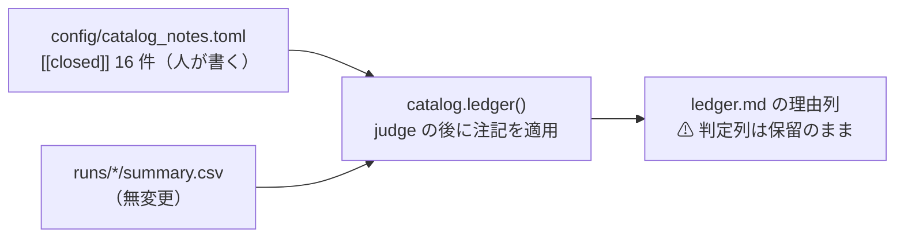

# 台帳の注記拡張と保留 16 行の処遇の反映

作成日: 2026-09-11。派生元: [TODO「検証方式の改善の反映と実装」](../../../TODO.md)の子タスク。
検討記録: [validation-power.md §6-2](../../specs/experiments/feature-discovery/validation-power.md)（処遇の決定 2026-09-11・利用者: **全 16 行を閉じる・再測しない**）。
規約: [rules.md 14 章](../../specs/experiments/feature-discovery/rules.md)（変更規約の答え「判定の列も変えない。変わるのは読み方（診断列・注記）」）。

## 1. 目的・背景

保留 16 行（符号割れ）を「閉じる」と決めたが、台帳は生成物なので手で書けない。
`config/catalog_notes.toml`（⚠ **人が書く唯一の入力**）を**試行の行にも注記できる形に拡張**し、台帳の「理由」列の末尾に閉じた理由と参照を機械で足す。

> この図の主張: ⚠ **人が書くのは catalog_notes だけ。** 台帳の理由列への反映は生成側が行い、判定列は触らない。

## 2. 対応方針

- `catalog_notes.toml` に `[[closed]]` の配列を足す。1 エントリ = 1 行への注記
  - 照合キーは ASCII（TOML の bare key の制約）: `key`（鍵 = ID or 鍵名）・`model`・`layers`（特徴量の層）・`style`（検証方式）・`threshold`・`layer`（データの層）・`form`。本文は `note`
  - ⚠ **各エントリはちょうど 1 行に一致しなければ SystemExit**（0 件 = 書き間違い、2 件以上 = 鍵が足りない。黙って空振りさせない）
  - ⚠ **一致した行の判定が「保留」でなければ SystemExit**（閉じるのは保留だけ。落とす行を閉じるのは設計ミス）
- `ail/catalog.py`: `closed_notes()`（TOML 読み）と `_apply_closed()`（照合と理由列への追記・`閉じる` フラグ）を足し、`ledger()` の judge の後で適用する
- `cli/ledger.py`: §0 に「保留のうち N 行は閉じる注記つき」の 1 文を足す（N は生成時に数える。日付は各注記側に持たせる）
- 注記の文面は [validation-power.md §6-2](../../specs/experiments/feature-discovery/validation-power.md) の処遇表のとおり（型 3 = 雑音・型 1 #7 = 代表済み・型 1 #10/#11 と型 2 = 検出限界の 2 桁下）
- 台帳 `ledger.md` を再生成する

## 3. 影響範囲

| 対象 | 触るか |
| --- | :-: |
| `config/catalog_notes.toml` | 書く（`[[closed]]` 16 件を追記） |
| `ail/catalog.py` | 書く（読み込みと適用。judge・KEY・is_trial は触らない） |
| `cli/ledger.py` | 書く（§0 の 1 文） |
| `docs/specs/experiments/feature-discovery/ledger.md` | 再生成（判定列・行数・n_trials は不変のはず） |
| `runs/` ・ `rules.md` ・ 判定ロジック | ⚠ **触らない** |

## 4. テスト方針

- 新規テスト（`tests/test_catalog.py`）: (1) 注記が対象行の理由列に付き判定は変わらない (2) 0 件一致で止まる (3) 2 件以上一致で止まる (4) 保留以外への注記で止まる (5) 実物の `catalog_notes.toml` の全 `[[closed]]` が実台帳にちょうど 1 行ずつ当たる
- 既存の不変テストがそのまま通ること: 旧 67 試行不変・n_trials 91・判定の件数（採る 0 / 落とす 66 / 保留 25）
- 再生成した `ledger.md` の diff が「生成日・理由列・§0 の 1 文」だけであることを目視確認
