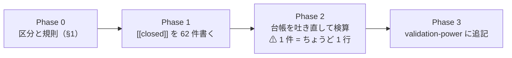

# 保留 78 行の処遇を決める（⚠ **判定は変えない。注記だけ足す**）

親タスク: 「台帳の空白を埋める」の子「保留 76 行のうち『閉じる』16 行を除く 60 行の処遇を決める」
利用者の指示（2026-09-15）: **今着手できるものを全て順番にやって**
先例: [validation-power.md §6-2](../../specs/experiments/feature-discovery/validation-power.md)（16 行の処遇を決めた回）／ 仕組み: `config/catalog_notes.toml` の `[[closed]]` ＋ `ail/catalog.py` の `_apply_closed`

---

## 0. 目的と現状

⚠ **保留は「採るの一歩手前」ではない。** ⚠ **多重検定を通していない良い数字**である（[rules.md 11 章 規約 2・3](../../specs/experiments/feature-discovery/rules.md)）。
⚠ **放っておくと「まだ望みがある行」に見える。** ⚠ **1 行ずつ「再測する / 閉じる」を決めて注記を残す。**

**内訳**【実測 2026-09-16・`catalog.ledger()` から】

| 区分 | 行 | 状態 |
| --- | ---: | --- |
| 「閉じる」注記つき | **16** | ✅ 2026-09-11 に処遇済み（§6-2） |
| ⚠ **無効・要再測**（日足 × `raw`） | **27** | ⚠ **未処遇** |
| ⚠ **平均だけ正・fold の符号が割れる** | **35** | ⚠ **未処遇** |
| 合計 | **78** | |

⚠ **判定の列は変えない・行は消さない**（[13-9 の 2](../../specs/experiments/feature-discovery/rules.md)）。⚠ **理由の列の末尾に「閉じた理由 ＋ 参照」を足すだけ。**

---

## 1. 処遇の規則（⚠ **行ごとの数字を見て決めない。区分で決める**）

⚠ **「数字が小さいから閉じる」にすると、大きい行だけが残って選別になる。** ⚠ **だから「同じ問いに答えた別の実測があるか」で決める。**

| # | 区分 | 行 | 処遇 | ⚠ 根拠 |
| ---: | --- | ---: | --- | --- |
| 1 | 日足 × `raw`（分割調整の誤り） | **27** | ⚠ **閉じる（代表済み）** | ⚠ **調整後の再実行が同じ 13 手法を全部含み、全部「落とす」**（`2026-09-08T19-28-09_own_only_h1`。純利 −1.42 〜 −6.55bp）【実測】。⚠ **raw の表は作り直せない**ので再測しても同じ数字は出ない |
| 2 | D 系の検知器（`trend_scales` ・ `trend_pairs` の D1〜D4・入口×出口。1995 表・us70・us74・旧/std 較正） | **23** | ⚠ **閉じる（軸を閉じた）** | ⚠ **検知器の軸は 2026-09-13 に閉じた**（[theta-placement.md §6-1](../../specs/experiments/theta-placement.md)）。⚠ **検定できる器で測ったら同じ保有日率の乱択ゲートに負けた**【実測】 |
| 3 | 1995 表の選別（`sel_small4_1995` の F1-4・F1-7・F2-2・全部使う。旧/std） | **5** | ⚠ **閉じる（代表済み）** | ⚠ **同じ手法の 2018 表の対が「落とす」で実測済み**（[selectors-small-four.md](../../specs/experiments/selectors-small-four.md)）。⚠ **1995 表は fold が 1,267〜1,324 日で上乗せの桁が違う**ので直接比べない（14-4） |
| 4 | 2018 表の「全部使う（基準）」（`trade_ownex_lgbm_a` ・ `trade_cs_lgbm_a` ・ `midcap_cs` ×2） | **4** | ⚠ **閉じる（代表済み）** | ⚠ **どれも θ 3 水準で符号が揃わないことが記録で実測済み**（[mlp-threshold-trading §8](../../specs/experiments/mlp-threshold-trading.md)・[midcap-targets §4](../../specs/experiments/midcap-targets.md)） |
| 5 | `T3 QUANT（60日窓）` θ=50 | **1** | ⚠ **閉じる（中身を確かめた）** | ⚠ **fold ごとに「全部持つ／全部休む」に倒れており、平均を正にしたのは fold 2 の 1 本だけ**（[tsc-threshold.md §2](../../specs/experiments/tsc-threshold.md)）【実測】 |
| 6 | 毎日往復の F3-1（`own_2018` ・ `exog_h1`。＋0.61bp） | **2** | ⚠ **閉じる（検出限界の 2 桁下）** | ⚠ **同じ表の閾値売買の対で「落とす」が実測済み**。⚠ **＋0.61bp はコスト 5bp の 1 桁下**（[daily-data-sources §9-2](../../specs/experiments/daily-data-sources.md)） |
| 7 | ⚠ **上のどれにも入らない行** | 残り | ⚠ **保留のまま残す**（注記も足さない） | ⚠ **無理に閉じない。** 次の実測が出たときに処遇する |

⚠ **再測する行は 0 件。** ⚠ **理由**: 再測は 1 行あたり ＋3〜6 試行を払って ⚠ **同じ検出限界の下で同じ答えを得る**だけで、DSR の基準だけが上がる（§6-2 と同じ判断）。

---

## 2. 影響範囲

| 触るもの | 中身 |
| --- | --- |
| `experiments/feature-discovery/config/catalog_notes.toml` | `[[closed]]` を **62 件**足す（16 → 78 件） |
| `docs/specs/experiments/feature-discovery/ledger.md` | ⚠ **生成物。吐き直す** |
| `docs/specs/experiments/feature-discovery/validation-power.md` | §6-2 の続きとして「2026-09-16 の処遇」を追記 |

| ⚠ 触らないもの | 理由 |
| --- | --- |
| 判定の列・行そのもの | 13-9 の 2 |
| `ail/catalog.py` の判定の規則 | ⚠ **規則を変えると既存の全行が別定義になる** |

---

## 3. Phase 構成

⚠ **Phase 1 は台帳の吐き直しとセット**: `[[closed]]` が 0 行・2 行に当たると ⚠ **`cli.report --catalog` が止まる**（設計どおり）。⚠ **書いたら必ず吐き直して確かめる。**

---

## 4. 検算

| # | 検算 | ⚠ 落ちたら |
| ---: | --- | --- |
| 1 | `cli.report --catalog` が止まらずに通る | `[[closed]]` の照合キーが足りない or 書き間違い |
| 2 | ⚠ **保留の行数が 78 のまま**（閉じても保留は保留） | 判定を変えてしまった |
| 3 | ⚠ **「閉じる」注記つきが 16 → 78 行** | 当て漏れ |
| 4 | ⚠ **判定・数字の列が 1 つも変わらない**（前後の差分で確かめる） | 生成の規則に触った |
| 5 | `pytest -q tests` 全件 pass | `catalog_notes.toml` の読み込みを壊した |

---

## 5. 費用の見積り【推測】

| 項目 | 見込み |
| --- | --- |
| `[[closed]]` 62 件の記述 | 1 時間（機械的に生成して手で理由を当てる） |
| 吐き直しと検算 | 10 分 |
| 追記 | 30 分 |

⚠ **実行は 1 本も回さない**（試行は 1 つも増えない）。

---

## 6. ⚠ 先に書く失敗モードと限界

| # | 起こりうること | ⚠ そのときどうするか |
| ---: | --- | --- |
| 1 | ⚠ **1 件が 2 行に当たる**（較正・期間・閾値の鍵が足りない） | 照合キーを足す。⚠ **当たる行を選ぶために数字を見ない** |
| 2 | ⚠ **閉じたい行が「落とす」に変わっていた**（新しい実行で鍵が動いた） | ⚠ **閉じない**（閉じられるのは保留だけ）。区分の表を直す |
| 3 | ⚠ **「閉じる」を「効かないと確かめた」と読まれる** | ⚠ **注記に必ず「代表済み」か「軸を閉じた」か「検出限界の下」かを書く。** ⚠ **判定は保留のまま** |
| 4 | 後から再測したくなる | ⚠ **閉じても行は残る。** 新しい実測が出たら別の試行として足す（消していないので比較できる） |

⚠ **限界**: (a) ⚠ **「代表済み」は【推測】を含む**（同じ手法・別の表の結果で代表させている）／ (b) ⚠ **閉じた行は台帳の分母に残り続ける**（n_trials は減らない。それが正しい）。

---

## 7. 完了条件

1. `[[closed]]` が 78 件になり、台帳が止まらずに吐き直せる
2. ⚠ **保留 78 行のすべてに処遇の注記が付く**（16 件は 2026-09-11 の分・62 件が今回）
3. ⚠ **判定と数字が 1 つも変わっていない**（差分で確認）
4. `validation-power.md` に 2026-09-16 の処遇が追記されている
