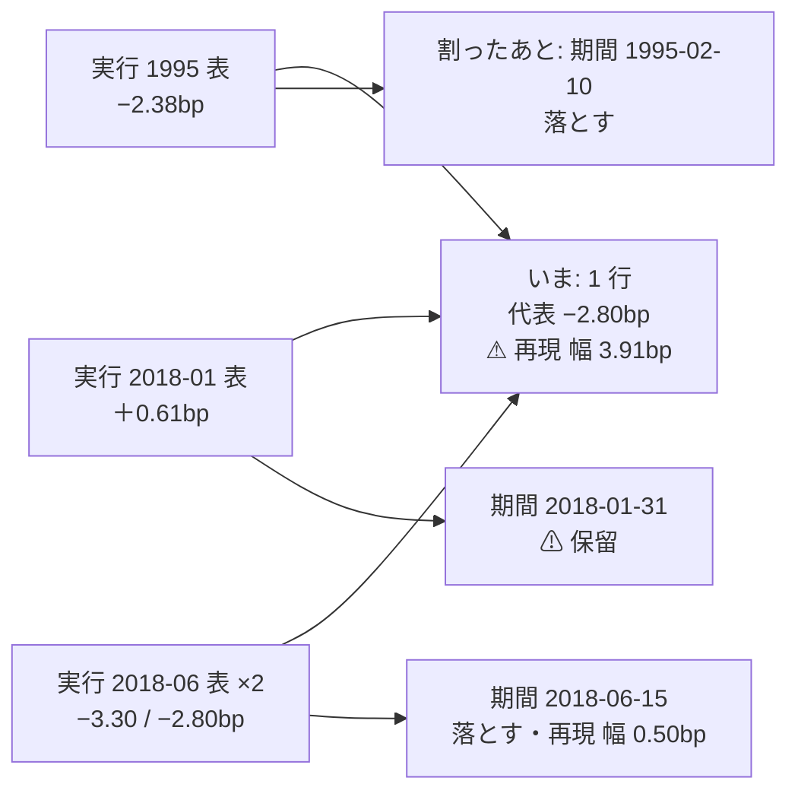

# 台帳の「期間」を遡って埋める

作成 2026-09-12。派生元: TODO「台帳の試行の数え方で見つかった 2 件」の (1)。
⚠ **利用者の決定（2026-09-12）: 埋める。**
経緯と実測: [validation-power.md §8-2-5](../../specs/experiments/feature-discovery/validation-power.md) ／ 規約: [rules.md 14-4](../../specs/experiments/feature-discovery/rules.md)・[14 章の変更規約](../../specs/experiments/feature-discovery/rules.md)・[11 章 規約 4](../../specs/experiments/feature-discovery/rules.md)。

## 目的・背景

台帳は同じ鍵の実行を 1 行にまとめる。2026-09-11 に鍵へ「期間」を足したが、**記録の無い実行は「—」に寄せた**ので、開始日の違う表で回した実行はいまも 1 行に混ざったままである。

| ⚠ いま起きていること | 中身【実測 2026-09-11】 |
| --- | --- |
| 期間の違う実行が同じ行にまとまる | **39 行**（うち試行 27） |
| 台帳に出るのは代表 1 本だけ | 他の期間の結果は行から消える |
| ⚠ **食い違いが「再現」の列に出る** | 「再現」は**同じ条件で回し直したら数字が動いた ＝ まず配線を疑え**の列（11 章 規約 7）。期間差をそこに出すと読み違える |
| ⚠ **試行を数え落としている** | 11 章 規約 4「数え落とすと必ず甘くなる」に反する。**36 試行ぶん少ない** |

例（F3-1 Lasso × Ridge × own × adjusted × 毎日往復）。いまは 1 行で「純利 −2.801bp ／ 再現 ⚠ 4 実行・幅 3.91bp ／ 落とす」。中身は 4 実行で、3 つは別の表である。

| 表の開始 | 表 | 純利 | fold | 割ったときの判定 |
| --- | --- | ---: | --- | :-: |
| 1995-02-10 | `own_only_h1` | −2.3805bp | 0/5 | 落とす |
| 2018-01-31 | `own_2018` | **＋0.6146bp** | 1/5 ＋−−−− | ⚠ **保留** |
| 2018-06-15 | `own_impact_2018` | −3.2993bp | 0/5 | 落とす |
| 2018-06-15 | `own_impact_2018`（代表） | −2.8010bp | 1/5 ＋−−−− | 落とす |

⚠ **同じ表どうしの再現幅は 0.50bp** で、3.91bp の大半は期間差だった。

> この図の主張: ⚠ **「割る」は再計算ではない。** どの数字も既にあり、代表 1 本に隠れていた実行が表に出るだけである。

## ⚠ 先に固めておく設計決定

| # | 決定 | 理由 |
| ---: | --- | --- |
| 1 | 期間の出所は 3 段: (a) `inputs.panel_start`（実行が記録している） → (b) sidecar の写し `features_meta.start` → (c) ⚠ **`inputs.features_file` が指す表の実物から読む** | (c) が今回足す段。⚠ **config の `start_date` からは埋めない**（表を借りる実行には無いし、いまの config を過去の実行に当てるのは自己申告になる） |
| 2 | ⚠ **(c) は「行数が実行の記録と一致する」ときだけ使う**。合わなければ「—」 | ⚠ **表は後から作り直されている**（実測: `2026-09-09T12-22-33_own_impact_2018` は 131,250 行を読んだが、いまの表は 130,134 行）。⚠ **別の表の開始日を貼ってはいけない** |
| 3 | 表が消えている実行も「—」（実測 1 本: `_repro_oldcsv`）／ 旧配線の表（legacy）も「—」 | 分からないものは分からないと書く |
| 4 | ⚠ **数字は 1 つも再計算しない。** 行が割れるだけで、各行の純利・fold・判定はその実行が出した値そのもの | 14 章「再計算しない」はこの意味で守られる。⚠ **変わるのは n_trials と、それを通した DSR の基準** |
| 5 | ⚠ **`[[closed]]` の 16 件は、注記が当たっていた行（＝ 代表の実行の期間）に釘付けする** | 利用者が 2026-09-11 に閉じたのは**その 16 行**である。割れて新しく出てきた保留の行は**閉じない**（別の試行であり、あの決定の対象ではない） |
| 6 | 割れて新しく出た保留の行は、⚠ **件数を報告して開けたままにする** | 閉じるかは利用者の判断（2026-09-11 の決定を勝手に広げない） |

⚠ **14 章の変更規約に追記が要る**（「旧 91 試行は残す・再計算しない・判定の列も変えない」と衝突するため）。何が変わって何が変わらないかを本プランの決定 4 の形で書く。

## 対応方針

### Phase 1: 期間の遡り（`ail/catalog.py`）

- `_table_period(features_file)`: 表の実物から `(最古の日, 行数)` を読む。⚠ **パスごとにキャッシュする**（実測: 27 本で 0.12 秒）
- `_period_of`: (a)(b) の次に (c) を足す。⚠ **行数の突き合わせに通らなければ「—」**
- テスト: (a)(b)(c) の 3 経路 ／ 行数不一致で埋めない ／ 表が無ければ埋めない

### Phase 2: `[[closed]]` の釘付け（`config/catalog_notes.toml`）

- 割る前の台帳で各 `[[closed]]` が当たっていた行の**代表の実行**を引き、その期間を `period = ...` として足す
- ⚠ **16 件がそれぞれちょうど 1 行・判定は保留のまま**であることを確認する（`_apply_closed` が合わなければ止まる）

### Phase 3: 台帳の再生成と文書

- `ledger.md` を再生成（178 行・94 試行 → **232 行・130 試行**の見込み。⚠ **実際は 245 行・139 試行だった** — 決定 2 の行数の門で 2 実行が「—」に落ち、見込みを出したときの試算には無かった割れ方をしたため）
- `rules.md` 14-4: 「遡って埋めない」を**埋めた**に直し、決定 4 の区別（行は割れるが数字は再計算しない）を書く。14 章の変更規約の答えにも追記
- `validation-power.md` §8-2-5 を実施済みに更新。⚠ **§2 の「再現幅」を根拠にした読みに注記を足す**（あの幅には期間差が混ざっていた）
- ⚠ **文書に散らばる「91 試行」「94 試行」の記述を洗い出して直す**（`ledger.md` は生成物なので触らない）

## 影響範囲

| 触るもの | 種類 |
| --- | --- |
| `ail/catalog.py` | 期間の遡り 1 か所 |
| `config/catalog_notes.toml` | `[[closed]]` に `period` を足す |
| `tests/test_catalog.py` | 追加 |
| `docs/specs/experiments/feature-discovery/{rules,validation-power,ledger}.md` | 追記・再生成 |
| `DONE.md` / `TODO.md` | 移動 |

⚠ **触らないもの**: `runs/` の記録（10 章。⚠ **過去の `inputs.json` に後から書き足さない**）・各実行の数字・判定の規則（13-7 / 14-5）・門の水準。

## テスト方針

| # | 確かめること | やり方 |
| ---: | --- | --- |
| 1 | 期間が 3 経路とも効き、⚠ **行数が合わなければ埋めない** | 単体テスト（tmp の parquet を作って行数を変える） |
| 2 | ⚠ **どの実行の数字も変わっていない** | 割る前後で「実行 × 手法 × 閾値」の純利・fold が一致することを突き合わせる |
| 3 | `[[closed]]` 16 件がちょうど 1 行ずつに当たる | 台帳の生成が止まらないこと ＋ 既存テスト |
| 4 | 試行数が 130 になる | 台帳を再生成して確認 |
| 5 | 全体 | `pytest -q tests`（feature-discovery ／ dashboard とも） |
