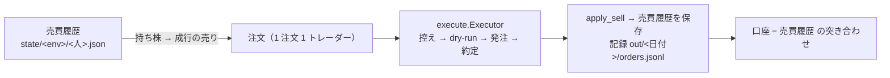

# 手じまい（持ち株を全部売る）を自動で行う `liquidate.py`

作成 2026-10-05（Sx360 の Claude）。TODO「手じまい（持ち株を全部売る）を自動で行う機能を作る」のプラン。

## 0. 目的・背景

- 利用者の指示（2026-10-05）: **「手じまいを自動で行う機能が欲しい」→「実装して明日にはプログラムを使った手じまいで既存の株を売却します」**
- いま: 人を外すとき・全部売って始め直すときは、利用者が口座の画面で売り、`reconcile.py remove` で 1 本ずつ売買履歴に写す（10/5 の 9 本がその形の予定だった）。手で売ると約定の記録（気配 → 約定の差・手数料）が残らず、売買履歴との突き合わせも手作業になる
- ⚠ 執行器の凍結（10/20 まで）: 毎日の経路（`run_day.py`・`trader.py`・`signals.py`・`plan.py`）は触らない。新しい独立した 1 本で、既存の部品（発注・控え・売買履歴・記録・許可・印・ロック）をそのまま使う

## 1. 形

この図の主張: 毎日の執行器と同じ部品を、合図の代わりに「売買履歴の持ち株」から注文を組んで通す。



```bash
cd experiments/live-trading
python liquidate.py --traders T1,T3                                   # cert: dry-run（既定）。持ち株を全部
python liquidate.py --traders T1 --symbols T,PFE --mode submit        # cert: 銘柄を絞って発注
python liquidate.py --traders T1,T3 --env prod --mode dry-run --allow-prod-dry-run
TT_ALLOW_PROD_ORDERS=1 python liquidate.py --traders T1,T3 --env prod --mode submit --i-know-this-is-real-money --while-halted
```

| 決めごと | 値 |
| --- | --- |
| 売るもの | 指定した人の売買履歴の持ち株（`--symbols` で絞れる）。口座にあって売買履歴に無い株は売らない（⚠ 差を推測で割り振らない） |
| 注文 | 成行の売り（`Sell to Close`）・1 注文 1 トレーダー・既存の `Executor`（控え → dry-run → 発注 → 約定待ち → 未約定は取消） |
| 許可 | 毎日の執行器と同じ 3 段（既定 dry-run ／ 本番の dry-run は `--allow-prod-dry-run` ／ 本番の発注は `TT_ALLOW_PROD_ORDERS=1` ＋ `--i-know-this-is-real-money`）。「本番の機械ではない」印・シミュレーションモードでは拒む・`run.lock` を取る（毎日の執行器と同時に動かない） |
| `HALT` | ある間は拒む。`--while-halted` を付けたときだけ通す（止めてから手じまいする、が普通の順） |
| 時間 | 市場が開いている間（NYSE の営業日の 9:30〜引け。半日立会は 13:00）。15:45〜16:05 の時間帯には限らない。`--ignore-market-hours` はテスト・モック用 |
| 売買履歴 | 約定ごとに `apply_sell` → 保存 → 控えを閉じる（毎日の執行器と同じ順）。状態を読めない注文は `unknown` ＝ 控えを開けたまま（次の起動 ／ `reconcile.py resolve`） |
| 記録 | `out/<日付>/`（`orders.jsonl` に `liquidate: true`・`events.jsonl` に `liquidate_start` ／ `liquidate_end`・`balances`・`positions`・`ledger`）。管理画面の注文の履歴にそのまま出る |
| 終わり | 口座の建玉 − 全員の売買履歴 を突き合わせて出す（`recovery.check_positions`）。差があれば rc=1 |
| 戻り値 | 0 ＝ 全部約定・差 0 ／ 1 ＝ 問題あり ／ 2 ＝ 引数・許可 ／ 3 ＝ HALT ／ 4 ＝ 市場が閉まっている ／ 5 ＝ sim モード ／ 6 ＝ ロック ／ 7 ＝ 印 |

## 2. 13500t での使い方（利用者）

```bash
cd /home/ubuntu/g3plus-ops/trade-runner
# 1. dry-run（何もルーティングしない）
docker compose --project-directory . run --rm -T trade-runner \
  python experiments/live-trading/liquidate.py --traders T1,T3 --env prod --mode dry-run --allow-prod-dry-run --while-halted
# 2. 発注（⚠ 実弾）
docker compose --project-directory . run --rm -T -e TT_ALLOW_PROD_ORDERS=1 trade-runner \
  python experiments/live-trading/liquidate.py --traders T1,T3 --env prod --mode submit --i-know-this-is-real-money --while-halted
# 3. 突き合わせ
python3 /home/ubuntu/ai-income-lab/experiments/live-trading/reconcile.py --env prod show
```

- 市場が開いている時間（9:30〜16:00 ET ＝ 日本時間 22:30〜翌 5:00）に。`HALT` は置いたままでよい（`--while-halted`）
- 売却代金の受渡しは翌営業日（T+1）。新しい 3 人の初日の買いは、入金分と元の現金で始まる

## 3. 影響範囲

- 足す: `experiments/live-trading/liquidate.py`・`tests/test_liquidate.py`（モックで通す・拒否の段）・手順書 2-7 と `live-trading.md` §0-8 への 1 行
- 変えない: `run_day.py`・`trader.py`・`signals.py`・`plan.py`・`execute.py`・`journal.py`・`state.py`・管理画面
- 本番: 13500t へは「デプロイ」（`prod` を進める）。⚠ `HALT` 中は auto-update が SKIP するので、売買の cron が無い時間に一時的に外して pull させる（10/4 と同じ）

## 4. テスト方針

- 拒否の段（subprocess・ネットワークなし）: 本番の発注に許可が無い ／ `HALT` で `--while-halted` なし ／ 市場が閉まっている ／ sim モード
- モックで通す: 売買履歴に持ち株 2 本 ＋ 口座にも同じ株 → `--mode submit --ignore-market-hours` → 全部 `Filled`・売買履歴の持ち株 0・`realized_usd` が動く・控えが閉じる・記録に `liquidate: true`・口座 − 売買履歴 ＝ 0 ／ dry-run は状態を書かない ／ `--symbols` で絞れる ／ 口座にあって売買履歴に無い株は売らない
- `./run-tests.sh --fast`（既存のテストが変わらない）
