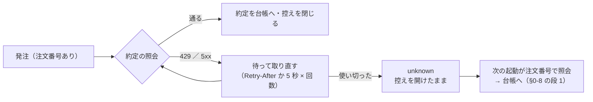

# 執行器: 429（Too Many Requests）で約定した注文が台帳から漏れる穴を塞ぐ

作成日: 2026-09-21（月・市場時間中 PDT）。利用者の指示「進めて」（cert のリハーサルで見つかった穴の修正）。

## 1. 目的・背景

2026-09-21 11:59 PDT の cert のリハーサル（`run_day.py --traders test_a --env cert --mode submit --ignore-window`）で:

- 発注は通って約定した（注文番号 1663195・`Filled`・T 1 株 @ $25.59【実測】）
- 発注の直後の約定確認の照会（`GET /accounts/{n}/orders/{id}`）が **429 Too Many Requests**（nginx の HTML）
- 執行器は `finish_one` の `except ApiError` で **「error・約定 0」と確定**し、控え（`journal.jsonl`）も `done`（0 株）で閉じた
  → 台帳は空・cert の口座は T 1 株。次の起動の復元（§0-8 の段 1）にも乗らない
- cert は認証から 3〜4 本目の照会で 429 を返した【実測】

本番の火曜の約 120 本で同じことが起きると、約定した注文が台帳から漏れ、翌日そのトレーダーは同じ銘柄を買い直す。

> この図の主張: 直す前は「照会が 1 回失敗 ＝ 約定 0 で確定」、直した後は「待って取り直す → それでも駄目なら控えを開けたまま次の起動へ渡す」。

## 2. 対応方針

| # | 直すもの | 場所 |
| ---: | --- | --- |
| 1 | `ApiError` に `retry_after`（応答の `Retry-After`）を持たせる | `experiments/tastytrade-api-sample/ttclient.py` |
| 2 | 429 を再送してよい拒否に入れる（`is_transient`）。dry-run ／ 発注の再送の待ちは 429 なら `Retry-After` か 5 秒 × 回数（上限 30 秒）。発注の再送は今までどおり `external-identifier` の重複確認を先に通す | `experiments/live-trading/execute.py` |
| 3 | 照会（約定待ち・最後の読み直し・重複確認・取消）は 429 と 5xx のとき待って取り直す（既定 6 回） | 同上 |
| 4 | 注文番号がある注文の照会を使い切ったら **`unknown`**（「error・0 株」にしない）。発注の最後の試みが 5xx で終わったときも `unknown`（届いたか分からない） | 同上 |
| 5 | `unknown` は控えを閉じない（次の起動が照会して台帳に戻す）・`events.jsonl` に `order_unknown`・問題の数に入れる | `experiments/live-trading/run_day.py` |

⚠ 変えないもの: 401 は再試行しない（IP ブロック）・4xx の拒否は再送しない・2 段の発注の順・1 注文ごとの台帳の保存。

## 3. 影響範囲

`ttclient.py`（`ApiError` の引数を 1 つ足すだけ ＝ 既存の呼び出しはそのまま）／ `execute.py` ／ `run_day.py`。管理画面は `ApiError` を読むだけなので変わらない。

## 4. テスト方針

- 約定待ちの照会が 429 を 2 回返してから `Filled` → 約定が入る
- 照会が 429 を返し続ける → `unknown`・約定 0・控えが開いたまま（次の起動の復元が拾う）
- 発注が 429 → 待って再送（重複確認を通る）→ 約定
- 既存: 執行器の pytest・`mockrun.sh`・管理画面の pytest（`ttclient` を import する）

## 5. 後片付け（引けの後）

cert の台帳の食い違い（T 1 株）は `reconcile.py --env cert add` で合わせる。

## 6. 結果（2026-09-21）

✅ 済み。執行器 142 本（新 7 本）・`mockrun.sh`・`selftest.sh`・管理画面 218 本が通る。直した後の cert の売り（1663301）で 429 が再び出て、5 秒待って約定を読めた【実測】。本番 `test_a` の買い・売りも直した後のコードで通った（本番では 429 は出ていない）。

同じ日に見つけてその場で直したもう 1 つの穴（プランを書く余裕が無かったのでここに残す）:

| 穴 | 直し | 確認 |
| --- | --- | --- |
| 市場時間中に日足の取得（`ail/data/sources/tastytrade.py`）が終わらない。「8 秒データが来なければ終わり」だが、今日の足の更新が 1 秒ごとに届き続けるので 1 束が上限 300 秒まで待つ（63 銘柄で約 20 分【推測】＝ 火曜の窓を越える） | 「**新しい時刻の足**が 8 秒来なければ終わり」にした（同じ時刻の更新は数えない） | テスト 1 本（偽の DXLink）・市場時間中に 46 秒【実測】・`run-live.sh` の更新 54〜55 秒【実測】 |
