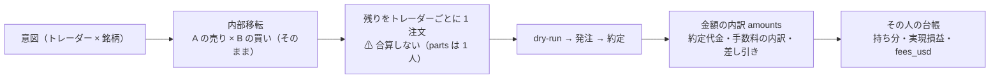
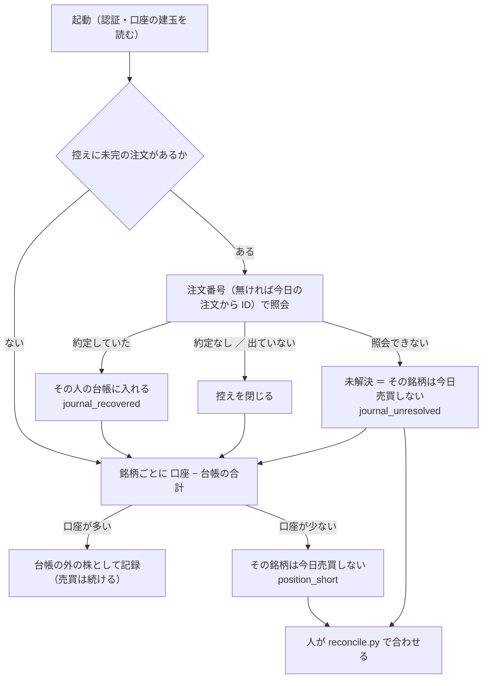

# シミュレーションで見つかった執行器の穴を直す

作成日: 2026-09-19。✅ **同日に Step 1〜7 を実装して閉じた**（決めごとと使い方は [live-trading.md §0-1・§0-2・§0-8](../../specs/experiments/live-trading.md)）。利用者の指示（2026-09-19）:「見つかった問題の修正をします」。
派生元: [シミュレーションの実装](live-trading-sim-clock.md)・[live-trading.md §0-7 (j)](../../specs/experiments/live-trading.md)（回して見つかったこと 1〜3）。

## 0. 目的・背景

シミュレーション（仮データと仮の時計）で、本物と同じ執行器に穴が 3 つ見つかった。3 つとも売買の振る舞いを変えるので、方針は利用者の裁定で決める。

## 1. 利用者の裁定（2026-09-19）

| # | 穴 | 裁定 | 状態 |
| ---: | --- | --- | --- |
| 1 | 違うトレーダーの買いを 1 本に合算して約定を按分するので、整数株の人に端数の持ち分ができる | ✅ **「トレーダーごとの成績を正確に知りたいので別々に出す。また手数料など金額の内訳も保存するように」** ＝ 口座への注文はトレーダーごとに 1 本（合算しない・按分しない）。注文ごとに金額の内訳（約定代金・手数料の内訳・差し引き）を記録し、手数料をそのトレーダーの台帳に入れる | Step 1・2 |
| 2 | 含み損 20% の停止（§0-2）が執行器に無い | ✅ **「警告だけ・止めるのは人」** ＝ 執行器は `drawdown_warning` を記録するだけで売買を続ける。止めるのは利用者（停止ボタン ＝ `HALT`）。§0-2 の文面をこれに合わせる | Step 3 |
| 3 | 発注の後に落ちた次の日、口座と台帳の食い違いを検知しない | ✅ **「提案の 3 段にします」**（2026-09-19。説明 → 「帳尻を合わせて通常の売買を回すのが良い」→ 提案）＝ 段 1 記録から戻す（自動）／ 段 2 突き合わせ（多いぶんは台帳の外として記録・少ない銘柄だけその日は売買しない）／ 段 3 人が合わせる（CLI）。⚠ **差を推測で誰かに割り振らない**（成績が混ざる） | Step 5〜7（§5） |

## 2. 対応方針

> この図の主張: 変わるのは「合算 → 按分」の 1 か所だけで、内部移転（2026-09-18 の利用者決定）と予算の検査はそのまま。1 本の注文は 1 人のものになるので、約定価格も手数料もその人にそのまま付く。

| Step | 中身 |
| --- | --- |
| 1 | `plan.aggregate`: 内部移転の後、残りの買い ／ 売りを**トレーダーごとに 1 注文**にする（`sizing` もその人のもの）。`NetOrder.parts` は常に 1 人。`allocate_fills` は形を変えない（1 人に全部） |
| 2 | 金額の内訳: `orders.jsonl` の各行に `amounts`（`gross_usd` 約定代金 ／ `fee_usd` ／ `fee_source` ／ `fee_breakdown` ＝ dry-run の `fee-calculation` を丸ごと ／ `buying_power_effect` ／ `net_usd`）。手数料は約定したときだけ、そのトレーダーの `apply_buy` ／ `apply_sell` の `fee` に入れる（`state.fees_usd`・`history`・`ledger.jsonl` の `fees_usd` に出る）。⚠ 出どころは **dry-run の見積り**（約定後の実額を読む経路 `/transactions` は未確認 ＝ TODO）。モックは `--fill-noise` のときだけ売りに規制費の内訳を返す（⚠ 想像の値） |
| 3 | 含み損の警告: `ledger` の `drawdown_pct_of_budget` ≥ 20 のトレーダーごとに `events.jsonl` へ `drawdown_warning`（⚠ 売買は続ける・rc は変えない）。管理画面の「問題」に数える |
| 4 | 文書: `live-trading.md` §0-1（持ち株の表）・§0-2（停止の行）・§0-7 (j)、親プランの「合算」の記述に注記、README、`CLAUDE.md`、`TODO.md` ／ `DONE.md` |

## 3. 影響範囲

| 場所 | 変更 |
| --- | --- |
| `experiments/live-trading/plan.py`・`execute.py`・`run_day.py` | 上の Step 1〜3。⚠ 鍵の 3 段・`HALT`・窓・予算の検査・内部移転は変えない |
| `experiments/tastytrade-api-sample/mock_server.py` | dry-run ／ 発注の応答の `fee-calculation` に内訳（`--fill-noise` のときだけ。selftest は変わらない） |
| `dashboard/app/live.py` | 「問題」に `drawdown_warning`。⚠ 画面は `parts` を読むだけなので形は変わらない |
| ⚠ 代償 | 同じ銘柄を n 人が同じ日に買うと注文が n 本になる（us63 × 3 人で最大 189 本。1 本ずつ約定を待つので窓 20 分の内に収まるかはシミュレーションと sandbox で見る）。⚠ 注文の回数が増える ＝ レート制限に近づく |

## 4. テスト方針

| # | 検査 |
| ---: | --- |
| 1 | 2 人が同じ銘柄を買う → 注文 2 本・各 `parts` は 1 人 ／ 整数株 ＋ 金額指定の混在でも整数株の人は整数株のまま ／ 内部移転は今までどおり |
| 2 | 約定した注文の `amounts` に内訳が残り、手数料がその人の `fees_usd` に入る ／ 取消・エラーの注文は手数料 0 |
| 3 | 含み損 20% 以上で `drawdown_warning`・売買は続く ／ 未満では出ない |
| 4 | 既存: pytest・`mockrun.sh`（内部移転 ≥ 1・原価が予算を超えない）・selftest・シミュレーション `sim1` ／ `sim2`（端数の持ち分が整数株の人にできない）・管理画面の pytest |

## 5. (3) 口座の建玉と台帳の帳尻を合わせる — 3 段（2026-09-19 利用者決定）

用語: **口座の建玉** ＝ tastytrade が持っている事実（銘柄ごとの株数。口座は 1 つなので合計しか見えない）／ **台帳** ＝ 執行器が付けている「誰が何株」（`state/<env>/<名前>.json`）／ **控え** ＝ 発注の前に書く注文の覚え書き（`state/<env>/journal.jsonl`）。

> この図の主張: 起動のたびに「控えの未完を戻す → 口座と台帳を突き合わせる」を売買の前に済ませる。自動で直すのは、誰の注文かが控えで確実に分かるものだけ。

| Step | 中身 |
| --- | --- |
| 5（段 1） | `journal.py`（控え）: 発注の直前に `intent`（ID・日付・誰の・銘柄・向き・数量・手数料の見積り）→ 発注の後に `submitted`（注文番号）→ 台帳を保存した後に `done`。⚠ **台帳の保存を 1 注文ごとに行う**（いままでは全注文の後に 1 回 ＝ 途中で落ちると全部失う）。起動時に `recovery.recover_unfinished`。⚠ 提案では「注文の ID を日付・トレーダー・銘柄・向きから決める」と書いたが、ID は今までどおり乱数のまま**発注の前に控えへ書く**形にした（同じ効果で、取消後の出し直しと ID がぶつからない） |
| 6（段 2） | `recovery.check_positions`: 全トレーダーの台帳（その回に動かさない人も含む）の合計と口座の建玉を比べる（許す差 0.001 株）。多い ＝ `positions_outside_ledger`（記録だけ）／ 少ない ＝ `position_short` ＋ その銘柄の意図を落とす `blocked_symbol`（rc=1）。モックに `/_mock/positions`（運転手が続きから起こすとき台帳の合計を入れる・筋書き `position_loss`） |
| 7（段 3） | `reconcile.py`（⚠ ネットワークを使わない・`run.lock` を取る・モードに従う木だけ）: `show` ／ `add` ／ `remove` ／ `resolve`。直した内容は台帳の `history` に `note: "reconcile"`、`reconcile.log` に残す |
| テスト | 控えの未完 → 約定を戻す ／ 約定なしで閉じる ／ 照会できず未解決 ＝ 銘柄を止める ／ 多い・少ないの突き合わせ ／ CLI ／ シミュレーションの `crash_mid` の次の日に二重に売買しない ／ `position_loss` |
| ⚠ 未確認 | 前の営業日の注文を注文番号で照会できるか（当日は 2026-09-08 に実測）。だめなら未解決 → 段 3 |
