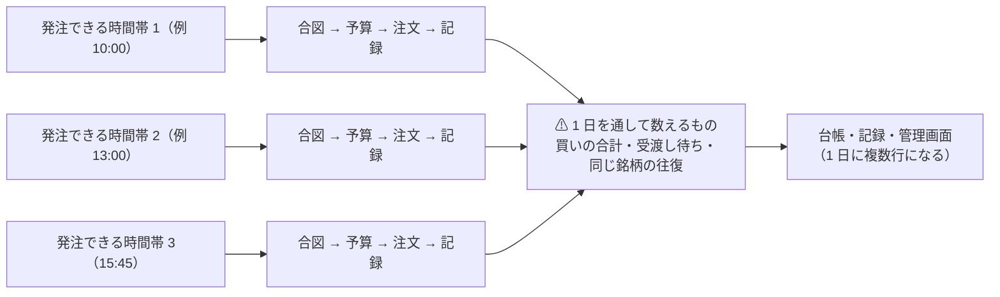

# 1 日に複数回の発注できる時間帯を通す — 発注できる時間帯を広げる（D13・C9・D14）

作成日: 2026-09-20。利用者の決定（2026-09-20）: **「1 日に複数回売買する可能性はあるので、そういう意味であれば広げる」**。
親: [実売買のプラン](../live-trading-three-models.md)。関連: [live-trading.md §0-2（発注できる時間帯と上限）・§0-6（規制の線）・§0-7 (l)（自動テスト）](../../specs/experiments/live-trading.md)・[dashboard.md §13](../../specs/dashboard.md)。
TODO の **D13**（発注してよい時間帯）・**C9**（同日の往復の規則）・**D14**（1 日の上限の数え方）をまとめて閉じるためのプラン。

❌ **2026-09-20 に「広げない」と決まった（不採用。実装しない）**。利用者の指示: **「1 日に複数回広げても意味がないので広げない。ただし 1 日に別銘柄を購入したり、買いと売りを同時に出すのは問題ない」**。
⚠ **取り消した理由**（利用者の指摘「そもそも分足などのデータを取っているのか。予測モデルが分足で学習しているのか」で調べ直した）:

| 調べたこと | 実測 2026-09-20 |
| --- | --- |
| 1 分足 | 63 銘柄 × 8,000 本 ＝ **提供元の上限 ≈ 30 日**。手元は **8 営業日だけ**・⚠ 遡れない |
| 3 人のモデル | ⚠ **全部 日足**（`dataset="daily"`・`horizon=1`）＝ **1 日に何回起こしても合図は 1 日 1 回しか変わらない** |
| 短い足 | ⚠ **2026-09-08 に「成立しない」と結論済み**（5 分先は符号を 100% 当てても 8.88bp ＜ 往復 10bp。値動きの幅の問題） |

**決定の正本は [live-trading.md §0-9](../../specs/experiments/live-trading.md)。** ⚠ **残った宿題は D14**（1 日の買いの上限がトレーダーごと・1 起動ごとにリセットされる ＝ 広げなくても 3 人なら 3 倍）。
⚠ 以下は取り消す前のプランの文面（再検討する日のために残す。再検討の条件は §0-9）。

## 0. 目的・背景 — 「広げる」と決まったが、広げるだけでは足りない

2026-09-18 に **「1 日に何回売買するかはトレーダーの判断」** と決まったのに、執行器の発注できる時間帯は **15:45〜16:05 ET に固定**のまま（`run_day.WINDOW_START/END`）。
⚠ **運転手（シミュレーション）は既に「発注できる時間帯の一覧」に対応している**ので、広げるのは執行器の側である【実測 2026-09-20: 10:00 の発注できる時間帯は `out_of_window` で拒まれる】。

> この図の主張: いまは 1 日に 1 回だけ「発注できる時間帯 → 合図 → 注文 → 記録」が回る。複数回にすると、回ごとに独立でよいものと、**1 日を通して数えないといけないもの**に分かれる。

⚠ **調べて見つかった穴（2026-09-20【実測】）**:

| # | 穴 | いまの実装 | 複数回にすると |
| ---: | --- | --- | --- |
| 1 | **1 日の買いの上限が「1 日の合計」になっていない** | `--max-day-usd` は `plan.size_intents` の中の `day_total` で数えるが、⚠ **トレーダーごと・1 起動ごとにリセットされる**（`run_day.py` が人ごとに呼ぶ） | ⚠ **発注できる時間帯を N 本にすると N 倍に緩む**（3 人 × 3 発注できる時間帯なら実質 9 倍）。⚠ **D14 を決めて直さないと、広げた瞬間に上限が効かなくなる** |
| 2 | 未約定の取消（600 秒）が発注できる時間帯より長くなりうる | `--cancel-after 600`（発注できる時間帯は 20 分） | 発注できる時間帯が短い／間隔が近いと、前の発注できる時間帯の注文が生きたまま次の発注できる時間帯が来る。⚠ **同じ銘柄に二重の注文**が出ないか（`external-identifier` は同じ実行の中の再送にしか効かない） |
| 3 | 合図の時刻が「15:50 の気配」前提 | §0-2・判定の閾値（差 1） | 発注できる時間帯ごとに気配の時刻が違う ＝ **差 1 を発注できる時間帯ごとに分けて見るか**を決める必要 |
| 4 | 記録・台帳・画面が 1 日 1 行を前提にしている所がある | `ledger.jsonl` は起動ごとに 1 行（複数行になる）／ 管理画面の**行動のマス目は 1 日 1 マス**（その日の最後の注文の色になる）／ 日次の表は 1 日 1 行 | ⚠ **1 日の中の 2 回目を画面で区別できない**（数字は合うが、行動が読めない） |

## 1. ⚠ 利用者に決めてもらうこと（推奨つき）

| # | 決めること | 推奨 | 他の案 |
| ---: | --- | --- | --- |
| **1** | **発注できる時間帯の置き方**（D13） | **トレーダーごとに「時刻の一覧」を持つ**（`config/traders/<名前>.toml` の `windows = ["10:00", "15:45"]`。既定は今までどおり `["15:45"]`）。⚠ **執行器が受け付ける時間帯は 9:35〜15:55 ET に広げ**、各発注できる時間帯は開始から 20 分（いまと同じ長さ）。⚠ 半日立会は 12:45〜13:05 に読み替える（いまは発注しない） | 全体で 1 本の一覧（人ごとに変えられない）／ 「N 分ごと」の間隔で持つ（回数が読めない）／ 場中ずっと（⚠ 常駐が要る・差 1 の比較が難しくなる） |
| **2** | **同日の往復の規則**（C9） | **今日買った株を今日売ってよい**（✅ 規制上は可 ＝ §0-6 E17-a）。⚠ **売った銘柄はその日は買い戻さない**（受渡し待ちで買えないうえ、損切りなら wash sale の当日分も避けられる ＝ §0-6 の候補どおり） | 1 日 1 方向に絞る（単純だが「トレーダーの判断」を狭める）／ 空きがあれば買い戻し可（⚠ 受渡し待ちの管理が要る） |
| **3** | **1 日の上限の数え方**（D14。⚠ **穴 1 の対処**） | **その日の記録（`out/<日付>/orders.jsonl`）を起動時に読み、全トレーダー・全発注できる時間帯の買いの合計で数える**（`--max-day-usd` の名前どおり）。⚠ 併せて**トレーダーごとの 1 日の上限**（`budget_usd` とは別）を持てるようにする | 1 起動あたりの上限として仕様の文面を直す（⚠ 「1 日に何回売買しても同じ」という約束を弱める）／ 発注できる時間帯の数で割る（分かりにくい） |
| **4** | **GFV の歯止め**（§0-6 E17-c） | 受渡し待ちを使わない限り 0 回のはずなので、**口座の通知を読む経路を調べ（未確認）、出たら即停止**を §0-2 の停止条件に足す | 何もしない（⚠ 12 か月で 5 回目に 90 日の closing-only ＝ 実験が止まる） |

## 1-1. 決めること 1 を丁寧に — 発注できる時間帯の置き方（⚠ まずこれだけ決める）

**決めるのは 3 つの数字**: (a) 1 日に何本の発注できる時間帯を置けるようにするか ／ (b) 執行器が受け付ける時間帯 ／ (c) 1 本の発注できる時間帯の長さ。

### いまの姿（事実。⚠ 推測ではない）

| 項目 | いま | どこ |
| --- | --- | --- |
| 発注できる時間帯 | **15:45〜16:05 ET の 1 本**。合図は発注できる時間帯に入った時点の気配、注文は成行、未約定は 600 秒で取消 | `run_day.WINDOW_START/END`・§0-2 |
| 起動 | ⚠ **人が手で 1 回叩く**（タイマーは無い） | §0-5 の手順書 |
| 休みの日 | 土日・NYSE 休場日・⚠ **半日立会も一律拒否**（13:00 引けなので発注できる時間帯が引けの後になる） | `window_refusal` |
| シミュレーション | ⚠ **運転手は既に「発注できる時間帯の一覧」に対応済み**（執行器だけが 1 本固定） | `simrun.window_times` |
| 番人 | 「発注できる時間帯の外（10:00）は `out_of_window` で拒む」テストがある ＝ 広げたら落ちて気づく | `tests/test_sim_limits.py` |

### 選択肢

| | **A** 全体で固定の複数発注できる時間帯 | **B** トレーダーごとの発注できる時間帯の一覧（⚠ 推奨） | **C** 時間帯 ＋ 間隔 | **D** 場中ずっと（常駐） |
| --- | --- | --- | --- | --- |
| 中身 | 例 10:00・13:00・15:45 を全員共通 | 各 `config/traders/*.toml` に `windows`。⚠ 省略時は `["15:45"]` ＝ いまと同じ | 例 10:00〜15:55 を 30 分ごと（12 本） | 合図が変わった瞬間に発注 |
| 「1 日に何回売買するかはトレーダーの判断」（2026-09-18 の決定）との整合 | △ 人ごとに変えられない | ◎ 決定そのまま | △ 回数が設計でなく間隔で決まる | ◎ だが別の設計 |
| 実装の重さ | 小 | **小〜中**（トレーダーに属性 1 つ ＋ 執行器の判定） | 中 | 大（常駐・見張り・再起動・二重起動の防止） |
| 1 日に起こす回数 | 3 | **人により 1〜3**（⚠ 起こすのは発注できる時間帯の和集合 ＝ 最大 3 回） | 12 | 1（起きっぱなし） |
| 差 1（判定の対象）への影響 | 発注できる時間帯ごとに分けて見られる | 同左（⚠ 記録に発注できる時間帯の番号を残す） | ばらけて比べにくい | 連続的で比べにくい |
| 危なさ | 中 | 中 | ⚠ 高（注文数・手数料・GFV の機会が増える） | ⚠ 高 |
| 実験の比較可能性 | 全員同じ条件 | ⚠ **人によって条件が違う**（発注できる時間帯も比較の対象になる ＝ 狙いどおりだが、θ やモデルの差と混ざる） | 低 | 低 |

### 推奨 B の具体案（数字を入れたもの）

| 項目 | 値 | ⚠ 理由 |
| --- | --- | --- |
| 発注できる時間帯の持ち方 | `windows = ["10:00", "13:00", "15:45"]`（トレーダーごと。省略時 `["15:45"]`） | いまの 3 人は 1 本のまま ＝ **走る実験の条件を静かに変えない** |
| 受け付ける時間帯 | **9:45〜15:55 ET** | ⚠ 9:30〜9:45 を外す: 寄り付き直後はスプレッドが広く気配が飛ぶ ＝ **差 1 が時間帯の効果で悪化する**【推測。実測はまだ無い】／ 15:55 で締める: 発注できる時間帯 20 分 ＋ 取消 600 秒が引け（16:00）をまたぐと成行が翌日に残る恐れ |
| 1 本の長さ | **20 分**（いまと同じ）。⚠ 発注できる時間帯どうしは重ねない（最短間隔 20 分） | 再送 60 秒 × 3 ＋ 取消 600 秒が発注できる時間帯の中で片付く（既存の設計をそのまま使える） |
| 半日立会（13:00 引け） | **引けの 15 分前に最後の発注できる時間帯**（12:45〜13:05 は引け後に食い込むので 12:40〜13:00）。それより後の発注できる時間帯はその日だけ落とす | いまは一律拒否。⚠ 20 営業日の実験にかかるのは 11-27・12-24 の 2 日 |
| 記録 | 注文・合図・台帳の行に **発注できる時間帯の番号（`window`）と発注できる時間帯の時刻**を足す | ⚠ **差 1 を発注できる時間帯ごとに分けて見られるようにする**（混ぜると時間帯の効果が判定に入る） |
| 既定 | ⚠ **変えない**（1 本 ＝ 15:45）。複数発注できる時間帯はトレーダーが明示したときだけ | 事故の面を最小にする |

### ⚠ 1 を決めると必ず付いてくるもの（先に見えているもの）

| # | 付いてくる決めごと | いまの状態 |
| ---: | --- | --- |
| 1 | **誰が発注できる時間帯ごとに起こすか** — いまは人が手で 1 回。発注できる時間帯が 3 本なら 3 回。⚠ **無人運転（判定の「人手 0 回」）を目指すならタイマー（systemd timer ／ cron）が要る**。⚠ 鍵を入れて起こすのは利用者（Claude は仕組みと手順まで） | ⚠ **プランに入っていなかった** ＝ Phase を 1 つ足す |
| 2 | **判定の分け方** — 差 1 の中央値を全部まとめて見るか、発注できる時間帯ごとに分けるか | §0-2 の閾値は「まとめて」のまま |
| 3 | 決めること 2（同日の往復）と 3（1 日の上限）は、発注できる時間帯が増えた瞬間に効く | 未決 |
| 4 | 実売買の T1〜T3 の発注できる時間帯 | ⚠ 決まるまで 1 本 |

## 2. Phase

| Phase | 中身 | 目安 |
| --- | --- | --- |
| **0** | ⚠ **利用者の裁定**（§1 の 4 つ）。決まった値を [live-trading.md §0-2](../../specs/experiments/live-trading.md) に書く | — |
| **1** | 執行器: 発注できる時間帯を**時刻の一覧**にする（トレーダーごと ＋ 既定）・受け付ける時間帯を広げる・半日立会の読み替え・`--ignore-window` はそのまま | 0.5 日【推測】 |
| **2** | ⚠ **1 日の上限を 1 日で数える**（起動時にその日の `orders.jsonl` を読む ＝ 記録が正本。⚠ 数え直さない設計のまま） ＋ C9 の規則（売った銘柄はその日買わない）を `plan.py` に | 0.5 日【推測】 |
| **3** | 二重発注の防止: 前の発注できる時間帯の**働いている注文**を起動時に照会し、同じ銘柄に重ねない（⚠ 穴 2）。取消の秒数を発注できる時間帯の長さに合わせる | 0.5 日【推測】 |
| **4** | 記録と画面: 1 日に複数行になる台帳の扱い・⚠ **行動のマス目を「1 日の中の回」で割るか**（`dashboard.md §13`）・日次の表に回数の列 | 0.5〜1 日【推測】 |
| **5** | シミュレーションとテスト: `config/sim/sim3.toml`（複数発注できる時間帯）・`test_sim_limits.py` の「発注できる時間帯の外は拒む」を**新しい時間帯に合わせて書き直す**・黄金の集計値を更新（⚠ 理由を書いて更新） | 0.5 日【推測】 |
| **6** | 仕様: §0-2（発注できる時間帯・上限・C9）・§0-6 の含意の表・§0-7 (l)・CLAUDE.md | 0.5 日【推測】 |

## 3. 影響範囲

| ファイル | 変更 |
| --- | --- |
| `experiments/live-trading/run_day.py` | `WINDOW_START/END` → 発注できる時間帯の一覧・`window_refusal` の判定・1 日の上限の読み込み |
| `experiments/live-trading/plan.py` | 1 日の合計での上限・C9 の規則（売った銘柄はその日買わない） |
| `experiments/live-trading/trader.py`・`config/traders/*.toml` | `windows`（トレーダーごと）・1 日の上限 |
| `experiments/live-trading/execute.py` | 働いている注文の照会（二重発注の防止） |
| `experiments/live-trading/config/sim/sim3.toml`（新） | 複数発注できる時間帯の筋書き |
| `experiments/live-trading/tests/` | `test_sim_limits.py`（発注できる時間帯）・`test_plan.py`（上限・C9）・黄金値 |
| `dashboard/app/live.py`・`charts.py`・templates | 1 日複数回の台帳・行動のマス目・日次の回数 |
| `docs/specs/experiments/live-trading.md`・`CLAUDE.md` | §0-2・§0-6 の含意・§0-7 (l) |

⚠ **実売買の 3 人（T1〜T3）の発注できる時間帯は、決まるまで今までどおり 1 回**（既定を変えない ＝ 走っている実験の条件を静かに変えない）。

## 4. テスト方針

| 確かめること | どう見るか |
| --- | --- |
| 発注できる時間帯が一覧で効く | トレーダーごとに違う発注できる時間帯を置き、それぞれの時刻に起動する・一覧に無い時刻は `out_of_window` |
| ⚠ **1 日の上限が 1 日で効く** | 3 発注できる時間帯 × 3 人で、**買いの合計が上限を超えない**（⚠ いまは発注できる時間帯ごとにリセットされるので、直す前に落ちるテストを書く） |
| 二重に買わない・二重に注文しない | 同じ銘柄に前の発注できる時間帯の注文が生きている間は出さない |
| C9 | 今日買った株を今日売れる ／ 売った銘柄はその日買い戻さない |
| 半日立会 | 12:45〜13:05 に読み替えた発注できる時間帯で動く（⚠ いまは「発注しない」） |
| 受渡し（T+1） | 売った代金はその日の買いに使われない（§0-6 E17-b の線。既存の回帰） |
| 黄金の集計値 | 複数発注できる時間帯の `sim3` を足す。⚠ 既存の `sim1`・`sim2` は**値が変わらない**こと（既定を変えていない証拠） |

## 5. やらないこと

- ⚠ **既定の発注できる時間帯を変えない**（1 日 1 回のまま。複数発注できる時間帯はトレーダーが明示したときだけ）
- ⚠ **場中ずっと動かす形にしない**（常駐と監視が別の設計になる。決めるなら別タスク）
- ⚠ **指値・MOC を今回入れない**（D13 の「注文の種類」は別の決めごと。いまは成行のまま）
- ⚠ **規制の判断を Claude がしない**（§0-6 は机上の調査。⚠ 最終判断は利用者と CPA）
