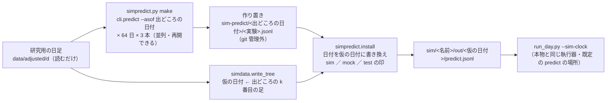

# `sim_T1`〜`sim_T3` を `kind = "experiment"` でシミュレーションに流す

親: [live-trading-three-models.md](live-trading-three-models.md) ／ 段取り: [live-trading-go-live-0922.md](live-trading-go-live-0922.md) ／ 決めごとと記録: [live-trading.md §0-7](../specs/experiments/live-trading.md)

## 0. 目的と背景

- 火曜（2026-09-22）に本番へ入れる `T1`〜`T3` は、モデルの `kind` が `experiment`（`predict.jsonl` を読む）。ところが、いままでのシミュレーション（`sim1`・`sim2`）は `kind = "file"`（移動平均の合図）の 3 人・最大 10 銘柄だけで、**`experiment` の経路・63 銘柄 ／ 48 銘柄・金額指定 $4.76 の枠を、何日も続けて通したことが無い**（S8 は 1 日ぶんだけ）。
- 投入の前に、本番と同じ形の 3 人を仮データと仮の時計で 64 営業日流し、執行器が「毎日の予測を読む → 計画 → 2 段の発注 → 台帳」を続けて回せるかを見る。
- ⚠ **見るのは執行器の振る舞いだけ**（注文の本数・所要時間・見送りの事象・口座 − 台帳の差）。⚠ **日付は仮・値段は過去の実物なので、損益に意味は無い**（判定に混ぜない。§0-7 (a)）。
- ⚠ **試行ではない**: `runs/` を作らない ＝ 台帳の n_trials は動かない（`cli.predict` は `runs/` を書かない）。

## 1. 対応方針

> この図の主張: 予測は「出どころの日付」で先に作り置きし、運転手が木を作るときに仮の日付へ書き換えて置くだけ ＝ 執行器（`run_day.py`）は 1 行も変えない。

### 1-1. 決めごと

| # | 決めごと | 値 | 理由 |
| ---: | --- | --- | --- |
| 1 | 予測の日付 | `cli.predict --asof <出どころの日付>` で作り、行の `date` を仮の日付に書き換える（元の日付は `source_date` に残す） | シミュレーションは「k 番目の仮の営業日 ＝ 出どころの k 番目の足」（`simdata.build`）。執行器は行の日付が今日と違えば読まない（`signals._read_predict_rows`） |
| 2 | 予測の入力 | **研究用の `data/`**（`AIL_DATA_DIR` を外して回す）。⚠ 読むだけ | シミュレーションの値段の出どころ（`simdata.DATA_DIR`）と同じ足 ＝ 予測の「今日の終値」（`proxy_close`）とモックの気配が同じ数字になる。置くときに突き合わせて、日付の当て方のずれを検知できる。`data-live/` は 2026-09-08 までは研究用の写しと同じ足だが、外部系列が別物（`exog_live`）で、実売買の日の更新と取り合う |
| 3 | 作り置きの場所 | `experiments/live-trading/sim-predict/<出どころの日付>/<実験>.jsonl`（＋ `.meta.json`。git 管理外。`LT_SIM_PREDICT_DIR` で変えられる） | `--fresh` は `sim/<名前>/` を消すので、木の外に置く。Sx360 へは titan で作ったこのディレクトリを写す（T2 の LightGBM が無くても回せる。§0-7 (f)） |
| 4 | 置く場所 | `sim/<名前>/out/<仮の日付>/predict.jsonl`（執行器の既定の場所） | `run_day.py` の引数を足さない。置き場はシミュレーションの木の内（`modes.inside`） |
| 5 | 行の印 | 置く行には `sim: true`・`mock: true`・`test: true` | `simctl.py check` は `out/*/*.jsonl` の全行に印を求める |
| 6 | 作り置きが欠けている日 | **運転手が起動を拒否する**（欠けた日と、作るコマンドを出す） | 予測が無い日は「合図なし」で静かに何もしない ＝ 通ったように見えてしまう |
| 7 | 並列と再開 | 1 回 約 34 秒【実測】× 192 回。既定 8 並列・出来ている（日付, 実験）は飛ばす・`setsid nohup` で切り離し、終了は pid で待つ | 直列だと約 1.8 時間【推測】 |
| 8 | トレーダー | `sim_T1`〜`sim_T3` ＝ `config/traders/candidates/notional/` の写し（名前は `sim_` 始まり・`test = true`・予算 $300 × 3 ＝ $900）→ `config/sim/sim3.toml`（筋書きなし・期間と出どころは sim1 と同じ） | 本番の第 1 候補の形 |
| 9 | 余力があれば | `sim_S1`〜`sim_S3` ＝ `candidates/shares/` の写し（T・PFE・NKE・VZ・BAC・整数株）→ `sim4`。作り置きは同じものを使う | 端株が通らなかったときの形 |

### 1-2. 変えないもの（⚠ 火曜の投入まで凍らせる）

`run_day.py`・`execute.py`・`ledger.py`・`journal.py`・`recovery.py`・`plan.py`・`signals.py`・`trader.py`・`state.py`・`reconcile.py`・`run-live.sh`・`cli/predict.py`・`cli/build.py`・`cli/run.py`・`data-live/`・研究用の `data/`。ここを変えないと進めないと分かったら、変えずに止めて報告する。

## 2. 影響範囲

| 場所 | 変更 |
| --- | --- |
| `experiments/live-trading/simpredict.py`（新） | `make`（作り置き）・`status`・`install`（木へ置く）。⚠ tastytrade に繋がない・`.env` を読まない |
| `experiments/live-trading/simrun.py` | 木を作った直後に `simpredict.install` を呼ぶ 1 か所。⚠ `experiment` のモデルを持つトレーダーがいないとき（sim1・sim2）は何もしない ＝ 動きは変わらない |
| `config/traders/sim_T1〜T3.toml`・`config/sim/sim3.toml`（＋ 余力で `sim_S1〜S3`・`sim4`） | 新規 |
| `tests/test_simpredict.py`（新） | 下の §3 |
| `.gitignore` | `experiments/live-trading/sim-predict/` |
| `docs/specs/experiments/live-trading.md` §0-7 | 小節 (k) と (g) の表 |

⚠ titan で回す ＝ 本物の `MODE`・`run.lock` に触らない。`LT_MODE_DIR` を作業用の置き場（`~/.cache/ai-income-lab-sim`）に向ける（`run-sim.sh` と同じ）。管理画面（3012）・vibeboard（3010）は触らない。

## 3. テスト方針

- `tests/test_simpredict.py`（`LT_MODE_DIR`・`LT_SIM_DATA_DIR`・`LT_SIM_PREDICT_DIR` は tmp。`cli.predict` は呼ばず、作り物の作り置きを置く）
  - 置いた行は日付が仮の日付・`source_date` が出どころ・印 3 つ・手法はそのまま
  - 作り置きが 1 日でも欠けていれば `install` が止まり、欠けた日を挙げる
  - `proxy_close` とその日の気配が食い違えば数える（日付の当て方のずれの検知）
  - `experiment` のモデルが無い設定では何も置かない（sim1・sim2 の木は今までどおり）
  - 運転手を通しで: `experiment` の 1 人を作り物の予測で数日流し、注文が出て `simctl.py check` が通る
- 回帰: 執行器の pytest 全部・`sim1`（`--fresh --speed max`）が今までどおり通る
- 終わりに `experiments/feature-discovery/runs/` と `data/` に増えた・変わったものが無いことを確かめる

## 4. 手順

1. プラン（これ）
2. `simpredict.py`・`simrun.py` の 1 か所・設定・テスト
3. 作り置きを切り離して回す（`setsid nohup`・pid で待つ）
4. `sim3` を最速で流す → `simctl.py check` → 数字を拾う（余力で `sim4`）
5. 回帰 → `live-trading.md` §0-7 (k)・(g)

## 5. 結果（✅ 2026-09-20）

手順 1〜5 とも済み（余力の `sim4` も）。数字と見つかったことは [live-trading.md §0-7 (k)](../specs/experiments/live-trading.md)。凍結の範囲（§1-2）は 1 行も変えていない。プランと違ったのは 1 点だけ ＝ 仮データが `BRK/B` を読めなかったので、`simdata.load_closes` と `run-sim.sh` の日足の確認のファイル名を `BRK-B.csv` に合わせた（`sim1`・`sim2` の動きは変わらない）。
