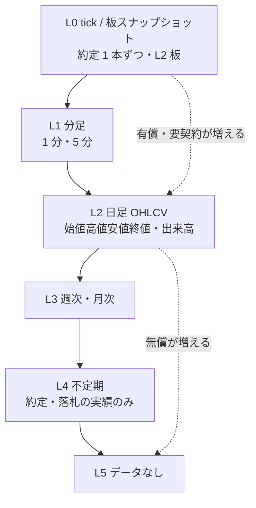
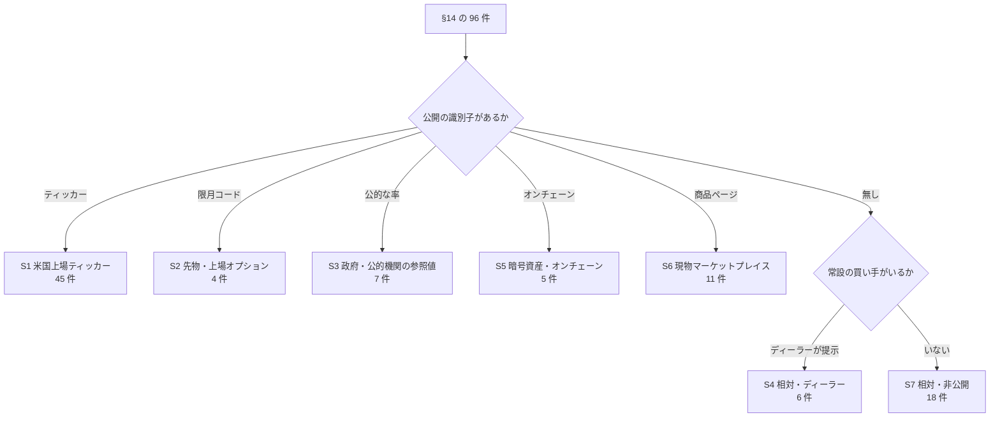
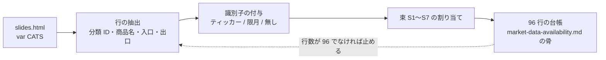
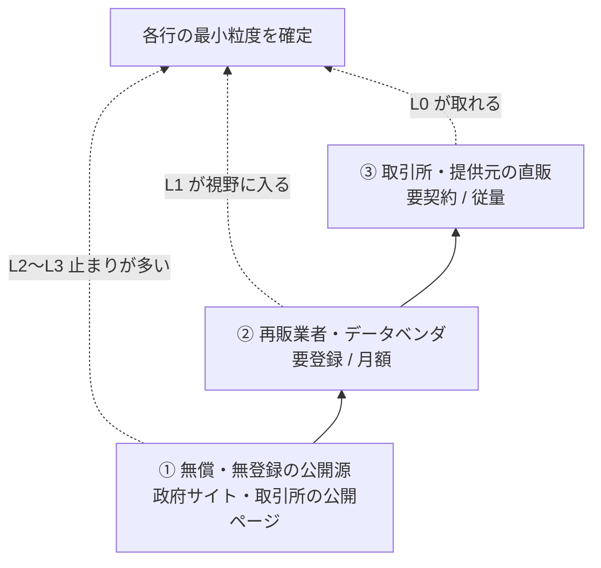
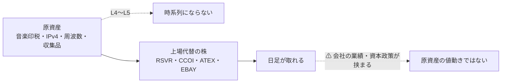

# §14 の 96 件について、過去の取引データが取れるサービスと粒度を調べる

作成日: 2026-09-01。対象: [docs/specs/online-tradable-assets-slides.html](../specs/online-tradable-assets-slides.html) に載っている **11 分類・96 件**（元文書は [docs/specs/online-tradable-assets.md](../specs/online-tradable-assets.md) §14）。

## 1. 目的と背景

**96 件のそれぞれについて「過去の取引データを取れるサービスがあるか」と「取れるとしたら最小粒度は何か」を、一次情報で埋める。**

§14 は「オンラインで売買する市場が存在するか」だけで作った一覧で、**板の有無までは分かっている**。しかし板があることと、**その板の過去のデータが手に入ること**は別である。

| 既に分かっていること（§14） | このタスクで足すこと |
| --- | --- |
| 出口が板か、買取保証か、相対か | その値動きが**時系列データとして残っているか** |
| 入口がどこか（証券口座・先物口座・専門の板） | データを**誰が売っているか / 無償で出しているか** |
| 分配利回りの現在値 | **1 分足まで取れるのか、日足止まりか、約定実績しか無いのか** |

⚠ 後続の TODO（「API で売買可能な商品を調べる」「ブラウザ自動操作で売買できるか調べる」）は、いずれも**過去データが取れることが前提**になる。この調査はその 1 段目にあたる。ただし **本タスクのスコープは「取得可否と粒度」までとし、バックテストの設計・自動売買の可否には踏み込まない**。

## 2. 何を「過去の取引データ」と呼ぶか

⚠ **ここを決めないと「取れる／取れない」が人によってぶれる。**先に定義を固定する。

### 2-1. データの種類（4 種）

同じ「価格の履歴」でも、下の 4 つは別物として列を分ける。

| 種類 | 中身 | 例 |
| --- | --- | --- |
| **T 約定** | 実際に売買が成立した値段と数量 | 株式の歩み値、先物の tick |
| **Q 気配** | 板に出ていた買い値・売り値（L1 = 最良気配 / L2 = 板の厚み） | NBBO、CME の MBO |
| **N 基準価額** | 運用側が計算する 1 口あたりの価値。**売買の値段ではない** | ETF・CEF の NAV、MMF の $1.00 |
| **R 参照値** | 第三者が決めて公表する率・指数 | I Bonds の利率、LBMA の金価格、SREC の成約指数 |

⚠ **N と R は「取引データ」ではない。**取れても「板の過去データが取れた」ことにはならないので、必ず区別して記録する。

### 2-2. 粒度の階梯（L0〜L5）

> この図の主張: 粒度は 6 段で、上に行くほど提供元が限られ有償になる。判定はこの階梯のどこに着地するかで書く。

| 段 | 内容 | ⚠ 注意 |
| --- | --- | --- |
| **L0** | tick・板スナップショット | 保存容量と費用が跳ねる。取引所の再配布規約が最も厳しい |
| **L1** | 1 分足・5 分足 | 履歴が短いことが多い（例: 直近 30 日だけ、という制限） |
| **L2** | 日足 OHLCV | ⚠ **ここが実質の標準線。**大半の判定はここに落ちる想定 |
| **L3** | 週次・月次 | 参照値（R）に多い |
| **L4** | 不定期 | オークション・相対の成約実績。**間隔が一定でない** |
| **L5** | なし | 出品履歴すら残らない |

### 2-3. 各行に付ける列（成果物の表の形）

| 列 | 内容 |
| --- | --- |
| 商品 | §14 の行と 1:1。行を増やさない・減らさない |
| 識別子 | ティッカー / 限月コード / シンボル。⚠ **無いものは「無し」と書く**（これ自体が結論） |
| データ源 | サービス名。複数あれば**最小粒度が取れるものを主**にし、無償の代替を副に書く |
| 種類 | T / Q / N / R（2-1） |
| 最小粒度 | L0〜L5（2-2） |
| 履歴の長さ | 何年分さかのぼれるか |
| 費用 | 無償 / 月額 / 従量。⚠ **【公表値】は出典 URL と取得日を併記** |
| 認証 | 不要 / 要登録 / 要契約 |
| ⚠ 規約 | 再配布・商用利用・ローカル保存の可否 |
| 出典 | URL・取得日 |

## 3. プロジェクト方針との関係（⚠ 先に確認）

CLAUDE.md の 2026-08-27 方針変更により、**登録・契約・課金は行わない**。この調査は次の線を引く。

| 行為 | 可否 |
| --- | --- |
| 提供元の公式ドキュメント・料金表・規約を読む | ✅ 行う。**判定の主根拠はこれ** |
| **無登録・無認証**で叩ける公開エンドポイントから 1 本だけ取り、粒度を目視確認する | ⚠ **規約を確認したうえでのみ行う**。禁止されていれば行わない |
| アカウント登録・API キー取得（無料枠を含む） | ❌ **行わない**（方針の「登録」にあたる） |
| 有償契約・課金 | ❌ 行わない |

⚠ この結果、**要登録・有償のサービスは「公表仕様どおりなら L1 が取れる」までしか書けない**。断定せず【公表値】として出典を残す。実地確認できたものだけ【実測】と区別する。

## 4. 成果物

| 項目 | 内容 |
| --- | --- |
| ファイル | `docs/specs/market-data-availability.md`（新規） |
| 本体 | **96 行の表**（§2-3 の 10 列）。§14 の 11 分類の並びを保つ |
| 付録 A | データ源カタログ — サービスごとに対象・粒度・費用・規約を 1 行 |
| 付録 B | ⚠ **取れないもの一覧**と、その代替経路（後述の Phase 3） |
| 図 | 各 Phase に最低 1 枚（CLAUDE.md のドキュメント規約） |

⚠ **元文書（`online-tradable-assets.md`）とスライド（`.html`）は書き換えない。**この調査は §14 に列を足すのではなく、**別ファイルで横に並べる**。§14 の行が動いたときに追随できるよう、行の対応は「§14-x の n 行目」で持つ。

## 5. 方針: 96 件を個別に調べず、「データ源の型」で束ねる

96 件を 1 件ずつ当たると重複が多い。**データの取れ方は商品ではなく“識別子と市場の型”で決まる**ので、先に束ねる。

> この図の主張: 96 件は 7 つの束に落ち、束ごとに当たるべきサービスが決まる。個別調査が要るのは下 2 束だけ。

| 束 | 件数 | 該当（§14 の分類） | 当たり方 | ⚠ 想定される着地 |
| --- | --- | --- | --- | --- |
| **S1** 米国上場ティッカー | **45** | 14-1（17）・14-2（10）・14-3 の ETF/CEF（9）・14-5 の ETF 系（5）・14-6 の ETF/SPAC 系（4） | 株式データ源を**横断で 1 回**調べれば 45 件が同時に片付く | **L0〜L1 まで有償で取れる／L2 は無償**。⚠ 例外は板の薄い銘柄（FPI・LAND・SRUUF）と SPAC ワラント |
| **S2** 先物・上場オプション | **4** | 14-5（米 rough rice・水 NQH2O）・14-6（§1256・オプション売り） | 取引所の直販（CME 等）と再販業者 | ⚠ **限月ごとにシリーズが切れる。**「連続足」を誰が作っているかが論点 |
| **S3** 公的機関の参照値 | **7** | 14-3（米国債・TIPS・I Bonds・EE Bonds・地方債・MMF・ブローカード CD） | 政府サイトの公開データ | ⚠ **種類が T ではなく R。**利回り曲線は取れても「約定」は別（社債・地方債の報告制度を当たる） |
| **S4** 相対・ディーラー | **6** | 14-3（仕組債）・14-4（MYGA・変額年金・生命保険買取）・14-5（現物金銀）・14-6（小売 FX・CFD） | 業界団体・アグリゲータ | ⚠ **L4 か L5 濃厚。**現物金銀と FX は参照値（R）なら取れる可能性 |
| **S5** 暗号資産・オンチェーン | **5** | 14-4（トークン化国債）・14-7（4 件） | 取引所の公開 API・チェーンのインデクサ | **L0 が無償で取れる可能性が最も高い束。**⚠ ただし NFT とトークン化不動産は板が薄い |
| **S6** 現物マーケットプレイス | **11** | 14-9（5）・14-11（官公庁払い下げ・返品在庫・AWS RI・ゲーム内・航空マイル・予測市場） | 各サイトの API・公開履歴 | ⚠ **サイトごとに個別調査。**予測市場（Kalshi）だけは板があり API も公開されている見込み |
| **S7** 相対・非公開 | **18** | 14-8（6）・14-10（7）・14-11 の 4 件・14-1 の「BDC 平均」 | 業界レポート・運営の開示 | ⚠ **L4〜L5 が本命。**ここは「無い」と確定させることが成果 |

⚠ **束の割り当ては初期案。**Phase 1 で 96 行に確定させる。

## Phase 1 — 母集団を確定し、束に割り当てる（見積もり 2h）

`online-tradable-assets-slides.html` の `CATS` 配列から 96 行を機械的に抜き、識別子と束を付ける。

> この図の主張: 抽出は手打ちせず、スライドの元データから機械的に取る。§14 と行数がずれない保証をここで作る。

- **Step 1-1**: `CATS` から 96 行を抽出し、`§14-x` + 行番号 + 商品名 + 入口 + 出口 を台帳にする
- **Step 1-2**: 商品名の中のティッカー（`NYSE:ABX`、`SCHD・VYM` など）を識別子列に起こす。⚠ **1 行に複数ティッカーが入っている行がある**（`AGNC・NLY`、`VRSN・GDDY・TCX`）。代表 1 本を決めるか全部持つかをここで決める
- **Step 1-3**: 束 S1〜S7 を割り当て、§5 の初期案（45/4/7/6/5/11/18）と突き合わせる。ずれたら §5 を直す
- ⚠ **「BDC 平均 12.6%」は括りで商品ではない。**識別子「無し」・束 S7 で確定させ、理由を残す

## Phase 2 — 束ごとにサービスを一次情報で当たる（見積もり 14h）

> この図の主張: 束ごとに「まず無償の公開源、次に再販業者、最後に取引所直販」の順で当たる。上に行くほど粒度が細かく、費用と規約の制約が重くなる。

### Step 2-1: S1（45 件）— 米国上場ティッカー（4h）

**1 回の横断調査で 45 件が片付く**ので、ここを最優先で厚くやる。調べるのは「サービス × 粒度 × 履歴 × 費用 × 規約」の表。

⚠ 下の候補は**すべて未確認**。Phase 2 で一次情報を当てて確定させる。

| 候補 | 想定される位置 | 確認したいこと |
| --- | --- | --- |
| 取引所・SIP の公式仕様 | ③ 直販 | L0 の再配布規約 |
| データベンダ各社（有償・月額） | ② | **L1 の履歴が何年分か**。⚠ 「1 分足は直近 N 日だけ」という制限が付きやすい |
| 無償 API（要登録の無料枠） | ② | ❌ 登録しないので**公表仕様のみ**。レート制限と粒度 |
| 無登録で CSV が取れる公開源 | ① | ⚠ **規約を確認したうえで**実地に 1 本取り、L2 の中身（分割・配当調整の有無）を目視 |
| 証券会社の API が返す履歴 | ② | 口座保有が前提かどうか。⚠ 口座開設はしないので仕様確認まで |

- ⚠ **調整済み価格かどうかを必ず記録する。**分配利回り 8〜13% の銘柄（AGNC・QYLD・PFF ほか）は、**未調整の終値では値動きの解釈を誤る**。§14-1 の ② 元本毀損型の判定と直結する
- ⚠ **上場が新しい行は履歴が短い**（ILS は設定 2025-04、CLOZ は 2023-01）。「サービスが対応していない」のか「そもそも歴史が無い」のかを分けて書く
- ⚠ **板の薄い 3 行**（FPI・LAND / SRUUF / SPAC ワラント）は、日足が取れても**出来高ゼロの日が並ぶ**可能性。出来高欠損の有無を確認項目に入れる
- ⚠ **U.UN は TSX**（米国外）。米国データ源のカバー範囲外になりやすい

### Step 2-2: S2（4 件）— 先物・上場オプション（2h）

- 取引所の直販と再販業者で、**tick / 分足 / 日足**それぞれの提供有無と費用体系
- ⚠ **限月をまたぐ「連続足」は誰かが合成したもの。**合成ルール（ロール日・価格調整）がサービスごとに違う。**どのルールかを記録する**
- ⚠ **水（NQH2O）は建玉が極小。**「データはあるが約定がほとんど無い」ことがありうる。出来高・建玉の履歴が取れるかを確認項目に入れる
- ⚠ **オプションは限月 × 権利行使価格でシリーズ数が爆発する。**日足でもデータ量が S1 と桁違いになる点を書く

### Step 2-3: S3（7 件）— 公的機関の参照値（2h）

- 政府の公開データで**利回り曲線（R）**がどこまでさかのぼれるか、粒度は日次か
- ⚠ **T（約定）は別経路。**社債・地方債には取引報告の制度があるはずで、それが公開されているか・粒度は何かを当たる
- ⚠ **I Bonds / EE Bonds は「板が無い」ので約定も無い。**取れるのは**利率の改定履歴（半期）= L3・種類 R** で確定する見込み
- ⚠ **ブローカード CD と MMF は、時系列で公開されているのが利率のスナップショットだけ**の可能性。誰がそれを蓄積しているかを探す

### Step 2-4: S5（5 件）— 暗号資産・オンチェーン（2h）

- 取引所の公開 API で **L0（約定 1 本ずつ）が無償・無登録で取れるか**。取れるならこの束は最も条件が良い
- ⚠ **取引所ごとに値段が違う。**「どの取引所の板か」を識別子に含める必要がある
- ⚠ **NFT とトークン化不動産（Lofty・RealT）は §14 の時点で板が薄い／未取得。**約定が year 単位で数件、という着地がありうる
- ⚠ トークン化国債（BUIDL・OUSG・USDY）は**購入資格が制限されている**が、データの取得可否とは別問題。混同しない

### Step 2-5: S6（11 件）— 現物マーケットプレイス（3h）

**唯一、サイトごとに個別に当たる必要がある束。**

| 対象 | ⚠ 論点 |
| --- | --- |
| 予測市場（Kalshi ほか） | **板があり API も公開されている見込み。**この束で唯一 L0〜L1 が期待できる。⚠ WA 州で取引できない件は**データ取得とは無関係**なので混ぜない |
| スニーカー（StockX） | §14 に「本物の bid/ask を持つ」と明記。**公式 API の提供形態（一般公開かパートナー限定か）**が論点 |
| トレーディングカード（TCGplayer）・時計（Chrono24） | 公式 API の有無と申請要件。⚠ **申請＝登録なので行わない。**仕様確認まで |
| 官公庁払い下げ・返品在庫・AWS RI | **落札履歴が公開されているか。**⚠ 公開されていても L4（不定期・ロットごと）で、時系列として扱えない可能性 |
| ゲーム内アイテム・航空マイル | ⚠ **そもそも規約違反の市場**（§14-11）。データ源が非公式サイトしか無い場合、**出典としての信頼性を落として記録する** |
| 美術品の分割所有（Masterworks） | ⚠ **2026-12-14 に ATS 終了予定。**過去データが**終了後も参照できるか**が固有の論点 |

- ⚠ **スクレイピングは各サイトの規約次第。**このタスクでは**規約の確認までとし、実際の収集は行わない**

### Step 2-6: S4（6 件）+ S7（18 件）— 相対・非公開（3h）

**「無い」ことを確定させるのが成果**の束。時間をかけすぎない。

- 各行について「**誰かが集計を公表しているか**」だけを当たる。⚠ 業界団体のレポート・運営自身の開示・上場代替企業の決算開示（IPv4 のリース収入、音楽印税のカタログ評価など）が候補
- ⚠ **§14-2 の 10 件は「上場代替」なので S1 で日足が取れる。**S7 の原資産（音楽印税・IPv4・ドメイン・周波数・未公開株・収集品）は取れないが、**代替銘柄の株価は取れる**。この対応関係を付録 B に残す
- ⚠ **L5（データなし）と「探しきれなかった」を分ける。**運営自身が「二次市場は無いに等しい」と明記している音楽印税のようなケースは L5 と断定してよい。根拠が無いものは「未確認」に置く

## Phase 3 — 穴を特定し、代替経路を書く（見積もり 3h）

> この図の主張: 原資産のデータが無くても、上場代替・ETF・先物を経由すれば時系列が取れることがある。⚠ ただしそれは別物の値動きである。

- **Step 3-1**: L4・L5 の行を全部集め、**代替経路があるか**を 1 行ずつ書く（上場代替 / ETF / 先物 / 参照値）
- **Step 3-2**: ⚠ **代替が「別物」であることを毎回明記する。**§14-2 のスライドが既に「資産そのものへの連動ではない」と書いている。ここと矛盾させない
- **Step 3-3**: 束ごとの着地を集計し、**L0 / L1 / L2 / L3 / L4 / L5 が何件ずつか**を出す

## Phase 4 — 成果物にまとめる（見積もり 3h）

- **Step 4-1**: `docs/specs/market-data-availability.md` を書く（§4 の構成）
- **Step 4-2**: 全行に出典 URL と取得日を入れ、**【公表値】/【推測】/【実測】**を表記区分どおりに付ける
- **Step 4-3**: ⚠ **§14 の 96 行と 1:1 で対応しているかを機械的に検算する**（行数・分類 ID・商品名）
- **Step 4-4**: TODO.md → DONE.md、プランを `docs/plans/archive/` へ

## 6. 影響範囲

| 対象 | 扱い |
| --- | --- |
| `docs/specs/market-data-availability.md` | ✅ **新規作成**（唯一の成果物） |
| `docs/specs/online-tradable-assets.md` | ❌ **書き換えない**。数値の正は元文書側 |
| `docs/specs/online-tradable-assets-slides.html` | ❌ **書き換えない**（Phase 1 で読むだけ） |
| `TODO.md` / `DONE.md` | ✅ 更新 |
| コード | ❌ 変更なし。⚠ 行抽出に使う一時スクリプトは `/tmp` に置き、リポジトリに残さない |

## 7. 検証方針

**実行しないプロジェクトなので「テスト」は無い。**代わりに次の 4 点で確からしさを担保する。

| # | 検証 | 方法 |
| --- | --- | --- |
| 1 | **母集団のずれが無い** | 成果物の行数が 96 であり、分類 ID の内訳が 18/10/17/4/8/7/4/6/5/7/10 と一致することを機械的に確認 |
| 2 | **粒度に根拠がある** | 最小粒度の列は**すべて提供元の公式ドキュメントの記述**を出典に持つ。無いものは「未確認」と書く |
| 3 | **⚠ 断定と推測を分ける** | 実地に取得して確認できたものだけ【実測】。公式仕様どおりなら取れるはず、は【公表値】。それ以外は【推測】 |
| 4 | **⚠ L5 の根拠を残す** | 「データが無い」は**提供元・運営自身の記述か、探した範囲の明示**をもって書く。探しきれなかったものは L5 にしない |

## 8. 作業量とコストの見積もり

| Phase | 内容 | 見積もり |
| --- | --- | --- |
| 1 | 母集団の確定と束の割り当て | 2h |
| 2 | 束ごとの一次情報調査（S1 4h / S2 2h / S3 2h / S5 2h / S6 3h / S4・S7 3h） | 14h |
| 3 | 穴の特定と代替経路 | 3h |
| 4 | 成果物のまとめと検算 | 3h |
| | **合計** | **約 22h**【推測】 |

| 費目 | 金額 |
| --- | --- |
| 調査の実施コスト | **0 円**。⚠ 登録・契約・課金を行わないため（§3） |
| 副産物として出す試算 | 「実際に L0 / L1 を継続取得するなら月額いくらか」を**【推測】として付録に置く**。⚠ 契約はしない |

## 9. 未確定・リスク

| # | 内容 | 扱い |
| --- | --- | --- |
| 1 | ⚠ **登録できないため、無料枠の実際の挙動が確認できない** | 公表仕様までで判定し、【公表値】と明示する。§3 の線を守る |
| 2 | ⚠ **1 行に複数ティッカーが入る行がある** | Phase 1 Step 1-2 で代表の取り方を決める。決めた規則を成果物に書く |
| 3 | ⚠ **S6 は 11 件すべて個別調査**で、想定より伸びる可能性 | 3h を超えたら「公式 API の有無」だけで打ち切り、粒度は「未確認」で残す |
| 4 | ⚠ **§14 側が更新されると 1:1 対応が崩れる** | 対応は「§14-x の n 行目」で持ち、検証 #1 で毎回検算する |
| 5 | ⚠ **規約の解釈**（スクレイピング・再配布） | 判断せず、**規約の該当箇所を引用して残す**にとどめる |
| 6 | **§14 全体像スライドの「68 件 / 28 件」が行単位の実数と合わない**件 | ✅ **2026-09-01 に解決済み**（[slides-overview-count-fix.md](archive/slides-overview-count-fix.md)）。⚠ **そこで確定した数え方をこのタスクでも引き継ぐ** — 「板があるか」は『売る場所』列が「板」を含むかだけで数え、**入口列は数え方に使わない**（表記が揺れて 49〜52 にぶれる）。板は **56 件** |
