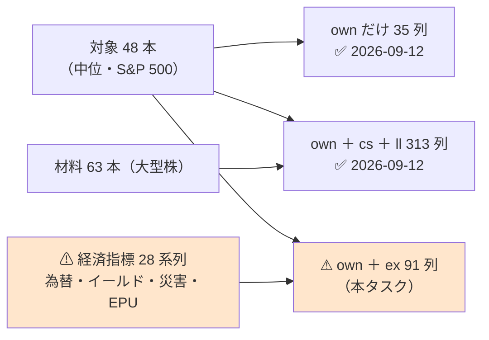

# 段 3 の続き: 中位 48 本に経済指標（`ex` 層）を足して回す

親タスク: 「銘柄集合を広げる」の子「段 3 の続き: 経済指標（`ex` 層）を足した 3 本目を回す」
派生元: 段 3（[midcap-targets.md](../../specs/experiments/midcap-targets.md)。✅ 2026-09-12 完了）
利用者の指示（2026-09-12）: **売買の確実性を担保したいので流動性がある程度あるものとし、大型株や経済指標などのデータに入力値を入れて、その銘柄の予測ができるのかを検証したい**
⚠ **このうち「経済指標」だけが未実施だった**（[midcap-targets.md §5 の限界 6・§7](../../specs/experiments/midcap-targets.md)）。
規約: [rules.md 13 章](../../specs/experiments/feature-discovery/rules.md)（閾値つき売買）／ [14-10](../../specs/experiments/feature-discovery/rules.md)（空白は積極的に埋める）／ [1 章](../../specs/experiments/feature-discovery/rules.md)（層）
台帳: [ledger.md](../../specs/experiments/feature-discovery/ledger.md)（着手時点 **n_trials 565**【実測 2026-09-15】・テスト **313 件 pass**【実測】）

---

## 0. 目的と背景

⚠ **段 3 は「大型株を材料に入れると中位 48 本を当てられるか」を測り、「良くなったがどこにも届かない」で終わった。**
⚠ **利用者の指示にはもう 1 つ「経済指標」があり、そちらは 1 度も回していない。** ⚠ **その 1 本を足す。**

> この図の主張: ⚠ **対象も期間も物差しも段 3 と同じ。** ⚠ **違うのは「何を材料に入れたか」だけである。**



⚠ **回す理由は「効くはず」ではない。** ⚠ **一次情報も過去の実測も否定的である**:

| 根拠 | 中身 |
| --- | --- |
| ⚠ **本命は偽薬を超えなかった**（[daily-data-sources §9](../../specs/experiments/daily-data-sources.md)）【実測 2026-09-09】 | us63・毎日往復で、⚠ **偽薬（気象・地震）のほうが多くの手法で価格だけを上回った**（偽薬 8/13 対 本命 7/13） |
| ⚠ **`ex` は全銘柄で同じ値** | ⚠ **断面の順位には効かない**（[exog.py](../../../experiments/feature-discovery/ail/features/exog.py) の注記）。効くとすれば ⚠ **市場全体の方向 ＝ 「休む日」の選び方**だけ |
| 段 3 の限界 3 | 中位株のリードラグの仕組みは S&P 500 の中では薄い |

⚠ **それでも回すのは、利用者の指示の未実施部分だから**であり、⚠ **「未実施」を「効かなかった」と区別するため**（[14-10 規約 4](../../specs/experiments/feature-discovery/rules.md)）。

### 0-1. ⚠ 期待する効き方を先に書く（TODO の要求）

⚠ **結果を見てから「こう効いた」と言わないために、⚠ 見る場所を先に決める。**

| # | 先に書く予想【推測】 | ⚠ 見る場所 |
| ---: | --- | --- |
| 1 | ⚠ **断面の順位は動かない**（全銘柄同値なので、同じ日の 48 本の買い% は同じ方向に動く） | 取引回数と保有日率が `own` だけの実行とどう違うか |
| 2 | ⚠ **効くとすれば「市場全体が下げる日に休む」** | ⚠ **乱択ゲートとの差**（14-6 b）。⚠ **上乗せだけ見て「当てた」と言わない** |
| 3 | ⚠ **効きの大きさは検出限界の内側に収まる** | t と fold の符号（段 3 の t は 0.46 だった） |
| 4 | ⚠ **良い数字が出たら、まず偽薬を疑う** | ⚠ **本タスクでは偽薬を回さない**（§0-2 の 3）ので、⚠ **「本命が効いた」と結論するには偽薬の対照が別に要る**と先に書いておく |

### 0-2. ⚠ 回す前に固定すること（結果を見てから決めない）

| 固定するもの | 値 | ⚠ 理由 |
| --- | --- | --- |
| 実験 | **`midcap_ex` 1 本**（＋ leak 対照 1 本）／ ⚠ **期間を揃えた対照 `midcap_own_s1809` 1 本**（＋ leak。§0-4 で足した） | TODO の「3 本目」 ＋ ⚠ **同じ行で比べるための対照** |
| 特徴量の層 | ⚠ **`own` ＋ `ex`**（35 ＋ 56 ＝ **91 列**【推測】） | ⚠ **相手は `midcap_own`**（own だけ）。⚠ **cs・ll は入れない** — 2 つ動かすとどちらが効いたか分からない（段 3 と同じ向き） |
| `ex` の取得元 | ⚠ **本命の 4 つだけ**: ECB 為替 7 ／ 米財務省イールド 7 ／ NCEI Storm Events 13 ／ EPU 1 ＝ **28 系列**（[daily-data-sources §10-5](../../specs/experiments/daily-data-sources.md)） | ⚠ **利用者の言う「経済指標」は本命の枠である。** ⚠ **偽薬（気象・地震）は入れない**（§0-2 の 3） |
| 変換 ／ ずらし ／ 引き継ぎ | `d1`・`z20` ／ **1 日**（⚠ **NCEI Storm Events だけ 120 日** — 公表が 101 日遅れる【実測 2026-09-09】）／ 上限 7 日・災害は 0 埋め | `exog.py` の既定。⚠ **振らない** |
| 対象 ／ 期間 | **48 本**（`targets = "company"`）／ **2018-06-27 から**（`midcap_own` と同じ） | ⚠ **期間を揃えないと、層の差か期間の差か分からない** |
| 選別 ／ モデル ／ k ／ θ ／ fold ／ 種 | 全部使う・乱択 ／ Ridge ／ 16 ／ 50・55・60 ／ 5 ／ 0 | ⚠ **`midcap_own.toml` と `feature_layers`・`name`・`[features]` 以外 1 key も違わない** |
| 数え方 | **n_trials 565 → 571**（＋6 ＝ 2 実験 × 「全部使う」× 3 θ。乱択は基準線で数えない） | 13-9。⚠ **期間が違えば別の鍵**なので、対照 `midcap_own_s1809` も試行として数える（13-9 の 3）。⚠ **数え落とすと必ず甘くなる** |
| 判定 | **対 B&H 上乗せ**の符号と t（13-7） | ⚠ **B&H は対象 48 本の等加重**なので、⚠ **us63 の実行とは数字を直接比べない**（13-8） |
| ⚠ **「効く」と言う条件** | ⚠ **13-7 の「採る」**（上乗せ > 0 かつ fold 5/5）に加えて、⚠ **`midcap_own` を 3 θ すべてで上回る** | 段 3 が `own+cs+ll` に課したのと同じ条件 |
| ⚠ **比較の相手（数字も先に書く）** | ⚠ **`2026-09-13T09-02-50_midcap_own`**（較正 `std`）の上乗せ **−615.58 ／ −969.19 ／ −787.44bp**（θ 50/55/60・t −1.15／−3.99／−3.06・乱択差 −598／−451／−230）【実測】 | ⚠ **記録 [§4](../../specs/experiments/midcap-targets.md) の −553.6／−955.7／−863.8 は旧の較正で回した 2026-09-12 の実行**。⚠ **較正は台帳の鍵なので、同じ `std` どうしで比べる**（13-2 の 6） |
| 門（14-5） | ⚠ **記録するだけ** | 14-10 規約 2 |

### 0-3. ⚠ 判断が要った点

| # | 判断 | 理由 |
| ---: | --- | --- |
| 1 | ⚠ **相手は `own` だけ**（`own+cs+ll` ではない） | ⚠ **段 3 と同じ土俵にする。** 「大型株を足すと ＋673bp」と「経済指標を足すと ±何 bp」を ⚠ **同じ基準線に対して並べられる** |
| 2 | ⚠ **`ex` は本命の 4 取得元にそろえる**（既存の `trade_ownex_*` は `ecb・treasury・noaa・usgs` ＝ 本命 2 ＋ 偽薬 2） | ⚠ **利用者の指示は「経済指標」。** ⚠ **災害と EPU は 2026-09-09 に足したのに 1 度も検証に入っていない**（`ex_sources` を指定した config は 0 本）。⚠ **本命の枠を宣言どおり全部入れる** |
| 3 | ⚠ **偽薬の対照は回さない** | ⚠ **偽薬の系列は 2026-09-01 で止まっており**（noaa 09-01・usgs 08-31【実測 2026-09-15】）、⚠ **引き継ぎの上限 7 日で表の尻が 1 週間短くなる** ＝ 期間が揃わない。⚠ **代わりに「偽薬を回していないので『本命が効いた』とは言えない」と §0-1 の 4 に先に書いた** |
| 4 | ⚠ **表は作り直す**（`features_from` を使わない） | ⚠ **`ex` の列は表の段で作る**ので、借りられる表が無い |

### 0-4. ⚠ 表を作って分かったこと — 頭が 50 営業日落ちた（⚠ **回す前に対照を 1 本足した**）

⚠ **`midcap_ex` の表は 95,856 行・2018-09-10 〜 2026-09-10 になった**【実測 2026-09-15】。⚠ **`midcap_own`（98,253 行・2018-06-27 から）より頭が 50 営業日・2,397 行短い。**

| 確かめたこと | 実測 |
| --- | --- |
| 原因 | ⚠ **NCEI Storm Events の `SE_CNT_熱`（熱波の件数）が 2018-04-23 から始まる。** `z20` に 20 本必要で、⚠ **公表の遅れ 120 日をずらすと、最初に使える足が 2018-09-09 になる** |
| 尻は切れたか | ⚠ **切れていない**（2026-09-10 まで。`midcap_own` と同じ） |
| `ex` の列 | **56 列・28 系列**（宣言どおり）。⚠ **定数の列 0・欠損 0** |
| leak の表 | 本番と ⚠ **行が完全一致**（95,856 行）・`LEAK_future_ret` あり |

⚠ **このままだと、比べているのが「層の差」か「期間の差」か分からない**（[daily-data-sources §9-1](../../specs/experiments/daily-data-sources.md) で同じ問題に当たり、`start_date` を足して揃えた）。
⚠ **だから対照 `midcap_own_s1809`（`own` だけ・`start_date = "2018-09-10"`）を 1 本足す。** ⚠ **足したのは結果を見る前である。**

| # | 判断 | 理由 |
| ---: | --- | --- |
| 1 | ⚠ **`ncei_storm` を外して頭を戻すことはしない** | ⚠ **取得元は §0-2 で結果を見る前に固定した。** ⚠ **データの都合で処置の中身を変えると、事前固定の意味が無くなる** |
| 2 | ⚠ **引き継ぎの上限（7 日）も伸ばさない** | ⚠ **止まった系列を定数の列で隠すことになる**（`exog.py` の注記） |
| 3 | ⚠ **既存の `midcap_own`（2018-06-27）とも並べるが、判定には使わない** | ⚠ **期間が違う。** ⚠ **[14-4](../../specs/experiments/feature-discovery/rules.md) のとおり、期間をまたぐ比較は日次換算か同じ fold 長でしか読まない** |

---

## 1. 対応方針

⚠ **コードは 1 行も書かない。** 足すのは config 1 本だけ（`ex` 層・`midcap48` の器・閾値売買はすべて実装済み）。

| 部品 | 中身 |
| --- | --- |
| `config/experiment/midcap_ex.toml`（新規） | `midcap_own.toml` の写しに `feature_layers = ["own", "ex"]` と `[features]` の `ex_*` を足したもの |
| `config/experiment/midcap_own_s1809.toml`（新規） | ⚠ **期間を揃えた対照。** `midcap_own.toml` と `name`・`start_date` 以外は 1 key も違わない（§0-4） |
| 表 | `cli.build --experiment midcap_ex`（＋ `--leak`）で 2 本 |
| 実行 | `cli.run --experiment midcap_ex`（＋ `--leak`） |

---

## 2. 影響範囲

| 触るもの | 中身 |
| --- | --- |
| `experiments/feature-discovery/config/experiment/midcap_ex.toml` | **新規**（config 1 本だけ） |
| `data/features/midcap_ex{,_leak}/` | **新規**（生成物。git 管理外） |
| `docs/specs/experiments/midcap-targets.md` | §8 として結果を追記（§5 の限界 6・§7 も更新） |
| `docs/specs/experiments/feature-discovery/ledger.md` | ⚠ **生成物。`cli.report --catalog` で吐き直す** |

| ⚠ 触らないもの | 理由 |
| --- | --- |
| `ail/` ・ `cli/` ・ 既存の config ・ 既存の表と `runs/` | ⚠ **コードを変えない**ので、段 3 の 2 本と同じ計算で回る |

---

## 3. Phase 構成


```bash
cd experiments/feature-discovery
./.venv/bin/python -m cli.build --experiment midcap_ex
./.venv/bin/python -m cli.build --experiment midcap_ex --leak
./.venv/bin/python -m cli.run   --experiment midcap_ex
./.venv/bin/python -m cli.run   --experiment midcap_ex --leak
./.venv/bin/python -m cli.report --catalog > ../../docs/specs/experiments/feature-discovery/ledger.md
```

---

## 4. テスト方針・検算

| # | 検算 | ⚠ 落ちたら |
| ---: | --- | --- |
| 1 | `pytest -q tests` が **313 件 pass**（⚠ **コードを変えないので増えない**） | 環境が壊れている |
| 2 | ⚠ **`midcap_ex` と対照 `midcap_own_s1809` の表が 1 行も違わない**（95,856 行・2018-09-10〜2026-09-10・並びまで一致） | ⚠ **同じ行で比べられない** → 揃うまで進まない |
| 2-2 | ⚠ **`midcap_ex` の尻が `midcap_own` と同じ**（2026-09-10） | 引き継ぎ上限で尻が切れた → 減った行数を記録する |
| 3 | ⚠ **`own` 35 列が `midcap_own` の表と 1 ビットも違わない** | 表の差が混ざる |
| 4 | 列数が **91**（own 35 ＋ ex 56）／ `ex_` の列が 56 本 | 取得元の指定が効いていない |
| 5 | ⚠ **`ex_` に定数の列が無い**（引き継ぎで潰れていないか。fold ごとに分散 0 の列を数える） | 止まった系列が定数の特徴量になっている |
| 6 | ⚠ **leak 対照の上乗せが跳ねる**（段 3 は ＋25,130・＋24,916bp・t 17） | ⚠ **本番の数字を読まない** |
| 7 | **n_trials 565 → 568**（＋3） | 数え落とし |
| 8 | `checks.json` の `calibration` が `std` ／ ⚠ **台帳の既存行の数字と判定が変わらない** | 配線が違う |
| 9 | ⚠ **基準線（B&H・直前符号）が `midcap_own` と一致**（同じ対象・同じ期間なら一致するはず） | 表の行が違う |

---

## 5. 費用の見積り【推測】

| 項目 | 見込み | 根拠 |
| --- | --- | --- |
| config | 10 分 | 写して 3 行足す |
| 表 2 本 | ⚠ **10〜30 分** | `midcap_own` の表は 30MB・`midcap_cs` は 80MB【実測】。`ex` は 56 列（`cs+ll` の 278 列より軽い） |
| 本番 ＋ leak | ⚠ **5〜20 分** | Ridge × 2 選別 × 5 fold × 98,253 行 × 91 列 |
| 台帳・検算・記録 | 1 時間 | |

⚠ **見積りは過去 6 回過大に外し、7 回目（PatchTST）は実測から計算してほぼ当たった。** ⚠ **1 本が 2 時間を超えたら止めて測る。**

---

## 6. ⚠ 先に書く失敗モードと限界

| # | 起こりうること | ⚠ そのときどうするか |
| ---: | --- | --- |
| 1 | ⚠ **表の尻が切れて期間が揃わない**（引き継ぎ上限 7 日） | 検算 2。⚠ **行を戻すために上限を伸ばさない**（止まった系列を定数で隠すことになる）。共通期間で読む |
| 2 | ⚠ **`ex` を足しても取引も保有日率もほとんど動かない** | ⚠ **想定の範囲**（§0-1 の 1）。⚠ **「効かなかった」と書いて閉じる** |
| 3 | ⚠ **上乗せが正で 5/5 になる** | ⚠ **まず配線を疑う**（11 章 規約 7）。⚠ **偽薬を回していないので「本命が効いた」と結論しない**（§0-1 の 4）。⚠ **偽薬の対照を別タスクとして立てる** |
| 4 | ⚠ **災害の 120 日ずらしが効いて見える** | ⚠ **4 か月前の災害を見ていることになる。** ⚠ **意味づけの前に、ずらし幅を変えた対照が要る**（別の試行） |
| 5 | 買い% の幅が θ の間隔より狭く潰れる | 既知の形。θ 別の差を「閾値の効き」と読まない |

⚠ **限界（消せないもの）**: (a) 生存バイアスが us63 より深い ／ (b) 検証期間 1,718 日で検出限界の内側 ／
(c) ⚠ **`ex` は全銘柄同値**なので断面では銘柄を区別できない ／ (d) ⚠ **偽薬の対照が無い**（§0-2 の 3）／
(e) ⚠ **アルファベット順の業種の偏りは段 3 のまま確かめていない。**

---

## 7. 完了条件

1. `runs/` に 2 実行（本番・leak）が 1 実行 1 ディレクトリで残っている
2. 台帳が吐き直され、**n_trials 565 → 571**、⚠ **既存行の数字が変わっていない**
3. [midcap-targets.md](../../specs/experiments/midcap-targets.md) に §8 として結果・判定・`own` との比較が載り、§5 の限界 6（`ex` 未実施）が解消されている
4. ⚠ **判定が「落とす」でも完了とする**（14-10 規約 5）
