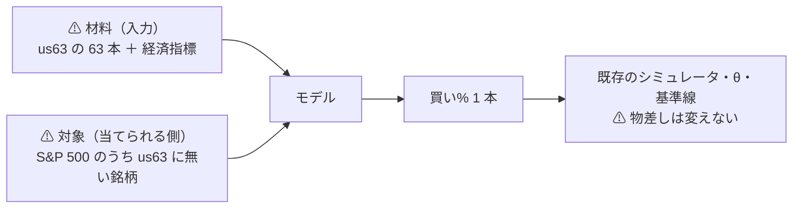

# 段 3: 流動性のある中位の銘柄を「当てられる側」に置く

- 親タスク: `TODO.md`「銘柄集合を広げる」→「段 3」
- 検討: [universe-widening.md §9](../../specs/experiments/universe-widening.md)
- 記録: [midcap-targets.md](../../specs/experiments/midcap-targets.md)
- 利用者の指示（2026-09-12）: **売買の確実性を担保したいので流動性がある程度あるものとし、大型株や経済指標などのデータに入力値を入れて、その銘柄の予測ができるのかを検証したい**

## 0. 目的

⚠ **変えるのは対象（当てられる側）であって入力ではない。**

> この図の主張: ⚠ **材料は今までと同じ。** 当てる相手を、情報が行き渡った大型株から、少し外側へ移す。



⚠ **入力側は 2 つとも既に落ちている**（[§9-2](../../specs/experiments/universe-widening.md)）。⚠ **未検証なのは対象の軸だけである。**

## 1. ⚠ 規則（取得の前に固定する）

⚠ **測った成績でも測った出来高でも選ばない。** ⚠ **取得の前に決められる基準だけで引く。**

| # | 規則 | ⚠ 理由 |
| ---: | --- | --- |
| 1 | 対象は **S&P 500 の構成銘柄のうち `us63` に含まれないもの** | ⚠ **流動性の下限が S&P 500 相当**（[§9-5](../../specs/experiments/universe-widening.md)。片道 2.5bp が成り立つ線） |
| 2 | ⚠ **さらに「2018-06 より前から日足が取れるもの」に限る** | ⚠ **断面は全銘柄が揃う期間でしか作れない**（`cross_section_h1.toml` の `common_window_only`）。新しい上場が 1 本混ざるだけで検証期間が消える |
| 3 | ⚠ **本数を絞るときはティッカーのアルファベット順で先頭から取る** | ⚠ **成績とも規模とも無関係な順序**。⚠ **「良さそうな銘柄」を選ばないための規則である** |
| 4 | 材料（`ll_leaders`）は **`us63` の 63 本を明示的に渡す** | 利用者の指示「大型株のデータを入力に入れる」 |
| 5 | ⚠ **物差しは 13 章のまま**（片道 2.5bp・対 B&H 上乗せ・θ 3 水準） | ⚠ **動かす軸を対象だけにする** |
| 6 | ⚠ **経済指標（`ex` 層）は別の実行にする** | ⚠ **2 つ動かすと、どちらが効いたか分からない**（13-2 規約 5 と同じ向き） |

### 1-1. ⚠ 規則を当てた結果（取得の前に固定した。2026-09-12）

出典: [List of S&P 500 companies（Wikipedia・2026-09-12 取得）](https://en.wikipedia.org/wiki/List_of_S%26P_500_companies)
⚠ **取れたのは A〜MTD の範囲だが、規則 3 が「ティッカー順の先頭から」なので ⚠ この範囲で足りる**（先頭 50 本は A と B で尽きる）。
⚠ **表は社名順なので、ティッカー順に並べ直した。** ⚠ **`.` を含むティッカー（BRK.B・BF.B）は取得の表記が違うので除いた。**

⚠ **候補 50 本（ティッカー順・`us63` を除く）**:

```
A ABNB ACGL ADI ADM ADP ADSK AEE AEP AES AFL AIG AIZ AJG AKAM ALB ALGN ALL ALLE AMAT
AMCR AME AMGN AMP AMT ANET AON AOS APA APD APH APO APP APTV ARE ARES ATO AVY AWK AXON
AXP AZO BALL BAX BBY BDX BEN BG BIIB BKNG
```

⚠ **このうち規則 2（2018-06 より前から日足が取れる）を満たさないものは、取得してから機械的に落とす。**
⚠ **落とした銘柄は記録に残す**（隠さない）。⚠ **成績を見て落とすのではない。**

⚠ **規則 3 の限界を先に書く**: アルファベット順は ⚠ **業種に偏りうる**（同じ業種の会社が近い綴りを持つ理由は無いが、保証も無い）。
⚠ **偏ったかどうかは取得後に業種の内訳を出して記録する**（⚠ **偏っていても銘柄を入れ替えない**。入れ替えたら選別になる）。

## 2. ⚠ 事前に分かっている限界

| # | 限界 | ⚠ 効き方 |
| ---: | --- | --- |
| 1 | ⚠ **生存バイアスが深くなる**（[12-1](../../specs/experiments/feature-discovery/rules.md)） | ⚠ **いまの指数構成銘柄を過去に当てはめる。** ⚠ **当時 500 に入っていたが消えた会社は 1 本も入らない** |
| 2 | ⚠ **効く仕組みが要求と衝突する**（[§9-4](../../specs/experiments/universe-widening.md)） | リードラグの原因はアナリストの少なさ・出来高の少なさ・非同期取引。⚠ **売買の確実性の要求と逆を向く** |
| 3 | ⚠ **非同期取引の分は板が無いので取れない** | ⚠ **仕組みとして最初から除かれる** |
| 4 | ⚠ **検証期間が短い**（断面は 2018-06 以降） | ⚠ **1995 表の 6,336 日ではなく 1,800 日級。** 検出限界が上がる |
| 5 | ⚠ **分割調整の「要確認」が増える** | ⚠ **一次情報で確かめるまで直さない。** 残したまま回し、記録する |
| 6 | ⚠ **銘柄集合は試行の次元** | ⚠ **試行が増える**（台帳の鍵に銘柄を足した 2026-09-12 の修正が効く） |

## 3. Phase

| Phase | 中身 | ⚠ 検算 |
| --- | --- | --- |
| 0 | 規則を書く（本プラン）／ 構成銘柄の一覧を出典つきで取る | ⚠ **出典と取得日を残す** |
| 1 | 取得（`cli.fetch`）→ 調整（`cli.adjust`） | ⚠ **既存 86 銘柄の調整結果が 1 バイトも変わらないこと**（指紋） |
| 2 | universe / dataset / experiment の設定を新規に 3 つ | ⚠ **既存の設定を書き換えない** |
| 3 | 表を作る（本番 ＋ `--leak`）→ 回す | ⚠ **leak が跳ねること** |
| 4 | 記録と台帳 | ⚠ **既存行が変わらないこと・n_trials の増分が事前に数えた本数と合うこと** |

## 4. 影響範囲

| 触る | 触らない |
| --- | --- |
| `data/raw/` `data/adjusted/`（新規銘柄の追加）／ `config/` 新規 3 本 ／ `runs/` 新規 ／ 記録・台帳 | ⚠ **`ail/` `cli/` のコード ／ 既存の設定 ／ 既存の `runs/` ／ 既存銘柄の `raw` `adjusted`** |
