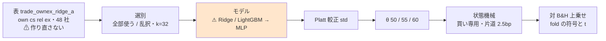
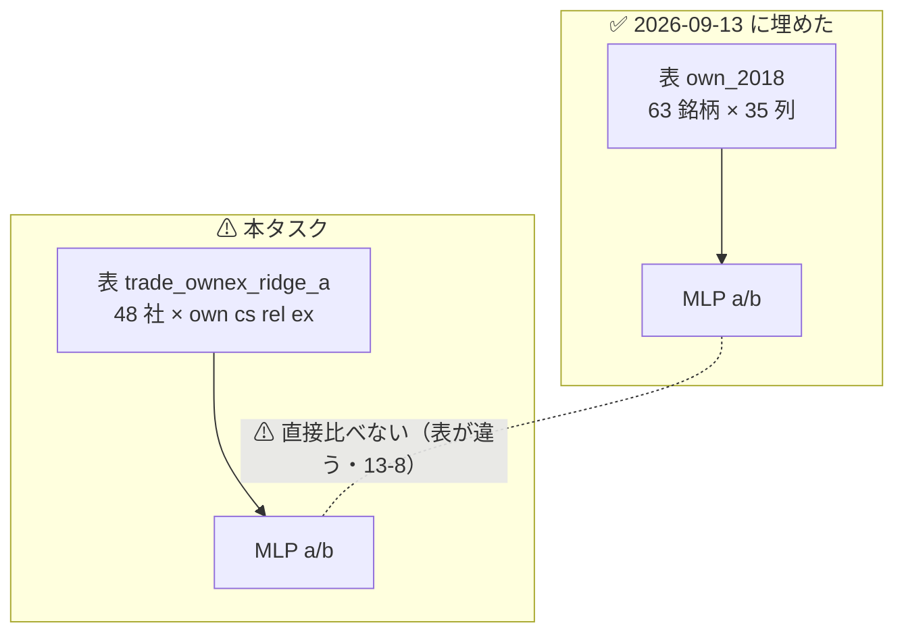
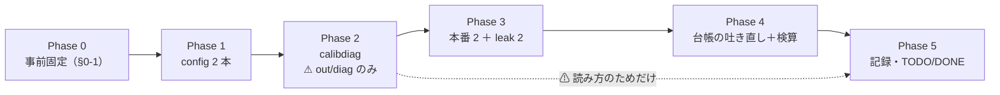

# MLP × 閾値売買 × ownex（own cs rel ex・2018）

親タスク: 「GPU 系を閾値売買でも回せるようにする」（利用者の指示 2026-09-13: **gpu 系も毎日往復ではない手法を実装する**）
派生元: 「MLP × 閾値売買（own 2018）」（✅ 2026-09-13 完了。[記録](../specs/experiments/mlp-threshold-trading.md)。⚠ **6 行とも「落とす」**）
規約: [rules.md 13 章](../specs/experiments/feature-discovery/rules.md)（閾値つき売買）／ [14-10](../specs/experiments/feature-discovery/rules.md)（空白は積極的に埋める）
台帳: [ledger.md](../specs/experiments/feature-discovery/ledger.md)（着手時点 **n_trials 415**【実測 2026-09-13】）

---

## 0. 目的と背景

⚠ **埋めるのは「モデルの軸」の残り半分である。** own（自分の履歴だけ）は 2026-09-13 に埋めたが、
⚠ **ownex（own ＋ cs ＋ rel ＋ ex）は Ridge・LightGBM が 2 本ずつあるのに MLP だけ 0 本**【実測 2026-09-13。台帳の
`2026-09-13T08-58-28_trade_ownex_ridge_a` ほか 3 実行】。

| モデル | own a/b | **ownex a/b** |
| --- | :---: | :---: |
| Ridge | ✅ | ✅ |
| LightGBM | ✅ | ✅ |
| **MLP** | ✅（2026-09-13） | ⚠ **空白 ← 本タスク** |

⚠ **回す理由は「効くはず」ではない。** own では ⚠ **6 行とも「落とす」**（上乗せ −68 〜 −1,017bp）だった。
⚠ **それは回さない理由にならない**（[14-10 規約 1](../specs/experiments/feature-discovery/rules.md)）。
⚠ **埋める目的は「MLP は ownex で未実施」を「MLP は ownex でも効かない」と区別できるようにすることだけである**（14-10 規約 4）。

⚠ **良い数字が出たらまず配線を疑う**（[11 章 規約 7](../specs/experiments/feature-discovery/rules.md)）。
⚠ **ownex の既存 4 本はすべて「落とす」で、上乗せは −461 〜 −716bp である**【実測】。

### 0-1. ⚠ 回す前に固定すること（結果を見てから決めない）

⚠ **本節は Phase 1 に入る前に書き終える。**（[14-10 規約 3](../specs/experiments/feature-discovery/rules.md)・[13-3 規約 4](../specs/experiments/feature-discovery/rules.md)）

| 固定するもの | 値 | ⚠ 動かさない理由 |
| --- | --- | --- |
| 回す本数 | **本番 2 本**（ownex × 形式 A/B）＋ **leak 対照 2 本** | 13-6 は (A) 共通と (B) 銘柄別の**両方**を求める。片方では既存 4 本と並ばない |
| 入力の層 | `own` `cs` `rel` `ex`・表は **`trade_ownex_ridge_a` を読む** | 13-8: 表を作り直すと「表の差」が混ざる。⚠ **既存 4 本と同じ表でなければモデルの差として読めない** |
| 対象 | `targets = "company"`（48 社） | ⚠ **ETF は `rel_sec_*` を持てず build が止まる**（2026-09-08 に踏んだ）。既存 4 本と同じ |
| k | **32** | 既存 ownex 4 本と同じ（own の 16 とは別。⚠ **列数が違うので揃えない**） |
| embargo | **1 本** | 断面は同じ足の他銘柄を見る。既存 ownex 4 本と同じ |
| θ | **50 / 55 / 60** | 13-3 規約 1・4 |
| モデルの設定 | `ail/models/deep.py` の既定のまま（64-32-1・Dropout 0.2・AdamW lr 1e-3・batch 4096・最大 200 epoch・patience 10） | ⚠ **振ると振った水準の数だけ n_trials が増える**（13-6 の 3） |
| 種 | 0（既存 4 本と同じ） | 13-6 の 4 |
| 数え方 | **n_trials 415 → 421**（＋6 ＝ 2 形式 × 3 θ）【推測】 | 13-9 の 3・4。基準線（B&H・直前符号・乱択）は数えない |
| 判定 | **対 B&H 上乗せ**の符号と t（13-7）。B&H は **＋1,650.62bp/fold**【実測】 | ⚠ **純利の符号では「買って持っただけ」と区別できない** |
| 門（14-5） | ⚠ **記録するだけ。門前でも回す**（`--ignore-gate`） | 14-10 規約 2。⚠ **既存 ownex 4 本も `gate.forced = true`** 【実測】 |

⚠ **`cli/calibdiag.py` は診断であって、回すかどうかの判断には使わない**（out/diag にしか書かず `n_trials` を動かさない）。

---

## 1. 対応方針 — ⚠ **コードは 1 行も書かない**

⚠ **足りないのは `[trading]` を持つ config 2 本だけである。** `MLP` は `ail/registry.py` に登録済みで、
閾値売買の経路（較正 → 閾値 → 状態機械）はモデルに依存しない。⚠ **own のときと同じ形である。**

> この図の主張: ⚠ **既存の ownex 経路のうち差し替わるのは「モデル」の箱 1 つだけである。**



⚠ **own との違いは 2 つだけで、どちらもモデルの話ではない**（層と対象）。

> この図の主張: ⚠ **本タスクが動かす軸は「表」ではなく「モデル」であり、表の側は own の実行と別の既存資産をそのまま使う。**



---

## 2. 影響範囲

| 触るもの | 中身 |
| --- | --- |
| `config/experiment/trade_ownex_mlp_a.toml` | **新規**。`trade_ownex_lgbm_a.toml` の `model` を `MLP` に替えるだけ |
| `config/experiment/trade_ownex_mlp_b.toml` | **新規**。同上（`form = "per_symbol"`） |
| `docs/specs/experiments/mlp-threshold-trading.md` | ⚠ **既存の記録に節を足す**（新しいファイルを作らない。同じ「MLP × 閾値売買」の話） |
| `docs/specs/experiments/feature-discovery/ledger.md` | ⚠ **生成物。`cli/report.py --catalog` で吐き直す。手で書かない** |
| `TODO.md` / `DONE.md` | タスクの移動 |

| ⚠ 触らないもの | 理由 |
| --- | --- |
| `ail/` `cli/` の全ファイル | ⚠ **手法を足すときに触るのは config だけ**（[10 章](../specs/experiments/feature-discovery/rules.md)） |
| `data/features/trade_ownex_ridge_a*` | 13-8: 表を作り直さない |
| 既存の `runs/` | 1 実行 1 ディレクトリ。⚠ **上書きしない** |
| 台帳の既存行 | ⚠ **再計算しない・消さない**（14-10 規約 5） |

---

## 3. Phase 構成

> この図の主張: ⚠ **診断（Phase 2）は本番の前に置くが、回すかどうかの判断には使わない。**



### Phase 0: 事前固定

⚠ **このプランの §0-1 が成果物。** 結果を見る前に書き終えていることが条件。

### Phase 1: config を 2 本足す

`trade_ownex_lgbm_a.toml` / `_b.toml` を写して `model = "MLP"` にする。
⚠ **TOML の平の key はテーブル見出しより上に書く**（10 章 規約 1）。⚠ **`features_from = "trade_ownex_ridge_a"` を消さない。**

### Phase 2: 予測のスケールを測る（診断）

```bash
./.venv/bin/python -m cli.calibdiag --experiment trade_ownex_mlp_a --tag mlp_ownex
```

⚠ **own では `pred_std` が Ridge と同じ尺度で潰れていなかった**（[記録 §1](../specs/experiments/mlp-threshold-trading.md)）。
⚠ **ownex は列が増える（k=32）ので同じとは限らない。** 見るのは `pred_std` / `反復_旧` / `width_te_std` / `auc_fit`。
⚠ **どの値が出ても Phase 3 は回す**（14-10 規約 1・3）。

### Phase 3: 本番 2 本 ＋ leak 対照 2 本

```bash
./.venv/bin/python -m cli.run --experiment trade_ownex_mlp_a --ignore-gate
./.venv/bin/python -m cli.run --experiment trade_ownex_mlp_b --ignore-gate
./.venv/bin/python -m cli.run --experiment trade_ownex_mlp_a --leak --ignore-gate
./.venv/bin/python -m cli.run --experiment trade_ownex_mlp_b --leak --ignore-gate
```

⚠ **leak 対照は毎回通す**（[7 章 規約 7](../specs/experiments/feature-discovery/rules.md)・13-10）。⚠ **時間はここで実測する。**

### Phase 4: 台帳の吐き直しと検算

```bash
./.venv/bin/python -m cli.report --catalog > ../../docs/specs/experiments/feature-discovery/ledger.md
./.venv/bin/python -m pytest -q tests
```

### Phase 5: 記録と後片付け

[mlp-threshold-trading.md](../specs/experiments/mlp-threshold-trading.md) に ownex の節を足し、`TODO.md` の子タスクを閉じ、
プランを `docs/plans/archive/` へ移す。⚠ **落とす結果でも記録を残す**（14-10 規約 5）。

---

## 4. テスト方針・検算

| # | 検算 | ⚠ 落ちたら |
| ---: | --- | --- |
| 1 | `pytest -q tests` が全件 pass（着手時点 **276 件**【実測】） | 配線が壊れている |
| 2 | ⚠ **回す前の台帳の行が 1 行も消えず 1 バイトも変わらない**（足されるだけ） | 既存の試行を壊した（14-10 規約 5） |
| 3 | ⚠ **leak 対照 2 本の上乗せが跳ねる**（既存の対は ＋16,108〜25,131bp・t 7.9〜27.0・5/5）【実測】 | 較正 → 閾値 → 状態機械のどこかが壊れている（13-10） |
| 4 | **n_trials が 415 → 421**（＋6） | 数え落とし、または数え過ぎ |
| 5 | ⚠ **`checks.json` の `calibration` が `std`** | 旧の較正で回っている（鍵が割れる） |
| 6 | ⚠ **`inputs.json` の表の指紋が既存 ownex 4 本と一致** | 表を作り直してしまった（13-8） |
| 7 | ⚠ **3 θ とも台帳に載る** | 良かった閾値だけ報告している（13-3 の 3） |

---

## 5. 費用の見積り【推測】

⚠ **own の実測（[§5-3](../specs/experiments/mlp-threshold-trading.md)）から引く。** ⚠ **同じ作り方で 1 桁外した前科があるので、実測で置き換える。**

| 本 | own の実測 | ⚠ ownex の見込み |
| --- | ---: | --- |
| (A) 本番 | 12.5 秒 | **15〜40 秒**（列が 35 → 最大 32 選別だが行は 48 社ぶんに減る） |
| (B) 本番 | 2 分 36 秒（1,260 fit・1 fit 124ms） | ⚠ **2〜3 分**（5 × 48 × 2 × 2 ＝ **960 fit**。⚠ **銘柄が 63 → 48 に減るので own より軽い見込み**） |
| (A)(B) leak | 24.9 秒 ／ 4 分 00 秒 | 同程度 |
| 合計 | 7 分 13 秒 | ⚠ **10 分前後** |

GPU は 3090 Ti（`AIL_TORCH_DEVICE` 既定 auto。着手時の空き **8,731MiB**【実測 2026-09-13】）。

---

## 6. ⚠ 先に書く失敗モードと限界

| # | 起こりうること | ⚠ そのときどうするか |
| ---: | --- | --- |
| 1 | ⚠ **(B) fold 1 の較正が `source = "train"` に落ちる**（行/銘柄 ＜ MIN_TRAIN 500） | ⚠ **消せない限界。そのまま記録する**（13-6 の 5）。own で実在した（[§5-1](../specs/experiments/mlp-threshold-trading.md)） |
| 2 | ⚠ **(B) の MLP が早期打ち切りなしで 200 epoch 回る** | 同上。⚠ **(B) の数字を (A) と直接比べない** |
| 3 | 上乗せが正で fold 5/5 が揃う | ⚠ **まず配線を疑う**（11 章 規約 7）。取引回数・保有日率を必ず併記する（13-10） |
| 4 | leak 対照が跳ねない | ⚠ **本番の数字を読まない。** 直してから回し直す |
| 5 | ⚠ **`ex` 層が MLP の入力で悪さをする**（水準の非定常・欠測の 0 埋め） | ⚠ **config は既存 4 本と同じ `ex_transforms = ["d1","z20"]`。** 変えない。⚠ **変えたくなったら別の試行として数える** |
| 6 | GPU が別プロセスに埋まって CPU に落ちる | ⚠ **落ちてもよい。** `env.json` にどちらで回ったかが残る |
| 7 | ⚠ **MLP は種を固定しても GPU の非決定性で厳密再現しないことがある** | ⚠ **厳密一致を検算に使わない**（検算 2 は台帳の**既存**行についてのもの） |

⚠ **限界（消せないもの）**: (a) ⚠ **48 社は独立でない**（12 章 限界 2）／ (b) 生存バイアス（12 章 限界 1）／
(c) ⚠ **検出限界**（fold 360 日 × 5 では上乗せ t は 1 前後まで — [validation-power.md](../specs/experiments/feature-discovery/validation-power.md)）。
⚠ **本タスクはこれらを改善しない。空白を埋めるだけである。**

---

## 7. 完了条件

1. `runs/` に 4 実行（本番 2・leak 2）が 1 実行 1 ディレクトリで残っている
2. 台帳が吐き直され、**n_trials 415 → 421**、⚠ **既存行が 1 バイトも変わっていない**
3. [mlp-threshold-trading.md](../specs/experiments/mlp-threshold-trading.md) に ownex の 3 θ × 2 形式の結果と判定が載り、⚠ **§7 の「未実施」が消えている**
4. ⚠ **判定が「落とす」でも完了とする**（14-10 規約 5。⚠ **採用を条件にしない**）
