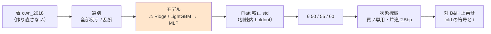
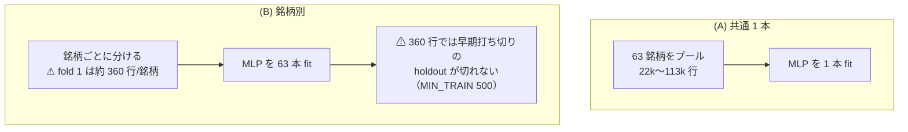
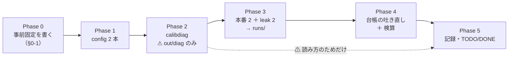

# MLP × 閾値売買（own 2018）

親タスク: 「GPU 系を閾値売買でも回せるようにする」（利用者の指示 2026-09-13: **gpu 系も毎日往復ではない手法を実装する**）
規約: [rules.md 13 章](../specs/experiments/feature-discovery/rules.md)（閾値つき売買）／ [14-10](../specs/experiments/feature-discovery/rules.md)（空白は積極的に埋める）
台帳: [ledger.md](../specs/experiments/feature-discovery/ledger.md)（2026-09-13 時点 **n_trials 409**）

---

## 0. 目的と背景

⚠ **埋めるのは「モデルの軸」の空白 1 つである。** 閾値売買（対 B&H 上乗せで測る新しい物差し）で回したモデルは
**Ridge と LightGBM の 2 つだけ**で、⚠ **MLP は毎日往復に 4 行あるきり**【実測 2026-09-13。台帳の `2026-09-09T17-27-42_gpu_mlp_2018` 由来の 4 行】。

| モデル | 毎日往復 | 閾値売買 |
| --- | :---: | :---: |
| Ridge | ✅ | ✅（own a/b・ownex a/b） |
| LightGBM | ✅ | ✅（own a/b・ownex a/b） |
| **MLP** | ✅（4 行） | ⚠ **空白 ← 本タスク** |
| Ridge+GAN増強 ／ LightGBM+GAN増強 | ✅ | ⚠ 空白（手間 大。別タスク） |
| MLP+GAN増強 | ⚠ 未実施 | ⚠ 空白（同上） |

⚠ **回す理由は「効くはず」ではない。** ⚠ **「未実施」を「効かなかった」と読ませないために埋める**（[14-10 規約 4](../specs/experiments/feature-discovery/rules.md)）。
⚠ **前提として、MLP の毎日往復の行は 3 手法とも「落とす / 保留」で、いちばん良い行でも純利 ＋0.99bp・fold 2/5 である**【実測】。
⚠ **良い数字が出たらまず配線を疑う**（[11 章 規約 7](../specs/experiments/feature-discovery/rules.md)）。

### 0-1. ⚠ 回す前に固定すること（結果を見てから決めない）

⚠ **本節は Phase 1 に入る前に書き終える。** [14-10 規約 3](../specs/experiments/feature-discovery/rules.md)（回すと決めるのは結果を見る前）と
[13-3 規約 4](../specs/experiments/feature-discovery/rules.md)（θ は事前固定）の要求である。

| 固定するもの | 値 | ⚠ 動かさない理由 |
| --- | --- | --- |
| 回す本数 | **本番 2 本**（own × 形式 A/B）＋ **leak 対照 2 本** | 13-6 は (A) 共通と (B) 銘柄別の**両方**を回すことを求める。片方だけでは既存の Ridge / LightGBM と並ばない |
| 入力の層 | `own` のみ（35 列）・表は `own_2018` を読む | 13-8: 表を作り直すと「表の差」が混ざる。既存 4 本と同じ表でなければモデルの差として読めない |
| θ | **50 / 55 / 60** | 13-3 規約 1・4 |
| モデルの設定 | `ail/models/deep.py` の既定のまま（64-32-1・Dropout 0.2・AdamW lr 1e-3・batch 4096・最大 200 epoch・patience 10） | ⚠ **ハイパーパラメータを振ると、振った水準の数だけ n_trials が増える**（13-6 の 3・[11 章 規約 4](../specs/experiments/feature-discovery/rules.md)） |
| 種 | 0（既存 4 本と同じ） | 13-6 の 4 |
| 数え方 | **n_trials 409 → 415**（＋6 ＝ 2 形式 × 3 θ）【推測】 | 13-9 の 3・4: 形式と閾値はどちらも「選べた自由度」。基準線（B&H・直前符号・乱択）は数えない |
| 判定 | 対 B&H 上乗せの符号と t（13-7） | ⚠ **純利の符号では「買って持っただけ」と区別できない** |
| 門（14-5） | ⚠ **記録するだけ。門前でも回す**（`--ignore-gate`） | 14-10 規約 2 で門は診断に降格。⚠ **既存 4 本も同じく `--ignore-gate` で回してある**【実測: `2026-09-13T08-57-48_trade_own_lgbm_a/checks.json` の `gate.forced = true`】 |

⚠ **`cli/calibdiag.py` は診断であって、回すかどうかの判断には使わない。** ⚠ **`out/diag/` にしか書かず `n_trials` を動かさない**が、
⚠ **「スケールが小さいから回さない」という使い方をすると 14-10 規約 1 に反する。** 使うのは**結果の読み方**のためだけである。

---

## 1. 対応方針 — ⚠ **コードは 1 行も書かない**

⚠ **足りないのは `[trading]` を持つ config だけである**【実測 2026-09-13】。`MLP` は `ail/registry.py` に登録済みで
（`ail/models/deep.py` の `@register("model", "MLP")`）、閾値売買の経路（較正 → 閾値 → 状態機械）はモデルに依存しない。

> この図の主張: ⚠ **既存の経路のうち差し替わるのは「モデル」の箱 1 つだけである。**



⚠ **形式 (A)(B) の違いは fit の範囲だけ**（13-6）。⚠ **MLP では (B) の代償が Ridge / LightGBM より大きい**ので、先に書いておく。

> この図の主張: ⚠ **(B) 銘柄別では 1 fold の中で MLP を 63 銘柄 × 2 選別 × 2 回 fit する**（較正用と予測用）。



⚠ **fold 1 の (B) は `tail_holdout` が `None` を返す** ＝ ⚠ **MLP は早期打ち切りなしで 200 epoch 回り、較正も訓練予測で代用される**
（`source = "train"`。13-2 の 2 が「どちらで fit したかを記録に残す」と求めている経路）。⚠ **消せない限界なのでそのまま記録する**（13-6 の 5）。

---

## 2. 影響範囲

| 触るもの | 中身 |
| --- | --- |
| `config/experiment/trade_own_mlp_a.toml` | **新規**。`trade_own_lgbm_a.toml` の `model` を `MLP` に替えるだけ |
| `config/experiment/trade_own_mlp_b.toml` | **新規**。同上（`form = "per_symbol"`） |
| `docs/specs/experiments/mlp-threshold-trading.md` | **新規**。記録（結果と判定） |
| `docs/specs/experiments/feature-discovery/ledger.md` | ⚠ **生成物。`cli/report.py --catalog` で吐き直す。手で書かない** |
| `TODO.md` / `DONE.md` | タスクの移動 |

| ⚠ 触らないもの | 理由 |
| --- | --- |
| `ail/` `cli/` の全ファイル | ⚠ **手法を足すときに触るのは config だけ**（[10 章](../specs/experiments/feature-discovery/rules.md)・README の表） |
| `data/features/own_2018*` | 13-8: 表を作り直さない |
| 既存の `runs/` | 1 実行 1 ディレクトリ。⚠ **上書きしない** |
| 台帳の既存行 | ⚠ **再計算しない・消さない**（[14-10 規約 5](../specs/experiments/feature-discovery/rules.md)） |

---

## 3. Phase 構成

> この図の主張: ⚠ **診断（Phase 2）は本番（Phase 3）の前に置くが、回すかどうかの判断には使わない。**



### Phase 0: 事前固定（§0-1 を書く）

⚠ **このプランの §0-1 が成果物である。** 結果を見る前に書き終えていることが条件。

### Phase 1: config を 2 本足す

```bash
cd experiments/feature-discovery
# trade_own_lgbm_a.toml → trade_own_mlp_a.toml（model だけ替える）
# trade_own_lgbm_b.toml → trade_own_mlp_b.toml（同上）
```

⚠ **TOML の平の key はテーブル見出しより上に書く**（10 章 規約 1）。⚠ **`features_from = "own_2018"` を消さない**。

### Phase 2: 予測のスケールを先に測る（診断）

```bash
./.venv/bin/python -m cli.calibdiag --experiment trade_own_mlp_a --tag mlp
```

⚠ **MLP の予測のスケールは 1 度も測っていない**（[TODO](../../TODO.md) の親タスク）。見るのは 3 列。

| 列 | 意味 | ⚠ 期待 |
| --- | --- | --- |
| `pred_std` | 予測の散らばり | ⚠ **`deep.py` は y を標準化して学習し `× ysd` で戻す**ので、Ridge と同じ尺度（σ ≈ 0.0017 前後）に戻る見込み【推測】 |
| `反復_旧` | 旧の解き方の L-BFGS 反復回数 | ⚠ **2 なら旧の解が止まっていたという意味**（本番はもう `std` で解くので、これは「旧行と比べられるか」の情報） |
| `width_std` | 直した較正での買い% の幅 | ⚠ **20 点には届かない見込み**（13-2 の注記。fold 中央値 4.43 点） |

⚠ **どの値が出ても Phase 3 は回す**（14-10 規約 1・3）。

### Phase 3: 本番 2 本 ＋ leak 対照 2 本

```bash
./.venv/bin/python -m cli.run --experiment trade_own_mlp_a --ignore-gate
./.venv/bin/python -m cli.run --experiment trade_own_mlp_b --ignore-gate
./.venv/bin/python -m cli.run --experiment trade_own_mlp_a --leak --ignore-gate
./.venv/bin/python -m cli.run --experiment trade_own_mlp_b --leak --ignore-gate
```

⚠ **leak 対照は毎回通す**（[7 章 規約 7](../specs/experiments/feature-discovery/rules.md)・13-10）。⚠ **上乗せが跳ねなければ配線が壊れている。**
⚠ **時間は Phase 3 で実測する**（下の §5 は【推測】）。

### Phase 4: 台帳の吐き直しと検算

```bash
./.venv/bin/python -m cli.report --catalog > ../../docs/specs/experiments/feature-discovery/ledger.md
./.venv/bin/python -m pytest -q tests
```

### Phase 5: 記録と後片付け

`docs/specs/experiments/mlp-threshold-trading.md` に結果・判定・限界を書き、`TODO.md` の子タスクを閉じ、
プランを `docs/plans/archive/` へ移す。⚠ **落とす結果でも記録を残す**（14-10 規約 5）。

---

## 4. テスト方針・検算

| # | 検算 | ⚠ 落ちたら |
| ---: | --- | --- |
| 1 | `pytest -q tests` が全件 pass（2026-09-13 時点 **276 件**） | 配線が壊れている |
| 2 | ⚠ **回す前の台帳の行が 1 行も消えず 1 バイトも変わらない**（足されるだけ） | 既存の試行を壊した（14-10 規約 5） |
| 3 | ⚠ **leak 対照 2 本の上乗せが跳ねる**（既存の 12 対は ＋16,108〜25,131bp・t 7.9〜27.0・5/5）【実測 2026-09-13】 | 較正 → 閾値 → 状態機械のどこかが壊れている（13-10） |
| 4 | **n_trials が 409 → 415**（＋6） | 数え落とし、または数え過ぎ |
| 5 | ⚠ **`checks.json` の `calibration` が `std`** | 旧の較正で回っている（鍵が割れる） |
| 6 | ⚠ **`inputs.json` の表の指紋が既存 4 本と一致**（`own_2018` の同じ表） | 表を作り直してしまった（13-8） |
| 7 | ⚠ **3 θ とも台帳に載る** | 良かった閾値だけ報告している（13-3 の 3） |

---

## 5. 費用の見積り【推測】

| 本 | 行 | fit の回数 | ⚠ 見込み |
| --- | ---: | ---: | --- |
| (A) 本番 | 135,962 | 5 fold × 2 選別 × 2 回 ＝ **20** | **数分**（`gpu_mlp_2018` は 60,000 行・20 fit で約 40 秒【実測 2026-09-09】。行が 2.3 倍） |
| (B) 本番 | 135,962 | 5 × 63 × 2 × 2 ＝ **1,260** | ⚠ **20〜40 分**（1 fit あたり数百 ms のオーバーヘッド支配） |
| (A)(B) leak | 同上 | 同上 | 同上 |
| 合計 | — | — | ⚠ **1〜1.5 時間** |

⚠ **TODO の「1 分未満」は毎日往復の実測（`gpu_mlp_2018`）から引いた数字で、(B) 銘柄別の 63 倍の fit を数えていない。**
⚠ **Phase 3 で実測に置き換える。**

GPU は 3090 Ti（`AIL_TORCH_DEVICE` 既定 auto ＝ 空き VRAM 4GB 以上で CUDA。2026-09-13 の空きは 8,731MiB【実測】）。

---

## 6. ⚠ 先に書く失敗モードと限界

| # | 起こりうること | ⚠ そのときどうするか |
| ---: | --- | --- |
| 1 | ⚠ **(B) fold 1 で較正が `source = "train"` に落ちる**（360 行 ＜ MIN_TRAIN 500） | ⚠ **消せない限界。そのまま記録する**（13-6 の 5）。⚠ **「(B) が悪い」の原因候補として先に書いておく** |
| 2 | ⚠ **(B) fold 1 の MLP に早期打ち切りの holdout が無く 200 epoch 回る** | 同上。⚠ **過学習の向きに寄るので、(B) の数字を (A) と直接比べない** |
| 3 | 上乗せが正で fold 5/5 が揃う | ⚠ **まず配線を疑う**（11 章 規約 7）。取引回数・保有日率を必ず併記し、⚠ **「取引しないだけ」でないかを潰す**（13-10） |
| 4 | leak 対照が跳ねない | ⚠ **本番の数字を読まない。** 配線を直してから回し直す |
| 5 | GPU が別プロセスに埋まっていて CPU に落ちる | ⚠ **落ちてもよい**（結果は同じはず）。⚠ **`env.json` にどちらで回ったかが残るか確かめる** |
| 6 | ⚠ **MLP は種を固定しても GPU の非決定性で厳密再現しないことがある** | ⚠ **`cudnn.deterministic = True` は入っている**。⚠ **厳密一致を検算に使わない**（検算 2 は台帳の**既存**行についてのもの） |

⚠ **限界（消せないもの）**: (a) ⚠ **63 銘柄は独立でない**（12 章 限界 2）ので実効標本は日数で数える ／ (b) 生存バイアス（12 章 限界 1）／
(c) ⚠ **検出限界**（fold 360 日 × 5 では上乗せ t は 1 前後までしか出ない — [validation-power.md](../specs/experiments/feature-discovery/validation-power.md)）。
⚠ **本タスクはこれらを改善しない。空白を埋めるだけである。**

---

## 7. 完了条件

1. `runs/` に 4 実行（本番 2・leak 2）が 1 実行 1 ディレクトリで残っている
2. 台帳が吐き直され、**n_trials 409 → 415**、⚠ **既存行が 1 バイトも変わっていない**
3. `docs/specs/experiments/mlp-threshold-trading.md` に 3 θ × 2 形式の結果と判定が載っている
4. ⚠ **判定が「落とす」でも完了とする**（14-10 規約 5。⚠ **採用を条件にしない**）
