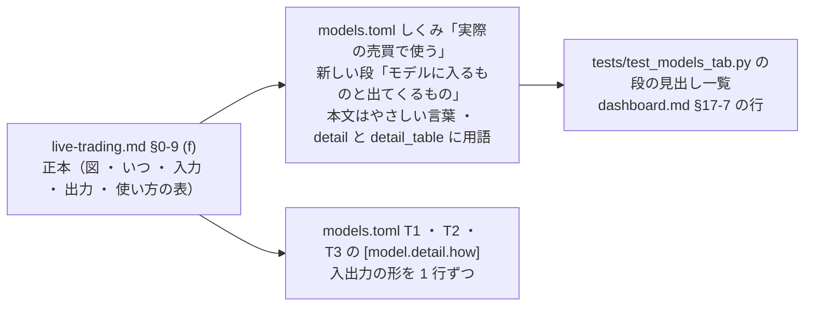

# 予測モデルの入力と出力の形式を、前後の流れつきで書く（2026-09-23）

## 目的・背景

利用者の指示（2026-09-23）: 「完成した予測モデルに入力する値と出力値の形式を知る」＋ 補足「入れるデータと出力だけでなく、その前後を 1 本の流れでつなげて説明する ＝ いつ学習されるか ／ いつデータが入力されるか ／ 出力をトレーダーがどう使うか」。置き場の裁定 ＝ **予測モデルタブの「詳しく」と `live-trading.md` §0-9 の両方**。

いまは情報が散らばっている（`dashboard/models.toml` の各モデルの「詳しく」に列の内訳・§0-9 (a) の B8 に `predict.jsonl` の項目・`plan.py` に売買の規則）。1 か所にまとまった「形式」の表と、前後をつなぐ流れの説明が無い。

## 対応方針

> この図の主張: 書くのは 2 か所で、技術的な正本は §0-9 (f)、やさしい言葉の本文と「詳しく」の写しは予測モデルタブ。

- ⚠ **コードは触らない**（`cli.predict`・`plan.py`・`signals.py` は読むだけ）。数字は 2026-09-22 asof の `predict.meta`・2026-09-23 の本番・13500t の plan の【実測】から写す
- 本文（`points`・`title`・リンクの見出し）はやさしい言葉（`FORBIDDEN`: 買い%・訓練・合図・形式・窓・手法・成行・執行・点 など）。用語は `detail`・`detail_table` だけ
- 「完成したモデル」は保存した重みではなく作り方（毎営業日 15:50 ET 過ぎに学習し直す）を、本文の 1 つ目に置く

## 影響範囲

`dashboard/models.toml`（`live` ページに段を 1 つ・3 モデルの `detail.how` に 1 行ずつ）／ `dashboard/tests/test_models_tab.py`（`live` の段の見出し一覧）／ `docs/specs/dashboard.md` §17-7 の「実際の売買で使う」の行 ／ `docs/specs/experiments/live-trading.md` §0-9 に (f)。画面のコード・執行器・予測のコードは変えない。

## テスト方針

`dashboard/.venv/bin/python -m pytest -q tests/test_models_tab.py tests/test_traders_tab.py tests/test_system_tab.py tests/test_help.py`（やさしい言葉・段の見出し・リンク先・描画）。研究の DB が無い機械（Sx360）では DB 突き合わせの 2 本は skip。
