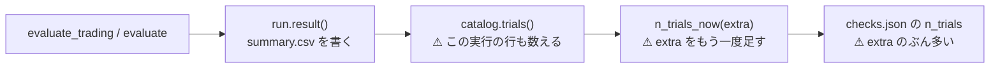

# `checks.json` の `n_trials` の二重計上を直す

作成 2026-09-12。派生元: TODO「`checks.json` の `n_trials` が、その実行自身のぶんを二重に足しているのを直すか」。
⚠ **利用者の決定（2026-09-12）: `n_trials_now(0)` で直す（以後の実行だけ）。**
実測と経緯: [validation-power.md §8-2-5](../../specs/experiments/feature-discovery/validation-power.md) ／ 規約: [rules.md 11 章 規約 4](../../specs/experiments/feature-discovery/rules.md)（`n_trials` は試した手法の総数）。

## 目的・背景

`cli/run.py` は **先に `run.result()` で `summary.csv` を書き、そのあとで** `checks.n_trials_now(extra)` を呼ぶ。
`n_trials_now` は台帳を数え直す関数で、台帳は `runs/*/summary.csv` を読む。⚠ **呼ばれた時点で台帳はもうこの実行の行を含んでいる。** そこへ「この実行ぶん」として `extra` をもう一度足すので二重になる。

> この図の主張: ⚠ **台帳がこの実行を数えたあとに、同じぶんをもう一度足している。**

検算【実測 2026-09-12】。ずれ幅はその実行の `extra` そのもので、⚠ **閾値売買だけの話ではない**（毎日往復の枝も同じ順序で、`extra` は選別手法の本数ぶん最大 9）。

| 実行 | 記録 | 正しい値 | ずれ | DSR（記録 → 正） |
| --- | ---: | ---: | ---: | --- |
| `own_impact_2018`（09-10） | 67 | 58 | ＋9 | 0.1453 → 0.1579 |
| `impact_both_2018` | 76 | 67 | ＋9 | 0.1249 → 0.1346 |
| `trade_own_ridge_a` | 73 | 70 | ＋3 | 0.2792 → 0.2843 |
| `trade_ownex_lgbm_b` | 94 | 91 | ＋3 | — |
| `trade_own_1995_ridge_a` | 97 | 94 | ＋3 | 0.6214 → 0.6256 |

⚠ **ずれは必ず「厳しい側」**（`n_trials` が多い ＝ DSR が低い）で、大きさは +0.004〜+0.013。
⚠ **採否は動かない**: 台帳の判定は対 B&H 上乗せの符号で決まり（13-7）、DSR は判定式に入っていない。管理画面の DSR の印は 0.95 が境目で、本番の実測は 0.12〜0.62・leak は 1.000 なので印も動かない。

## ⚠ 先に固めておく設計決定

| # | 決定 | 理由 |
| ---: | --- | --- |
| 1 | `n_trials_now()` を**引数なしで呼ぶ**（台帳に数えさせる） | ⚠ **`extra` を足す方式はそもそも重複に弱い。** 同じ設定を同じ表で回し直すと台帳の鍵では 1 試行のままなのに `extra` は足される。leak 対照は台帳に入らないので、いまは `extra` のぶんが丸ごと架空 |
| 2 | ⚠ **`n_trials_now` から `extra` の引数を消す** | 残すと同じ間違いがまた書ける。⚠ **呼び出し側は `cli/run.py` 2 か所と `cli/report.py` 1 か所だけ**（report は既に引数なし） |
| 3 | ⚠ **順序の依存をコメントに残す**（`summary.csv` を書いてから数える） | いまは偶然その順序になっているだけで、⚠ **逆にすると静かに 1 実行ぶん少なくなる** |
| 4 | ⚠ **過去の実行は直さない** | 閾値売買は日次系列が無く `--recheck` で書き直せない（毎日往復だけ直すと記録に 2 種類の数え方が混ざる）。⚠ **さらに 2026-09-12 に鍵へ期間を足したので、いま数え直すと当時ではなく今の規則の数（139）が入る** — 過去の「正しい値」はもう一意に決まらない |
| 5 | ずれの向きと大きさは文書に残したまま | 記録を消さずに読み方を足す（14 章と同じ向き） |

## 対応方針

### Phase 1: 直し（`cli/run.py` ／ `ail/validation/checks.py`）

- `ail/validation/checks.py` の `n_trials_now(extra=0)` → **`n_trials_now()`**。docstring に「⚠ **`summary.csv` を書いたあとに呼ぶ。台帳はもうこの実行を数えている**」を書く
- `cli/run.py` の閾値売買の枝: `n_trials_now(n_meth * n_th)` → `n_trials_now()`。`n_meth` / `n_th` の計算を消す
- `cli/run.py` の毎日往復の枝: `n_trials_now(n_sel)` → `n_trials_now()`。`n_sel` の計算を消す
- ⚠ **どちらの枝も `run.result()` の**あと**で呼ばれていることを、消したコメントの代わりに 1 行残す**

### Phase 2: テスト

- ⚠ **契約そのものを検査する**: 仮の `runs/` に config ＋ summary だけの実行を置くと、⚠ **`catalog.trials()` の試行数がその場で 1 増える**。だから「この実行ぶん」を足してはいけない
- `n_trials_now()` が台帳の試行数とちょうど一致すること
- `extra` を消したので、⚠ **`n_trials_now(3)` は TypeError**（同じ間違いを書けなくする）

### Phase 3: 文書

- `validation-power.md` §8-2-5 の「直すかは別途」を**直した**に更新（⚠ **過去の記録はそのまま**と、なぜ遡らないかを残す）
- `rules.md` 付録の実装対応表の 11 章の行に `n_trials_now` を足す

## 影響範囲

| 触るもの | 種類 |
| --- | --- |
| `ail/validation/checks.py` | `n_trials_now` の引数を消す |
| `cli/run.py` | 呼び出し 2 か所 ＋ 不要になった計算 5 行 |
| `tests/test_checks.py` | 追加 |
| `docs/specs/experiments/feature-discovery/{validation-power,rules}.md` | 追記 |

⚠ **触らないもの**: 既存の `runs/*/checks.json`（10 章。記録は書き換えない）・台帳の生成・判定の規則・`cli/report.py --recheck`（既に引数なしで正しい）・管理画面（`checks.json` を読むだけ）。

## テスト方針

| # | 確かめること | やり方 |
| ---: | --- | --- |
| 1 | ⚠ **summary を書いた時点で台帳がその実行を数えている** | 仮 `runs/` に最小の実行を置いて試行数が 1 増えることを見る |
| 2 | `n_trials_now()` が台帳の試行数と一致する | 実台帳で突き合わせ |
| 3 | ⚠ **同じ間違いを書けない** | `n_trials_now(3)` が TypeError |
| 4 | 既存が壊れていない | `pytest -q tests`（feature-discovery ／ dashboard とも） |
| 5 | 実際の実行で正しい値が記録される | ⚠ **新しい実行は回さない**（回すと n_trials が増える）。1・2 で契約を押さえる |
