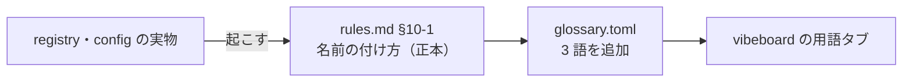

# 表の呼び名（own / ownex）とモデル名・実験名の付け方を定義し、用語集に足す

利用者の指示（2026-09-14）: **own, ownex を用語集に追加して。予想モデルの命名方法も定義がなかったら追加して**

## 1. 目的・背景

- 用語集（`dashboard/glossary.toml`。vibeboard の「用語」タブ）に **own / ownex が無い**。近いのは `own_`・`cs_ / rel_ / ll_`・`ex_ / im_`（特徴量の接頭辞）だけで、⚠ **「どの層で作った表か」という呼び名としては引けない**
- ⚠ **モデル名（`Ridge+GAN増強(batch16k)`）と実験名（`trade_ownex_mlpgan16k_b`）の付け方は、どの spec にも定義が無い**【実測 2026-09-14。rules.md・README・units.md を検索】。実物（registry と `config/experiment/`）にあるだけ
- 用語集は索引で、⚠ **詳しい定義はリンク先の doc が持つ**（[dashboard.md §12-1](../../specs/dashboard.md) 規約 1・2）。だから定義を先に spec へ書き、用語集からリンクする

## 2. 対応方針

> この図の主張: 定義は rules.md に 1 か所だけ置き、用語集はそこを指す索引にする。

| 足すもの | 場所 | 中身 |
| --- | --- | --- |
| §10-1 名前の付け方 | [rules.md](../../specs/experiments/feature-discovery/rules.md) の 10 章（実行の記録と設定） | モデル名（基底 ＋ 増強 ＋ 水準・基準線）／ 実験名（`trade_` ＋ 表の呼び名 ＋ モデル略 ＋ 水準 ＋ 形式・`_leak`）／ ⚠ **モデル名は台帳の鍵、実験名は鍵ではない** |
| own / ownex（表の呼び名） | 用語集「データ」 | §10-1 へリンク |
| モデル名 / 実験名 | 用語集「手法とモデル」 | §10-1 へリンク |

- ⚠ **記述の追加であって規約の変更ではない。** 既存の実行名・モデル名は 1 つも変えない
- ⚠ `trade_` 以外の接頭辞（`gpu_` / `sel_` / `trend_` など）は規則になっていないので、⚠ **規則として書かず「規則になっていない」と書く**

## 3. 影響範囲

`docs/specs/experiments/feature-discovery/rules.md`（§10-1 を追加）／ `dashboard/glossary.toml`（3 語）。⚠ コードは触らない。

## 4. テスト方針

- `dashboard/tests/test_vibetab.py` の用語集の検査（リンク先の実在・1 語 90 字以内・名前の重複なし）が通る
- §10-1 に書いた名前が実物と合っている（registry の登録名・config の `features_from` / `feature_layers` / `targets`）

## 5. Step

| Step | 中身 |
| --- | --- |
| 1 | rules.md §10-1 を書く |
| 2 | glossary.toml に 3 語を足す |
| 3 | 検査（用語集のテスト） |
