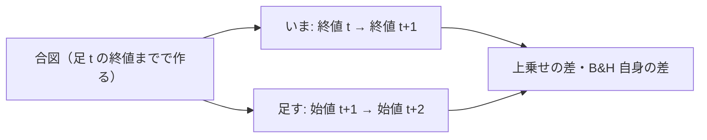

# 翌日の始値で売買したら何が起きるか（机上で回す）

2026-10-08 利用者決定「1」（研究側の 3 件 E・F・G を全部回す）。元の問い（2026-09-26）: 予測モデルの検証とトレーダーの売買を、終値ではなく市場が開いた最初（翌日の始値）で執行したら何が起きるか。⚠ 2026-09-26 は「想定するだけ」で回していない（見立ては TODO の疑問タスクの子）。

## 0. 目的・背景

いまの机上は「足 t の終値まで見て、足 t の終値で執行」（rules.md 13-4）。執行器は 15:50 ET の途中の足で予測して成行 ＝ 終値執行の近似。同じ合図を翌日の始値で執行した形を机上に足し、上乗せがどう変わるかを測る。

⚠ 本番は変えない（発注できる時間帯は 2026-09-20 に「広げない」と決めた）。結果で起動時刻を変えるかは利用者。

この図の主張: 変えるのは「どの値段で執行したか」の系列だけで、合図・学習・較正・θ・コスト・fold はそのまま。

## 1. 方針

| 項目 | 中身 |
| --- | --- |
| 口 | config の `[trading] execution = "next_open"`（無ければ今と 1 行も変わらない）。調整済み日足の `open` から `y_exec = log(open_{t+2} ／ open_{t+1})` を (symbol, ts) で表に継ぎ、`simulate` に渡す |
| 揃えるもの | 学習・較正・θ・コスト（片道 2.5bp）・fold・基準線（基準線も同じ始値の系列で） |
| 名前 | 検証方式「閾値売買（翌日始値）」・予測モデル名に `~exec-open` |
| 水準（回す前に固定） | モデル 4 本 ＝ いま本番で使っている形: `trade_own_ridge_a`（T1・T4）／ `trade_ownex_lgbm_a`（T4）／ `trade_ownseq_ridge_a`（T4）／ `sel_small4_1995`（T6）× θ 3 ＝ **n_trials ＋12**・leak 対照 4 本 |
| 物差し（回す前に rules.md に書く） | ① 上乗せの符号が変わるか ② B&H 自身の差（終値 → 終値 と 始値 → 始値）③ 差の大きさを 5bp/日 と比べる。⚠ 採否は今までと同じ判定式（対 B&H の上乗せの符号） |

## 2. Phase と Step（titan の Claude）

| Phase | 中身 |
| --- | --- |
| 1 | rules.md に新しい検証方式と物差し・水準を書く（回す前）|
| 2 | `execution = "next_open"` の口・テスト（無い config は 1 行も変わらない ／ 始値の系列が (symbol, ts) で正しく継がれる ／ 先読みしない）・既定経路の指紋テスト |
| 3 | config 4 本（＋ leak）→ `cli.queue` → 検証結果一覧を吐き直す → 記録 `docs/specs/experiments/next-open-execution.md`（図・表・言えること ／ 言えないこと）→ TODO の子を `DONE.md` へ |

## 3. 影響範囲

`experiments/feature-discovery/`（`cli/run.py` の執行の系列・`ail/` の表の組み立て）。⚠ `cli.build.assemble`・`cli.run.fold_buy_pct` に触れるなら既定経路の指紋テスト（`tests/test_trading_run.py`・`tests/test_predict.py`）を流す。執行器・管理画面は変えない。

## 4. テスト方針

上の Phase 2 のテスト ＋ `./run-tests.sh`。

## 5. 作業量・費用【推測】

実装 半日・実行 数分〜1 時間（titan）。費用 0。

✅ 2026-10-08 完了: 採る 0 ／ 保留 1 ／ 落とす 11・n_trials 777 → 789。結果は [next-open-execution.md §1](../../specs/experiments/next-open-execution.md)。
