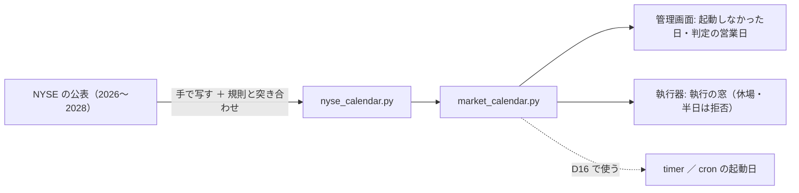

# 休場日の暦を入れる（管理画面の「平日＝営業日」の仮を外す）

2026-09-18。利用者の指示「そっちで進められるのをやって」（GAN のキューが回っている間に進められるタスクの次の 1 本）。

## 1. 目的・背景

管理画面の「起動しなかった日」（N7）は、営業日なのに執行器の記録が無い日を出す。いまは**平日をすべて営業日とみなす仮**（`dashboard/app/live.py` の `business_days`。印「仮 休場日の暦なし」）なので、祝日が「起動なし」として赤く出る。

TODO の条件: **NYSE の休場日を一次情報から持つ ／ 執行器の timer・cron の起動日（D16）と同じ暦を使う**。

## 2. 一次情報

【公表値】NYSE "Holidays & Trading Hours"（https://www.nyse.com/markets/hours-calendars 。取得 2026-09-18）。2026〜2028 年の 3 年分が載っている。

| 年 | 休場（全日） | 半日立会（13:00 ET 引け） |
|---|---|---|
| 2026 | 10 日（01-01・01-19・02-16・04-03・05-25・06-19・07-03・09-07・11-26・12-25） | 11-27・12-24 |
| 2027 | 10 日（01-01・01-18・02-15・03-26・05-31・06-18・07-05・09-06・11-25・12-24） | 11-26 |
| 2028 | 9 日（01-17・02-21・04-14・05-29・06-19・07-04・09-04・11-23・12-25。⚠ 01-01 は土曜で振替なし） | 07-03・11-24 |

⚠ **要約ツール（WebFetch）の結果は誤っていた**（2026-07-03 を半日・2026-12-25 を欠落・2027-07-05 を半日など）。生の HTML の表と脚注 4 本を読んで上の表を作った。⚠ **写し間違いを拾うために、テストで規則（第 n 月曜・聖金曜日・土日の振替）から独立に計算した日付と突き合わせる**。

## 3. 対応方針

**主張: 暦は 1 つのファイルに持ち、管理画面と執行器が同じ読み手を通して使う。載っていない年は「仮」に戻る。**

- 置き場: `experiments/tastytrade-api-sample/`（管理画面も執行器も、ここを `sys.path` に足して `ttclient` を import している ＝ すでに共有の場所。g3plus の clone にも入る）
  - `nyse_calendar.py`（出典・取得日・対象年・休場・半日）／ `market_calendar.py`（標準ライブラリだけ）
  - ⚠ **当初は `.toml` に置いたが `.py` に変えた**: g3plus のコンテナはこのディレクトリの `*.py` と `*.sh` しか COPY しない（dashboard.md §7）。`.toml` だと公開面に載らず、概要が 500 になる（デプロイ設定は g3plus-ops 側なので、こちらで契約に合わせた）
- **載っていない年**（2029 年〜・2025 年以前）: 平日＝営業日に戻し、`covered=False` を返す。管理画面はそのときだけ「仮」の印を出す（⚠ 黙って平日扱いにしない）
- 管理画面: `live.business_days` を暦に ／ `placeholder.calendar` は範囲が暦の外に出たときだけ `True` ／ `judge.py` の `in_market_hours`・`business_date`（「祝日は見ない」と書いてある）も暦に
- 執行器: `run_day.in_window` が休場日を拒否する。⚠ **半日立会の日も拒否する**（窓 15:45〜16:05 ET は 13:00 の引けの後）。⚠ **半日の日に窓を 12:45 へ動かすかは決めごと（live-trading.md §0-2）なので Claude は決めない** — 拒否して理由を出し、TODO に裁定を残す

## 4. 影響範囲

- 新規: `experiments/tastytrade-api-sample/{nyse_calendar.py,market_calendar.py}`・テスト
- `dashboard/app/live.py`・`judge.py`・`templates/overview.html`・`overall.html`・`tests/test_live.py`
- `experiments/live-trading/run_day.py`・`tests/test_run_day.py`
- 文書: `dashboard.md` §15-8（仮データの表）・更新履歴 ／ `live-trading.md` §0-2（窓と休場・半日）／ `CLAUDE.md`（「休場日の暦は仮データ」の記述）

## 5. テスト方針

| 何を固定するか | どこ |
|---|---|
| 暦の中身: 全部平日・昇順・対象年の中・年ごとの本数・**規則から独立に計算した日付と一致** | `dashboard/tests/test_market_calendar.py` |
| 載っていない年は `covered=False` で平日扱い | 同上 |
| 起動しなかった日に祝日（2026-09-07 Labor Day）が出ない・仮の印が消える／暦の外では出る | `dashboard/tests/test_live.py` |
| 執行の窓: 休場日・半日の日は拒否 | `experiments/live-trading/tests/test_run_day.py` |

## 6. 年に 1 度の更新

NYSE は先 3 年分を公表する。`market_calendar` は「今日から暦の終わりまでの残り日数」を返し、管理画面は残りが 90 日を切ったら全体の詳細に注意を出す（⚠ 切れたら黙って仮に戻るのではなく、切れる前に気づく）。
