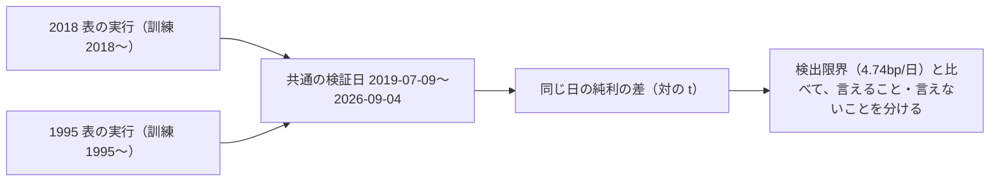
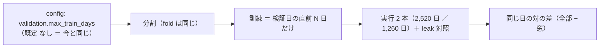

# 疑問「古すぎるトレンドは直近では参考にならないのではないか」に、既存の記録で答える

2026-09-18。利用者の指示「おススメ順でやって」（疑問タスクの子。登録は利用者）。

## 1. 目的・背景

訓練に 1995 年からのデータを入れると、直近（2019〜2026 年）の予測の役に立つのか、邪魔なのか。⚠ **新しい実行はしない**（GAN のキューの後始末で「n_trials 613 のまま」を検算する前なので、`runs/` に足さない）。既にある実行の記録を読むだけで、どこまで言えるかを確かめる。

## 2. 対応方針

**主張: 同じ手法を 2018 年始まりと 1995 年始まりの表で回した対が 1 組あるので、両方が検証している同じ日付の上で比べる。**

- 材料: `runs/` の `trade_own_ridge_a`（2018 表）と `trade_own_1995_ridge_a`（1995 表）の `daily.csv`・`checks.json`。⚠ 読むだけ
- ⚠ **fold の長さを跨いで fold の bp を比べない**（rules.md 14-4）。日次で比べる
- ⚠ 事後の読みであって新しい試行ではない（n_trials は動かない）。採否には使わない（診断）
- 交絡を先に挙げる: 1995 表は fold が 1,324 日なので、直近を当てているモデルは最長 5 年更新されていない（「古いデータを入れた」と「モデルが古い」が分かれない）

## 3. 成果物

`docs/specs/experiments/old-data-relevance.md`（答え・数字・言えないこと・決着をつける実験の案）。TODO の子タスクに答えの要点をメモし、決着の実験を回すかは利用者に聞く（⚠ 疑問タスクの子の追加は利用者の指示）。

## 4. 影響範囲・テスト

文書だけ。コード・`runs/`・台帳は変えない。

---

## 5. Phase 2: 決着の実験を回す（2026-10-08 利用者決定「1」＝ E・F・G を全部回す。titan の Claude）

**主張: 表・fold・検証日・特徴量・モデル・θ・コストをそろえ、訓練の窓の長さだけを変える**（中身は [old-data-relevance.md §3](../../specs/experiments/old-data-relevance.md) の案そのまま。⚠ 回す前に固定した水準を変えない）。

⚠ 本番との関わり: ソラ（`T6`。`sel_small4_1995` ＝ 1995 年から学ぶ）は今の時期に毎日「全部買う」。§2 の 2（1995 年から学ぶとほぼ「ずっと持つ」）と同じ形なので、窓を短くすると持ち方が変わるかを見る。⚠ 結果で `T6` を替えない（替えるのは新しい人 ＝ 利用者）。

この図の主張: 変えるのは窓の 1 引数だけで、既定（無制限）はいまの結果を 1 ビットも変えない。

| Step | 中身 |
| --- | --- |
| 2-1 ✅ | rules.md と記録に、回す前の水準と読み方を書く（全部 ／ 2,520 日 ／ 1,260 日・θ 3・n_trials ＋6・対の差・検出限界 2.02bp/日） |
| 2-2 ✅ | `validation.max_train_days`（既定は無制限）＋ テスト（既定で 1 ビットも変わらない ／ 窓の外の行が訓練に入らない）・既定経路の指紋テスト |
| 2-3 ✅ | 表は 1995 表・モデルは 2 つ（`trade_own_1995_ridge_a` の形 ＝ 対の元 ／ `sel_small4_1995` ＝ `T6` の形）。✅ 2026-10-08 利用者が 2 つとも了承 ＝ n_trials ＋12（水準 2 × θ 3 × 2）。2-1 で数を書いてから回す |
| 2-4 ✅ | `cli.queue` で回す（leak 対照つき）→ 検証結果一覧を吐き直す → 記録 §5 に結果・言えること ／ 言えないこと → TODO の子を `DONE.md` へ |

- テスト方針: 既定経路の指紋テスト（`tests/test_trading_run.py`・`tests/test_predict.py`）が変わらないこと。`./run-tests.sh` ✅
- 費用【推測】: 実装 2〜3 時間・実行 3 分 × 4（titan）。費用 0

✅ 2026-10-08 完了: 採る 0 ／ 保留 2 ／ 落とす 10・n_trials 765 → 777。結果は [old-data-relevance.md §5-1](../../specs/experiments/old-data-relevance.md)。
