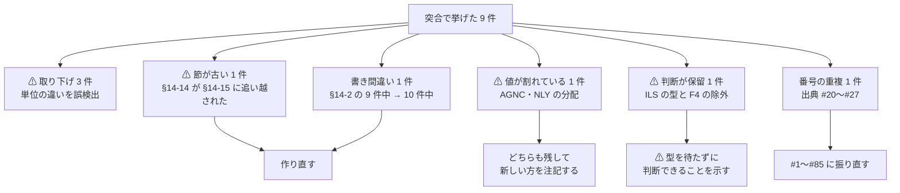
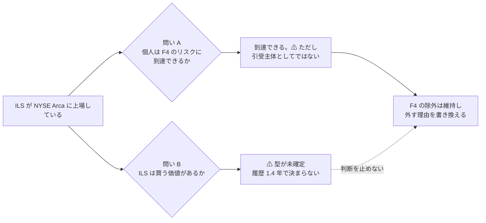

# online-tradable-assets.md の食い違いを直す

作成日: 2026-08-31。対象: [docs/specs/online-tradable-assets.md](../../specs/online-tradable-assets.md)。
発端: スライド化（2026-08-29）の突合。突合表は [archive/online-tradable-assets-slides.md](online-tradable-assets-slides.md) §9-3。

## 1. 目的

**スライド側で黙って直さずに残しておいた元文書の食い違いを、元文書側で直す。**

⚠ 起票した 9 件のうち **3 件は 2026-08-31 に取り下げた**（累計と年率・範囲と代表値・SEC 利回りと分配率という
**単位の違いを食い違いとして拾っていた**）。⚠ **残る 5 件のうち 4 件は、数字違いではなく別の性質の問題だった。**

> この図の主張: 残る 4 件は「数字が間違っている」のではなく、節が古い・単位が並記されている・判断が保留、と種類が違う。

⚠ **調査結果そのものは変えない。**候補の追加・判定の変更・再試算はこのタスクの範囲外。

## 2. Phase 1 — ⚠ §14-14 を §14-15 の結果で作り直す（一番重い）

**§14-14 は §14-15 が書かれる前の状態のまま残っている。**数字を 1 つ直せば済む話ではない。

| 箇所 | 現状 | 実際 |
| --- | --- | --- |
| 見出し | 「**93 件**全部が対象ではない」 | 一覧は **96 件** |
| 実測して判定済み | **8 銘柄** | ⚠ **直後の §14-15 が 17 銘柄を確定させている** |
| 「判定が要る（未了）約 22」の参照先 | 「**§14-14 の表（下）**」 | ⚠ **自己参照**。§14-15 を指すべきで、しかもそこで解消済み |
| 内訳の合計 | 8＋22＋8＋11＋30 = **79** | 96 に合わない |

### やること

**96 行すべてを区分に割り当て、合計が 96 になる内訳に作り直す。**

⚠ **行数と銘柄数がずれる。**1 行に 2 銘柄を載せた行が 3 つある（mREIT の AGNC・NLY、
シニアローン ETF の BKLN・SRLN、ロイヤリティトラストの PBT・SBR）。**両方を書く。**

- [x] Step 1-1: 96 行を 6 区分に割り当て、合計 96 を機械的に確かめる
- [x] Step 1-2: 「実測して判定済み」を §14-15 の 17 銘柄（① 6・② 9・③ 2）に合わせる
- [x] Step 1-3: 参照先を §14-15 に直す
- [x] Step 1-4: ⚠ **区分の境目に判断が入ることを明記する**（貸株・SPAC 信託・タックスリーエンをどちらに置くか）

## 3. Phase 2 — 書き間違いと、値が割れている 2 銘柄

- [x] Step 2-1: §14-2 の見出し文「分配は **9 件中** 5 件がゼロ」→ **10 件中**（表は 10 行。ゼロが 5 件なのは正しい）
- [x] Step 2-2: AGNC・NLY の分配が §14-1 と §14-15 で割れている件に注記を入れる

⚠ **どちらかを消さない。**§14-1 は一覧の取得時点、§14-15 は 4 巡目（2026-08-29）の再取得で、
**どちらでも判定は ② のまま変わらない**（差は −7.2〜−9.1pt でいずれも負）。
⚠ **一覧の値を書き換えるとスライド側の突合が崩れる**ので、値は残して**新しい方を注記する**。

| 銘柄 | §14-1（一覧） | §14-15（4 巡目の再取得） |
| --- | --- | --- |
| AGNC | 13.56% | 約 12% |
| NLY | 13.30% | 12.97%（$3.00/年） |

## 4. Phase 3 — ⚠ ILS の型と F4 の除外を切り離す

**TODO は「ILS の型が未確定だから F4 の判断ができない」としていたが、これは 2 つの別の問いを 1 つにしている。**

> この図の主張: 「F4 のリスクに到達できるか」と「その商品が良いか」は別の問い。型が決まらなくても前者は決まる。

- [x] Step 3-1: F4 の除外を維持し、**外す理由を書き換える**方針を §14-16 に記録する
- [x] Step 3-2: `docs/specs/income-taxonomy/shortlist.md` の F4 の行と保留の但し書きを更新する

⚠ **母集団 51 件は変えない。**F4 は枠として除外したまま。ILS は F4 の手法ではなく **E1 の一銘柄**として一覧に載っている。

## 5. Phase 4 — 出典の通し番号を振り直す

⚠ **#20〜#27 が §9 と §12-10 で重複している。**本文から番号で参照している箇所は **0 件**なので実害は小さいが、
「出典 #23」と書いた瞬間にどちらか分からなくなる。

| 節 | 現状 | 振り直し後 | 件数 |
| --- | --- | --- | ---: |
| §9 | #1〜27 | #1〜27（変更なし） | 27 |
| §12-10 | ⚠ **#20〜48** | **#28〜56** | 29 |
| §13-9 | #49〜66 | **#57〜74** | 18 |
| §15-4 | #67〜77 | **#75〜85** | 11 |
| | | **合計 85** | |

- [x] Step 4-1: 3 節を機械的に振り直す。⚠ **他の番号付き表（§14 の行番号など）に触れないこと**
- [x] Step 4-2: 番号で参照している箇所を追随させる（突合表の「§12-10 #23」）

## 6. Phase 5 — 検証

| # | 検証 | 方法 |
| --- | --- | --- |
| 1 | §14-14 の内訳が 96 になるか | 区分ごとの件数を足す |
| 2 | 判定済みが §14-15 と一致するか | 17 銘柄（① 6・② 9・③ 2）を突き合わせる |
| 3 | 出典番号が #1〜85 で重複なしか | 3 節の番号を抜き出して連番か確かめる |
| 4 | ⚠ **スライドが壊れていないか** | 96 行・294 個の数値トークンの突合を再実行する |
| 5 | リンク切れが無いか | 節見出しへのアンカーを確かめる |

## 7. 影響範囲

| 対象 | 変更 |
| --- | --- |
| `docs/specs/online-tradable-assets.md` | §14-14 作り直し／§14-2 見出し／§14-1・§14-15 に注記／§14-16 に F4 の判断／出典 3 節の番号 |
| `docs/specs/income-taxonomy/shortlist.md` | F4 の行と保留の但し書き。⚠ **母集団 51 件は変えない** |
| `docs/specs/online-tradable-assets-slides.html` | ⚠ **原則そのまま。**突合が崩れていないことだけ確かめる |
| `docs/plans/archive/online-tradable-assets-slides.md` | 出典番号の参照を追随 |
