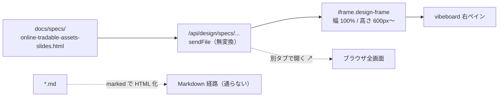
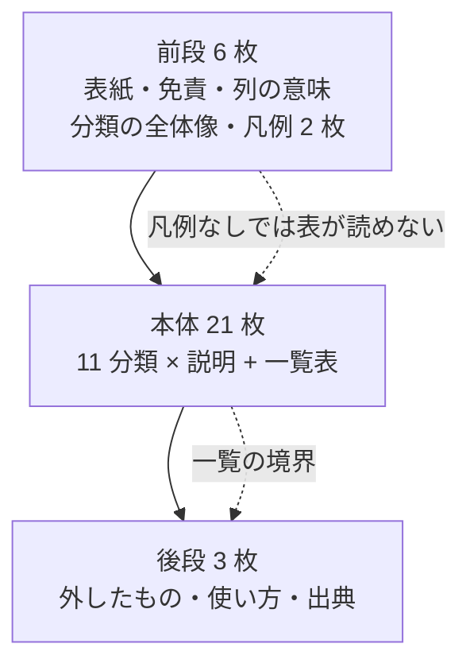
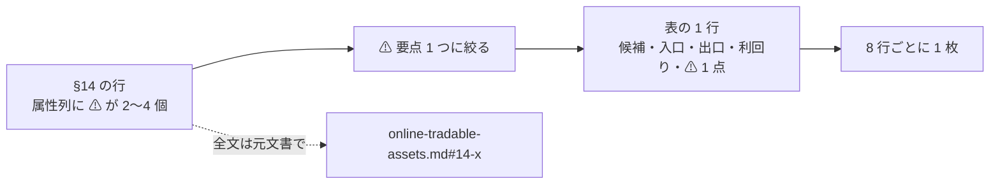
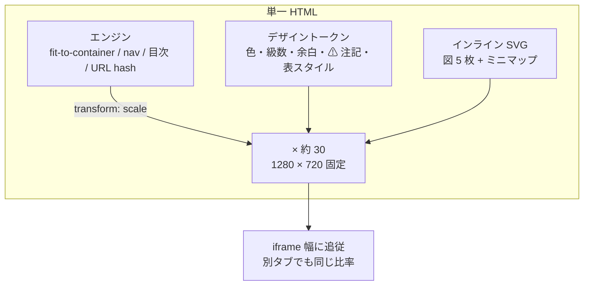
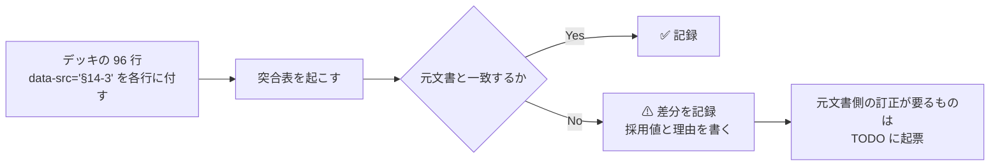

# online-tradable-assets.md の商品リストをスライドショーにする

作成日: 2026-08-29。対象: [docs/specs/online-tradable-assets.md](../specs/online-tradable-assets.md) の **§14 のみ**（一覧・11 分類・96 件）。

## 1. 目的とスコープ

**この資料に載せるのは商品リストだけとする。**分かりやすくするために、**11 分類が何で分かれているのかを説明する**。

元文書 1,683 行のうち §14 が成果物で、§0〜§13 は「その一覧をどう作ったか」の記録、§15 は「①維持型 6 件の順位」である。
⚠ **記録と順位はスライドに載せない。**一覧を読むために必要な説明だけを足す。

| 元文書 | 扱い |
| --- | --- |
| §14-1〜14-11（11 分類・96 件の表） | ✅ **本体**。全 96 件を載せる |
| §14-12（一覧から外した 3 種類） | ✅ 載せる（一覧の境界の説明） |
| §14-13（一覧の使い方） | ✅ 載せる |
| §12-3（①②③ の型）・§1（出口の 2 型） | ✅ **凡例として載せる**。⚠ 一覧の「属性」列に ①②③ と「板型／買取保証型」が出てくるため、これが無いと表が読めない |
| §0〜§13 の調査経緯（4 ゲート・4 巡の洗い直し・見落としパターン） | ❌ **載せない** |
| §14-15・§15（型判定の一斉適用・① 6 件の税引後順位） | ❌ **載せない**（順位付けは商品リストではない） |
| §9・§15-4（出典） | ✅ 末尾に 1 枚 |

⚠ **元文書は書き換えない。**数値の正は常に元文書側にある。

## 2. 成果物

| 項目 | 内容 |
| --- | --- |
| ファイル | `docs/specs/online-tradable-assets-slides.html`（**単一ファイル・自己完結**） |
| 枚数 | **約 30 枚**（§3 に内訳） |
| 閲覧 | vibeboard の `Specs` タブ → 右ペインの iframe。ツールバーの「別タブで開く ↗」で全画面相当 |
| 依存 | ⚠ **なし**（CDN・外部フォント・ビルドツールを使わない。CSS / JS / SVG をすべてインラインに書く） |

### なぜ単一 HTML で作れるか（vibeboard 実装の確認結果）

vibeboard は `docs/specs/` 配下の `.html` を **Markdown 変換せず生のまま配信し、iframe に流し込む**。

| 箇所 | 内容 |
| --- | --- |
| `vibeboard/dist/server.js:185` | ツリー一覧の対象拡張子が `['.md', '.html']`。`.html` もサイドバーに並ぶ |
| `vibeboard/dist/server.js:217-238` | `GET /api/design/:category/*` が `.html` を `res.type('html').sendFile()` で**そのまま**返す |
| `vibeboard/src/web/app.js:1298` | 拡張子が `.html` なら `renderDesign()` に分岐（Markdown 経路に入らない） |
| `vibeboard/src/web/app.js:1153` | `sandbox` 属性なしの iframe に読み込む。⚠ **インライン JS はそのまま動く** |
| `vibeboard/src/web/style.css:698` | `.design-frame` は `width:100%` / `flex:1`、親の `min-height: 600px` |

> この図の主張: スライドは Markdown 経路を通らず、書いた HTML がそのまま iframe に届く。

⚠ **既知の制約 2 点**（Phase 5 で扱う）。

| 制約 | 内容 | 対応 |
| --- | --- | --- |
| ⚠ 全画面 API | iframe に `allow="fullscreen"` が無いため、**デッキ内の全画面ボタンは iframe 内では効かない** | 「別タブで開く ↗」を案内する。⚠ 必要なら `vibeboard/src/web/app.js:1153` 付近に `iframe.allow='fullscreen'` を 1 行足す（vendor 済みなのでカスタマイズ可） |
| キーボード | iframe に focus が無い間は ←→ が親に取られる | 読み込み時に自前で focus し、**画面上に送り／戻しボタンと目次**も置く。キーボードだけに依存しない |

## 3. スライド構成（約 30 枚）

> この図の主張: 前段（読み方の説明）→ 本体（11 分類の商品リスト）→ 後段（境界と使い方）の 3 段で、本体が 7 割を占める。

### 前段（6 枚）

| # | 内容 |
| --- | --- |
| 1 | 表紙: **オンラインで売買できるもの — 11 分類・96 件** |
| 2 | ⚠ 前提と免責（**実行していない**／米国 WA 州居住者が買える経路／⚠ 投資・税務助言ではない／【実測】【公表値】【推測】【Web 確認済（二次）】の表記区分） |
| 3 | **表の読み方** — 5 列（候補・買う場所＝入口・売る場所＝出口・利回り／値動き・⚠ 属性）の意味 |
| 4 | **11 分類の全体像** — 何で分かれているか＝**買う「もの」の正体**（会社の持分／会社の株を通じた代替／貸したお金／保険契約／実物／約束事／トークン／権利／現物の板／個別の債権・持分／事業そのもの）。件数つき |
| 5 | 凡例①: **出口は 2 種類**（板型＝市場で付け合わせる／買取保証型＝発行体が既定の式で買い取る）。⚠ 「板が無い＝出口が無い」ではない |
| 6 | 凡例②: **①②③ の型**（分配の原資は何か。① 維持型／⚠ ② 元本毀損型／⚠ ③ 枯渇型）。⚠ 属性列に出てくるので先に説明する |

### 本体（21 枚）— 11 分類

**大きい分類は「説明 1 枚 ＋ 一覧表 1〜3 枚」、小さい分類は「説明と表を 1 枚」に収める。表は 8 行まで。**

| # | 分類 | 件数 | 枚数 | 分類の説明で言うこと（1 主張） |
| --- | --- | ---: | ---: | --- |
| 14-1 | 株式・株式ファンド | 18 | **4** | 会社の持分。⚠ **同じ「証券口座で買える板」の中に、分配 2% 台から 13% 台までが同居している** |
| 14-2 | 上場の代替アクセス | 10 | **3** | ⚠ **買うのは資産ではなく「その資産を扱う事業会社の株」**。出口は板で確実だが、10 件中 5 件が分配ゼロ |
| 14-3 | 債券・金利 | 17 | **4** | お金を貸して利子を受け取る。⚠ **この分類にだけ「買取保証型の出口」（I Bonds・CD・MYGA）がある** |
| 14-4 | 保険・年金 | 4 | **1** | 保険会社との契約。⚠ **解約控除と拘束期間が価格の一部** |
| 14-5 | 商品・実物 | 8 | **1** | 物そのもの。⚠ **分配が出ない**（売買差益しかない）。金は collectibles 扱いで最大 28% |
| 14-6 | デリバティブ・仕組み | 7 | **1** | 値動きの約束事。⚠ **建玉・限月の管理が要るものと、ETF に包まれて要らないものが混在** |
| 14-7 | 暗号資産 | 4 | **1** | ⚠ **財産扱いで長期譲渡益は株と同率**。ただし分配が無い |
| 14-8 | 権利・ロイヤリティ | 6 | **1** | 使用料を生む権利。⚠ **入口はあるが出口が無い**（運営自身が「二次市場は無いに等しい」と明記） |
| 14-9 | 収集品・実物の板 | 5 | **1** | 現物の板。⚠ **売り手数料が二桁になる**（StockX 9% ＋決済 3%） |
| 14-10 | 債権・不動産・未公開 | 7 | **1** | 個別の債権・持分。⚠ **資格要件・最低額・償還枠という「買えても売れない」制約** |
| 14-11 | 事業・在庫・その他 | 10 | **3** | 事業や在庫そのもの。⚠ **仕入れて売る作業が要る**。規約・州法で止まるものが集まる |

⚠ **属性列は元文書の全文を載せない。**各行につき **⚠ の要点 1 つ**に絞り、全文は元文書へのリンクで辿らせる。
各スライドの隅に **11 分類のミニマップ**（今どこか）を置く。

### 後段（3 枚）

| # | 内容 |
| --- | --- |
| 29 | ⚠ **一覧から外したのは 3 種類だけ**（実地確認が必須／設備の運用であって売買ではない／「もの」ではなく手法）。⚠ **「時間がかかる」「州で買えない」「資格が要る」「利回りが低い」は外す理由にしない** |
| 30 | **一覧の使い方** — 絞り込みは一覧の外でやる（受動的に持ちたい → 保有中の作業／すぐ換金したい → 売る場所／WA 州で買いたい → 受取の制約／収入が欲しい → ⚠ **96 件中 11 件が分配ゼロ**） |
| 31 | 出典と表記ルール（元文書 §9・§15-4 へのリンク） |

## 4. Phase 分割

### Phase 1 — 原稿を固める（コードを書く前）

96 行を**表に載せる形に整形する**のがこの Phase の主作業。⚠ 実装しながら数字を拾わない。

- [x] Step 1-1: 96 件を 5 列（候補・入口・出口・利回り／値動き・⚠ 属性 1 点）に整形し、分類ごとに 8 行以内へ割る
- [x] Step 1-2: 11 分類の説明文（1 分類 1 主張 ＋ 3 行以内）を書く。⚠ **§3 の表の「言うこと」を元文書で裏取りする**
- [x] Step 1-3: 凡例 2 枚（出口の 2 型・①②③）の文言を §1・§12-3 から起こす
- [x] Step 1-4: ⚠ **元文書の数値の食い違いを洗い出す**（§5 に既知分あり）。採用値と理由を残す

> この図の主張: 原稿は「元文書の行 → 表の 1 行」への圧縮であって、書き足しではない。

### Phase 2 — スライドエンジンとデザインを作る

> この図の主張: 固定サイズの舞台を作り、それを容器に合わせて拡大縮小する。これで狭い iframe でも別タブ全画面でも同じ見た目になる。

- [x] Step 2-1: 1280×720 の舞台 ＋ `ResizeObserver` で `transform: scale()` するフィット処理
- [x] Step 2-2: 送り／戻し（←→・Space・PageUp/Down・Home/End・クリック）、画面上のボタン、`#14-3-2` の形で分類直リンク
- [x] Step 2-3: 目次オーバーレイ（`o` キーまたはボタン。**11 分類から飛べる**ことを優先する）
- [x] Step 2-4: **表のデザイン**（この資料の主役）— 8 行 × 5 列で読める級数、⚠ 属性列の枠、行の交互背景、数値の右寄せ
- [x] Step 2-5: デザイントークン（本文 24px 以上、⚠ は色だけでなく記号と枠で示す、出所表記 `§14-3` の共通スタイル、進捗バー）

### Phase 3 — 図を作る（インライン SVG・5 枚）

| ID | 図 | 使う枚 | 内容 |
| --- | --- | --- | --- |
| C1 | **11 分類のマップ** | 4 | 96 件がどう分かれているか。⚠ **各分類スライドの隅にミニ版を置く**（現在地表示） |
| C2 | 分類ごとの件数 | 4 | 横棒。18 / 10 / 17 / 4 / 8 / 7 / 4 / 6 / 5 / 7 / 10 |
| C3 | 出口の 2 種類 | 5 | 板型・買取保証型の対比図 |
| C4 | ①②③ の分岐 | 6 | 「分配の原資は稼いだ収益か → 原資産は買い増せるか」の 2 分岐 |
| C5 | ⚠ 分配ゼロの内訳 | 30 | 96 件中 11 件（金 ETF・商品 ETF・KRBN・ウラン・バッファー ETF・ATEX・RSVR・LQDT・DXYZ・FRGE・水先物）。「収入が欲しい」用途の説明に使う |

⚠ **CLAUDE.md の「図は mermaid で書く」からの逸脱。**理由は 3 つ。

1. 分類マップとミニマップは**スライドの隅に置く現在地表示**で、mermaid の自動レイアウトでは作れない
2. デッキ全体でフォント・色・線幅を揃えたい。mermaid とインライン SVG が混ざると 1 枚ごとに見た目が変わる
3. mermaid は CDN 読み込みになり、**自己完結（依存なし）の条件を壊す**

→ ⚠ **`docs/plans/` `docs/specs/` の Markdown は従来どおり mermaid**。逸脱はこのスライド HTML 内に限る。
図の原則（1 図 1 主張・ノード 12 個以内・一覧は表）は SVG でもそのまま守る。

### Phase 4 — 流し込みと数値突合

> この図の主張: 96 行すべてを元文書に突き当てる。合わなければデッキではなく突合表に理由を残す。

- [x] Step 4-1: 原稿を流し込む。各行に `data-src="§14-3"` の形で出所を埋める
- [x] Step 4-2: ⚠ **件数を機械的に数える**（分類ごと 18/10/17/4/8/7/4/6/5/7/10、合計 96）。デッキの行数と一致すること
- [x] Step 4-3: 数値（利回り・手数料・上限）を 1 件ずつ元文書と照合する
- [x] Step 4-4: ⚠ 差分の扱いを決め、必要なら `TODO.md` へ起票する

### Phase 5 — vibeboard で実機確認

- [x] Step 5-1: `node vibeboard/dist/cli.js --root .` で起動し、`Specs` タブに `.html` が並ぶことを確認
- [x] Step 5-2: 右ペイン（狭い iframe）と「別タブで開く ↗」の両方で全枚を送り、⚠ **表の 5 列が読める級数か**を確認
- [x] Step 5-3: 送り／戻し・目次・分類直リンクの動作確認。⚠ 全画面ボタンの扱いを決める
- [x] Step 5-4: 元文書 §14 の冒頭にスライドへのリンクを 1 行足す（⚠ 本文の数値は触らない）

## 5. ⚠ 先に見つかっている元文書の食い違い

Phase 4 で扱う。**デッキ側で黙って直さない。**

| # | 箇所 | 内容 | 暫定方針 |
| --- | --- | --- | --- |
| 1 | §14-14 の見出し | 「**93 件**全部が対象ではない」だが、§14-1〜14-11 の分類合計は **96 件**（18+10+17+4+8+7+4+6+5+7+10） | デッキは **96** を使う。元文書の訂正は TODO へ |
| 2 | §14-1 と §14-15 | AGNC の分配が **13.56%**（§14-1）と 約 12%（§14-15） | ⚠ **一覧に載せるのは §14-1 の値**（この資料は §14 の一覧が本体）。差分は突合表に残す |
| 3 | §14-1 と §14-15 | BSM の 10 年が **−8.8%**（§14-1）と −0.9%（§14-15） | 同上 |
| 4 | §14-3 | ILS の型が「⚠ ② の疑い」。⚠ **確定していない属性を一覧にどう書くか** | 「⚠ 未確定」と明示する。断定しない |

## 6. 影響範囲

| 対象 | 変更 |
| --- | --- |
| `docs/specs/online-tradable-assets-slides.html` | **新規**（このタスクの成果物） |
| `docs/specs/online-tradable-assets.md` | §14 冒頭にスライドへのリンク 1 行のみ（Step 5-4）。⚠ **本文・数値は変更しない** |
| `TODO.md` / `DONE.md` | タスク管理ルールどおり |
| `docs/plans/online-tradable-assets-slides.md` | 完了後に `docs/plans/archive/` へ |
| ⚠ `vibeboard/src/web/app.js` | **任意**。全画面を iframe 内で効かせる場合のみ 1 行（Step 5-3 で判断） |

⚠ **調査内容そのものは変更しない。**候補の追加・判定の変更・再試算はこのタスクの範囲外。

## 7. 検証方針

| # | 検証 | 方法 |
| --- | --- | --- |
| 1 | **96 件が漏れなく載っているか** | 分類ごとの行数を数え、18/10/17/4/8/7/4/6/5/7/10・合計 96 と一致すること |
| 2 | **数値が元文書と一致するか** | Phase 4 の突合表。`data-src` を全数チェック |
| 3 | 依存が無いか | `grep -E 'https?://'` で外部参照が**出典リンク以外に無い**こと。ネットワークを切って開いても崩れないこと |
| 4 | 読めるか | vibeboard の狭い iframe（幅 600〜900px 想定）と別タブ全画面の両方で全枚を目視。⚠ **表の 5 列目が潰れていないこと** |
| 5 | 表記ルール | 数値に【実測】【公表値】【推測】【Web 確認済（二次）】のいずれかが付いていること（CLAUDE.md） |
| 6 | 免責 | ⚠ 「実行していない」「投資・税務助言ではない」がスライド 2 と末尾の両方にあること |
| 7 | 図の原則 | 1 図 1 主張／主張文が図の直前にある／一覧は表になっている |

## 8. 想定作業量

| Phase | 内容 | 目安 |
| --- | --- | --- |
| 1 | 96 行の整形＋分類の説明文 | 1〜1.5 セッション（⚠ **ここが一番重い**） |
| 2 | エンジン＋表のデザイン | 1 セッション |
| 3 | 図 5 枚＋ミニマップ | 0.5 セッション |
| 4 | 流し込み＋数値突合 | 1 セッション |
| 5 | 実機確認 | 0.5 セッション |

⚠ 初期コスト・収益は発生しない（ドキュメント作業）。

---

## 9. 突合の結果（Phase 4・2026-08-29 実施）

### 9-1. 件数

分類ごとの行数を機械的に数えた。**元文書 §14-1〜§14-11 の 96 件と、デッキの 96 行が一致した。**

| 検証 | 方法 | 結果 |
| --- | --- | --- |
| 分類ごとの件数 | デッキのデータ配列と DOM の `tr[data-src]` を数える | 18/10/17/4/8/7/4/6/5/7/10 = **96**。元文書と一致 |
| 全行が 5 列か | DOM の `td` 数 | **96 行すべて 5 セル**。空セル 0 |
| `data-src` | 全行に `data-src="§14-x"` を埋め、分類ごとに集計 | 96 行すべてに付与。分類ごとの内訳も一致 |
| スライド枚数 | 前段 6 ＋ 本体 21 ＋ 後段 3 | **30 枚**（プランの想定どおり） |

デッキ自身にも自己点検を埋めてある（`window.__deckCheck`）。読み込み時に件数が合わなければ console にエラーを出す。

### 9-2. 数値

**デッキの 96 行から数値トークンを 294 個抜き出し、1 個ずつ対応する §14-x の本文に含まれるかを照合した。不一致 0。**

照合の途中で、§14 の外から持ち込んでいた数値が 3 件見つかったので**落とした**（`data-src` が §14-x のままだと出所が食い違うため）。

| 落とした値 | 元の出所 | 対応 |
| --- | --- | --- |
| 暗号資産の長期譲渡益「0 / 15 / 20%」 | §9 #20 | 削除。§14-7 の「株と同率」だけ残す |
| Lofty の内訳「買 2.5%・売 3%・成行 片道 2.5%」 | §9 #24 | 削除。§14-7 の「往復コスト 約 8%」だけ残す |
| Fundrise「legacy eREIT は 2025-10-01 から」 | §9 #23 | 削除。§14-10 の「実際に停止した例がある」だけ残す |

逆向き（元文書の `**強調**` された数値がデッキに載っているか）も見た。載せていないものが 9 個あるが、
すべて **⚠ 属性を 1 点に絞った結果の意図的な省略**（LQDT の EBITDA、BKLN の設定来、CCLFX の純資産など）で、
全文は元文書で読ませる設計どおり。

### 9-3. ⚠ 元文書の食い違い — デッキ側で黙って直していない

プラン §5 で挙げた 4 件に加え、Phase 4 で 5 件見つかった。**元文書は書き換えていない。**

| # | 箇所 | 内容 | デッキの扱い |
| --- | --- | --- | --- |
| 1 | §14-14 見出し | 「**93 件**全部が対象ではない」だが分類合計は **96 件** | **96** を使う |
| 2 | §14-1 と §14-15 | AGNC の分配 **13.56%** ／ 約 12% | §14-1 の値 |
| 3 | §14-1 と §14-15 | BSM の 10 年 **−8.8%** ／ −0.9% | §14-1 の値 |
| 4 | §14-3 | ILS の型が「⚠ ② の疑い」で未確定 | バッジを「未確定」にし、⚠ **断定していない**と本文に明記 |
| 5 | §14-1 と §14-15 | ⚠ **新規**。NLY の分配 **13.30%** ／ 12.97% | §14-1 の値 |
| 6 | §14-1 と §14-15 | ⚠ **新規**。BSM の分配 **8.19〜8.60%** ／ 8.24% | §14-1 の値 |
| 7 | §14-2 見出し文 | ⚠ **新規**。「分配は **9 件中** 5 件がゼロ」だが表は **10 行**（ゼロは 5 件） | **10 件中 5 件**と書く |
| 8 | §14-3 JBBB 行 | ⚠ **新規**。同じ行の中で分配が「30 日 SEC **8.5%**」と「分配 **7%**」 | 利回り列は 8.5%、属性は「設定来 6% < 分配 7%」と原文どおり併記 |
| 9 | §9 と §12-10 | ⚠ **新規**。出典の通し番号 **#20〜#27 が重複**（§9 は #1〜27、§12-10 は #20〜48）。番号だけでは一意に引けない | 出典スライドに**注記**した。件数は節ごとに書く |

→ ⚠ **1・2・3・5・6・7・8・9 は元文書側の訂正が要る。`TODO.md` に起票した。**

### 9-4. ⚠ 行単位で確かめたら成立しなかった主張 5 つ

プラン §3 の「分類の説明で言うこと」を元文書に突き当てたところ、**そのままでは書けないものが 5 つあった**。書き換えた。

| 分類 | プランの原案 | ⚠ 実際 | デッキの文言 |
| --- | --- | --- | --- |
| 14-1 | 「18 件すべて出口は板」 | BDC「平均 12.6%」の行は出口が「—」 | 「括りの 1 行を除き、出口はすべて板」 |
| 14-1 | 「分配 8% 超の 7 件のうち 4 件が ②」 | 行と銘柄がずれる（MORT は「疑い」） | 「⚠ ② と**確定**しているのが 4 銘柄、① が 3 銘柄。同じ利回り帯に両方いる」 |
| 14-7 | 「4 件とも分配は無い」 | ステーキングは「銘柄ごと」に収益がある | 「①②③ の型は付かない — 収益源が分配ではなく売買差益とステーキング報酬だから」 |
| 14-8 | 「6 件すべて出口が無い」 | REC / SREC は Flett Exchange という板がある | 「**6 件中 5 件**は出口が無いか相対取引」 |
| 14-11 | 「出口も 10 件中 4 件が個別交渉」 | 数え直すと 3 件 | 「出口も **3 件**は常設の買い手がいない」と銘柄名まで書く |

## 10. Phase 5 の結果（実機確認）

| # | 確認 | 結果 |
| --- | --- | --- |
| 1 | `Specs` タブに並ぶか | ✅ `<title>` から「オンラインで売買できるもの — 11 分類・96 件」で表示される |
| 2 | 生のまま配信されるか | ✅ `GET /api/design/specs/online-tradable-assets-slides.html` → `200 text/html`、Markdown 変換なし |
| 3 | 右ペイン（iframe）で動くか | ✅ iframe 1168×806 に対し舞台が 1168×657（scale 0.91）。インライン JS も動く |
| 4 | ⚠ **狭い枠で 5 列が読めるか** | ✅ **幅 820px でも 5 列すべて残る**（最密の §14-10 で 5 列目が実効 9.3px）。vibeboard の実寸 1168px なら余裕がある |
| 5 | 全 30 枚が 1 枚に収まるか | ✅ **はみ出し 0px**（Playwright で 30 枚を 1 枚ずつ測定） |
| 6 | 送り・目次・直リンク | ✅ ←→ / Space / Home / End / `o` / クリック、画面上のボタン、`#14-10` の直リンクすべて動作 |
| 7 | 依存なし | ✅ 外部参照は**出典 5 本のリンクだけ**。CDN・フォント・画像の読み込みは無い |

### ⚠ 全画面ボタンの扱い（Step 5-3 の判断）

**vibeboard 側は変更しない。** 理由は 2 つ。

1. 右ペインの実寸が 1168px あり、**scale 0.91 でほぼ原寸**。全画面にしなくても読める
2. ツールバーの「別タブで開く ↗」で全画面相当になる。vendor 済みコードに手を入れる必要がない

デッキ側は、`requestFullscreen()` が失敗したら**「別タブで開く ↗ を使うこと」と画面に出す**ようにした。

### ⚠ 実装で 1 つ設計を変えた — 表の級数は読み込み時に自動で詰める

固定の級数だけでは、⚠ 属性の文量が多い §14-8・§14-10 が 1 枚に収まらなかった。
**読み込み時にすべてのスライドを一度可視化し、表が `.sbody` に収まるまで 0.5px ずつ級数を下げる**処理を入れた（`autofit()`）。

| 分類 | 行数 | 確定した級数 |
| --- | ---: | ---: |
| 14-4・14-7 | 4 | 19px |
| 14-2・14-3-3・14-11-2 | 5 | 18.5px |
| 14-1・14-3 | 6 | 17.5px |
| 14-6 | 7 | 16.5px |
| 14-5 | 8 | 15.5px |
| ⚠ 14-8 | 6 | **15.5px**（文量が多く 2 段下がった） |
| ⚠ 14-10 | 7 | **14.5px**（最小） |

⚠ **もう 1 つ直したのは中央寄せ。** `place-items:center` は舞台がはみ出すと start 寄せに落ちて**右が切れる**。
実寸 1280×720 の箱を絶対配置で中央に置き、その中心を軸に `scale()` する形に変えた。
