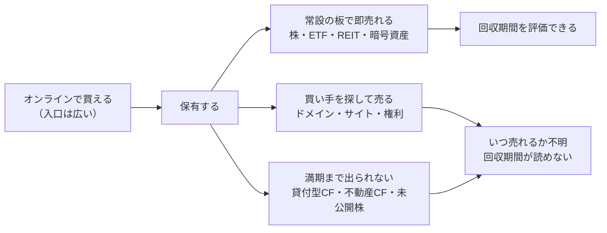
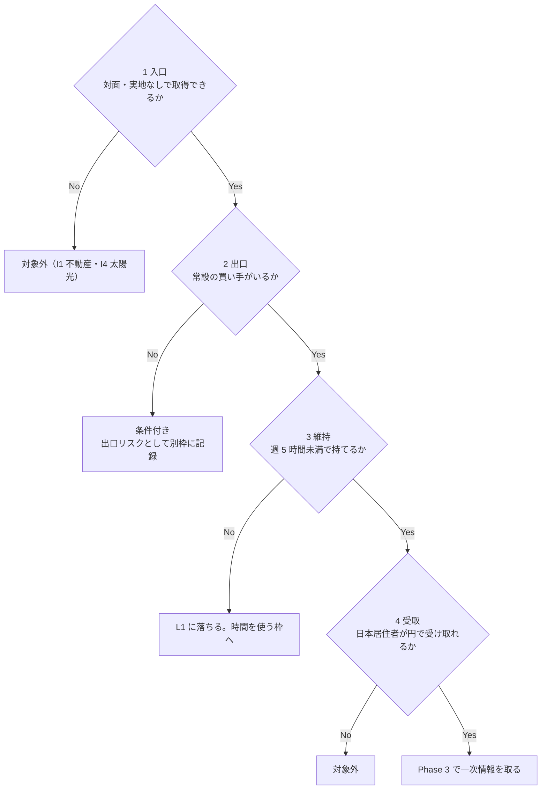
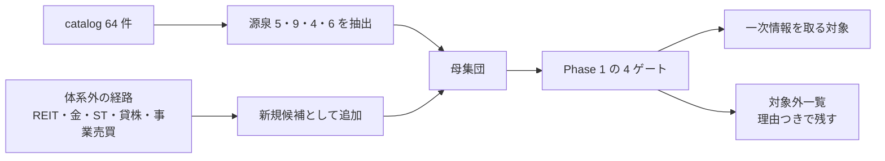
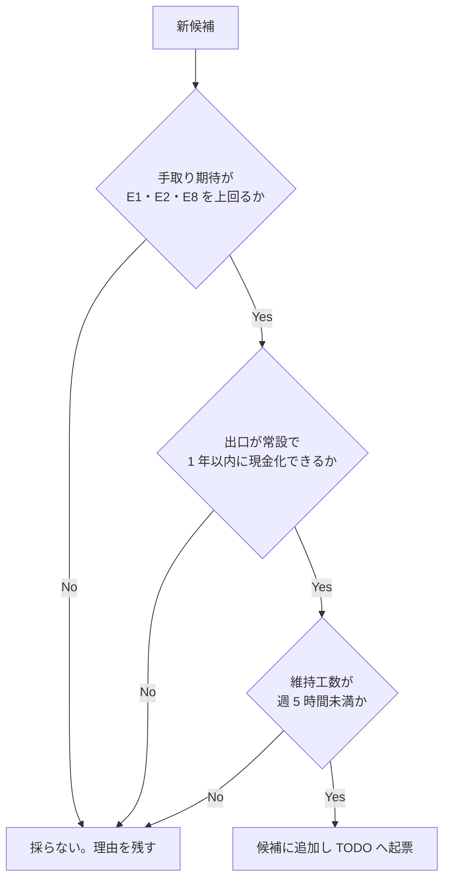
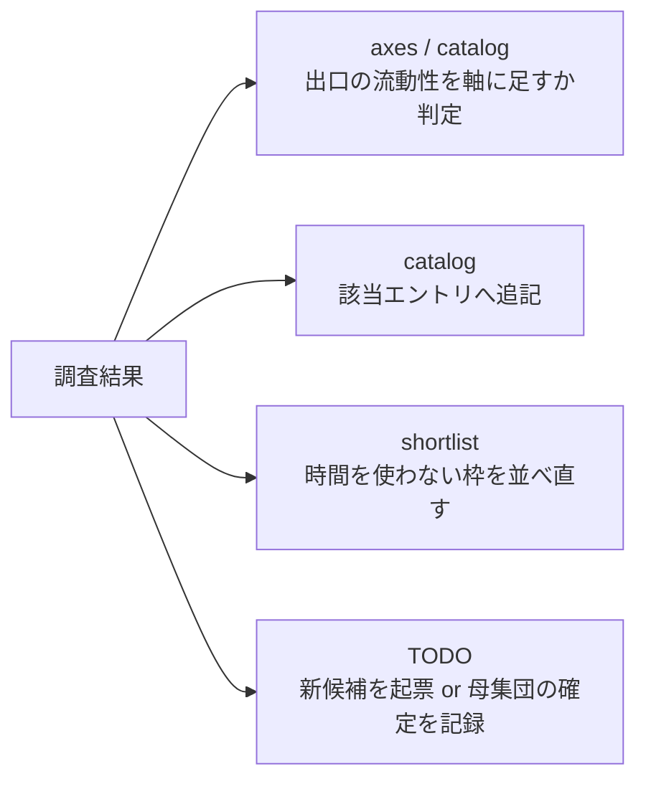

# オンラインで売買が完結する資産を洗い出す

横断調査プラン。**実行はしない**（口座開設・入金・売買・登録を行わず、一次情報と試算で母集団と採否を判定する）。

## 目的・背景

TODO の「株式のようにオンラインで売買が完結できるものを調べる」を起票元とする。

確定セグメント（資金 大 1,000 万円〜 × 週 5〜15 時間 × 回収 6 ヶ月〜1 年）で
現在残っている「時間を使わない枠」は **E1 上場株・ETF / E2 債券 / E8 譲渡益** の 3 件だけで、
これらはいずれも **売買がオンラインで完結する**という共通の性質を持つ。
一方この性質は [axes.md](../../specs/income-taxonomy/axes.md) の 3 軸（価値の源泉・関与度・当事者構成）に入っておらず、
[catalog.md](../../specs/income-taxonomy/catalog.md) の属性列にも無い。
つまり **3 件は「同じ枠の代表」なのか「たまたま残った 3 件」なのかが体系から判定できない**。

この調査は個別手法の採否ではなく、**先に母集団を確定させる**ことを目的とする。
E1・E2・E8 を個別に分析する前にこれをやる理由は、同じ枠に E1 より条件の良い候補があった場合、
E1 の分析結果だけでは気づけないため。

この図の主張: 「株式のように」の本質は入口ではなく**出口**にある。オンラインで買えるものは多いが、いつでも売れるものは少ない。

**回収 6 ヶ月〜1 年という条件は、出口が常設でなければそもそも計算できない。**
これが「株式のように」を軸に置く理由であり、この調査の主題になる。

## 先に潰す論点

| 論点 | 内容 | どの Phase で見るか |
| --- | --- | --- |
| 定義 | 「オンラインで完結」を入口だけで判定すると、貸付型 CF や未公開株まで入って枠が壊れる | Phase 1 |
| 母集団 | catalog 64 件の中だけを見ると、体系化（2026-08-25）以降に増えた経路（セキュリティトークン等）を取りこぼす | Phase 2 |
| 手取り | 表面利回りで比べると、売買手数料・信託報酬・為替・課税で順位が入れ替わる | Phase 3・4 |
| 関与度 | 売買がオンラインで完結することは L3 を意味しない。判断を頻繁に求められる資産は L1 に落ちる | Phase 1・4 |
| ⚠ 規制 | 無登録業者・賭博罪・資金決済法に触れる経路が混ざる。**入口の広さは合法性を意味しない** | Phase 3 |

## ⚠ 先に指摘しておく規制上の前提

CLAUDE.md の方針に従い、着手前に明示する。

- **本調査は銘柄・商品の推奨を行わない。** 自分の条件で成立するかの分析にとどめる（⚠ 金融商品取引法の投資助言・代理業）
- **⚠ 無登録の海外業者**（海外 FX・一部の暗号資産取引所・海外証券）は、日本居住者への勧誘が金商法違反にあたる場合がある。候補に入れる場合は登録状況を一次情報で確認する
- **⚠ 予測市場**（Polymarket・Kalshi 等）は「オンラインで売買が完結する」形をしているが、日本では賭博罪に触れうる。**Phase 2 で対象外として明記し、理由を残す**
- **⚠ ゲームアイテム・アカウントの売買**は各サービスの利用規約で禁止されていることが多い。同じく対象外候補として扱う
- **⚠ 暗号資産**は資金決済法の枠組みと税務（雑所得・総合課税）が株式と大きく異なる。利回りではなく**手取り**で比較しないと E1 と並べられない
- 物理を伴う中古品売買は ⚠ 古物商許可が要るが、本調査の対象（デジタル・証券・権利）では原則不要。**不要である根拠まで確認する**

## 判定条件

この調査の完了条件は「新候補が見つかったか」ではなく、以下がすべて埋まること。

- [ ] 「オンラインで売買が完結する」の定義が 4 ゲートで書かれ、E1・E2・E8 がそれを通ることを確認できている
- [ ] 母集団が catalog 由来と体系外由来の両方から作られ、対象外にしたものは理由つきで残っている
- [ ] 残った候補それぞれについて、入口・出口・手数料・最低単位・課税・⚠ 規制が【公表値】（出典 URL・取得日つき）で埋まっている
- [ ] 各候補が確定セグメントで **E1・E2・E8 より上に来るか** を手取りベースで比較し、採否を書いている

新候補を「着手順に入れる」条件は Phase 4 の 3 条件（手取り・出口・維持工数）をすべて満たすこと。1 つでも外れたら理由を残して打ち切る。

## Phase 1: 定義と判定ゲート

「オンラインで完結」を 4 つのゲートで定義する。ここを曖昧にすると母集団が発散する。

- [ ] ゲート 1（入口）: 対面・実地確認・郵送の原本なしで取得できるか。**口座開設時の eKYC は入口に含める**（一度きりのため）
- [ ] ゲート 2（出口）: **常設の買い手がいるか**。板があるか、運営が常時買い取るか、二次流通市場が実在するか。「売れることがある」は不可
- [ ] ゲート 3（維持）: 保有中の作業が週 5 時間未満に収まるか。監視・判断を継続的に求められる資産は L1 と判定して時間枠へ回す
- [ ] ゲート 4（受取）: 日本居住者が本人確認を通せて、円で受け取れるか。**D7 で ElevenLabs の対応国が論点になったのと同じ確認**（[d7-content-licensing.md](../../specs/experiments/d7-content-licensing.md)）
- [ ] 4 ゲートを E1・E2・E8 に適用し、既知の 3 件が通ることを確認する（通らないなら定義が間違っている）

この図の主張: 4 ゲートは順に効く。出口（ゲート 2）で落ちるものが最も多い、というのが検証したい仮説。

## Phase 2: 母集団を作る

catalog の中だけを見ない。**体系化は 2026-08-25 時点の知識で作っており、それ以降に増えた経路が入っていない**可能性がある。

- [ ] catalog 64 件から、源泉 **5 資本 / 9 資源 / 4 権利 / 6 リスク引受**のエントリを機械的に抜き出し、4 ゲートを当てる
  - 既知の通過候補: E1 上場株・ETF、E2 債券（債券 ETF と個人向け国債で出口が違う点に注意）、E8 譲渡益
  - 出口で落ちる見込み: E3 貸付・ソーシャルレンディング、E5 未公開株、I6 ドメイン、D6 権利の買取
  - 維持で落ちる見込み: F2 オプション売り、F3 裁定取引（L3 表記だが判断の頻度を確認する）
  - 課税・規制で要注意: E4 暗号資産
- [ ] 体系外の候補を洗い出して追加する。最低限あたる先:
  - REIT・インフラファンド（上場しており E1 と同型か、別枠かを判定する）
  - 金・コモディティの ETF とオンライン地金取引（売却経路がオンラインで閉じるか）
  - セキュリティトークン（ST）と国内の二次流通市場（**実際に売買が成立しているかを板の実績で見る**。制度の存在と流動性は別）
  - 貸株サービス（保有株を貸して金利を得る。catalog に該当エントリが無ければ新規候補として起票する）
  - オンラインの事業・サイト売買（Flippa・Acquire 等。E6 との関係とデューデリジェンスの重さを見る）
  - 上記以外に「入口も出口もオンラインで閉じる」ものが無いかを一次情報の範囲で探す
- [ ] 対象外にしたもの（予測市場・ゲームアイテム・無登録の海外業者）を理由つきで一覧に残す
- [ ] 母集団の件数と内訳を確定させる

この図の主張: 母集団は 2 系統から作る。片方だけでは体系の穴か、体系外の思いつきのどちらかに偏る。

## Phase 3: 一次情報で埋める（⚠ ここに規制と課税が集中する）

残った候補ごとに、以下を【公表値】（出典 URL・取得日つき）で埋める。取れないものは【推測】として明示する。

| 項目 | 内容 |
| --- | --- |
| 入口 | 取扱業者、最低購入単位、口座開設の要件（居住者・年齢・資産要件） |
| 出口 | 取引時間、板の有無、直近の出来高・約定実績、売却から着金までの日数 |
| コスト | 売買手数料、スプレッド、保有中の費用（信託報酬・保管料・更新料）、出金・為替コスト |
| 収益 | 分配・利子・値上がりのどれで発生するか。【公表値】の利回りと、その算定期間 |
| 課税 | 申告分離 20.315% か総合課税か。損益通算・繰越控除の可否、外国税額控除 |
| ⚠ 規制 | 取扱業者の登録状況（金商法・資金決済法）、個人が参加できるかの要件 |

- [ ] 上記 6 項目を候補ごとに埋める
- [ ] **出口の流動性を数字で押さえる**。「売れる仕組みがある」ではなく、直近に実際に売買が成立しているかを確認する（I7 の教訓: 実例ゼロなら入口が無いことを疑う）
- [ ] 課税だけは候補間で比較可能な形（手取り率）に揃える。⚠ 暗号資産の総合課税と株式の申告分離を同じ表に並べない

この図の主張: 表面利回りではなく、この 4 段すべてを引いた**手取り**で比べる。桁が変わるのは最後の課税段。

## Phase 4: 確定セグメントで判定する

- [ ] 投入額を揃えて（1,000 万円を基準とする）、候補ごとの年間手取りを【推測】で試算する。前提（利回り・保有期間・税区分）を明記する
- [ ] E1・E2・E8 と同じ表に並べ、順位をつける
- [ ] 各候補に 3 条件を当て、着手順に入れるかを判定する
- [ ] 判定の結果、E1・E2・E8 の着手順が変わるならその理由を書く

この図の主張: 新候補が既存 3 件を上回るには 3 条件すべてが要る。1 つでも欠ければ打ち切る。

## Phase 5: 体系へ反映する

- [ ] **軸を足すかを判定する**。「出口の流動性」は現状どの軸にも無い。属性として catalog の列に足すか、axes に第 4 の観点として書くかを決める（[TODO の体系の保守](../../../TODO.md) の「作る側 / 在庫を持つ側」の軸と同時に扱う）
- [ ] catalog の該当エントリへ、確認した【公表値】と出典・取得日を追記する
- [ ] shortlist の「時間を使わない枠」を、この調査の結果で並べ直す
- [ ] 新候補が出た場合は TODO に個別タスクとして起票する。出なかった場合は「E1・E2・E8 が母集団の全部だった」ことを結論として書く（**これも成果物**）

この図の主張: 反映先は 4 つ。新候補が出なくても、母集団が確定した事実は体系側に残す。

## 成果物と影響範囲

| ファイル | 変更内容 |
| --- | --- |
| `docs/specs/online-tradable-assets.md` | **新規**。調査結果・試算・判定の記録。横断調査のため手法 ID を接頭辞に付けない |
| `docs/specs/income-taxonomy/catalog.md` | 該当エントリへの追記、必要なら新規エントリ（貸株・ST 等）の追加 |
| `docs/specs/income-taxonomy/shortlist.md` | 時間を使わない枠の並べ直し |
| `docs/specs/income-taxonomy/axes.md` | 「出口の流動性」を軸・属性として足す場合のみ |
| `docs/specs/overview.md` | ファイル早見表と §6 現在地の更新 |
| `TODO.md` / `DONE.md` | Phase の進捗と、新候補が出た場合の起票 |

## 検証方針

- 数値には **【公表値】/【推測】** を必ず付ける。【公表値】は出典 URL と取得日を併記する（[overview.md §5](../../specs/overview.md)）
- 記号は overview §5 の定義に揃える。d7 のような本文書き分けはしない（TODO の「数値の根拠記号を統一する」に合わせる）
- 利回り・手数料は**同じ算定期間**に揃えてから比較する。揃えられないものは揃えられないと書く
- 出口の流動性は「制度の存在」ではなく「直近の約定実績」で判定する
- 判定できなかった項目は空欄にせず「不明」と書き、Phase 4 では幅で試算する
