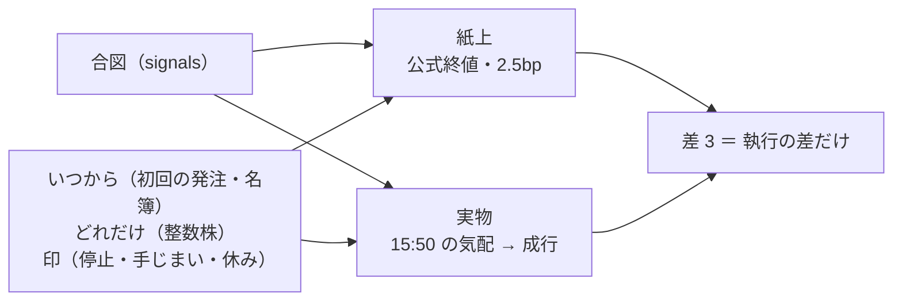
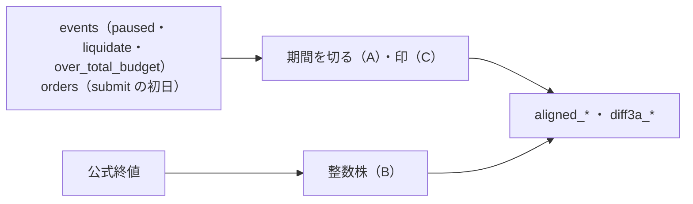

# 紙上の対照（`paper.py`）を実物にそろえる（2026-10-08 利用者決定「全部はい」＝ P1〜P3 とも推す案）

## 0. 目的・背景

いまの 3 人の 8 営業日の判定（[live-trading.md §2-1](../specs/experiments/live-trading.md)）で、差 3（紙上 − 実物）が |日次| 平均 26bp と線（5bp/日）を越えた。中身は執行の差ではなく、紙上と実物で「いつから・どれだけ持つか」が違うこと【実測 ＋ 推測】:

| # | ずれ | いまの紙上 | 実物 | 確かめた度合い |
| ---: | --- | --- | --- | --- |
| 1 | 始めた日 | 合図が記録に出た最初の日（T1・T3 は 9/21 ＝ 本番の dry-run の日） | 最初に発注した日（9/23） | 【実測】`daily.csv` の 9/21 に `paper_trades` 5 |
| 2 | 買う量 | 予算 ÷ 銘柄数を端数のまま全部（等加重） | 整数株（予算の約 82% だけ買えた） | 【実測】§1 の 9/23。日ごとの寄与は分解していない【推測】 |
| 3 | 印と名簿（10/5〜） | 知らない（停止の日も売買・手じまいの日も持ち続ける） | 停止 ＝ 売買しない・手じまい ＝ 全部売る・名簿の外 ＝ 動かない | 【コードを読んだ】`paper.py` は `paused` ／ `liquidate_flag` ／ `over_total_budget` の事象を読まない |
| 4 | 人の区切り | 同じ識別名は 1 本の線（T1 は 9/21 から続く） | T1 は 10/7 に全部売り、10/8 から予算 $600 で始め直し | 【コードを読んだ】 |

⚠ 3 と 4 は新しい 3 人（10/8 から）で必ず起きる（T1 の続き・T4 ／ T6 の 10/5〜07 の停止）＝ **直さないと、新しい 3 人の差 3 も初日から執行の差を測れない**。

この図の主張: 紙上を「実物と同じ日に・同じ量だけ・同じ印で」動かせば、差 3 に残るのは執行（気配 → 約定 → 終値）だけになる。

## 1. 案

| # | 直すこと | 中身 |
| ---: | --- | --- |
| A | 区切り | 人ごとに「期間」を切る: 実物が最初に発注した日（`orders.jsonl` に `submit` の行がある日）から。手じまいが済んだ日（`liquidate_complete`）で閉じ、次に発注した日から新しい期間（紙上は現金から） |
| B | 量 | 紙上も整数株: その日の公式終値で `floor(予算 ÷ 銘柄数 ÷ 終値)` 株（実物の `plan.size_intents` と同じ丸め。⚠ 実物は 15:50 の気配で数える ＝ 株数がまれに 1 ずれる） |
| C | 印 | 実物の事象をそのまま写す: `paused` ／ `over_total_budget` の日は紙上も売買しない・`liquidate_flag` の日は紙上も終値で全部売る |
| D | 列 | 今までの列（バックテストと同じ形 ＝ 等加重・端数）は残し、そろえた紙上を **新しい列**（`aligned_*`・差 3 は `diff3a_*`）で足す。⚠ 管理画面は新しい列があればそちらを差 3 に使う |

⚠ 変えないもの: 紙上の状態機械（`simulate.py` と同じ）・片道 2.5bp・読むだけ（発注しない・台帳を書かない）。

## 2. Phase と Step

### Phase 0: 決めごと（⚠ 利用者）

| # | 決めること | 推す案 |
| --- | --- | --- |
| P1 | そろえるか | そろえる（新しい 3 人の判定に差 3 を使うなら必須） |
| P2 | 今までの列を残すか | 残す（D。バックテストとの比較に要る） |
| P3 | いまの 3 人（9/23〜10/2）にもかけ直すか | かけ直して §2-1 に 1 行足す（判定は変えない ＝ 書いた後の数字で線を動かさない） |

### Phase 1: `paper.py`（Claude）

この図の主張: 入力は今と同じ記録だけ。増えるのは事象の読み方と列。

- A〜C・D の列・`tests/test_paper.py` に 4 本（期間の切れ目・整数株・停止の日・手じまいの日）。今までの列が 1 文字も変わらないこと（今の `daily.csv` と突き合わせ）

### Phase 2: 管理画面と記録（Claude）

- 管理画面の差 3 を新しい列に（無ければ今までどおり）・`dashboard.md` §13・`live-trading.md` §0-10
- P3 ならいまの 3 人にかけ直して §2-1 に 1 行

## 3. 影響範囲

- `experiments/live-trading/paper.py`（読むだけの後処理。執行器は変えない ＝ 黄金の集計値は変わらない）
- `dashboard/app/live.py`（`daily.csv` の列を読むところ）
- 本番: 13500t の朝の `--prepare` が作り直す ＝ 「デプロイ」が要る

## 4. テスト方針

- `tests/test_paper.py`: 今までの 5 本はそのまま通る ＋ 新しい 4 本
- 13500t の記録の写しで、新しい列の T1・T3 の 8 営業日を手で検算（1 日分）

## 5. 作業量・費用【推測】

- Claude の作業: Phase 1 が半日・Phase 2 が 2〜3 時間。費用 0
