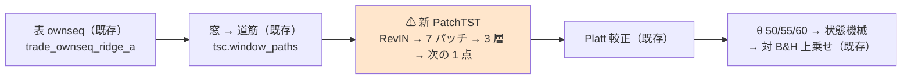
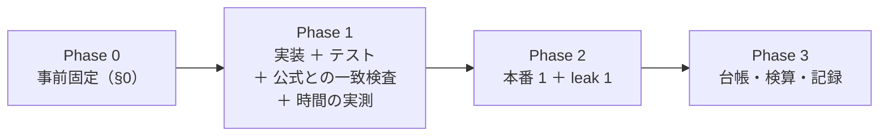

# 系列モデル 1 本（PatchTST）を閾値売買で回す

親タスク: 「DeepLearning と進化的探索（遺伝的アルゴリズム）を使った検証をかなり増やす」の子「DL / 進化的探索の手法を増やして検証を回す」
利用者の指示（2026-09-15）: **TODO から次の作業を選んで → おすすめを始めて**（Claude が候補 3「PatchTST 系を 1 本」を推した）
候補の出所: [ts-trend-ai-survey.md §7](../../specs/experiments/ts-trend-ai-survey.md) の優先 3（「§9-2 の未検証枠。期待は低い。実装 1 日・実行 数時間（GPU）」）
規約: [rules.md 13 章](../../specs/experiments/feature-discovery/rules.md)（閾値つき売買）／ [15-1](../../specs/experiments/feature-discovery/rules.md)（検知器の契約）／ [14-10](../../specs/experiments/feature-discovery/rules.md)（空白は積極的に埋める）
台帳: [ledger.md](../../specs/experiments/feature-discovery/ledger.md)（着手時点 **n_trials 562**【実測 2026-09-15】）
直前の同型タスク: [tsc-threshold.md](../../specs/experiments/tsc-threshold.md)（時系列分類器 3 本。⚠ **表・入力の窓・物差しをそのまま借りる**）

---

## 0. 目的と背景

⚠ **埋めるのは「系列モデル」の空白である。** [feature-discovery §9-2](../../specs/experiments/feature-discovery.md) で見送り、[ts-trend-ai-survey.md §3](../../specs/experiments/ts-trend-ai-survey.md) が「厳密には未検証の 1 枠」と書いた。
⚠ **2026-09-15 の時系列分類器 3 本は「固定の変換 → Ridge」**で、⚠ **窓から表現そのものを学習するモデルはまだ 1 本も回していない。**

| 手法 | 中身 | 出典 |
| --- | --- | --- |
| **PatchTST** | 系列を長さ 16・ずらし 8 のパッチに切り、パッチを 1 トークンとして Transformer に入れる。系列ごとに独立に扱い（channel-independence）、入力を窓ごとに正規化して出力で戻す（RevIN） | [arXiv:2211.14730](https://arxiv.org/abs/2211.14730) §3.1・付録 A.1.4（取得 2026-09-15）／ 公式実装 [yuqinie98/PatchTST](https://github.com/yuqinie98/PatchTST) commit `204c21e`（取得 2026-09-15） |

⚠ **回す理由は「効くはず」ではない。** 調査の判定は ⚠ **期待「低い」**（金融の一次評価は汎用の新しい構造に否定的。DLinear が「線形で並ぶ」と示した批判論文もある。[ts-trend-ai-survey.md §3](../../specs/experiments/ts-trend-ai-survey.md)）。
⚠ **「未実施」を「効かなかった」と区別するために回す**（[14-10 規約 4](../../specs/experiments/feature-discovery/rules.md)）。⚠ **良い数字が出たらまず配線を疑う**（11 章 規約 7）。

### 0-1. ⚠ 回す前に固定すること（結果を見てから決めない）

⚠ **本節は Phase 1 に入る前に書き終える。** ⚠ **水準は公式実装の設定から機械的に引き、振らない**（13-6 の 3）。

| 固定するもの | 値 | ⚠ 理由 |
| --- | --- | --- |
| 手法 | **PatchTST 1 本**（検知器 `S1 PatchTST（60日窓）` ＋ モデル `PatchTST`） | 利用者に示した候補どおり「1 本だけ」。⚠ **iTransformer は採らない**（§0-2 の 1） |
| 入力 | ⚠ **時系列分類器と同じ窓**: `tsc.window_paths`（過去 60 営業日の累積の道筋。古い → 新しい。最後の点は 0） | ⚠ **入力を揃えないと、時系列分類器 3 本との差を「モデルの差」として読めない** |
| 予測の対象 | ⚠ **道筋の次の 1 点 ＝ `y`**（1 日先の対数リターン。予測の長さ 1） | 道筋の最後は log c[i] − log c[i] ＝ 0 なので、⚠ **次の点はちょうど log c[i+1] − log c[i] ＝ `y`**。⚠ **論文と同じ「系列の続きを予測する」形のまま、own 表のモデルの軸と同じ対象になる** |
| 構造 | ⚠ **公式実装の既定のまま**: RevIN あり（affine なし・平均を引く）／ パッチ長 16・ずらし 8・末尾を最後の値で 8 点埋める（→ **7 パッチ**）／ 学習する位置埋め込み（`zeros`・一様 ±0.02）／ 残差注意（`res_attention`）／ 後置の BatchNorm ／ GELU ／ flatten の頭（ドロップアウト 0） | 公式 `PatchTST_backbone.py` と `models/PatchTST.py` の既定値。⚠ **`decomposition`・`individual` は 0（既定）** |
| ⚠ **大きさ** | ⚠ **縮小側**: 層 3 ・ 頭 4 ・ D 16 ・ F 128 ・ ドロップアウト 0.3 | ⚠ **§0-2 の 2 の規則で決めた**（学習に使う窓の本数で、論文が縮小側を使ったデータに近いか既定側に近いか） |
| 学習 | ⚠ **縮小側のスクリプト（`etth1.sh`・`etth2.sh`）と同じ**: Adam ・ 学習率 1e-4 ・ MSE ・ batch 128（端数は捨てる）・ **100 epoch** ・ 学習率の調整 `type3`（3 epoch 目以降 ×0.9/epoch）・ ⚠ **打ち切りの我慢 100（＝打ち切らない）・検証の損失が最小の epoch の重みを使う** | `run_longExp.py` の既定値 ＋ スクリプトの指定。⚠ **ETTm1 以上は `TST` 調整・我慢 20 だが、大きさと同じ規則で縮小側に揃える** |
| 検証（早期打ち切り・重みの選択） | ⚠ **訓練分割の尻 10%（`tail_holdout`・隙間つき）** | ⚠ **論文は時間順の別区間（ETT は 12/4/4 か月）だが、ここでは検証 fold に触れられない**（3 章 B）。MLP（`deep.py`）と同じ切り方 |
| 尺度 | ⚠ **窓と `y` を訓練の `y` の標準偏差で割って学習し、予測で掛け戻す** | 公式のデータ読み込みは訓練区間で標準化してから入れる（`data_loader.py` の `scaler.fit`）。⚠ **その役割を 1 つの尺度で果たす**（道筋と `y` は同じ系列の値なので同じ尺度で割る）。⚠ **RevIN の eps 1e-5 が生の尺度（日次 σ ≈ 0.017）では効いてしまう**のを避ける意味もある |
| 頭（買い%） | PatchTST の予測 → **Platt 較正**（`calibrate.fit`・訓練の尻の holdout）→ 買い% | ⚠ **13-2: 分類器の確率には替えない。** ⚠ **Ridge は挟まない**（PatchTST は頭まで学習するモデルなので、Ridge を挟むと別のモデルになる） |
| 表 | ⚠ **`features_from = "trade_ownseq_ridge_a"`**（作り直さない。本番・leak とも既にある） | ⚠ **時系列分類器と 1 行も違わない表で回す**（13-8） |
| 形式 | ⚠ **(A) 共通だけ** | (B) は 63 銘柄 × 5 fold × 4 回の学習になる。⚠ **足すなら別の試行**（＋3） |
| θ ／ 種 ／ embargo | **50 / 55 / 60** ／ **0** ／ **0 本** | 13-3・13-6 の 4 |
| デバイス | ⚠ **`AIL_TORCH_DEVICE` を明示して 1 実行の中で混ぜない**（既定 auto は呼び出しごとに判定する）。⚠ **CPU か GPU かは Phase 1 の時間の実測で決め、本番の前に記録に書く** | デバイスが変わると最終ビットが変わる。⚠ **本番と leak は同じデバイス** |
| 数え方 | **n_trials 562 → 565**（＋3 ＝ 1 手法 × 3 θ）【推測】 | 13-9 |
| 判定 | **対 B&H 上乗せ**の符号と t（13-7） | |
| ⚠ **「効く」と言う条件** | ⚠ **13-7 の「採る」**（上乗せ > 0 かつ fold 5/5）に加えて、⚠ **own 表の Ridge「全部使う」（`trade_own_ridge_a`）を 3 θ すべてで上回る** | ⚠ **時系列分類器と同じ条件**（E8「複雑なモデルは Ridge を超えないと採らない」）。⚠ **参考の比較**として own 表 MLP (A)・時系列分類器 3 本も並べる（採否には使わない） |
| 門（14-5） | ⚠ **記録するだけ**（`cli/run.py` の既定） | 14-10 規約 2 |

### 0-2. ⚠ 判断が要った点

| # | 判断 | 理由 |
| ---: | --- | --- |
| 1 | ⚠ **PatchTST を選び、iTransformer は採らない** | iTransformer は「変数 1 つを 1 トークン」にして変数間に注意を掛ける構造（[arXiv:2310.06625](https://arxiv.org/abs/2310.06625)）。⚠ **入力は 1 変数（道筋 1 本）なので、トークンが 1 つになり注意が働かない**（実質 MLP）。⚠ **1 変数で構造が生きるのは PatchTST** |
| 2 | ⚠ **大きさは縮小側（H 4・D 16・F 128・ドロップアウト 0.3）** | 論文は既定（H 16・D 128・F 256・0.2）を使い、⚠ **小さいデータ（ILI・ETTh1・ETTh2）では過学習を避けるため縮小した**（付録 A.1.4【公表値】）。規則: ⚠ **学習に使う窓の本数（系列数 × 時点）を、縮小側で最大の ETTh（8,640 × 7 ≈ 6.0 万）と既定側で最小の ETTm1（34,560 × 7 ≈ 24.2 万）の対数の中点（≈ 12.1 万）と比べる**【公表値から計算】。⚠ **こちらの訓練は 5 fold で 22,461〜113,219 行**【実測 2026-09-15】で、⚠ **全 fold が中点より下 → 縮小側**。⚠ **結果を見る前に規則で決めた** |
| 3 | ⚠ **入力は時系列分類器と同じ道筋。RevIN は論文どおり入れる** | 時系列分類器では「窓ごとの z 正規化はしない（振れ幅の情報を消さない）」と決めた。⚠ **RevIN も窓ごとに平均と標準偏差で割るが、出力に標準偏差を掛け戻す**ので、⚠ **振れ幅は予測の大きさとして残る**。⚠ **RevIN を外すと論文の構造から外れる**（外すなら別の試行） |
| 4 | ⚠ **公式実装を移植し、依存は足さない**（Hugging Face `transformers`・`neuralforecast` は入れない） | ⚠ **torch 2.14 だけで 150 行ほどで書ける。** 大きな依存を足すと numpy・torch の版が動く恐れがある（時系列分類器の aeon で踏みかけた）。⚠ **移植の正しさは「公式のコードに同じ重みを入れて同じ出力が出るか」で確かめる**（§4 の 3） |
| 5 | ⚠ **末尾の埋め方は `ReplicationPad1d` ではなく「最後の値を 8 回つなぐ」で書く** | 数学的に同じ。⚠ **`ReplicationPad1d` の CUDA の逆伝播は非決定的**（PyTorch の文書が非決定的な演算として挙げる）。⚠ **一致検査で公式の出力と同じになることを確かめる** |
| 6 | ⚠ **leak 対照の `LEAK_` 列は、RevIN で戻した後の予測に「重み 0 で始まる線形の項」として足す** | ⚠ **PatchTST は系列ごとに独立なので、`LEAK_` を 2 本目の系列として入れても 1 本目の予測に効かない**（跳ねない）。⚠ **RevIN の内側に足すと、窓の平均が予測を支配して `LEAK_` の符号が埋もれる**。⚠ **本番の表には `LEAK_` が無いので、この項は作られない**（本番は論文の構造そのまま）。時系列分類器で「変換の出力の横に足した」のと同じ役割 |
| 7 | ⚠ **学習の細部で公式と違うもの**: (a) 検証は訓練の尻 10%（上の表）／ (b) 検証の損失はバッチ平均の平均ではなく全行の平均 ／ (c) 学習の並びは種 0 の `torch.Generator` で引く | (a) は 3 章 B。(b)(c) は最終の重みの選び方にしか効かず、⚠ **構造と水準は変えない** |
| 8 | ⚠ **`PatchTST` はモデルとして登録し、窓の配列でしか呼べないようにする** | モデル名は台帳の鍵（10-1）なので config の `model` に出したい。⚠ **だが選別 × モデルの経路（標準化した 35 列）で呼ばれると、35 列を系列と見なして黙って動いてしまう** → ⚠ **検知器が ctx に窓の長さを入れたときだけ動き、無ければ止める** |
| 9 | 実験名は `trade_ownseq_patchtst_a` | [rules.md 10-1](../../specs/experiments/feature-discovery/rules.md) の形。⚠ **モデル略の表に `patchtst` を 1 行足す**（規約の変更ではない） |

---

## 1. 対応方針

> この図の主張: ⚠ **新しく作るのは「PatchTST のモデル」と「それを呼ぶ検知器」だけで、表・窓・較正から先は時系列分類器の経路をそのまま使う。**



| 部品 | 書き方 |
| --- | --- |
| `ail/models/patchtst.py`（新規） | 公式の構造を移植した `nn.Module` ＋ 学習ループ ＋ `@register("model", "PatchTST")`。⚠ **ctx に `seq_window` が無ければ止める**（§0-2 の 8）。⚠ **記録に残す**: 最良 epoch・検証 MSE（最良・0 と予測した場合）・パラメータ数・デバイス・学習の行数 |
| `ail/detectors/seqmodel.py`（新規） | `S1 PatchTST（60日窓）`: `tsc.window_paths` → (行, 60) ＋ `LEAK_` 列 → `calibrate.fit` → モデル → 買い%。⚠ **ctx のモデルが `PatchTST` でなければ止める**（config の食い違いを黙って通さない） |
| `ail/bootstrap.py` | import を 2 行 |
| `config/experiment/trade_ownseq_patchtst_a.toml`（新規） | `trade_ownseq_ridge_a` と `name`・`features_from`・`detectors`・`model` 以外 1 key も違わない |
| `tests/test_patchtst.py`（新規） | §4 |

---

## 2. 影響範囲

| 触るもの | 中身 |
| --- | --- |
| `experiments/feature-discovery/ail/models/patchtst.py` | **新規** |
| `experiments/feature-discovery/ail/detectors/seqmodel.py` | **新規** |
| `experiments/feature-discovery/ail/bootstrap.py` | import 2 行 |
| `experiments/feature-discovery/config/experiment/trade_ownseq_patchtst_a.toml` | **新規** |
| `experiments/feature-discovery/tests/test_patchtst.py` | **新規** |
| `docs/specs/experiments/feature-discovery/rules.md` | 10-1 のモデル略に `patchtst` を 1 行 |
| `docs/specs/experiments/patchtst-threshold.md` | **新規**。記録 |
| `docs/specs/experiments/feature-discovery/ledger.md` | ⚠ **生成物。`cli.report --catalog` で吐き直す** |

| ⚠ 触らないもの | 理由 |
| --- | --- |
| `cli/run.py` ／ `ail/validation/*` ／ `ail/models/` の既存ファイル ／ 既存の検知器（`tsc.py` は import するだけ） | ⚠ **既存の全実行の経路**。変えると再現が崩れる |
| `seq` 層・`own` 層 ／ 表（`data/features/trade_ownseq_ridge_a*`） | ⚠ **読むだけ** |
| `requirements.txt` | ⚠ **依存は足さない**（§0-2 の 4） |
| 既存の `runs/`・台帳の既存行 | 14-10 規約 5 |

---

## 3. Phase 構成



### Phase 1: 実装 → 一致検査 → 時間の実測

1. モデル・検知器・config・テストを書き、`pytest` が全件 pass することを確かめる
2. ⚠ **公式のコード（commit `204c21e` の `layers/`）を使い捨ての場所に置き、同じ重みを入れて出力が一致するか**を確かめる（§4 の 3）。⚠ **一致しなければ本番に進まない**
3. ⚠ **fold 5 と同じ大きさ（約 11.3 万行）で 1 epoch の時間を CPU と GPU で測り**、本番のデバイスを決める（§0-1）。⚠ **見積り（§5）が 1 本 6 時間を超えるなら、止めて利用者に諮る**（水準を下げて回すのは別の試行）

#### Phase 1 の結果（⚠ **本番の前に書いた**。2026-09-15）

| 項目 | ⚠ 実測 |
| --- | --- |
| テスト | ✅ **313 件 pass**（着手時点 304 ＋ 新規 9） |
| ⚠ **公式との一致**（§4 の 3） | ✅ **CPU・GPU とも完全一致**: パラメータ数 16,676 ／ `state_dict` の鍵と形 ／ 同じ種の初期値 ／ 推論の出力 ／ 学習モード（ドロップアウト 0.3・同じ種）の出力と勾配 ／ ⚠ **Adam 200 ステップ後の重み（BatchNorm の統計を含む）と出力まで最大差 0**。公式の `layers/` 3 ファイルの sha256 は記録に残す |
| ⚠ **GPU の決定性**（§6 の 4） | ✅ **別プロセスで 2 回学習して予測がビット一致**（2 万行・5 epoch） |
| 1 ステップの時間（fold 5 と同じ 113,219 行・2 epoch） | ⚠ **GPU 7.12ms ／ CPU 12.66ms**（検証の損失の計算を含む） |
| ⚠ **本番のデバイス** | ⚠ **`AIL_TORCH_DEVICE=cuda`**（本番・leak とも）。⚠ **見積りは約 86 万ステップ × 7.1ms ≈ 1.7 時間/本**【実測から計算】で、§3 の止める線（6 時間）の内側 |
| 並べ方 | ⚠ **本番と leak を同時に走らせる**（VRAM は 1 本 1GB 未満・CPU は 32 コア。⚠ **学習はビット単位で決定的なので、並べても数字は変わらない**） |

### Phase 2: 本番 1 本 ＋ leak 対照 1 本

```bash
cd experiments/feature-discovery
AIL_TORCH_DEVICE=<Phase 1 で決めたもの> ./.venv/bin/python -m cli.run --experiment trade_ownseq_patchtst_a
AIL_TORCH_DEVICE=<同じ> ./.venv/bin/python -m cli.run --experiment trade_ownseq_patchtst_a --leak
```

⚠ **表は作らない**（`features_from`）。⚠ **leak 対照は毎回通す**（13-10）。⚠ **走行中はコミットしない**。

### Phase 3: 台帳の吐き直し・検算・記録

`cli.report --catalog` → 検算（§4）→ `docs/specs/experiments/patchtst-threshold.md` → TODO / DONE → プランを archive へ。

---

## 4. テスト方針・検算

| # | 検算 | ⚠ 落ちたら |
| ---: | --- | --- |
| 1 | `pytest -q tests` が全件 pass（着手時点の件数 ＋ 新規） | 配線が壊れている |
| 2 | ⚠ **形**: 長さ 60・パッチ 16/8・末尾埋めで **7 パッチ**、出力は行数ぶん・有限 | 移植の取り違え |
| 3 | ⚠ **公式との一致**: 公式の `PatchTST_backbone`（縮小側の設定）と移植に同じ重みを入れ、同じ入力で ⚠ **学習モード（ドロップアウト 0 にして）と推論モードの両方で出力が一致**（許容差 1e-6）、⚠ **パラメータ数も一致** | ⚠ **本番に進まない。** 移植を直す |
| 4 | ⚠ **決定性**: CPU で同じ種・同じ入力なら 2 回の学習の予測が 1 ビットも違わない | 再現の前提が崩れる |
| 5 | ⚠ **呼び方の守り**: ctx に `seq_window` が無い呼び出し（選別 × モデルの経路）は止まる ／ 検知器は ctx のモデルが `PatchTST` でなければ止まる | 黙って別物が回る |
| 6 | ⚠ **検知器の契約**: 買い% が 0〜100・検証の行数ぶん・使う列は窓と `LEAK_` だけ（15-1） | 契約違反 |
| 7 | ⚠ **fit が訓練だけ**: 検証の行を半分にしても、残った行の買い% が変わらない | 先読み |
| 8 | ⚠ **leak の項**: `LEAK_` 列があるときだけ線形の項が作られ、合成データで上乗せが跳ねる（少ない epoch で） | leak 対照が配線の検査にならない |
| 9 | ⚠ **本番の leak 対照の上乗せが跳ねる**（既存は ＋16,108〜25,131bp・t 7.9〜27.0） | ⚠ **本番の数字を読まない** |
| 10 | **n_trials 562 → 565**（＋3） | 数え落とし |
| 11 | `checks.json` の `calibration` が `std` ／ ⚠ **台帳の既存行の数字が 1 つも変わらない** ／ 「検知器」の系統で載る ／ ⚠ **基準線（B&H・直前符号）が `trade_ownseq_ridge_a` と一致** | 表か配線が違う |
| 12 | ⚠ **実行したコードを指せる**（未コミットで回すなら sha256 を記録に残す） | 再現できない |

---

## 5. 費用の見積り【推測】

| 項目 | 見込み | 根拠 |
| --- | --- | --- |
| 実装 ＋ テスト ＋ 一致検査 | 半日〜1 日 | モデル 150 行・検知器 50 行・テスト |
| ⚠ **学習の回数** | ⚠ **1 fold あたり 4 回** | 本番の較正（訓練の頭で学習）＋ 本番の予測 ＋ ⚠ **門が訓練の内側で同じ 2 回をもう 1 度** |
| ⚠ **学習の量** | ⚠ **約 86 万ステップ/実行** | 5 fold の訓練 339,177 行【実測】× 4 回の実効の大きさ（約 3.25 倍。tail_holdout が入れ子で 9 割ずつ削る）× 100 epoch ÷ batch 128【推測】 |
| 本番 1 本 | ⚠ **40 分〜2.5 時間** | ⚠ **1 ステップ 3〜10ms**【推測。パラメータ約 1.7 万・7 トークン × batch 128】。⚠ **Phase 1 で実測して置き換える** |
| leak 対照 | 同程度 | |
| メモリ | ⚠ **数 GB** | 窓は 11.3 万行 × 60 × float32 ＝ 27MB。⚠ **時系列分類器の 1 万列（28.3GB）とは桁が違う** |
| VRAM | 1GB 未満 | ⚠ **いま llama-server が 15.5GB を使い、空きは 8.8GB**【実測 2026-09-15】。止める必要は無い見込み |

⚠ **見積りは過去 6 回連続で過大に外した。** ⚠ **1 本が 6 時間を超えたら止めて、どこが重いかを測ってから続ける。**

---

## 6. ⚠ 先に書く失敗モードと限界

| # | 起こりうること | ⚠ そのときどうするか |
| ---: | --- | --- |
| 1 | ⚠ **何も学ばない**（最良 epoch が 1 桁・検証 MSE が「0 と予測した場合」を下回らない） | ⚠ **想定の範囲**（日次リターンはほぼ雑音）。⚠ **学習率・大きさを振らない。** そのまま記録する |
| 2 | ⚠ **買い% の幅が θ の間隔（5 点）より狭く潰れる** | MLP・LightGBM・時系列分類器で起きた既知の形。⚠ **θ 別の差を「閾値の効き」と読まない** |
| 3 | ⚠ **公式との一致検査が通らない** | ⚠ **本番に進まない。** 移植を直す（§4 の 3） |
| 4 | ⚠ **GPU で同じ種でも最終ビットが揃わない** | ⚠ **1 実行は 1 回きりなので採否には効かない。** 記録に書く。CPU のテストでは決定性を確かめる |
| 5 | ⚠ **leak 対照が跳ねない** | ⚠ **本番の数字を読まない。** leak の項の配線（§0-2 の 6）をまず疑う。⚠ **跳ねないまま「効かなかった」と書かない** |
| 6 | ⚠ **own 表 Ridge に 3 θ で負ける** | ⚠ **想定どおり**（期待「低い」）。⚠ **落とす結果でも記録を残す** |
| 7 | 上乗せが正で 5/5 | ⚠ **まず配線を疑う**（11 章 規約 7）。表の行（検算 11）と窓の向き（`test_tsc`）を先に見直す |
| 8 | ⚠ **時間が見積りを大きく超える** | 6 時間で止めて測る（§5）。⚠ **epoch を減らして回さない**（水準の変更 ＝ 別の試行） |

⚠ **限界（消せないもの）**: (a) 63 銘柄は独立でない（12 章 限界 2）／ (b) 生存バイアス（12 章 限界 1）／
(c) ⚠ **検出限界**（fold 約 340 日 × 5 では上乗せ t は 1 前後まで）／ (d) ⚠ **論文の水準は長期予測（336 点 → 96〜720 点）で決まったもので、60 点 → 1 点の日次リターンに最適とは限らない**（⚠ **最適化しないのが規約**。13-6 の 3）／
(e) ⚠ **移植であって公式のコードそのものではない**（検算 3 で出力の一致は確かめる）。

---

## 7. 完了条件

1. `runs/` に 2 実行（本番・leak）が 1 実行 1 ディレクトリで残っている
2. 台帳が吐き直され、**n_trials 562 → 565**、⚠ **既存行の数字が変わっていない**
3. `docs/specs/experiments/patchtst-threshold.md` に 3 θ の結果・判定・own 表 Ridge との比較（参考に MLP・時系列分類器）が載っている
4. ⚠ **判定が「落とす」でも完了とする**（14-10 規約 5）
