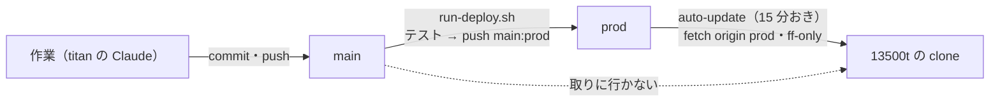

# 13500t の更新を本番用の `prod` ブランチから取る（2 ブランチ運用）

## 1. 目的・背景

2026-09-25 の利用者の決定: **案 A にする。CLAUDE.md を修正し 2 ブランチに**。

いまは `main` への push ＝ 13500t の auto-update（15 分おき）が pull ＝ 本番に反映（K2・[live-trading.md §0-13](../../specs/experiments/live-trading.md)）。
同じ日に分析して分かったこと:

| 問題 | 中身 |
| --- | --- |
| 関門が無い | CI なし。`./run-tests.sh` を流すかは書き手の習慣 |
| 研究の直しが本番の予測に入る | `cli/predict.py` は研究側の `cli.build.assemble`・`cli.run.fold_buy_pct`・`ail/` を読む ＝ Phase 6（〜2026-10-20）の途中で予測が黙って変わりうる。番人の指紋テスト（`test_predict.py`・`test_trading_run.py`）は流したときしか効かない |
| push が多い | 9/18 からの 8 日で 70 コミット【実測】。TODO の直しでも管理画面を起こし直す（9/25 17:15 の `e43fda5` もそう） |
| 見届けが無い | 9/24 07:57 PDT の執行器の直しは同じ日の回で動いた |

## 2. 対応方針

この図の主張: 13500t が見るのは `prod` だけで、`prod` を進めるのは関門を通った後の 1 か所だけ。

| 項目 | 決め |
| --- | --- |
| `main` | ふだんの作業。今までどおり直接コミット・push（⚠ push しても本番は動かない） |
| `prod` | 本番の目印。⚠ **直接コミットしない**・**`main` の過去の点へだけ進める**（fast-forward のみ）＝ 巻き戻しや別の枝は作らない |
| 進める道具 | プロジェクト直下の `run-deploy.sh`（§3） |
| 最初の `prod` | 2026-09-25 時点で 13500t が動かしている `e43fda5`（＝ いまの本番をそのまま名前にする。関門は通していないが、すでに動いているものと同じ） |
| auto-update | `origin/prod` を fetch して `--ff-only`。⚠ clone の HEAD が `origin/prod` の祖先でなければ**何もせず ERROR**（自動で巻き戻さない） |

## 3. `run-deploy.sh`（`prod` を進める）

順に確かめ、1 つでも外れたら止める（`prod` を動かさない）。

1. いまのブランチが `main`・作業ツリーがきれい・`origin/main` と同じ（push 済み）
2. `origin/prod` が `HEAD` の祖先（fast-forward できる）。同じなら「進めるものが無い」で終わる
3. 進める中身を見せる: `prod..main` のコミットと、本番に効く道（`experiments/live-trading/`・`experiments/tastytrade-api-sample/`・`experiments/feature-discovery/{cli,ail,config}/`・`dashboard/app/`・`run-live.sh`・`requirements*.txt`）の変更ファイル
4. 時間帯: ⚠ **15:00〜16:15 ET は拒む**（15:15 に pull されて 15:50 の回で見届けなしに動くのを避ける）
5. 関門: `./run-tests.sh`（既定）＋ 予測の経路の指紋テスト（`experiments/feature-discovery` の `tests/test_predict.py`・`tests/test_trading_run.py`）。⚠ **⏭（依存が無くて飛ばした）も不合格**（Sx360 の軽い venv は LightGBM・aeon が無く落ちる【実測 2026-09-25】＝ 進めるのは依存のそろった titan）
6. `git push origin HEAD:prod`（fast-forward だけ。`--force` を使わない）

`--dry-run` は 1〜5 だけ（push しない）。関門を飛ばす引数は作らない。

2026-09-25 追記（利用者の指示「「デプロイ」この命令で 13500t を更新できるようにして」）:

- **titan 以外で叩くと関門は titan へ**: main が push 済みかを確かめ、`ssh titan` で pull → 自分を `--no-wait` で流す（Sx360 の venv では指紋テストが落ちるため）
- **7. 13500t の反映を待つ**: 13500t に届く機械（Sx360）なら `auto-update.log` の待ち始めた後の行に `done <sha>` が出るまで最長 20 分（ERROR で ❌）。届かない機械（titan）は案内だけ。`--no-wait` で待たない
- CLAUDE.md の Git 運用ルールに「利用者の「デプロイ」＝ 13500t を更新する依頼」と Claude の手順（コミット・push → `run-deploy.sh` → 報告）を書いた

## 4. 影響範囲

| 場所 | 変更 | だれ |
| --- | --- | --- |
| CLAUDE.md | 「Git 運用ルール」を 2 ブランチに・機械の役割の「push ＝ 本番」を「`prod` を進める ＝ 本番」に | titan / Sx360 の Claude |
| `run-deploy.sh`（新規） | §3 | 同上 |
| [live-trading.md §0-13](../../specs/experiments/live-trading.md) | auto-update の行 | 同上 |
| [three-machines.md](../three-machines.md) K2 | 決めの追記 | 同上 |
| [dashboard.md §7-1](../../specs/dashboard.md) | 13500t の管理画面が追うのは `prod` | 同上 |
| g3plus-ops `trade-runner/auto-update.sh`・`docs/workflows/trade-runner.md` | `prod` を取りに行く・祖先の検査 | ⚠ **Sx360 の Claude**（13500t へは scp。⚠ 利用者の了承のあと） |

## 5. Step

| Step | 中身 | 状態 |
| --- | --- | --- |
| 1 | CLAUDE.md の Git 運用ルール | |
| 2 | `run-deploy.sh` と手順 | |
| 3 | `prod` を `e43fda5`（いま 13500t が動かしているもの）で作って push → Step 4 の後に最初のデプロイで main まで進めて通しで確かめる | |
| 4 | g3plus-ops の auto-update を `prod` に・13500t へ送る（売買の時間帯の外・⑦ 9/28 の前に済ませるか後にするかは利用者） | |
| 5 | 仕様（live-trading.md §0-13・three-machines.md K2・dashboard.md §7-1） | |
| 6 | 確かめる: `main` だけの push で 13500t が動かない ／ `prod` を進めると 15 分以内に pull | |

## 6. テスト方針

- `run-deploy.sh --dry-run` を Sx360 で流す → 関門で ⏭ ／ 落ちて止まり、`prod` が動かないこと
- 各検査の外れ（ブランチ違い・汚れ・未 push・時間帯）で止まること
- auto-update: 13500t で `bash -n`・`main` だけ進んだ状態で 1 周 → log に何も書かない（変化なし）／ `prod` を進めて 1 周 → `update … done`
