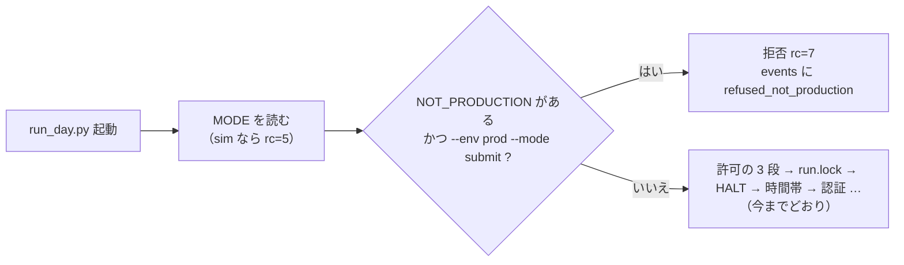

# 「本番の機械ではない」印と、本番を titan → 13500t へ切り替える手順（3 台の役割分け Phase 3）

> 2026-09-24 作成（titan の Claude）。親プランは [three-machines.md](three-machines.md) の Phase 3。利用者の指示「phase3進めて」。
> 前提の決定: K4 ＝ 売買は 1 台だけ（切り替えまで titan の timer・切り替え後は 13500t の cron）／ K6 ＝ 記録は切り替えの日に移し titan は読むだけの写し／「2026-09-24 の決定」＝ Phase 3 は切り替えの前に必須。

## 1. 目的・背景

- 切り替えの後に **titan が本番の口座へ注文を出さない**ことを、人の注意ではなく**仕組み**で守る（K4）。排他（`MODE`・`run.lock`）は機械の中のファイルなので、2 台が両方起きていると同じ口座に 2 回注文が出る
- 切り替えの手順（timer を止める → 印を置く → 記録を移す → 差 0 を確かめる → 13500t を submit にする）を**手順書**にし、**cert の記録と作業用の置き場で 1 往復稽古**して、Phase 4（利用者・週末）で迷わないようにする

## 2. 対応方針

### 2-1. 印 ＝ `experiments/live-trading/NOT_PRODUCTION`（git 管理外・`MODE` と同じ型の JSON）

> この図の主張: 印は本番の発注（`--env prod --mode submit`）だけを、資格情報・許可の検査より前で拒む。plan・dry-run・cert はそのまま通る（titan は読むだけの写しとして使える）。

| 項目 | 決め |
| --- | --- |
| 置き場 | `experiments/live-trading/NOT_PRODUCTION`（`mode.base_dir()` の下 ＝ テストは `LT_MODE_DIR` で tmp に向く）。git 管理外 |
| 中身 | `{"machine": "<hostname>", "since": …, "by": …, "reason": …}`。⚠ **`machine` は置いた機械の `hostname`** で、読むときに今の `hostname` と突き合わせる |
| 何を拒むか | **`--env prod` かつ `--mode submit`** だけ。`TT_ALLOW_PROD_ORDERS=1` ＋ `--i-know-this-is-real-money` があっても拒む（許可より印が先） |
| 何を拒まないか | `--mode plan`・`dry-run`・`--env cert`（sandbox）。印のある機械でも手順の稽古・読むだけの管理画面・cert の試験はできる |
| 取り違え | 印の `machine` が今の `hostname` と違うとき（印を写した・ホスト名を変えた）も**発注は拒む**（fail closed）が、メッセージと記録に「この機械の印ではない」と出す ＝ 13500t に titan の印が紛れ込んだら、起動しなかった理由がすぐ分かる |
| 壊れているとき | JSON が読めない・`machine` が無い → **拒む**（読めない印を「無い」と読まない） |
| 記録 | 拒否は本物の `events.jsonl` に `refused_not_production`（`machine`・`host`・`since`・`by`・`matches_host`）。置く・外すは `mode.log` に 1 行 |
| 操作 | `notprod.py status ／ set [--reason …] ／ clear`（CLI だけ。`set` は自分の `hostname` を書く ＝ 他の機械の名前を書けない）。⚠ **置くのも外すのも利用者**（Phase 4・Phase 5） |
| `sample.py` | 本番の発注系の手順（4・5・5limit・6）も同じ印で拒む（発注の経路は執行器と CLI の 2 本 ＝ 両方をふさぐ） |
| `run-live.sh` | 早見に足す（submit ＋ `--env prod` ＋ 印 → 95 秒むだにせず rc=7）。⚠ 関門の本体は `run_day.py` |
| 管理画面 | 帯「本番の機械ではない（発注しない）」を全ページの最上部に出し、`/api/*` に `not_production` を足す。⚠ 表示だけ・公開面は読まない（`mode_dir` が無い） |

### 2-2. 切り替えの手順書（`live-trading.md` §0-14 に書く）

順は親プラン Phase 4 のとおり: ① titan の timer を止め `live.env` から発注の許可を外し印を置く → ② `live.sqlite` と `state/` を 13500t へ（sha256。13500t の Phase 2 の DB は `live.sqlite.phase2-<日付>` に退ける）→ ③ 13500t の `reconcile.py show` で差 0 → ④ 13500t の `run.sh` の留め金を外し `live.env` を submit → ⑤ 翌営業日の cron を見る。戻し方（Phase 5）は逆順の見出しだけ置く。

- ⚠ **DB の中の道はリポジトリ直下からの相対**（`livefs.locate` ＝ DB のあるディレクトリからの相対で引く）＝ clone の絶対パスが違う 13500t へ**ファイルをそのまま写せば読める**
- ⚠ `state/<env>/*.json` も DB の中（`state/` はディレクトリとしては空）＝ 写すのは `live.sqlite` 1 つ。`state-backup/` は控え（ファイル）なので別
- ⚠ 13500t への転送は titan から届かない（K3）＝ **Sx360 の Claude ＋ 利用者**が運ぶ。titan の Claude は写しと sha256 を用意するところまで

### 2-3. cert で 1 往復の稽古（titan・作業用の置き場）

本物の `MODE`・`run.lock`・`live.sqlite` には触らない。scratch（`~/.cache/ai-income-lab-switch/`）に「13500t 役」の木を作り、

1. titan の `live.sqlite` を `livefs.py backup` で写す → sha256 が一致・`livefs.py stats` の行数が一致
2. 13500t 役で `reconcile.py --env cert show`（`LT_MODE_DIR`・`LT_STATE_DIR`・`LT_OUT_DIR` を scratch へ）＝ cert の売買履歴が読め、差が出る
3. titan 役に印を置き `run_day.py --env prod --mode submit`（⚠ 許可は付けない）→ rc=7・`refused_not_production` ／ 同じ置き場で `--mode plan` は通る（認証まで進む）
4. 印を外す → 拒否が消える

## 3. 影響範囲

- `experiments/live-trading/mode.py`（印の読み書き）・`notprod.py`（新規 CLI）・`run_day.py`（拒否 rc=7）・`tests/test_not_production.py`（新規）・`README.md`・`systemd/README.md`
- `run-live.sh`（早見）・`experiments/tastytrade-api-sample/sample.py`（本番の発注系の手順を拒む）
- `dashboard/app/simmode.py`・`templates/base.html`・`glossary.toml`・`tests/test_mode_banner.py`（帯）
- `.gitignore`（`NOT_PRODUCTION`）・`docs/specs/experiments/live-trading.md` §0-14（手順書・正本）・CLAUDE.md
- ⚠ 触らないもの: 許可の 3 段・`HALT`・`MODE`・`run.lock` の意味・発注できる時間帯・13500t（g3plus-ops）側

## 4. テスト方針

- 単体（`tests/test_not_production.py`。ネットワークなし・`LT_MODE_DIR` は tmp）: 印なしで何も変わらない ／ `set` が hostname を書き `status`・`clear`・`mode.log` ／ 印ありの prod submit は許可があっても rc=7 で `refused_not_production` が本物の記録に残る ／ prod の plan・dry-run と cert の submit は印で拒まれない ／ hostname 違いも壊れた印も rc=7
- 管理画面（`test_mode_banner.py`）: 印があると全ページに帯・`/api/*` に `not_production`。無ければ 1 文字も変わらない
- `./run-tests.sh` が通る（執行器 → 管理画面 → selftest → mockrun）
- 稽古（§2-3）の結果を `live-trading.md` §0-14 に【実測】で残す
