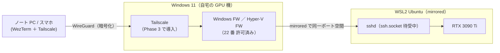

# 自宅の外から SSH で GPU 機（WSL2）に入れるようにする（Tailscale）

作成: 2026-09-09

## 目的・背景

この PC（WSL2・RTX 3090 Ti 24GB）に自宅の外から SSH で入り、GPU を使う作業（gpu-models の検証など）を外出先から回せるようにする。

2026-09-09 の調査で、**受け側はほぼ出来上がっている**ことが分かった:

| 項目 | 状態 |
|---|---|
| WSL2 ネットワーク | mirrored（Windows と同一ポート空間。portproxy 不要） |
| sshd | `ssh.socket`（socket activation）が有効・ポート 22 で待受中 |
| Windows ファイアウォール | 「WSL SSH Port 22」許可ルールあり |
| Hyper-V ファイアウォール | 同上の許可ルールあり（既定 inbound は Block） |
| Windows 側 OpenSSH Server | 未導入（22 番は WSL のもの） |
| `~/.ssh/authorized_keys` | **空**。パスワード認証が有効なまま |

残っているのは (1) 外から届く経路、(2) 認証の固め直し、(3) 常時稼働、の 3 つ。

## 対応方針

経路は **Tailscale（WireGuard ベースの VPN）を Windows ホストに導入**する。CGNAT でも動き、ルーター設定が不要で、ポートをインターネットに露出しない。2026 年時点の事例で、mirrored モードなら Windows の Tailscale IP のポート 22 がそのまま WSL の sshd に届くことが確認されている。

外の端末から WSL の sshd までの経路と、各区間の設定状態:

## 影響範囲

**このリポジトリのコードには触れない。** 変更先は:

- WSL: `/etc/ssh/sshd_config.d/`（鍵認証のみに固定）、`~/.ssh/`（接続用鍵）
- Windows: スタートアップ（WSL 自動起動）、電源設定（スリープ無効）、Tailscale の導入

## Phase

### Phase 1: WSL 側の受け入れ（Claude が実行）

- 接続用の ed25519 鍵ペアを生成し、公開鍵を `~/.ssh/authorized_keys` に登録する
  - ⚠ 本来は端末側で生成するのが定石。ここでは受け渡しを 1 回で済ませるためサーバ側で生成し、**秘密鍵を端末へ移したら利用者が端末側でパスフレーズを付ける**（`ssh-keygen -p`）
- `/etc/ssh/sshd_config.d/` にドロップインを置き、`PasswordAuthentication no` / `PermitRootLogin no` に固定する
  - ⚠ これ以降、鍵の無い端末からは LAN 内でも入れなくなる（この PC のローカル操作は影響なし）
- `sshd -t` で構文検査。socket activation なので再起動は不要（次の接続から効く）

### Phase 2: Windows 側の常時稼働（Claude が実行）

- スタートアップに `wsl.exe -d <distro> --exec sleep infinity` を隠し窓で回す vbs を置く
  - Windows 再起動 → ログオン後に WSL が自動で上がり、常駐プロセスが VM のアイドル停止も防ぐ
  - ⚠ **ログオンするまでは上がらない**。再起動後も無人で使うなら自動サインイン（netplwiz）が別途要る
- （2026-09-10 追記）**ログオン不要（電源オンだけ）にする場合はタスクスケジューラ**で同じコマンドを「スタートアップ時」トリガー・「ログオンしているかどうかにかかわらず実行」で回す（アカウントのパスワード保存が必要。⚠ 実行時間制限〔既定 3 日〕を解除する）。Tailscale はサービスとしてログオン前から繋がるため、これで電源オンだけで SSH 可能になる。利用者の指示（2026-09-10）で、**先にログオン前提の vbs 版を通してからこちらへ切り替える**。netplwiz の自動サインインは代替（デスクトップが開いたままになるので次点）
  - （2026-09-10 追記）上記設定を織り込んだタスク定義 XML を `C:\Users\akira\wsl-autostart-task.xml` に配置済み。登録は利用者が管理者 PowerShell で `schtasks /create /tn wsl-autostart /xml ... /ru titan\akira /rp *`（パスワード入力と昇格が要るため Claude は行わない）。高速スタートアップは有効を実測（`HiberbootEnabled=0x1`）→ 電源オフ→オンの確認前に `powercfg /h off` が要る
- 電源設定: AC 接続時のスリープを無効化（`powercfg`。権限で弾かれたら利用者に依頼）

### Phase 3: Tailscale の導入とログイン（導入は Claude が試行、ログインは利用者）

- `winget install Tailscale.Tailscale`（⚠ UAC の昇格ダイアログが出たら利用者が許可）
- `tailscale login` → 表示される URL をブラウザで開いてアカウント連携（Google アカウント可）
- 外で使う端末（ノート PC・スマホ）にも Tailscale クライアントを入れ、同じアカウントでログイン
- 秘密鍵を端末へコピーし、パスフレーズを付ける

### 実機での変更点（2026-09-09・クライアント側の作業）

- 鍵は **端末（Sx360）側で生成**した `titan-ed25519` を使う。titan で先に作った `remote-client-ed25519` は運ばない（titan が鍵なしを拒否するので秘密鍵を運ぶ経路が無く、端末側生成が定石でもある）
- WezTerm の接続先は deco-tarm の `ssh.local.lua`（端末ごと・git 管理外）に置く。`wezterm.lua` は配布スクリプトが毎回上書きするため
- tailnet 経由で titan の sshd に到達すること・鍵で通ること・`wezterm connect titan` で GPU が見えることまで Sx360 から実測した
- 外の回線（スマホのテザリング）からも `ssh titan` → `nvidia-smi` が通った。経路は最初 DERP 中継（`tailscale ping` 約 210〜240ms・`ssh` 往復 2.1s）で、10 往復のうちに直結へ切り替わって 78ms【実測】。Phase 4 はこれで完了

- ログオンなしの起動（タスクスケジューラ）では **Windows の Tailscale を「Run unattended」にしておく必要がある**。無いとサービスは動いていても接続せず（`tailscale status` が「起動中 / NoState」）、外からは届かない。`tailscale set --unattended` で有効化し、以後は無人でも接続する（2026-09-10 実測）

### Phase 4: 接続試験（利用者）

- LAN 内から: `ssh -i <鍵> ubuntu@<この PC の LAN IP>` が**鍵で通り**、鍵なしが**拒否される**こと
- tailnet 経由: 端末の Wi-Fi を切る等で外部回線にし、`ssh ubuntu@<Tailscale IP または MagicDNS 名>` が通ること
- WezTerm: `wezterm ssh` または ssh_domains で同上
- 通ったら `nvidia-smi` で GPU が見えることまで確認

## 運用メモ（2026-09-10 完了時点。TODO にだけあった手順をここへ移した）

| 項目 | 場所・値 |
|---|---|
| titan の sshd | `/etc/ssh/sshd_config.d/60-remote-access.conf`（`PasswordAuthentication no` / `KbdInteractiveAuthentication no` / `PermitRootLogin no`）。socket activation |
| titan の `authorized_keys` | Sx360 の `titan-ed25519`（ssh config の `titan` が使う）と `gpu-home-ed25519`（利用者作成）。バックアップ `authorized_keys.bak-20260909` |
| 無人起動 | タスクスケジューラ `wsl-autostart`（システムの開始時・ログオン不問・電源条件なし・実行時間制限なし）。定義 XML は `C:\Users\akira\wsl-autostart-task.xml`。登録は管理者 PowerShell で `schtasks /create /tn wsl-autostart /xml C:\Users\akira\wsl-autostart-task.xml /ru titan\akira /rp *`（PIN 不可・昇格が要る） |
| ログオン時起動（旧） | `shell:startup` の `wsl-autostart.vbs`（`wsl.exe -d Sandbox24 --exec sleep infinity` を隠し窓で）。タスク版が通ったので外す予定 |
| Tailscale（titan） | Windows サービス。**`tailscale set --unattended` 済み**（これが無いとログオン前は「起動中 / NoState」で外から届かない） |
| Tailscale（Sx360） | v1.102.3、`sx360` = 100.119.134.116。ログインは Google（`akiraak@gmail.com`、2 段階認証オン） |
| 電源（titan） | 高パフォーマンス。スリープ・休止とも「なし」。ディスプレイ電源オフ AC 15 分（ログオン画面の 1 分は効かず、15 分でよいと判断）。高速スタートアップは有効のまま（電源オフ→オンの確認前に `powercfg /h off`） |
| Sx360 の ssh alias | `titan`（`titan.tail061b58.ts.net`）／ `titan-lan`（`titan.lan` = 10.0.1.81）。WSL と Windows の両方の ssh config |
| WezTerm | deco-tarm の `ssh.local.lua` に `titan` / `titan-lan`。`wezterm connect titan` で開く（起動中の WezTerm には再起動まで出ない） |

切り分けの型: tailnet で届かないときは、まず `tailscale status` で titan がオンラインか、次に LAN 側 `10.0.1.81:22` が開いているか。Windows が上がって WSL も上がっているのに Tailscale だけ落ちていれば、無人実行の設定が容疑者。

## テスト方針

- Phase 1: `sudo sshd -t` が無言（エラーなし）／ `sshd -T` で `passwordauthentication no` を確認
- Phase 4 の接続試験が実地のテストを兼ねる（成功・拒否の両方を確認する）

## セキュリティ上の注意

- ポート 22 はインターネットには露出しない（Tailscale の内側と LAN のみ）。それでも鍵認証のみに固定する
- 秘密鍵の受け渡しは自宅 LAN 内または端末の直接接続で行い、クラウドストレージ経由にしない
- Tailscale のアカウントが乗っ取られると経路ごと開くので、アカウントに 2 要素認証を付ける

## 失敗時の代替

- mirrored モードと Windows 側 Tailscale が干渉して WSL に届かない事例も報告されている。その場合は **Tailscale を WSL 内に入れて独立ノードにする**（`tailscaled` を systemd で常駐。ログイン URL 方式なので手順はほぼ同じ）
- それも不調なら Cloudflare Tunnel（dashboard で使用中の Cloudflare Access の延長）に切り替える
