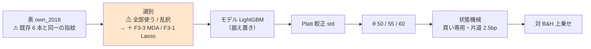

# LightGBM × 閾値売買 に選別 2 本を足す（F3-3 並べ替え(MDA)・F3-1 Lasso）

親タスク: 「GPU 系を閾値売買でも回せるようにする」（利用者の指示 2026-09-13: **gpu 系も毎日往復ではない手法を実装する**）
先例: [selectors-small-four.md](../specs/experiments/selectors-small-four.md)（選別 3 本を閾値売買に足した 2026-09-12 の実行）
規約: [rules.md 13 章](../specs/experiments/feature-discovery/rules.md)（閾値つき売買）／ [14-10](../specs/experiments/feature-discovery/rules.md)（空白は積極的に埋める）
台帳: [ledger.md](../specs/experiments/feature-discovery/ledger.md)（着手時点 **n_trials 421**【実測 2026-09-13】）

---

## 0. 目的と背景

⚠ **埋めるのは「選別の軸」の空白 2 つである。** 閾値売買（対 B&H 上乗せで測る物差し）で回した選別は
⚠ **4 本だけ**（F1-4 分散しきい値・F1-7 IC の安定性・F2-2 RFE・F5-1 PCA）で、⚠ **実装のある 13 本のうち 9 本が毎日往復にしか無い**【実測 2026-09-13。台帳を集計】。

| | 毎日往復 | 閾値売買 |
| --- | :---: | :---: |
| F1-4 ／ F1-7 ／ F2-2 ／ F5-1 | ✅ | ✅（2026-09-12） |
| **F3-3 並べ替え(MDA)** ／ **F3-1 Lasso** | ✅（`gpu_lgbm_2018` ほか） | ⚠ **空白 ← 本タスク** |
| F1-1 ／ F1-2 ／ F1-3 ／ F1-5 ／ F2-3 ／ F3-2 ／ F3-5 | ✅ | ⚠ 空白（別タスク） |

⚠ **この 2 本を選ぶのは「効きそうだから」ではない。** ⚠ **`gpu_lgbm_2018` が既にこの 2 本を持っており、
同じ選別を新しい物差しへ移すだけで済むから**（[TODO](../../TODO.md) の親タスク: 「`gpu_*` は F3-3 MDA と F3-1 Lasso を持っているので、移すと両方の空白が同時に埋まる」）。
⚠ **回す目的は「未実施」を「効かなかった」と区別できるようにすることだけである**（[14-10 規約 4](../specs/experiments/feature-discovery/rules.md)）。

⚠ **前提として、先行する 4 選別は 12 行とも「採る」が 0 件だった**（[selectors-small-four.md](../specs/experiments/selectors-small-four.md)）。
⚠ **良い数字が出たらまず配線を疑う**（[11 章 規約 7](../specs/experiments/feature-discovery/rules.md)）。

### 0-1. ⚠ 回す前に固定すること（結果を見てから決めない）

⚠ **本節は Phase 1 に入る前に書き終える。**（[14-10 規約 3](../specs/experiments/feature-discovery/rules.md)・[13-3 規約 4](../specs/experiments/feature-discovery/rules.md)）

| 固定するもの | 値 | ⚠ 動かさない理由 |
| --- | --- | --- |
| 回す本数 | **本番 1 本** ＋ **leak 対照 1 本** | 先例 `sel_small4_1995` と同じ形（1 実行に選別をまとめる） |
| ⚠ **形式** | ⚠ **(A) 共通だけ**（`form = "shared"`） | ⚠ **§0-2 に理由を書く。判断が要った唯一の点** |
| 表 | `own_2018` を `features_from` で読む | 13-8: 表を作り直すと「表の差」が混ざる |
| モデル | **LightGBM**（既定のまま） | ⚠ **処置は選別。** モデルを動かすと何の差か分からなくなる |
| 選別 | `F3-3 並べ替え(MDA)` ／ `F3-1 Lasso` ＋ 基準線 2 本（`全部使う` ／ `乱択`） | ⚠ **基準線 2 本は `trade_own_lgbm_a` と鍵が同じなので台帳でまとまる** → ⚠ **検算に使う**（§4 の 2） |
| k | **16** | `trade_own_lgbm_a` と同じ（own 表の既定） |
| θ | **50 / 55 / 60** | 13-3 規約 1・4 |
| embargo | **0 本** | `trade_own_lgbm_a` と同じ（own は断面を含まない） |
| 種 | 0 | 13-6 の 4 |
| 数え方 | **n_trials 421 → 427**（＋6 ＝ 選別 2 本 × 3 θ）【推測】 | ⚠ **基準線 2 本は数えない**（13-9 の 4）。⚠ **既存の鍵と重なるので「再現の 2 実行目」になる** |
| 判定 | **対 B&H 上乗せ**の符号と t（13-7）。B&H は **＋1,652.02bp/fold**【実測】 | ⚠ **純利の符号では「買って持っただけ」と区別できない** |
| 門（14-5） | ⚠ **記録するだけ。門前でも回す**（`--ignore-gate`） | 14-10 規約 2。⚠ **既存 `trade_own_lgbm_a` も `gate.forced = true`**【実測】 |

### 0-2. ⚠ 判断が要った 1 点: 形式 (A) だけで回す

⚠ **[13-6](../specs/experiments/feature-discovery/rules.md) は「(A) 銘柄共通と (B) 銘柄別の両方を回す」と書いている。** ⚠ **本タスクはそれに従わない。** 理由は 3 つ。

| # | 理由 |
| ---: | --- |
| 1 | ⚠ **13-6 の「両方」は、処置が検証方式そのもの（形式の比較）であるときの要求である。** ⚠ **本タスクの処置は選別で、形式は据え置きの設定にあたる** |
| 2 | ⚠ **先例が (A) だけである** — 選別を処置にした `sel_small4_1995` は `form = "shared"` の 1 本だけを回した（3 選別 × 3 θ ＝ 9 試行） |
| 3 | ⚠ **(B) で回すと橋渡しの相手がいない**（13-8）。⚠ **比較対象になる既存 4 選別は (A) にしか無い**ので、(B) の数字は「選別の差」として読めない |

⚠ **これは規約の変更ではない。** ⚠ **(B) を足したくなったら別の試行として数える**（＋6）。

---

## 1. 対応方針 — ⚠ **コードは 1 行も書かない**

⚠ **足りないのは config 1 本だけである。** F3-3・F3-1 は `ail/selectors/embedded.py` に登録済みで
（`@register("selector", "F3-3 並べ替え(MDA)")` ／ `"F3-1 Lasso"`）、閾値売買の経路は選別に依存しない。

> この図の主張: ⚠ **既存の経路のうち差し替わるのは「選別」の箱 1 つだけである。**



⚠ **2 本の選別は性質が違う。** ⚠ **どちらも「訓練分割の内側だけで選ぶ」ことが要件**（[3 章 B](../specs/experiments/feature-discovery/rules.md)）で、
⚠ **それを破っていないことは leak 対照でしか確かめられない。**

| 選別 | 何をするか | ⚠ 閾値売買で初めて効く可能性がある点 |
| --- | --- | --- |
| **F3-3 並べ替え(MDA)** | 列を 1 本ずつシャッフルして精度の落ち方で順位づけ | ⚠ **モデル依存の順位** ＝ LightGBM の使い方に沿った選別になる |
| **F3-1 Lasso** | L1 罰則で係数を 0 に潰して残った列を採る | ⚠ **線形の選別を非線形モデルに渡す**ので、噛み合わない可能性が先にある |

---

## 2. 影響範囲

| 触るもの | 中身 |
| --- | --- |
| `config/experiment/sel_lgbm_two.toml` | **新規**。`trade_own_lgbm_a.toml` の `selectors` に 2 本足すだけ |
| `docs/specs/experiments/selectors-lgbm-two.md` | **新規**。記録（結果と判定） |
| `docs/specs/experiments/feature-discovery/ledger.md` | ⚠ **生成物。`cli/report.py --catalog` で吐き直す。手で書かない** |
| `TODO.md` / `DONE.md` | タスクの移動 |

| ⚠ 触らないもの | 理由 |
| --- | --- |
| `ail/` `cli/` の全ファイル | ⚠ **手法を足すときに触るのは config だけ**（[10 章](../specs/experiments/feature-discovery/rules.md)） |
| `data/features/own_2018*` | 13-8: 表を作り直さない |
| 既存の `runs/` ／ 台帳の既存行 | 1 実行 1 ディレクトリ。⚠ **再計算しない・消さない**（14-10 規約 5） |

---

## 3. Phase 構成


### Phase 1: config を 1 本足す

`trade_own_lgbm_a.toml` を写し、`selectors` に 2 本足して `name` を替える。⚠ **他の key は 1 つも変えない。**

### Phase 2: 本番 1 本 ＋ leak 対照 1 本

```bash
./.venv/bin/python -m cli.run --experiment sel_lgbm_two --ignore-gate
./.venv/bin/python -m cli.run --experiment sel_lgbm_two --leak --ignore-gate
```

⚠ **leak 対照は毎回通す**（[7 章 規約 7](../specs/experiments/feature-discovery/rules.md)・13-10）。
⚠ **選別は「標本から学ぶ変換」なので、訓練分割の外を見ていたら leak 対照ではなく本番が跳ねる**（3 章 B）。

### Phase 3: 台帳の吐き直しと検算

```bash
./.venv/bin/python -m cli.report --catalog > ../../docs/specs/experiments/feature-discovery/ledger.md
./.venv/bin/python -m pytest -q tests
```

### Phase 4: 記録と後片付け

`docs/specs/experiments/selectors-lgbm-two.md` に結果・判定・限界を書き、`TODO.md` の子タスクを閉じ、
プランを `docs/plans/archive/` へ移す。⚠ **落とす結果でも記録を残す**（14-10 規約 5）。

---

## 4. テスト方針・検算

| # | 検算 | ⚠ 落ちたら |
| ---: | --- | --- |
| 1 | `pytest -q tests` が全件 pass（着手時点 **276 件**【実測】） | 配線が壊れている |
| 2 | ⚠ **基準線 2 本（全部使う・乱択）が `trade_own_lgbm_a` と 1 バイトも違わない** | ⚠ **選別を足しただけで基準線が動くはずがない。** 動いたら配線を壊した（先例 `sel_small4` が同じ検算を使っている） |
| 3 | ⚠ **回す前の台帳の行が 1 行も消えず 1 バイトも変わらない**（足されるだけ） | 既存の試行を壊した（14-10 規約 5） |
| 4 | ⚠ **leak 対照の上乗せが跳ねる**（既存 15 対は ＋16,108〜25,131bp・t 7.9〜27.0）【実測】 | 経路のどこかが壊れている（13-10） |
| 5 | **n_trials が 421 → 427**（＋6） | 数え落とし、または数え過ぎ |
| 6 | ⚠ **`checks.json` の `calibration` が `std`** | 旧の較正で回っている（鍵が割れる） |
| 7 | ⚠ **表の指紋が既存 6 本と一致**（`own_2018` の 135,962 行 × 35 列 × 63 銘柄・`raw 81ade06ba58c8e42`） | 表を作り直してしまった（13-8） |
| 8 | ⚠ **3 θ とも台帳に載る** | 良かった閾値だけ報告している（13-3 の 3） |
| 9 | ⚠ **選ばれた列が fold で違う**（`fitted/` を見る） | ⚠ **全 fold で同じ列なら、訓練分割の外を見た疑いがある**（3 章 B） |

---

## 5. 費用の見積り【推測】

| 本 | ⚠ 見込み | 根拠 |
| --- | --- | --- |
| 本番 | ⚠ **5〜20 分** | ⚠ **F3-3 MDA は列ごとにシャッフルして再評価するので選別のなかで重い**（35 列 × fold × 木の再評価）。⚠ **`trade_own_lgbm_a`（選別 2 本）は 7 秒**【実測 2026-09-13 の runs のタイムスタンプ差】 |
| leak 対照 | 同程度 | |
| 合計 | ⚠ **10〜40 分** | ⚠ **MLP で 1 桁外した前科があるので、Phase 2 で実測に置き換える** |

⚠ **MDA の実測が無いので幅を広く取った。** ⚠ **1 時間を超えたら一度止めて、選別ごとの時間を測ってから続ける。**

---

## 6. ⚠ 先に書く失敗モードと限界

| # | 起こりうること | ⚠ そのときどうするか |
| ---: | --- | --- |
| 1 | ⚠ **F3-1 Lasso が全列を 0 に潰す**（罰則が強すぎる） | ⚠ **「選別が空」は測れない。** そのまま記録し、⚠ **`n_trials` には数える**（回したものは全部数える） |
| 2 | ⚠ **F3-3 MDA が遅すぎる**（1 時間超） | ⚠ **止めて時間を測り直し、プランに実測を書いてから再開する。** ⚠ **選別を減らして誤魔化さない** |
| 3 | 上乗せが正で fold 5/5 が揃う | ⚠ **まず配線を疑う**（11 章 規約 7）。取引回数・保有日率を必ず併記する（13-10） |
| 4 | ⚠ **基準線 2 本が既存と食い違う** | ⚠ **本番の数字を読まない。** 選別を足したことが基準線に漏れている（配線の不具合） |
| 5 | leak 対照が跳ねない | ⚠ **本番の数字を読まない。** 直してから回し直す |
| 6 | ⚠ **選ばれた列が全 fold で同じ** | ⚠ **先読みの疑い。** `fitted/` を開いて fold ごとの列を確かめる（検算 9） |
| 7 | ⚠ **買い% の幅が θ の帯より狭く「全部持つ / 全部休む」に潰れる** | ⚠ **MLP で 2 回起きた既知の形**（[mlp-threshold-trading.md §2-1・§8-2-1](../specs/experiments/mlp-threshold-trading.md)）。⚠ **起きたら θ 別の数字を「閾値の効き」として読まない** |

⚠ **限界（消せないもの）**: (a) ⚠ **63 銘柄は独立でない**（12 章 限界 2）／ (b) 生存バイアス（12 章 限界 1）／
(c) ⚠ **検出限界**（fold 360 日 × 5 では上乗せ t は 1 前後まで — [validation-power.md](../specs/experiments/feature-discovery/validation-power.md)）。
⚠ **本タスクはこれらを改善しない。空白を埋めるだけである。**

---

## 7. 完了条件

1. `runs/` に 2 実行（本番 1・leak 1）が 1 実行 1 ディレクトリで残っている
2. 台帳が吐き直され、**n_trials 421 → 427**、⚠ **既存行が 1 バイトも変わっていない**
3. `docs/specs/experiments/selectors-lgbm-two.md` に 2 選別 × 3 θ の結果と判定が載っている
4. ⚠ **判定が「落とす」でも完了とする**（14-10 規約 5。⚠ **採用を条件にしない**）
