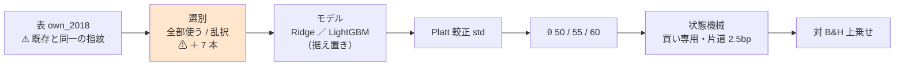

# 選別の 7 手法を閾値売買に移して回す（F1-1・F1-2・F1-3・F1-5・F2-3・F3-2・F3-5）

親タスク: 「GPU 系を閾値売買でも回せるようにする」の **(2) 選別の軸**（利用者の指示 2026-09-13: **gpu 系も毎日往復ではない手法を実装する**）
利用者の指示（2026-09-15）: **選別の 7 手法を閾値売買に移して回す**
先例: [selectors-lgbm-two.md](selectors-lgbm-two.md)（選別 2 本を LightGBM × 閾値売買に移した 2026-09-13 の実行）／ [selectors-small-four.md](selectors-small-four.md)
規約: [rules.md 13 章](../../specs/experiments/feature-discovery/rules.md)（閾値つき売買）／ [14-10](../../specs/experiments/feature-discovery/rules.md)（空白は積極的に埋める）
台帳: [ledger.md](../../specs/experiments/feature-discovery/ledger.md)（着手時点 **n_trials 511**【実測 2026-09-15】・テスト **294 件 pass**【実測】）

---

## 0. 目的と背景

⚠ **埋めるのは「選別の軸」に残った空白 7 つである。** 実装のある選別 13 本のうち、閾値売買（対 B&H 上乗せで測る物差し）で回したのは 6 本だけで、
⚠ **残る 7 本は毎日往復にしか無い**【実測 2026-09-15。台帳を集計】。

| 選別 | 毎日往復 | 閾値売買 |
| --- | :---: | :---: |
| F1-4 ／ F1-7 ／ F2-2 ／ F5-1 | ✅ | ✅（Ridge × 1995 表。2026-09-12） |
| F3-3 ／ F3-1（／ F3-1b） | ✅ | ✅（LightGBM × own_2018 ／ 断面。2026-09-13） |
| **F1-1 相関 ／ F1-2 相互情報量 ／ F1-3 mRMR ／ F1-5 検定+FDR ／ F2-3 Boruta ／ F3-2 木の重要度 ／ F3-5 クラスタ化MDA** | ✅（Ridge × own_2018 ほか） | ⚠ **空白 ← 本タスク** |

⚠ **回す理由は「効きそうだから」ではない。** ⚠ **「未実施」を「効かなかった」と区別できるようにするためだけに回す**（[14-10 規約 4](../../specs/experiments/feature-discovery/rules.md)）。
⚠ **先行する 6 選別は閾値売買で「採る」が 0 件だった**（先例 2 本）。⚠ **良い数字が出たらまず配線を疑う**（[11 章 規約 7](../../specs/experiments/feature-discovery/rules.md)）。

### 0-1. ⚠ 回す前に固定すること（結果を見てから決めない）

⚠ **本節は Phase 1 に入る前に書き終える。**（[14-10 規約 3](../../specs/experiments/feature-discovery/rules.md)・[13-3 規約 4](../../specs/experiments/feature-discovery/rules.md)）

| 固定するもの | 値 | ⚠ 動かさない理由 |
| --- | --- | --- |
| 回す本数 | **本番 2 本**（Ridge・LightGBM）＋ **leak 対照 2 本** | §0-2 の 1 |
| ⚠ **形式** | ⚠ **(A) 共通だけ**（`form = "shared"`） | §0-2 の 2 |
| 表 | `own_2018` を `features_from` で読む | 13-8: 表を作り直すと「表の差」が混ざる |
| モデル | **Ridge** ／ **LightGBM**（どちらも既定のまま） | ⚠ **処置は選別。** ハイパーパラメータは動かさない（13-6 の 3） |
| 選別 | 7 本 ＋ 基準線 2 本（`全部使う（基準）` ／ `乱択（基準）`） | ⚠ **基準線 2 本は `trade_own_ridge_a` ／ `trade_own_lgbm_a` と鍵が同じ** → ⚠ **検算に使う**（§4 の 2） |
| k | **16** | 既存の own 表の実行と同じ。⚠ **F1-5・F2-3 は k を使わない**（本数は結果として決まる） |
| θ | **50 / 55 / 60** | 13-3 規約 1・4 |
| embargo | **0 本** | 既存と同じ（own は断面を含まない） |
| 種 | 0 | 13-6 の 4 |
| 数え方 | **n_trials 511 → 553**（＋42 ＝ 7 選別 × 3 θ × 2 モデル）【推測】 | ⚠ **基準線 2 本は数えない**（13-9 の 4） |
| 判定 | **対 B&H 上乗せ**の符号と t（13-7） | ⚠ **純利の符号では「買って持っただけ」と区別できない** |
| ⚠ **「選別が効く」と言う条件** | ⚠ **同じモデルの `全部使う（基準）` と `乱択（基準）` の両方を 3 θ すべてで上乗せが上回る** | 先例 [selectors-lgbm-two.md §1-1](../../specs/experiments/selectors-lgbm-two.md) と同じ線。⚠ **結果を見てから緩めない** |
| 門（14-5） | ⚠ **記録するだけ**（`cli/run.py` の既定。2026-09-14 から門で止めない） | 14-10 規約 2 |

### 0-2. ⚠ 判断が要った 3 点

| # | 判断 | 理由 |
| ---: | --- | --- |
| 1 | ⚠ **モデルは Ridge と LightGBM の両方で回す** | ⚠ **Ridge**: 7 本を毎日往復で測ったのは Ridge × own_2018（`own_2018`・`own_impact_2018`）なので、⚠ **選別とモデルを据え置いたまま物差しだけを替えた形になる**。⚠ **LightGBM**: 親タスクが GPU 系で、⚠ **先例 `sel_lgbm_two`（F3-3・F3-1）と同じモデル**なので選別 9 本が 1 つの表に並ぶ。⚠ **片方だけだと、もう片方が空白として残る**。⚠ **費用は数十分・DSR への効きは √ln N**（14-10）なので両方回す |
| 2 | ⚠ **形式は (A) 共通だけ** | 先例 2 本と同じ（[selectors-lgbm-two §0-2](selectors-lgbm-two.md)）。⚠ **13-6 の「両形式」は処置が検証方式のときの要求**で、ここの処置は選別。⚠ **比較相手の既存 6 選別が (A) にしか無い**。⚠ **(B) を足すなら別の試行として数える**（＋42） |
| 3 | 実験名は `trade_own_ridge_sel7_a` ／ `trade_own_lgbm_sel7_a` | [rules.md 10-1](../../specs/experiments/feature-discovery/rules.md) は「これから足す閾値売買の名前は `trade_` の形に揃える」とする。⚠ **形に選別の部品は無い**ので、水準の位置に `sel7` を置いた。⚠ **実験名は台帳の鍵ではない**ので数え方には効かない（10-1 規約 1） |

⚠ **数字を毎日往復の行と直接比べない**（[13-8](../../specs/experiments/feature-discovery/rules.md)）。毎日往復の `own_2018` は行 rank の fold・6 万行に間引き、閾値売買は日付の fold・間引かない（13-4）ので、⚠ **厳密な橋渡しの対にはならない。**

---

## 1. 対応方針 — ⚠ **コードは 1 行も書かない**

⚠ **足りないのは config 2 本だけである。** 7 本はどれも `ail/selectors/` に登録済みで（`filter.py` の F1-1・F1-2・F1-3・F1-5、`wrapper.py` の F2-3、`embedded.py` の F3-2・F3-5）、閾値売買の経路は選別に依存しない。

> この図の主張: ⚠ **既存の経路のうち差し替わるのは「選別」の箱 1 つだけで、モデルの箱は既存 2 本の値をそのまま使う。**



⚠ **7 本はどれも本体のモデルを使わずに選ぶ**（F1 は統計量、F2-3・F3-2・F3-5 は RandomForest を内部で回す）。⚠ **だから Ridge 実行と LightGBM 実行で選ばれる列は一致するはずである**（種 0 で決定的）。⚠ **これを検算に使う**（§4 の 10）。

| 選別 | 何で選ぶか | ⚠ 本数 | ⚠ 先に疑うこと |
| --- | --- | --- | --- |
| F1-1 相関 | \|Pearson\| の上位 k | 16 | ⚠ **F1-3 と材料が同じ**（\|相関\|）。重なりを数える |
| F1-2 相互情報量 | k 近傍の MI の上位 k | 16 | ⚠ **13.6 万行で遅いかもしれない**（§5） |
| F1-3 mRMR | 関連 − 既に選んだ列との冗長 | 16 | F1-1 との差は冗長の項だけ |
| F1-5 検定+FDR | BH で偽発見率 10% | ⚠ **結果で決まる** | ⚠ **全部落ちたら 1 本に落ちる**（F3-1 と同じ形のフォールバック） |
| F2-3 Boruta | 影の列より重要な列 | ⚠ **結果で決まる** | ⚠ **全部落ちたら 1 本に落ちる** |
| F3-2 木の重要度 | RF の MDI の上位 k | 16 | 相関した列で重要度を分け合う |
| F3-5 クラスタ化MDA | 相関のクラスタごとに壊して落ち方で順位 | 16 | クラスタ単位で入るので本数が k で切られる |

---

## 2. 影響範囲

| 触るもの | 中身 |
| --- | --- |
| `experiments/feature-discovery/config/experiment/trade_own_ridge_sel7_a.toml` | **新規**。`trade_own_ridge_a.toml` の `selectors` に 7 本足すだけ |
| `experiments/feature-discovery/config/experiment/trade_own_lgbm_sel7_a.toml` | **新規**。`trade_own_lgbm_a.toml` の `selectors` に 7 本足すだけ |
| `docs/specs/experiments/selectors-seven-threshold.md` | **新規**。記録（結果と判定） |
| `docs/specs/experiments/feature-discovery/ledger.md` | ⚠ **生成物。`cli.report --catalog` で吐き直す。手で書かない** |
| `TODO.md` / `DONE.md` | タスクの移動 |

| ⚠ 触らないもの | 理由 |
| --- | --- |
| `ail/` `cli/` の全ファイル | ⚠ **手法を足すときに触るのは config だけ**（10 章） |
| `data/features/own_2018*` | 13-8: 表を作り直さない |
| 既存の `runs/` ／ 台帳の既存行 | 1 実行 1 ディレクトリ。⚠ **再計算しない・消さない**（14-10 規約 5） |

⚠ **コミットは回す前にしない**（コミットは利用者の依頼があったときだけ）。⚠ **コードを 1 行も変えないので、`env.json` の `git_commit`（`a0581ce`）が実際に走ったコードを指す**。⚠ **config の中身は各実行の `config.json` に残る**（§4 の 12）。

---

## 3. Phase 構成


### Phase 1: config を 2 本足す

`trade_own_ridge_a.toml` ／ `trade_own_lgbm_a.toml` を写し、`selectors` に 7 本足して `name` を替える。⚠ **他の key は 1 つも変えない**（`tomllib` で全 key を突き合わせる）。

### Phase 2: 本番 2 本 ＋ leak 対照 2 本（直列）

```bash
cd experiments/feature-discovery
./.venv/bin/python -m cli.run --experiment trade_own_ridge_sel7_a
./.venv/bin/python -m cli.run --experiment trade_own_ridge_sel7_a --leak
./.venv/bin/python -m cli.run --experiment trade_own_lgbm_sel7_a
./.venv/bin/python -m cli.run --experiment trade_own_lgbm_sel7_a --leak
```

⚠ **直列で回す**（CPU を奪い合うと費用の実測が読めなくなる）。⚠ **1 本ずつ所要時間を記録する。**

### Phase 3: 台帳の吐き直しと検算

```bash
./.venv/bin/python -m cli.report --catalog > ../../docs/specs/experiments/feature-discovery/ledger.md
./.venv/bin/python -m pytest -q tests
```

### Phase 4: 記録と後片付け

`docs/specs/experiments/selectors-seven-threshold.md` に結果・判定・限界を書き、`TODO.md` の子タスクを閉じ、プランを `docs/plans/archive/` へ移す。⚠ **落とす結果でも記録を残す**（14-10 規約 5）。

---

## 4. テスト方針・検算

| # | 検算 | ⚠ 落ちたら |
| ---: | --- | --- |
| 1 | `pytest -q tests` が全件 pass（着手時点 **294 件**【実測】） | 配線が壊れている |
| 2 | ⚠ **基準線 2 本（全部使う・乱択）が `trade_own_ridge_a` ／ `trade_own_lgbm_a`（2026-09-13 の std 実行）と 1 バイトも違わない** | ⚠ **選別を足しただけで基準線が動くはずがない** |
| 3 | ⚠ **回す前の台帳の行が 1 行も消えず、数字が 1 つも変わらない**（足されるだけ） | 既存の試行を壊した（14-10 規約 5） |
| 4 | ⚠ **leak 対照の上乗せが跳ねる**（既存は ＋16,108〜25,131bp・t 7.9〜27.0）【実測】 | 経路のどこかが壊れている（13-10） |
| 5 | **n_trials 511 → 553**（＋42） | 数え落とし、または数え過ぎ |
| 6 | ⚠ **`checks.json` の `calibration` が `std`** | 旧の較正で回っている（鍵が割れる） |
| 7 | ⚠ **表の指紋が既存と一致**（`own_2018/d.parquet` 135,962 行 × 35 列 × 63 銘柄・`raw 81ade06ba58c8e42` / `adjusted 1a9c6d15374af248`） | 表を作り直してしまった（13-8） |
| 8 | ⚠ **3 θ × 7 選別 × 2 モデルが全部台帳に載る** | 良かった閾値だけ報告している（13-3 の 3） |
| 9 | ⚠ **選ばれた列が fold で違う**（`selected.csv`） | ⚠ **全 fold で同じ列なら、フォールバックか先読みを疑う**（先例で F3-1 がこれだった） |
| 10 | ⚠ **7 選別の `selected.csv` が Ridge 実行と LightGBM 実行で一致する** | ⚠ **選別は本体のモデルを使わない**ので、食い違ったら非決定性（RF の並列など）がある |
| 11 | ⚠ **config が既存と `selectors` と `name` 以外で違わない**（`tomllib` 全 key 照合） | 設定の差が混ざる |
| 12 | ⚠ **`env.json` の `git_commit` が `a0581ce`**（コードの変更が無い） | 再現できない実行になる（own §6-1） |

---

## 5. 費用の見積り【推測】

| 本 | ⚠ 見込み | 根拠 |
| --- | --- | --- |
| Ridge 本番 | ⚠ **3〜15 分** | `trade_own_ridge_a`（基準線 2 本）は **5 秒**【実測 2026-09-13 の log と result の時刻差】。⚠ **足すのは選別の計算だけ**で、⚠ **F1-2 相互情報量（k 近傍）が 11〜12 万行 × 35 列 × 5 fold で最も重い**と見る。RF を回す 3 本（F2-3・F3-2・F3-5）は `sel_lgbm_two` の MDA と同程度 |
| Ridge leak | 同程度 | |
| LightGBM 本番 | ⚠ **4〜17 分** | `sel_lgbm_two`（MDA 込み 4 選別）は **47.4 秒**【実測】。⚠ **選別 9 本分のモデル fit が加わる** |
| LightGBM leak | 同程度 | |
| 合計 | ⚠ **15〜65 分** | ⚠ **見積りは過去 4 回過大に外し、1 回だけ ±5% に収まった**。⚠ **Phase 2 で実測に置き換える** |

⚠ **1 本が 1.5 時間を超えたら一度止めて、選別ごとの時間を測ってから続ける。** ⚠ **選別を減らして誤魔化さない。**

---

## 6. ⚠ 先に書く失敗モードと限界

| # | 起こりうること | ⚠ そのときどうするか |
| ---: | --- | --- |
| 1 | ⚠ **F1-5 または F2-3 が全 fold で 1 本に落ちる**（フォールバック） | ⚠ **F3-1 と同じ形。** ⚠ **「選別が 1 本を選んだ」と読まない。** そのまま記録し ⚠ **`n_trials` には数える**。⚠ **実装は直さない**（既存行が別の手法になる。F3-1 の裁定と同じ理由）→ 利用者の裁定に回す |
| 2 | ⚠ **F1-1 と F1-3 がほぼ同じ列を選ぶ** | ⚠ **2 試行として数える**（回したものは全部数える）が、⚠ **独立な 2 本の証拠と読まない**。重なりの本数を記録に書く |
| 3 | ⚠ **F1-2 が遅すぎる**（1 本 1.5 時間超） | 止めて時間を測り直し、プランに実測を書いてから再開する |
| 4 | 上乗せが正で fold 5/5 が揃う | ⚠ **まず配線を疑う**（11 章 規約 7）。取引回数・保有日率を必ず併記する（13-10） |
| 5 | ⚠ **基準線 2 本が既存と食い違う** | ⚠ **本番の数字を読まない。** 選別を足したことが基準線に漏れている |
| 6 | leak 対照が跳ねない | ⚠ **本番の数字を読まない。** 直してから回し直す |
| 7 | ⚠ **買い% の幅が θ の帯より狭く「全部持つ / 全部休む」に潰れる** | ⚠ **MLP・GAN 増強で起きた既知の形。** 起きたら θ 別の数字を「閾値の効き」として読まない |
| 8 | ⚠ **Ridge と LightGBM で選ばれた列が食い違う** | 検算 10。⚠ **非決定性として記録し、どちらの実行も数える**（回し直して揃えない） |

⚠ **限界（消せないもの）**: (a) ⚠ **63 銘柄は独立でない**（12 章 限界 2）／ (b) 生存バイアス（12 章 限界 1）／
(c) ⚠ **検出限界**（fold 約 340 日 × 5 では上乗せ t は 1 前後まで — [validation-power.md](../../specs/experiments/feature-discovery/validation-power.md)）。
⚠ **本タスクはこれらを改善しない。空白を埋めるだけである。**

---

## 7. 完了条件

1. `runs/` に 4 実行（本番 2・leak 2）が 1 実行 1 ディレクトリで残っている
2. 台帳が吐き直され、**n_trials 511 → 553**、⚠ **既存行の数字が変わっていない**
3. `docs/specs/experiments/selectors-seven-threshold.md` に 7 選別 × 3 θ × 2 モデルの結果と判定が載っている
4. ⚠ **判定が「落とす」でも完了とする**（14-10 規約 5。⚠ **採用を条件にしない**）
