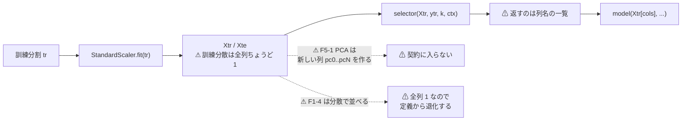
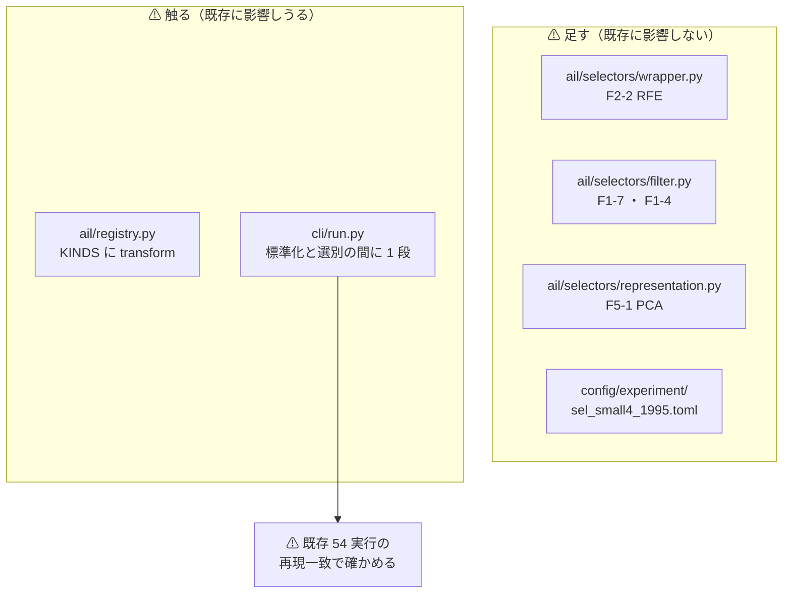
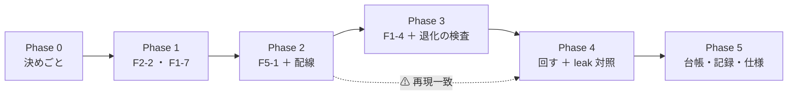

# 台帳の空白を埋める（手間「小」の 4 件）

対象: **F2-2 再帰的特徴量削減** ／ **F5-1 PCA・主成分** ／ **F1-7 情報係数（IC）の時系列安定性** ／ **F1-4 分散しきい値**

関連: [rules.md 14-10](../specs/experiments/feature-discovery/rules.md)（空白は積極的に埋める）／ [ledger.md §3](../specs/experiments/feature-discovery/ledger.md)（未実施 16 件）／ [ledger-role.md](../specs/experiments/feature-discovery/ledger-role.md)（落とした行が分母）

---

## 0. 目的と背景

利用者の決定（2026-09-12）で「検証はコストが低いので、可能性が低くても積極的に行う。空白は積極的に埋める」が [rules.md 14-10](../specs/experiments/feature-discovery/rules.md) に規約化された。
台帳 §3 の未実施 13 件を **手間の小さい順**（14-10 規約 4）に回す、その最初の 4 件をまとめて 1 プランで扱う。

⚠ **回す理由は「効くはず」ではない**（14-10 規約 3）。⚠ **「未実施」を「効かなかった」と読ませないために埋める**（規約 4）。
⚠ **結果が「落とす」でも消さない**（規約 5。落とした行が分母になる）。

**4 件をまとめる理由**: ⚠ **`n_trials` の数え方を 1 度で決められる**から。1 件ずつ回すと、同じ「選別手法 × 閾値売買」の数え方を 4 回決め直すことになり、⚠ **そのたびに数え落としの機会が増える**。

---

## 0-1. ⚠ 先に書く — 回す前に見えている穴が 2 つある

⚠ **どちらも「実装 10 行」という台帳 §3 の見積もりが成り立たないことを意味する。** ⚠ **結果を見てから言い訳にしないため、ここに先に書く**（[16-2](../specs/experiments/feature-discovery/rules.md) で「対称構成は定義から退化する」を先に書いたのと同じ形）。

> この図の主張: ⚠ **選別手法は「既存の列名を返す」契約しか持たない。** PCA は新しい列を作るので、この契約に入らない。



### 穴 1: ⚠ **F5-1 PCA は現在の selector の契約に入らない**

- 契約は `selector(X, y, k, ctx) -> 列名の一覧` で、呼び出し側が `Xtr[cols]` を取る（`cli/run.py:79-80`・`:186-188`）。⚠ **PCA が返したい `pc0..pcN` は `Xtr` に存在しない列**なので `KeyError` になる
- しかも検証分割 `Xte` は selector に渡らない。⚠ **transform を当てる先が手に入らない**
- ✅ **土台はある**: `ail/data/transforms/fitted.py` の `FittedTransform(kind="pca")` は実装済み。⚠ **ただし現在どこからも呼ばれていない**【実測 2026-09-12】
- ⚠ **つまり台帳 §3 の「`ail/selectors/representation.py` に 10 行」は成り立たない。** 配線の決めごとが要る（Phase 0）

### 穴 2: ⚠ **F1-4 分散しきい値は現在の配線では定義から退化する**

- selector に渡る `Xtr` は **`StandardScaler` 済み**（`cli/run.py:74-76`）。⚠ **訓練分割での分散は全列ちょうど 1** になる
- ⚠ **分散で順位を付けると、並ぶのは数値誤差**。⚠ **それは「乱択（基準）」と区別がつかない**
- 唯一残る意味は「**訓練分割で定数だった列**」の検出（`StandardScaler` は分散 0 の列に `scale_ = 1` を当てるので、変換後は全ゼロになる）。⚠ **その列が 0 件なら、F1-4 の出力は「全部使う」と 1 列も違わない**
- ⚠ **これは欠陥ではなく、台帳 §3 が既に書いていたこと**（「ラベルを見ないので単独では判定できない。前処理としてのみ意味がある」）の、⚠ **配線まで降ろした形である**

---

## 1. 対応方針

⚠ **共通の前提**: 選別は必ず訓練分割の内側で呼ぶ（[rules.md 3 章 B](../specs/experiments/feature-discovery/rules.md)・9 章）。⚠ **配線（`cli/`）は原則触らない** — 例外は F5-1 だけで、その理由は §0-1。

| 件 | 手法 | 置き場 | 方針 | ⚠ 事前固定する自由度 |
| --- | --- | --- | --- | --- |
| 1 | **F2-2 RFE** | `ail/selectors/wrapper.py` | `sklearn.feature_selection.RFE` ＋ 線形推定器。⚠ **重要度の定義に依存する**ので F3-1/F3-2 の弱点を引き継ぐ | `n_features_to_select = k`・`step = 1`・推定器は **Ridge**（モデルと揃える） |
| 2 | **F5-1 PCA** | `ail/selectors/representation.py` ＋ ⚠ **配線 1 か所** | `FittedTransform(kind="pca")` を訓練分割の内側で fit し、⚠ **`runs/<実行>/fitted/` に成分を残す**（3 章 B の再現の規約） | `n_components = k = 16`（⚠ **モデルに渡る列数を「全部使う」と揃える**） |
| 3 | **F1-7 IC の時系列安定性** | `ail/selectors/filter.py` | ⚠ **訓練分割をさらに時間で 4 等分**し、各区間で列 × ラベルの順位相関（IC）を取り、⚠ **符号の一致率**で並べる。既存の fold の枠に触らない | 区間数 **4**・相関は **Spearman**・同点は IC の絶対値の平均で割る |
| 4 | **F1-4 分散しきい値** | `ail/selectors/filter.py` | ⚠ **退化することを測ってから回す**（§0-1 の穴 2）。実装は「訓練分割で分散が `1e-12` 以下の列を落とし、残りから分散の大きい順に k 本」 | しきい値 **1e-12**（⚠ **「定数を落とす」以上の意味を持たせない**） |

### 1-1. ⚠ F5-1 の配線をどう通すか（Phase 0 の決めごと）

⚠ **3 つの案があり、どれを採るかで「何を検証したことになるか」が変わる。**

| 案 | 中身 | ⚠ 評価 |
| --- | --- | --- |
| **(a) selector の契約を広げる** | 列名に加えて「fit 済み変換」も返せるようにし、`run.py` が `Xte` に transform を当てる | ⚠ **既存 6 手法の契約を全部変える。** 回帰の危険が大きい |
| **(b) ⚠ 推奨: 変換を selector の内側に閉じる** | PCA は `X` を受け取り、⚠ **`X` に `pc0..pcN` 列を足して**その名前を返す。`Xtr`・`Xte` は `run.py` が作った使い捨ての `DataFrame` なので、⚠ **fit は訓練分割でだけ行い、検証分割には transform だけを当てる**必要がある → ⚠ **selector は `Xtr` しか見ないので、この案でも `Xte` に届かない** | ⚠ **成立しない。** 検討の記録として残す |
| **(c) ⚠ 実際に採る: registry に種類を 1 つ足す** | `KINDS` に **`transform`** を足し、`run.py` の「標準化 → 選別」の間に 1 段挟む。⚠ **`detector` を足したとき（15-1）と同じ形** | ⚠ **配線は増えるが、F5-2 オートエンコーダ・F4-4 多項式展開・F5-4 ウェーブレットが全部同じ口に入る。** ⚠ **残り 9 件のうち 4 件がここに乗る** |

⚠ **(c) を推す理由は「PCA のため」ではなく「同じ穴を 4 回掘らないため」**。⚠ **ただし配線を触るので、`--leak` 対照と既存の全実行の再現一致を Phase 4 で必ず確かめる。**

---

## 2. ⚠ `n_trials` の数え方（回す前に数える）

⚠ **回したものは門前も含めて全部数える**（[14-10 規約 2](../specs/experiments/feature-discovery/rules.md)。門は 2026-09-12 に診断へ降格した）。

| 次元 | 値 | 根拠 |
| --- | --- | --- |
| 手法 | **4** | 本プランの対象 |
| 閾値 θ | **3**（50 / 55 / 60） | 13-9 の 3（⚠ **閾値 1 水準ごとに 1 試行**） |
| 形式 | **1**（(A) 共通） | (B) は回さない |
| 粒度・地平・層・期間・銘柄集合・モデル | 各 **1** | `trade_own_1995_ridge_a` と揃える |

⚠ **4 × 3 ＝ 12 試行。`n_trials` は 253 → 265。**

代償【推測】: TODO の見積もり（13 手法 ＝ ＋39 試行で強い手法の DSR 0.9221 → 0.915）を比例で読むと、⚠ **今回の ＋12 では 0.9221 → 約 0.920**。⚠ **採否の判定式に DSR は入らない**（13-7 は対 B&H 上乗せの符号）ので、⚠ **試行を増やしても採用しにくくならない**。

⚠ **同じ実行に入れる基準線は数えない**（13-9 の 4）。⚠ **「全部使う（基準）」は既存の `trade_own_1995_ridge_a` と鍵が同じなのでまとまる** — ⚠ **数字が 1 つでも食い違ったら配線を壊したということ**（`catalog.trials()` が食い違いを出す）。これを検算に使う。

---

## 3. 影響範囲

> この図の主張: ⚠ **触るのは 4 ファイル。** そのうち配線に当たるのは `run.py` の 1 段だけで、そこだけが既存の実行に影響しうる。



| ファイル | 変更 | ⚠ 危険 |
| --- | --- | --- |
| `ail/selectors/wrapper.py` | ＋ F2-2 | 無（登録するだけ） |
| `ail/selectors/filter.py` | ＋ F1-7・F1-4 | 無 |
| `ail/selectors/representation.py` | ＋ F5-1（骨組みに中身を入れる） | 無 |
| `ail/registry.py` | `KINDS` に `"transform"` | ⚠ **小**（足すだけ。既存の種類は変えない） |
| `cli/run.py` | `evaluate` / `evaluate_trading` に変換の 1 段 | ⚠ **ここだけ中。** ⚠ **`transform` が空なら 1 行も通らない形にする** |
| `config/experiment/sel_small4_1995.toml` | 新規 | 無 |
| `tests/test_selectors_small4.py` | 新規 | 無 |
| 台帳・記録・仕様 | Phase 5 | — |

⚠ **`dashboard/` と `vibetab.py` は触らない**（画面は `runs/` を読むだけ）。

---

## 4. Phase 構成

> この図の主張: ⚠ **配線を触る Phase 2 の前後で、既存の実行が 1 バイトも変わらないことを挟む。**



### Phase 0: 決めごと（コードを書く前に固定する）

1. ⚠ **F5-1 の配線は §1-1 の (c)**（registry に `transform` を足す）。⚠ **理由は「残り 4 件が同じ口に乗るから」で、PCA の成績とは無関係**
2. ⚠ **F1-4 は §0-1 の穴 2 を承知のうえで回す**（14-10 規約 1: 可能性が低いことは回さない理由にならない）。⚠ **ただし「退化したかどうか」を先に測り、記録に残す**
3. **回す土俵**: `trade_own_1995_ridge_a` と ⚠ **`selectors` の行だけが違う**設定にする（13-8 の橋渡しの形）。⚠ **`features_from = "own_1995"`・`k = 16`・`model = "Ridge"`・`form = "shared"`・`seed = 0`・`folds = 5`・`cost_bp = 5.0` を動かさない**
4. **事前固定する自由度**は §1 の表のとおり。⚠ **結果を見て動かさない**（13-3 規約 4）

### Phase 1: F2-2 RFE ＋ F1-7 IC の時系列安定性

- ⚠ **契約にそのまま入る 2 件**なので配線を触らない
- `tests/test_selectors_small4.py` に単体テスト: ⚠ **返す列が `X.columns` の部分集合か** ／ 本数が `k` 以下か ／ ⚠ **`y` を並べ替えると選ぶ列が変わるか**（＝ ラベルを見ている証拠。F1-4 はここで**変わらない**ことを確かめる）
- F1-7 は ⚠ **訓練分割をさらに割るだけで、検証 fold に触れない**ことをテストで固定する

### Phase 2: F5-1 PCA ＋ 配線（registry に `transform`）

- `ail/registry.py` の `KINDS` に `"transform"` を足す
- `cli/run.py` の `evaluate` と `evaluate_trading`（(A)・(B) の両方）で、⚠ **標準化の直後に**変換を 1 段挟む。⚠ **`exp.get("transform")` が無ければ 1 行も通らない**形にする
- `FittedTransform` を ⚠ **訓練分割で fit → 検証分割には transform だけ**。係数は `run.fitted(...)` で `runs/<実行>/fitted/` へ（⚠ **次の実行では読み込まない**）
- ⚠ **検算（この Phase の本体）**: 既存の実行を 1 本回し直し、⚠ **`summary.csv` が 1 バイトも変わらないこと**を確かめる

### Phase 3: F1-4 分散しきい値 ＋ ⚠ 退化の検査

- 実装は §1 の表のとおり
- ⚠ **回す前に測る**: 訓練分割で分散 `≤ 1e-12` の列が何本あるか。⚠ **0 本なら F1-4 の出力は「全部使う」と同一** — それを **結果ではなく前提として記録に書く**
- テスト: ⚠ **定数列を 1 本混ぜた人工の表で、その列だけが落ちること**

### Phase 4: 回す（本番 ＋ `--leak` 対照）

```bash
python3 -m cli.run --experiment sel_small4_1995 --leak    # ⚠ 先に対照（跳ねなければ配線が壊れている）
python3 -m cli.run --experiment sel_small4_1995
```

- ⚠ **`--leak` 対照は必ず通す**（[7 章 規約 7](../specs/experiments/feature-discovery/rules.md)・14-10 規約 6）。⚠ **上乗せが跳ねなければ、その実行の結果は読まない**
- ⚠ **1 実行 1 ディレクトリ**（10 章）。seed・config・入力の指紋は `runs.Run` が自動で残す
- 門（14-5）は ⚠ **値を記録するだけ。門前でも回す**（14-10 規約 2）

### Phase 5: 台帳・記録・仕様の更新

- `python3 -m cli.ledger` で台帳を再生成し、⚠ **前の行で数字が変わった行が 0・消えた行が 0** を確かめる
- `docs/specs/experiments/feature-discovery/ledger.md` §3 の 4 件を **未実施 → 実施済み**へ（⚠ **落とすでも行は残す**）
- 記録を `docs/specs/experiments/selectors-small-four.md` に新規作成（判定・fold の符号・上乗せ・DSR・⚠ **§0-1 の 2 つの穴がどうなったか**）
- ⚠ **`n_trials` が 265 になったことを ledger.md の該当行に反映**

---

## 5. テスト方針

| # | 何を確かめるか | どこで |
| ---: | --- | --- |
| 1 | 4 手法が `registry` に登録され、`resolve_all` が通る | `tests/test_selectors_small4.py` |
| 2 | ⚠ **返す列が `X.columns` の部分集合**・本数 ≤ k | 同上 |
| 3 | ⚠ **ラベルを並べ替えると選択が変わる**（F2-2・F1-7）／ ⚠ **変わらない**（F1-4） | 同上 |
| 4 | F5-1 が ⚠ **検証分割に `fit_transform` を当てていない** | 同上（`FittedTransform` を差し替えて fit の呼び出し回数を数える） |
| 5 | F1-4 が ⚠ **定数列だけを落とす** | 同上（人工の表） |
| 6 | ⚠ **配線を触っても既存の実行が再現する** | Phase 2 で既存実行を回し直して `summary.csv` を突き合わせ |
| 7 | ⚠ **`--leak` 対照が跳ねる** | Phase 4 |
| 8 | 既存の **256 件**【実測 2026-09-12】が pass し続ける | `python3 -m pytest -q tests` |

---

## 6. ⚠ 期待する効き方を先に書く（結果を見てから理由を決めないため）

⚠ **4 件とも「採る」に届く見込みは薄い。** ⚠ **それでも回すのは 14-10 規約 1 に従うからで、以下は「効くはず」の主張ではない。**

| 件 | ⚠ 効かないと見る理由【推測】 | ⚠ どちらに転んでも閉じる軸 |
| --- | --- | --- |
| F2-2 | ⚠ **選別の優劣は既に決着している**（既存の閾値売買は「全部使う」1 本に絞ってある） | ⚠ **ラッパー型が 1 件も無い空白**（F2 は 4 件中 1 件しか実施済みでない）が埋まる |
| F5-1 | ⚠ **35 本を 16 本に圧縮しても情報は増えない。** 直交化が効くのは共線性が成績を壊しているときだけ | ⚠ **F5-2 オートエンコーダの見送り理由（「PCA が効かないなら AE も効かない」）の前提が実測になる** |
| F1-7 | ⚠ **IC の符号が安定な列があるなら、相関（F1-1）が既に拾っているはず** | ⚠ **「安定性で選ぶ」軸が閉じる** |
| F1-4 | ⚠ **§0-1 の穴 2。定義から退化する可能性が高い** | ⚠ **退化を実測で示せば、F1-4 は「前処理としてのみ」が確定する** |

⚠ **良い数字が出たら、まず §0-1 の穴と配線を疑う**（11 章 規約 7）。

---

## 7. ⚠ 限界（先に書く）

- ⚠ **銘柄集合・期間・モデル・形式を 1 つも動かさない**ので、⚠ **「この土俵では効かない」しか言えない**。(B) 銘柄別で効く可能性は閉じない
- ⚠ **F5-1 の `n_components = 16` は 1 水準しか試さない。** ⚠ **水準を増やせばそのぶん `n_trials` が増える**ので、増やすなら回す前に決める（14-9）
- ⚠ **F1-4 は「前処理として他の手法の前に挟む」形を試さない。** 単独で回して空白を埋めるだけ。⚠ **挟む形は別の試行になる**
- ⚠ **配線（`transform` の段）を足すと、以後の実行はすべてその段を通る。** ⚠ **空のときに 1 行も通らないことをテストで固定しないと、静かに全実行に影響する**
