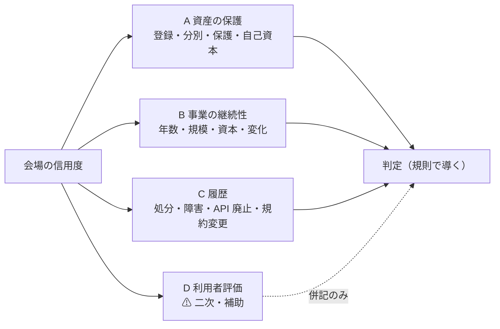
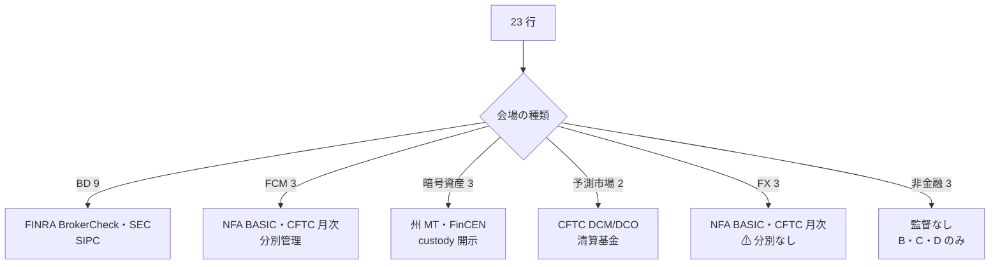
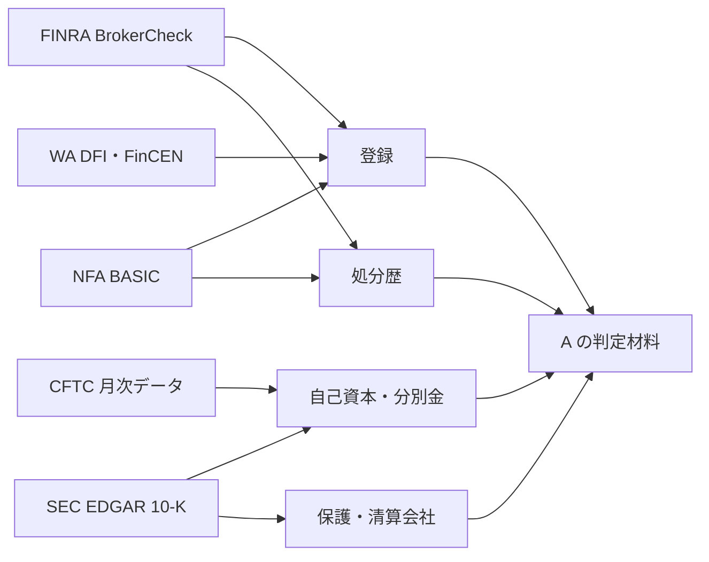
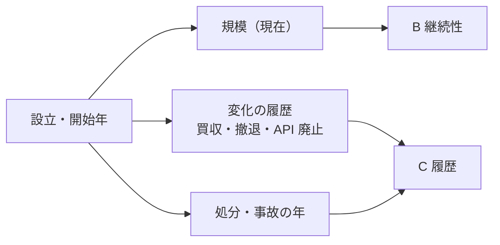
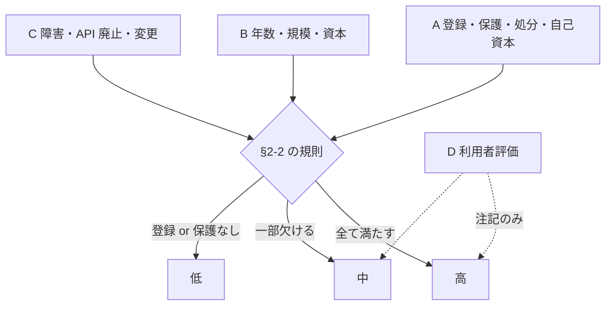

# API が使用できるサービスの信用度を調査する

作成日: 2026-09-03。
対象: [docs/specs/trading-api-availability.md](../specs/trading-api-availability.md) 付録 A で **発注 API が A0〜A1** になった提供元 **21**（[trading-fee-comparison.md](../specs/trading-fee-comparison.md) §2-1 と同じ母集団）。

## 1. 目的と背景

### 1-1. 何を知りたいか

前々タスクで「経路があるか」、前タスクで「いくらかかるか」が決まった。残るのは**「その会場に資金と発注を預けて大丈夫か」**である。API 経由の自動売買は、会場が止まる・API が閉じる・資産が返ってこない、のどれが起きても流れが切れる。

「信用度」は 1 つの数字ではなく、次の 4 つの問いに分けて答える。

| 問い | 中身 | 主な尺度 |
| --- | --- | --- |
| **A** 資産は守られるか | 規制上の登録・監督、顧客資産の分別と保護（SIPC / FDIC sweep / CFTC 分別管理 / 暗号資産の custody）、自己資本 | 規制当局の一次情報 |
| **B** 事業は続くか | 継続年数、規模（顧客数・口座数・預かり資産・出来高）、資本の裏付け（上場・親会社）、事業の変化（買収・撤退） | SEC EDGAR・CFTC 月次データ・公式発表 |
| **C** 約束を守ってきたか | 監督当局の処分歴、障害・事故の履歴、API の廃止・規約や料金の変更頻度 | BrokerCheck / NFA BASIC / SEC・CFTC の執行、status page、前 2 タスクの記録 |
| **D** 利用者はどう評価しているか | アプリストア評価、BBB、Trustpilot | ⚠ 二次情報・自己選択バイアス。**補助尺度**にとどめる |

> この図の主張: 尺度は 4 群あり、根拠の強さは A → B → C → D の順に弱くなる。判定は A〜C で行い、D は併記にとどめる。

### 1-2. ⚠ 会場の種類で監督者と保護の仕組みが違う

21 提供元は 6 種類に分かれ、**同じ尺度が使えない**。Phase 1 で種類ごとに尺度と出典を固定する。

| 種類 | 提供元 | 監督者と登録の確認先 | 資産保護の仕組み |
| --- | --- | --- | --- |
| **証券ブローカー（BD）** | IBKR・Alpaca・Tradier・tastytrade・E*TRADE・Public・Webull・moomoo・Schwab | FINRA BrokerCheck（CRD）、SEC | SIPC（証券 $500,000、うち現金 $250,000）、清算会社（Apex・Futu Clearing 等）の別 |
| **先物 FCM / IB** | Tradovate（NinjaTrader Clearing）・AMP・Ironbeam | NFA BASIC、CFTC 月次「Selected FCM Financial Data」（調整純資本・分別金） | CFTC 分別管理（SIPC 対象外） |
| **暗号資産取引所** | Kraken・Coinbase・Robinhood Crypto | 州 Money Transmitter ライセンス（WA DFI）、FinCEN MSB、NY BitLicense | ⚠ SIPC・FDIC 対象外。custody の分別と保険は各社の開示 |
| **予測市場（DCM / DCO）** | Kalshi・Polymarket US（QCX） | CFTC の DCM / DCO 指定、NFA BASIC | DCO の清算基金・分別管理 |
| **小売 FX（RFED / FCM）** | OANDA・tastyfx・FOREX.com | NFA BASIC、CFTC 月次データ（Retail Forex Obligation） | ⚠ 分別管理の義務なし（NFA の資本要件 $20M ＋ 5%） |
| **非金融マーケットプレイス** | AWS RI・eBay・DMarket | 金融監督なし | 残高は会場の債務（eBay は Managed Payments、AWS は請求）。⚠ 尺度は B・C・D のみ |

### 1-3. 既に分かっていること（前 2 タスクから引く）

| 提供元 | 既知の材料 |
| --- | --- |
| IBKR・Schwab・Robinhood・Coinbase・eBay・Amazon・Morgan Stanley（E*TRADE）・Futu（moomoo）・Webull・StoneX（FOREX.com）・IG Group（tastyfx） | **上場企業**。10-K / 年次報告で規模・自己資本・訴訟が読める |
| OANDA・GAIN（FOREX.com）・tastyfx・IBKR・Schwab Futures | CFTC 月次データに Retail Forex Obligation と登録区分が載る（前タスクで取得済み） |
| Kalshi | WA 州の裁判所命令（2026-08-12）、CFTC Release 9281-26。旧 API エンドポイントの廃止予定（2026-05-06） |
| Polymarket US | QCX 買収（2025-07）、app は Beta、州別一覧なし |
| TCGplayer（対象外）・IEX Cloud・Polygon → Massive | API・サービスの廃止／改名の先例（C の尺度「API の廃止」の参考） |
| Fidelity（対象外）・Kraken・Polymarket US・Robinhood | 2026 年に手数料・PFOF 方針が変わった（C の尺度「変更頻度」） |

## 2. 定義

### 2-1. 尺度の候補と、採否の基準（Phase 1 で確定）

候補を **「一次情報で取れるか」「会場の種類をまたいで比較できるか」「操作されにくいか」** の 3 点で採否を決める。

| 群 | 尺度 | 一次情報 | 比較可能 | 操作されにくい | 仮の採否 |
| --- | --- | --- | --- | --- | --- |
| A | 登録の有無と番号（CRD・NFA ID・MT ライセンス・DCM 指定） | ✅ | ✅ | ✅ | **採る** |
| A | 監督当局の処分歴（件数・直近の年・金額・内容） | ✅ | ⚠ 種類で母数が違う | ✅ | **採る**（種類内で比べる） |
| A | 顧客資産の保護（SIPC / 分別 / custody / 保険） | ✅ | ⚠ 仕組みが違う | ✅ | **採る**（「何が守られ、何が守られないか」を書く） |
| A | 自己資本・調整純資本（FOCUS 公開部分・CFTC 月次・10-K） | ✅（FCM は毎月） | ⚠ BD は非公開が多い | ✅ | **採る**（取れる範囲） |
| B | 設立年・サービス開始年・API 提供開始年 | ✅ | ✅ | ✅ | **採る** |
| B | 規模（口座数・顧客資産・出来高） | ⚠ 上場企業と FCM のみ確実 | ⚠ | ✅ | **採る**（⚠ 前タスクで IR ページが 403/404。**SEC EDGAR の XBRL / 10-K 本文**と CFTC 月次データから取る） |
| B | 資本の裏付け（上場・親会社・買収履歴） | ✅ | ✅ | ✅ | **採る** |
| C | 障害・事故の履歴（status page・監督当局の事案） | ⚠ status page は自己申告 | ⚠ | ⚠ | **採る**（当局事案を主、status page を従） |
| C | API の廃止・破壊的変更の履歴 | ✅（changelog・deprecation 告知） | ✅ | ✅ | **採る** |
| C | 規約・料金の変更頻度 | ✅（前 2 タスクの記録） | ✅ | ✅ | **採る** |
| D | アプリストア評価（App Store / Google Play） | ✅ 公開 | ⚠ | ❌ | **補助**（点数と件数を併記） |
| D | Trustpilot・BBB | 二次 | ⚠ | ❌ | **補助** |
| D | Reddit・SNS の評判 | 二次 | ❌ | ❌ | **採らない** |

### 2-2. 判定の規則（Phase 1 で固定し、Phase 5 で適用）

⚠ **点数を足し合わせない。**種類ごとに次の 3 値で判定し、理由を尺度の値で書く。

| 判定 | 規則（仮） |
| --- | --- |
| **高** | 監督当局への登録あり ＋ 顧客資産の保護が制度で担保 ＋ 直近 5 年に重大な処分（顧客資産・執行・システムに関わる罰金）なし ＋ 継続 10 年以上 or 上場 |
| **中** | 登録・保護はあるが、直近 5 年に処分がある／継続 10 年未満／規模が確認できない、のいずれか |
| **低** | 登録なし or 保護の仕組みなし（非金融マーケットプレイスは種類として「保護なし」と書き、判定は B・C だけで行う） |

「重大な処分」の線引きは Phase 1 で決める（例: 顧客資産・最良執行・システム障害・虚偽表示に関わる $1M 以上の罰金、または営業停止）。

### 2-3. 「壊れる形」を提供元ごとに 1 行書く

信用度の判定とは別に、**その会場が止まったとき・破綻したときに資金と発注がどうなるか**を制度から書く（例: BD なら SIPC の範囲内で返る、FCM なら分別金から按分、暗号資産は custody 次第、予測市場は DCO の清算基金、非金融は会場の債務）。自動売買の設計に直接効く。

## 3. 母集団

前タスク §2-1 の API 側 21 提供元をそのまま使う（Robinhood は暗号資産で API 側）。

| 種類 | 提供元 | 件数 |
| --- | --- | ---: |
| BD | IBKR・Alpaca・Tradier・tastytrade・E*TRADE・Public・Webull・moomoo・Schwab | 9 |
| FCM / IB | Tradovate・AMP・Ironbeam | 3 |
| 暗号資産 | Kraken・Coinbase・Robinhood Crypto | 3 |
| 予測市場 | Kalshi・Polymarket US | 2 |
| 小売 FX | OANDA・tastyfx・FOREX.com | 3 |
| 非金融 | AWS RI・eBay・DMarket | 3 |
| | | **23** |

⚠ 前タスクは「21」と数えたが、Robinhood Crypto を暗号資産に、Ironbeam を FCM に立てると **23 行**になる。Phase 1 で行数を確定し、前タスクとの対応表を残す。

> この図の主張: 母集団は 6 種類に割れ、種類ごとに監督者・出典・保護の仕組みが違う。横断の尺度（年数・規模・API 廃止・利用者評価）と種類固有の尺度（登録・処分・保護・自己資本）の 2 段で持つ。

## 4. 方針との関係

CLAUDE.md の 2026-08-27 方針変更により、**登録・契約・課金・実行は行わない**。

| 行為 | 可否 | 帰結 |
| --- | --- | --- |
| 監督当局の公開データベースを 1 社ずつ引く（BrokerCheck・NFA BASIC・SEC EDGAR・CFTC 月次・WA DFI） | ✅ 行う | **判定の主根拠**。⚠ 自動の一括取得はしない（各サイトの規約・robots.txt を先に読む） |
| 上場企業の 10-K / 年次報告を読む | ✅ 行う | 規模・自己資本・訴訟・リスク要因 |
| 各社の status page・changelog・deprecation 告知を読む | ✅ 行う | C の尺度 |
| アプリストア・BBB・Trustpilot を読む | ⚠ 行う | 二次情報として D に置く。点数だけで判定しない |
| 口座開設・API 登録・問い合わせ | ❌ 行わない | 開示請求でしか出ない情報（FOCUS の非公開部分等）は「未確認」 |

## 5. 成果物

| 項目 | 内容 |
| --- | --- |
| ファイル | `docs/specs/service-trust-assessment.md`（新規） |
| 本体 | **23 行 × 尺度の表**（種類・登録・処分・保護・自己資本・年数・規模・資本・障害・API 廃止・変更頻度・利用者評価・判定・壊れる形・出典） |
| §結論 | 判定の件数（高 / 中 / 低）と、前々タスクの「成立 51 件」を支える会場のうち信用度が高い経路が何件あるか |
| 付録 A | 処分歴・事故の引用（当局の文書名・日付・金額・要旨。判断せず引用） |
| 付録 B | 「壊れる形」— 種類ごとに制度上の保護の範囲と、対象外になるもの |
| 付録 C | 取れなかった尺度と二次情報の隔離 |
| 図 | 各 Phase に最低 1 枚 |

⚠ 前 2 タスクの成果物は書き換えない。

## Phase 1 — 尺度と判定規則を固定する（見積もり 1.5h）

- **Step 1-1**: §2-1 の候補を 3 基準で採否し、種類ごとの出典（URL）を固定する。BrokerCheck・NFA BASIC・EDGAR・CFTC 月次・WA DFI の各サイトの利用規約と `robots.txt` を読み、1 社ずつの手動相当の取得に限る旨を書く
- **Step 1-2**: 母集団を 23 行で確定し、前タスクの 21 との対応表を書く。上場 / 非上場、親会社、清算会社を先に埋める
- **Step 1-3**: §2-2 の判定規則を確定する（「重大な処分」の線引き、「継続年数」の起点＝サービス開始年か API 提供開始年か）

## Phase 2 — A: 規制・保護・自己資本（見積もり 3h）

- **Step 2-1**: 登録の確認（BD: BrokerCheck の CRD と登録区分／FCM・FX・予測市場: NFA BASIC と CFTC 一覧／暗号資産: WA DFI の MT ライセンス・FinCEN MSB・NY BitLicense）
- **Step 2-2**: 処分歴（BrokerCheck の Disclosures、NFA BASIC の Regulatory Actions、SEC・CFTC の執行リリース）。直近 5 年を主に、件数・年・金額・内容を引用で残す
- **Step 2-3**: 顧客資産の保護（SIPC 会員の確認、清算会社、FCM の分別金と調整純資本、暗号資産の custody・保険の開示、DCO の清算基金）
- **Step 2-4**: 自己資本（CFTC 月次の Adjusted Net Capital・Excess、上場企業の 10-K の regulatory capital、非上場 BD は FOCUS の公開部分か「未確認」）

> この図の主張: A の 4 尺度は種類ごとに出典が決まっており、同じ当局から複数の尺度が取れる。

## Phase 3 — B・C: 継続性・規模・履歴（見積もり 3h）

- **Step 3-1**: 設立年・サービス開始年・API 提供開始年（公式の about・changelog・press）
- **Step 3-2**: 規模。⚠ **前タスクで IR ページが 403/404 だった**ので、SEC EDGAR の XBRL（companyfacts）と 10-K 本文、CFTC 月次データ（分別金・Retail Forex Obligation）、取引所の公表出来高を経路にする。非上場は公式発表の数値のみ（無ければ「未確認」）
- **Step 3-3**: 資本の裏付け（上場市場・親会社・買収履歴: Schwab の TD Ameritrade、Morgan Stanley の E*TRADE、Polymarket の QCX、NinjaTrader の Tradovate、IG の tastyfx）
- **Step 3-4**: 障害・事故（当局事案を主に、status page の incident 履歴を従に。件数と直近日付）
- **Step 3-5**: API の廃止・破壊的変更（changelog・deprecation 告知。例: Kalshi 旧発注エンドポイント、Coinbase Pro → Advanced Trade、Robinhood v1 → v2）と、規約・料金の変更頻度（前 2 タスクの記録から）

> この図の主張: B と C は「時間軸」の尺度。設立 → 規模 → 変化（買収・廃止・処分）を 1 本の年表にすると、種類が違う会場でも並べて読める。

## Phase 4 — D: 利用者評価（見積もり 1h）

- **Step 4-1**: App Store・Google Play の評価（点数・件数・取得日）を 1 社ずつ取る
- **Step 4-2**: BBB の格付と Trustpilot の点数・件数（二次情報と明記）
- **Step 4-3**: ⚠ **判定には使わない。**A〜C の判定と D が食い違う会場を「注記」として拾う

## Phase 5 — 判定と成果物（見積もり 2h）

- **Step 5-1**: §2-2 の規則を 23 行に適用し、理由を尺度の値で書く
- **Step 5-2**: 「壊れる形」を種類ごとに制度から書く（付録 B）
- **Step 5-3**: 前々タスクの「成立 51 件」との対応 — 各行の最良経路（IBKR 48 件等）が判定「高」の会場で通るか
- **Step 5-4**: `docs/specs/service-trust-assessment.md` を書き、全数値に URL・取得日・【公表値】/【推測】/【二次】を付ける
- **Step 5-5**: 検算（§7）。`overview.md` に 1 行追加、TODO → DONE、プランを archive へ

> この図の主張: 判定は規則から導き、点数の足し算をしない。D は判定を動かさず注記にだけ現れる。

## 6. 影響範囲

| 対象 | 扱い |
| --- | --- |
| `docs/specs/service-trust-assessment.md` | ✅ **新規作成**（唯一の成果物） |
| `docs/specs/overview.md` | ✅ 1 行追加 |
| `docs/specs/trading-api-availability.md`・`trading-fee-comparison.md` | ❌ 書き換えない。母集団と既知の材料を参照するだけ |
| `TODO.md` / `DONE.md` | ✅ 更新 |
| コード | ❌ 変更なし。当局データベースの一括取得スクリプトは**書かない** |

## 7. 検証方針

**実行しないプロジェクトなので「テスト」は無い。**代わりに次の 5 点で確からしさを担保する。

| # | 検証 | 方法 |
| --- | --- | --- |
| 1 | **母集団のずれが無い** | 23 行が前タスク §2-1 の 21 提供元と対応表で 1:1（Robinhood Crypto・Ironbeam の分離を明記） |
| 2 | **尺度に根拠がある** | A の 4 尺度はすべて監督当局か 10-K の URL を持つ。B・C は公式ページか当局文書。D は「二次」と明記 |
| 3 | **判定が規則から再現できる** | 各行の判定が §2-2 の規則と尺度の値だけから導かれ、読み手が同じ結論に到達できる。点数の足し算をしていない |
| 4 | **処分歴は引用で残す** | 付録 A に当局の文書名・日付・金額を逐語で置き、「重大」の線引きは §2-2 の規則に従う |
| 5 | **断定と推測を分ける** | 取れなかった尺度（非上場の自己資本・規模、custody の保険額等）は「未確認」。二次情報は付録 C に隔離 |

## 8. 作業量とコストの見積もり

| Phase | 内容 | 見積もり |
| --- | --- | --- |
| 1 | 尺度・判定規則・母集団の固定 | 1.5h |
| 2 | A: 登録・処分・保護・自己資本 | 3h |
| 3 | B・C: 年数・規模・資本・障害・API 廃止 | 3h |
| 4 | D: 利用者評価 | 1h |
| 5 | 判定・壊れる形・成果物・検算 | 2h |
| | **合計** | **約 10.5h**【推測】 |

| 費目 | 金額 |
| --- | --- |
| 調査の実施コスト | **0 円**。登録・契約・課金を行わないため（§4） |

## 9. 未確定・リスク

| # | 内容 | 扱い |
| --- | --- | --- |
| 1 | ⚠ **BrokerCheck・NFA BASIC は検索フォーム型**で、利用規約への同意画面や自動取得の制限がありうる | Phase 1 で規約と `robots.txt` を読み、1 社ずつの手動相当の取得に限る。読めなければ SEC EDGAR（BD の Form X-17A-5 公開部分）・FINRA の公開一覧で代替 |
| 2 | ⚠ **非上場の会場（Alpaca・Tradier・Public・Tradovate・AMP・Kraken・Kalshi・Polymarket・OANDA・DMarket）は規模と自己資本が取りにくい** | FCM・RFED は CFTC 月次で取れる。BD は FOCUS の公開部分、無ければ「未確認」。判定規則は「規模が確認できない」を「中」に落とす形で吸収 |
| 3 | ⚠ **処分歴の「重大」の線引きが恣意的になる** | Phase 1 で金額・内容の基準を先に決め、付録 A に全件を引用で残して読み手が再判定できるようにする |
| 4 | ⚠ **利用者評価は操作されうる** | D は判定に使わず注記のみ |
| 5 | ⚠ **会場の種類が違うと「高」の意味が違う**（暗号資産の「高」は SIPC の「高」ではない） | 判定は種類内の相対で読み、付録 B の「壊れる形」で制度の差を明示 |
| 6 | ⚠ **Polymarket US・Public・Alpaca は歴史が短い**（QCX 2025、Public API 2025-06、Alpaca 2015〜） | 「継続年数」の起点を定義し、短いことは事実として書く |
| 7 | 前 2 タスクと同じく**調査エージェントが使用上限で止まる** | 同じエージェントに SendMessage で再開（memory 記録済み） |
