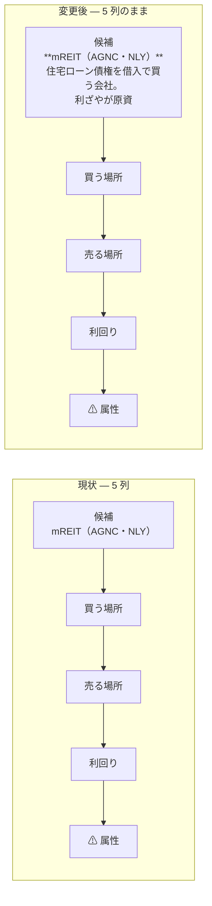

# online-tradable-assets-slides.html に「どんな商品か」の解説を付ける

## 目的・背景

`docs/specs/online-tradable-assets-slides.html` は §14 の一覧 96 件をスライド化したもの。
現状の表は 5 列（候補・買う場所・売る場所・利回り／値動き・⚠ 属性）で、
**候補の列は名前とティッカーだけ**になっている。

- `mREIT（AGNC・NLY）`・`MYGA`・`タックスリーエン`・`CLO ETF（JBBB）` のように、
  名前を見ても**何を買うのか分からない**行が多い
- ⚠ 属性の列は「その 1 件でいちばん効く注意点」であって、商品の説明ではない
- 分類スライド（lead）は分類全体の説明で、1 件ごとの説明ではない

96 件それぞれに **1 行の平易な解説**（何を買っているのか）を付ける。

## 対応方針

### 方針 A: 候補の列に解説を敷く（採用）

6 列目を足すのではなく、**候補の列の名前の下に解説行を敷く**。

> この図の主張: 列は増やさない。候補セルの中を「名前」と「解説」の 2 段にする。

6 列にしなかった理由:

| 案 | 判断 | 理由 |
| --- | --- | --- |
| 6 列目に「どんな商品か」を足す | 却下 | 1280px 幅で 6 列は 1 列あたり平均 213px。`買う場所` の `TreasuryDirect・証券口座` が 3 行に折れる |
| 候補セルを 2 段にする（採用） | 採用 | 列数が変わらない。解説が名前の真下に来て対応が明快 |
| 別スライドに用語集をまとめる | 却下 | 表を見ている最中に参照できない |

### 方針 B: 行の高さが増えるぶん、1 枚あたりの行数を減らす

解説で 1 セルが 2〜3 行伸びる。autofit は 11.5px まで級数を落とすので、
**放置すると全部が読めない大きさになる**。分類ごとの `chunk`（1 枚に載せる行数）を下げる。

⚠ あわせて `chunk` の意味を「固定幅で切る」から**「1 枚あたりの上限行数。端数が出ないよう均等に割る」**に変える。
固定幅だと 17 件 ÷ 5 が `5,5,5,2` になり、最後の 1 枚が 2 行だけになる。均等割りなら `5,4,4,4`。

| §    | 件数 | chunk 現状 | chunk 変更後 | 割り方 | 一覧の枚数 |
| ---- | ---- | ---------- | ------------ | ------ | ---------- |
| 14-1  | 18 | 6 | 5 | 5,5,4,4 | 4 |
| 14-2  | 10 | 5 | 5 | 5,5     | 2 |
| 14-3  | 17 | 6 | 5 | 5,4,4,4 | 4 |
| 14-4  | 4  | 4 | 4 | 4       | 1 |
| 14-5  | 8  | 8 | 4 | 4,4     | 2 |
| 14-6  | 7  | 7 | 4 | 4,3     | 2 |
| 14-7  | 4  | 4 | 4 | 4       | 1 |
| 14-8  | 6  | 6 | 3 | 3,3     | 2 |
| 14-9  | 5  | 5 | 5 | 5       | 1 |
| 14-10 | 7  | 7 | 4 | 4,3     | 2 |
| 14-11 | 10 | 5 | 5 | 5,5     | 2 |

行が少ない表は `table{height:100%}` で行が縦に伸びるので、**4 行以下は上下中央寄せ**（既存の `.vmid`）にする。

### 方針 C: データ構造を 5 要素 → 6 要素にする

`rows` の 1 行を `[候補, 解説, 入口, 出口, 利回り, 属性]` にする。
末尾の自己点検（`r.length!==5`）も 6 に直す。**96 件・6 要素を機械的に数える点検は残す。**

## 解説の書き方

- **何を買っているのか**だけを書く。良し悪し・利回り・注意点は書かない（⚠ 属性の列の仕事）
- 20〜45 字。専門語を使うときはその場でほどく（例: 「CLO＝企業向けローンを束ねて格付け階層に切り分けた証券」）
- ⚠ **値（利回り・価格・金額・年月・比率）は入れない。** 数値の正は元文書 `online-tradable-assets.md` 側にあり、
  スライドに元文書に無い値を足すと突合できなくなる。
  「1 口」「2 つ」「1 枚の絵」のような**数詞は可**（突合の対象になる値ではない）
- 14-2（上場の代替アクセス）は「その資産を扱う**会社**が何をしているか」を書く

## 影響範囲

- `docs/specs/online-tradable-assets-slides.html` のみ
- ⚠ 元文書 `docs/specs/online-tradable-assets.md` §14 の表は**変更しない**。
  解説は数値を含まない説明文なので、元文書との数値の突合には影響しない
- スライド枚数が 30 → 34 枚に増える（本体 21 → 25 枚）。表紙・目次の総数表示は JS が数えるので追随する

## テスト方針

1. **件数の自己点検**（既存を拡張）: 分類 11・データ行 96・DOM 行 96・**DOM の解説 96** が一致することを `window.__deckCheck` で確認
2. **解説の欠落点検**（追加）: 96 行すべてに解説（`r[1]`）が入っており、空文字が無いこと
3. **はみ出しと級数**: Playwright で 36 枚を 1 枚ずつ表示し、`.sbody` のはみ出しが 0px、`table.grid` の実級数が 13.5px を下回らないこと
4. **元文書との突合**: 96 行から解説を機械的に取り除いたものが `HEAD` の 96 行と 1 バイト差なく一致すること（＝**値を 1 つも動かしていない**）

### 結果（2026-08-31）

| 点検 | 結果 |
| --- | --- |
| `window.__deckCheck` | `{categories:11, rows:96, domRows:96, descs:96, slides:36, errors:[], ok:true}` |
| はみ出し | 36 枚すべて 0px |
| 実級数 | 最小 **15.0px**（§14-2 一覧 1）／ 最大 19.0px。13.5px 未満は 0 枚 |
| 解説の長さ | 最短 9 字・最長 44 字・平均 27.8 字 |
| 値を動かしていないこと | 解説を外した 96 行が HEAD と **96/96 一致**。数値トークン **324 個で増減なし**（解説側に足した 5 個は「1 本」「1 件」「1 口」「2 つ」「1 枚」の数詞） |
| 枚数 | 30 → **36 枚**（前段 6・本体 21 → **27**・後段 3）

## Phase

- Phase 1: 96 件の解説を書く
- Phase 2: データ構造を 6 要素にし、`table()` と CSS と自己点検を直す
- Phase 3: chunk を下げて枚数を調整、表示を確認する
