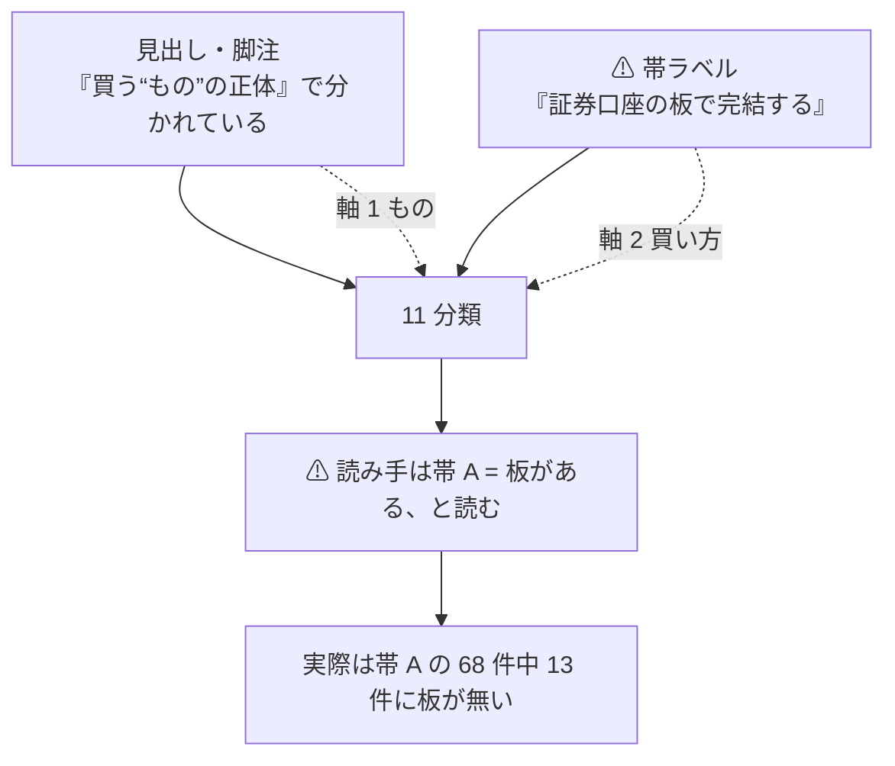
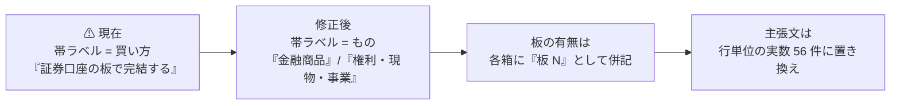

# 「11 分類の全体像」スライドの 68 件 / 28 件を、数え方を確定して直す

作成日: 2026-09-01。対象: [docs/specs/online-tradable-assets-slides.html](../specs/online-tradable-assets-slides.html) の **「11 分類の全体像」1 枚のみ**（`data-title="11 分類の全体像"`、`docs/specs/online-tradable-assets-slides.html:239-289`）。

## 1. 目的と背景

現在の主張文はこうなっている。

> 96 件のうち **68 件は同じ証券口座の板で完結し**、残り 28 件は専門の板か相対取引になる。

そして SVG の帯ラベルが `A. 証券口座の板で完結する — 7 分類・68 件` / `B. 専門の板・相対取引 — 4 分類・28 件`。

### ⚠ 68 / 28 という数字自体は正しい

| 帯 | 分類 | 件数 |
| --- | --- | --- |
| A | 14-1（18）+ 14-2（10）+ 14-3（17）+ 14-4（4）+ 14-5（8）+ 14-6（7）+ 14-7（4） | **68** |
| B | 14-8（6）+ 14-9（5）+ 14-10（7）+ 14-11（10） | **28** |

**壊れているのは数字ではなくラベルのほう。**「68 件は同じ証券口座の板で完結し」は**行単位の断定**なのに、根拠は**分類単位の合計**でしかない。

### ⚠ 行単位で数えると成り立たない

`CATS` 配列の 96 行を機械的に数えた実数。

| 数え方 | 実数 | 68 と一致するか |
| --- | --- | --- |
| 出口列が「板」 | **56** | ❌ |
| 入口列に「証券口座」 | **49**（表記の解釈で 49〜52 に揺れる） | ❌ |
| 入口が証券口座 **かつ** 出口が板 | **47** | ❌ |
| 帯 A（68 件）のうち出口が板 | **55** | ❌ **13 件に板が無い** |
| 帯 B（28 件）のうち出口が板 | **1**（予測市場） | — |

帯 A に混じっている**板が無い 13 件**の内訳。

| 分類 | 件数 | 該当 |
| --- | --- | --- |
| 14-1 | 1 | BDC「平均 12.6%」（括り。入口・出口とも `—`） |
| 14-3 | 5 | I Bonds・EE Bonds（財務省が償還）／ MMF（随時）／ ブローカード CD（新発は par）／ 仕組債（⚠ 板が無い） |
| **14-4** | **4** | ⚠ **保険・年金は 4 件すべて板が無い**（発行体が買い取る／換金困難／オンチェーン） |
| 14-5 | 1 | 現物金・銀（ディーラーが常時買い取る） |
| 14-7 | 2 | NFT（板の厚みは未取得）／ トークン化不動産（二次流通は実在） |

⚠ **とくに 14-4 保険・年金は入口も「保険会社・仲介」で、証券口座ですらない。**14-7 暗号資産の入口も「取引所・オンチェーン」であって証券口座ではない。**帯 A のラベルは 2 分類・8 件について端的に誤り。**

### ⚠ 根本原因 — 同じスライドの中で軸が 2 本ある

このスライドは見出しで **「11 分類は『買う"もの"の正体』で分かれている」** と言い、SVG の脚注でも **「⚠ 利回りの高さでも、買いやすさでも分けていない」** と書いている。
それなのに**帯ラベルだけが「買い方（証券口座の板か）」で名前を付けている**。

> この図の主張: 分類は「もの」の軸で切られているのに、帯ラベルだけ「買い方」の軸で名前が付いている。軸が 2 本あるのが原因。

⚠ **元文書 `online-tradable-assets.md` §14 に A / B の帯は存在しない。**68 / 28 の区切りはスライドを作るときに足したもの。よって**この修正で元文書は一切触らない**。

## 2. 確定する数え方

**「板があるか」は、各分類の表の『売る場所（出口）』列が「板」を含むかで数える。**これを唯一の数え方とする。

| 判定 | 規則 |
| --- | --- |
| ✅ 数える | 出口列に「板」がある（`板` / `同左・板` / `板・償還権`） |
| ❌ 数えない | `板が無い`（仕組債）／ `板ではない`（住宅ローン債権）／ `板の厚みは未取得`（NFT）／ `掲示板方式`（美術品の分割所有） |

⚠ **入口列は数え方に使わない。**表記が `証券口座` / `同上` / `Fidelity・Schwab` / `証券口座（NYSE Arca）` と揺れており、機械的に数えると 49〜52 でぶれる。**再現できない数え方は採らない。**

### この規則での実数（確定値）

| 分類 | 件数 | 板 |
| --- | --- | --- |
| 14-1 | 18 | 17 |
| 14-2 | 10 | 10 |
| 14-3 | 17 | 12 |
| 14-4 | 4 | **0** |
| 14-5 | 8 | 7 |
| 14-6 | 7 | 7 |
| 14-7 | 4 | 2 |
| **帯 A 小計** | **68** | **55** |
| 14-8 | 6 | 0 |
| 14-9 | 5 | 0 |
| 14-10 | 7 | 0 |
| 14-11 | 10 | 1 |
| **帯 B 小計** | **28** | **1** |
| **合計** | **96** | **56** |

## 3. 対応方針

**帯そのものは残す**（SVG のレイアウトが 7 箱 + 4 箱で組まれており、分類の並びは元文書どおりで正しい）。**直すのはラベルと主張文、そして「板がいくつか」を図の中に出すこと。**

> この図の主張: 帯の名前を「もの」の軸に戻し、「板があるか」は各箱の中に数字として別に出す。軸を混ぜない。

| # | 直す箇所 | 前 | 後 |
| --- | --- | --- | --- |
| 1 | `p.claim` | 96 件のうち 68 件は同じ証券口座の板で完結し、残り 28 件は専門の板か相対取引になる。 | ⚠ 分類の境目と「板があるか」は別の軸。板があるのは 96 件中 **56 件**で、帯 A の 68 件にも板の無い 13 件が混じる。 |
| 2 | 帯 A のラベル | A. 証券口座の板で完結する — 7 分類・68 件 | A. **金融商品**（発行体・運用者が作ったもの） — 7 分類・68 件 / **板 55** |
| 3 | 帯 B のラベル | B. 専門の板・相対取引 — 4 分類・28 件。⚠ 板が無いもの・作業が要るものが集まる | B. **権利・現物・事業そのもの**（1 件ごとに中身が違う） — 4 分類・28 件 / **板 1** |
| 4 | 11 個の箱 | 件数のみ | 件数に加えて左下に `板 N` を小さく併記 |
| 5 | SVG 脚注 | 分類の境目は「買う"もの"の正体」。⚠ 利回りの高さでも、買いやすさでも分けていない。 | 同左に**数え方の定義**を追記 — 「板の件数は各表の『売る場所』列が『板』の行を数えたもの」 |

⚠ **#1 の「56 件」は、この 1 枚だけの主張ではなく他スライドと突き合う数字になる。**分類ごとの表（本体 21 枚）を数え直せば必ず 56 になることを、テストで機械的に担保する（§5）。

## 4. 影響範囲

| 対象 | 扱い |
| --- | --- |
| `docs/specs/online-tradable-assets-slides.html` の「11 分類の全体像」1 枚 | ✅ **修正する**（claim 1 行 + SVG の帯ラベル 2 本 + 箱 11 個 + 脚注 1 行） |
| 同ファイルの他の 35 枚 | ❌ 触らない。⚠ ただし 68 / 28 が他所にも出ていないか grep で確認する |
| 同ファイルの `CATS` 配列（96 行のデータ） | ❌ **触らない**。数え方を変えるだけでデータは動かさない |
| `docs/specs/online-tradable-assets.md`（元文書） | ❌ **触らない**。A / B の帯は元文書に存在せず、数値の正は元文書側 |
| `docs/plans/market-data-availability.md` | ⚠ 未確定 #6 に「別 TODO として起票する」と書いてある。**本タスクの完了でその参照先が解決する**ので、リスク欄を更新する |
| `TODO.md` / `DONE.md` | ✅ 更新 |

## 5. テスト方針

**表示を目視するだけでは、数字が合っているかは分からない。**機械的に検算する。

| # | 検証 | 方法 | 期待値 |
| --- | --- | --- | --- |
| 1 | データが動いていない | 修正の前後で `CATS` の行数と各分類の件数を比較 | 96 / 18・10・17・4・8・7・4・6・5・7・10 で不変 |
| 2 | 板の件数が規則どおり | §2 の規則で `CATS` から数え、スライドに書いた数字と突き合わせる | 17・10・12・0・7・7・2・0・0・0・1、A 55 / B 1 / 計 **56** |
| 3 | 帯の合計が合う | 箱の件数の合計 | A = 68、B = 28、計 96 |
| 4 | ⚠ 古い数字が残っていない | `grep '68 件\|証券口座の板で完結'` | ヒット 0 件 |
| 5 | HTML が壊れていない | ブラウザ / vibeboard で該当スライドを開き、SVG が描画され文字が箱からはみ出していないことを目視 | 崩れなし |

## 6. ⚠ 未確定・この修正では扱わないこと

| # | 内容 | 扱い |
| --- | --- | --- |
| 1 | ⚠ **小売 FX・CFD** の出口が「板」と書かれているが、実態は業者との相対で公開された中央板は無い | **今回は直さない。**§2 の規則どおり「板」として数える。⚠ 直すなら `CATS` のデータ側の修正になり、元文書 §14-6 との突合が要る。**別 TODO として起票する** |
| 2 | ⚠ **スニーカー（StockX）** は出口が「同左」表記だが、属性に「本物の bid/ask を持つ」と明記があり実質は板 | 同上。**今回は数えない。**⚠ #1 と同じ理由で別 TODO |
| 3 | 帯 A の新ラベル「金融商品」が 14-7 暗号資産に厳密に当てはまるか（発行体がいないものがある） | 「買う"もの"の正体」の軸としては成立すると判断して採る。⚠ より良い名前が出たら差し替える |
| 4 | 板があっても厚みは別問題（FPI・LAND は「上場 2 社のみで板が薄い」と明記） | このスライドの論点ではない。各分類の表に既に書いてある |
