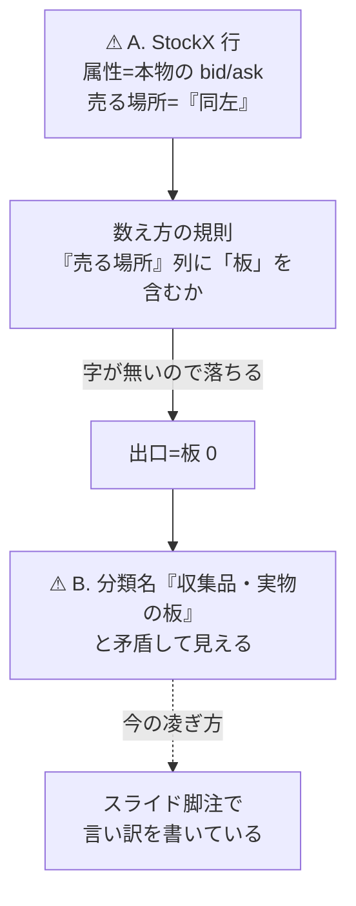
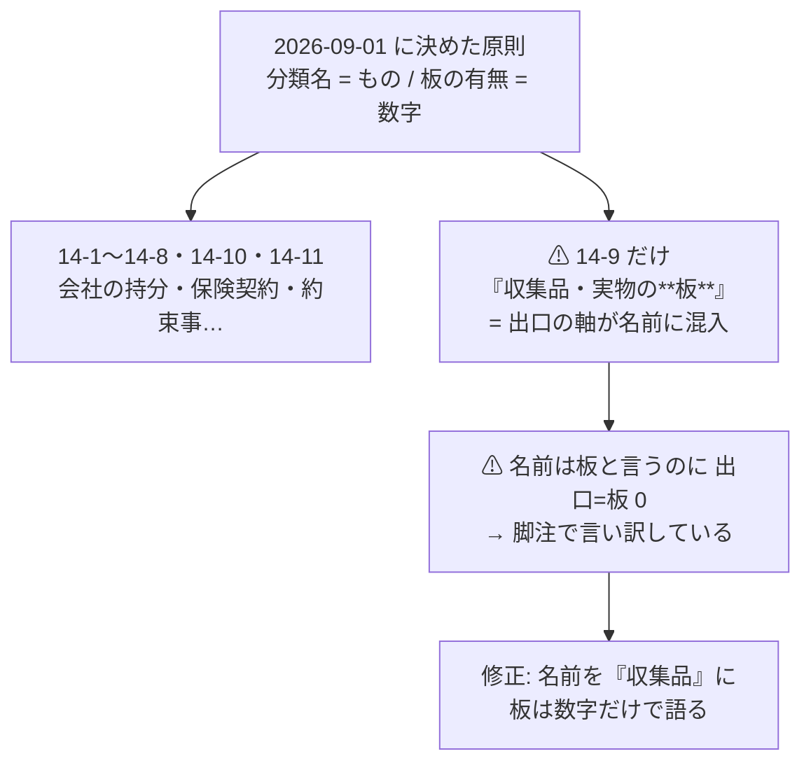
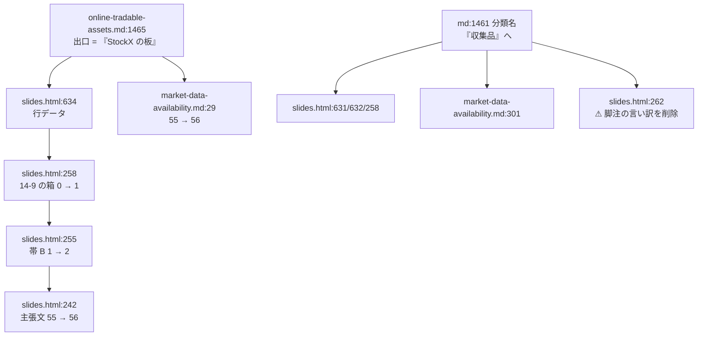

# スニーカー / StockX（§14-9）の出口表記と分類名を直す

作成日: 2026-09-01。対象: [docs/specs/online-tradable-assets.md](../../specs/online-tradable-assets.md) §14-9 の 3 箇所と、そこから波及する 8 箇所。

⚠ **先行タスク [fx-cfd-exit-notation.md](fx-cfd-exit-notation.md) の「§5 この作業では決めないこと」で別 TODO として起票された項目**である。同じ「出口=板」の数え方の問題だが、判断の中身（「同左」を板と読むか）が違うので分けた。

## 1. 目的と背景

TODO の 1 行は、**互いに絡んだ 2 つの食い違い**を指している。片方だけ直すと辻褄が合わない。

### 前提 — 「出口=板」の数え方（2026-09-01 に確定）

> 各分類の表の **『売る場所』列に「板」の文字を含むか**。ただし除外リスト（`板が無い` / `板ではない` / `板の厚みは未取得` / `掲示板方式`）に当たる行は数えない。

grep で検算できるよう、あえて文字列マッチにしてある（[slides-overview-count-fix.md](slides-overview-count-fix.md)）。⚠ **この規則が今回の問題の発生源である。**

### 問題 A — StockX の出口が「同左」

`online-tradable-assets.md:1465` は、同じ 1 行の中で逆のことを言っている。

| 列 | 記述 |
| --- | --- |
| 買う場所 | **StockX**（⚠ **本物の bid/ask を持つ**）← **板であると明言している** |
| 売る場所 | 同左 ← ⚠ **「板」の字が無いので数えられない** |

### 問題 B — 分類名が「収集品・実物の板」なのに 出口=板 0

§14-9 の 5 行を規則にかけると全滅する。

| 行 | 売る場所の表記 | 判定 |
| --- | --- | --- |
| スニーカー | 同左 | ⚠ 「板」の字が無い |
| トレーディングカード | 同左 | ⚠ 同上 |
| 時計 | ⚠ 板の厚みは未取得 | 除外リスト |
| 美術品の分割所有 | ⚠ 掲示板方式 | 除外リスト |
| ワイン・クラシックカー・楽器 | 同左 | ⚠ 「板」の字が無い |

結果、スライドの 14-9 の箱は `⚠ 出口=板 0`。**分類名に「板」と書いてある分類の板が 0 件**という見た目になり、現在はスライド脚注（`:262`）で言い訳を書いて凌いでいる。

> この図の主張: A を直すと B も自動的に解消する。だから 2 つを分けて扱えない。

### ⚠ 案 2（数え方の規則を変える）を採らない理由

「同左」を買う場所欄に読みに行く形へ規則を変える道もあるが、採らない。
⚠ **§14 全体に「同左」が 11 行ある**（14-8:1・14-9:4・14-10:1・14-11:5）。
14-11 の官公庁払い下げ・返品在庫・ゲーム内アイテムまで再判定になり、合計 55 件が広範囲に動く。
**先行タスクと同じく「データ側を直して規則は動かさない」を採る。**

## 2. 対応方針

### Phase 1 — 元文書 `online-tradable-assets.md` の 3 箇所

#### 1-a. スニーカーの出口（`:1465`）— 属性の記述を出口欄へ**移す**

| | 買う場所 | 売る場所 |
| --- | --- | --- |
| 現在 | **StockX**（⚠ **本物の bid/ask を持つ**） | 同左 |
| 修正後 | **StockX** | **StockX の板**（⚠ **本物の bid/ask を持つ**） |

⚠ **複製ではなく移動である。**「bid/ask を持つ」は入口ではなく**出口の性質**なので、置き場所としてもこちらが正しい。「板」の字が入り、除外リストに当たらないので 1 件として数えられる。

#### 1-b. トレーディングカードの出口（`:1466`）

| | 売る場所 |
| --- | --- |
| 現在 | 同左 |
| 修正後 | ⚠ **出品型。常設の買い注文があるかは未確認** |

⚠ **板として数えない。**[market-data-availability.md](../../specs/market-data-availability.md):306 はカードを TCGplayer の商品 ID 経由（L2 日足）で捉えており、**bid/ask があるという一次情報を当てていない**。「板」の字を含めないので、規則にも除外リストにも触れずに落ちる。

#### 1-c. 分類名（`:1461`）

| | 名前 | 一言（スライドの essence） |
| --- | --- | --- |
| 現在 | 14-9. **収集品・実物の板** | 現物の板 |
| 修正後 | 14-9. **収集品** | 収集の対象 |

⚠ **「板が 1 件しか無いから名前を弱める」のではない。**2026-09-01 の帯ラベル修正で
**「分類の境目は買う"もの"の正体。板の有無は別軸として数字で出す」**と決めたのに、
**11 分類のうち 14-9 だけが分類名に出口の軸（板）を混ぜている。**
他の 10 個は「会社の持分」「保険契約」「約束事」「トークン」と、すべて"もの"で名付けられている。

> この図の主張: 14-9 の名前は 2026-09-01 に決めた原則そのものに違反している。名前を直せば矛盾も脚注も消える。

### Phase 2 — 波及する 8 箇所

14-9 の板が **0 → 1**、合計が **55 → 56** に動く。⚠ **先行タスク（FX・CFD）とは逆向き**（あちらは減、今回は増）。

| # | 箇所 | 現在 | 修正後 |
| --- | --- | --- | --- |
| 1 | `slides.html:634` スニーカー行の出口 | `同左` | Phase 1-a と同じ（HTML 装飾版） |
| 2 | `slides.html:635` カード行の出口 | `同左` | Phase 1-b と同じ |
| 3 | `slides.html:631` `CATS` の title / essence | `収集品・実物の板` / `現物の板` | `収集品` / `収集の対象` |
| 4 | `slides.html:632` `CATS` の claim | `現物の板がある分類。` | ⚠ **`板を持つのは StockX（スニーカー）だけ。`**（5 件中 1 件であることを明示） |
| 5 | `slides.html:258` 14-9 の箱 | `⚠ 出口=板 0`（赤 `#a2371a`）＋ 箱内タイトル | `出口=板 1`（灰 `#5f6775`）＋ タイトル差し替え |
| 6 | `slides.html:255` 帯 B のラベル | `板なのは 1（予測市場のみ）` | `板なのは 2（予測市場・スニーカー）` |
| 7 | `slides.html:242` 主張文 | `96 件中 55 件` | `56 件`。⚠ **`板の無い 14 件` は据え置き**（帯 A 側の数字で、今回動くのは帯 B） |
| 8 | `slides.html:262` 脚注 | `⚠ 14-9 は分類名に「板」とあるが…0 になる。14-4 は…` | ⚠ **14-9 の一文を削除**し、14-4 の一文だけ残す |
| 9 | `market-data-availability.md:29` | `§14 で板ありとした 55 件` | `56 件` |
| 10 | `market-data-availability.md:301` 見出し | `§14-9 収集品・実物の板（5 件）` | `§14-9 収集品（5 件）` |

> この図の主張: 元文書の 3 セルを直すが、そこを参照している箇所が 10 あり、同時に動かさないと食い違う。

## 3. 影響範囲

### 触るファイル

| ファイル | 箇所 |
| --- | --- |
| `docs/specs/online-tradable-assets.md` | 3（§14-9 の見出し 1 ＋ 表の 2 行） |
| `docs/specs/online-tradable-assets-slides.html` | 7（`CATS` 4 ＋ 全体像スライドの SVG 3） |
| `docs/specs/market-data-availability.md` | 2（§0 の結論 2 ＋ §14-9 の見出し） |

### ⚠ 触らないもの

| 対象 | 理由 |
| --- | --- |
| `market-data-availability.md:305` StockX の粒度**未確認** | ⚠ **別軸。**「出口が板か」と「過去データが取れるか」は独立で、公式 API が申請・審査制（D27）であることは変わらない |
| 同 `:436` `:472` `:516` `:522` `:525` の `14-9-N` 参照 | 番号は不変。中身も出口の表記に依存しない |
| `DONE.md:73` の 2026-09-01 の記録（`⚠ 14-9 は分類名が…`） | ⚠ **完了日付きの作業ログなので書き換えない。**その時点で正しかった記録として残し、今回は新しい日付で追記する（先行タスクと同じ扱い） |
| `docs/plans/archive/` の各プラン | 同上。作業当時の記録 |
| 数え方の規則そのもの・除外リスト | §2 の「案 2 を採らない理由」のとおり |
| 時計・美術品・ワインの 3 行 | 既に `板の厚みは未取得` / `掲示板方式` で除外済み。判定は変わらない |
| §14-12 以降・型判定 | 出口の表記に依存しない |

## 4. テスト方針

⚠ **目視では数字の整合は分からない。機械的に検算する。**

| # | 検証 | 期待値 |
| --- | --- | --- |
| 1 | `CATS` から出口列を抽出し除外リストで数える | 分類別 **17/10/12/0/7/6/2/0/1/0/1 = 56**、帯 A **54** / 帯 B **2** |
| 2 | 行数と分類別件数が不変 | **96**、18/10/17/4/8/7/4/6/5/7/10 |
| 3 | 古い表記が残っていないか（⚠ `docs/plans/archive/` と `DONE.md` を除く） | `板なのは 1`・`96 件中 55 件`・`板ありとした 55 件`・`収集品・実物の板`・`現物の板` のヒット **0** |
| 4 | 元文書とスライドの §14-9 の 5 行が商品名で一致 | 5/5 |
| 5 | SVG の XML パース | エラー 0 |
| 6 | 箱からの文字はみ出し目視 | 崩れなし |
| 7 | `git diff --stat` で想定外の行が動いていないか | 変更行が想定の 12 行のみ |

⚠ **検算スクリプトは使い捨てとし、リポジトリには残さない**（`experiments/` は 2026-08-27 の方針変更以降、新規追加しない）。

## 5. ⚠ この作業では決めないこと — 別 TODO に起票する

**トレーディングカードは、確認が取れれば 2 件目になる余地がある。**
買う場所欄に StockX が入っており、その StockX には bid/ask があると本書自身が書いている。
⚠ **ただし StockX がカードで常設の買い注文を持つことの一次情報を当てていないので、断定せず「未確認」で置く。**
先行タスクが FX 行から CFD の可否を切り出したのと同じ扱いとする。
