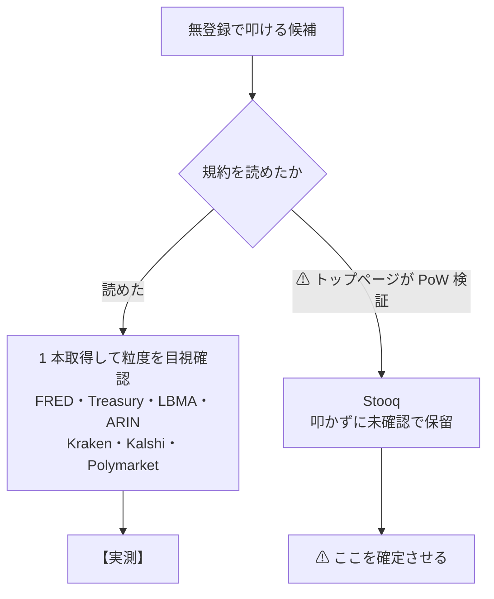
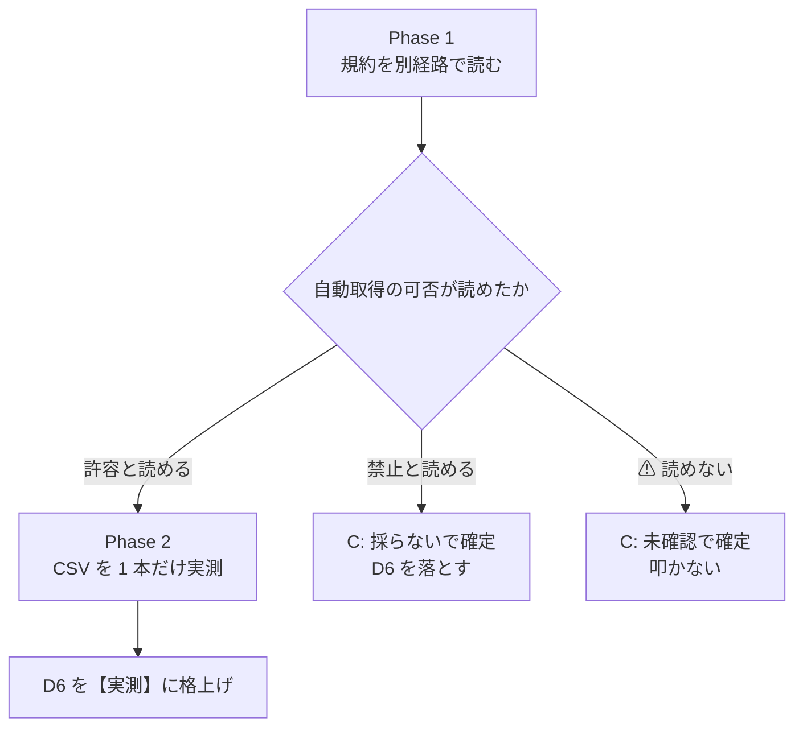

# Stooq の判断を確定させる — 規約を別経路で読み、実測するかを決める

> 2026-09-01 完了。**Phase 1 で `robots.txt` が `User-agent: * / Disallow: /` であることを実測し、Phase 2（CSV 実測）には進まず「採らない」で確定した。**結果: [docs/specs/market-data-availability.md](../../specs/market-data-availability.md)（D6 / 3-2 / A-1 / §0 / §5）

作成日: 2026-09-01。対象文書: [docs/specs/market-data-availability.md](../../specs/market-data-availability.md)（D6 / 3-2 / A-1 / §0 / §5）

## 1. 目的・背景

Stooq は **URL を叩くだけで株価 CSV が返る**とされ、⚠ **米国上場株（S1・45 件）で唯一の「無登録」候補**である。
2026-09-01 の調査では、**トップページが JavaScript の proof-of-work による bot 検証を要求**したため規約本文に到達できず、データ用エンドポイントを叩かないまま **【未確認】** で置いた。

⚠ **止まった理由は方針違反ではない。**Stooq は登録も課金も要らないので 2026-08-27 の方針には触れない。
引っかかったのは §3 で自分が引いた線 —「無登録・無認証で叩ける公開エンドポイントから 1 本取る。**ただし規約を確認したうえで**」— の**前提条件のほう**である。

> この図の主張: 他の 7 経路は「規約を読む」を通過して実測に進んだが、Stooq だけ入口で止まっている。

## 2. ⚠ 確定させても 96 行の判定は動かない

先に効果の範囲を確定させておく。**これは粒度の調査ではなく、§0 の看板 1 つの正確さの問題である。**

| 動かないもの | 理由 |
| --- | --- |
| S1 の 45 件の粒度 | 既に **L0**（D1 Massive・D2 Databento の tick）。Stooq は 5 分足＝ **L1** で、取れても粒度は上がらない |
| L0〜L5 の件数 | 同上。**96 件の集計は不変** |

| 動くもの | 現状の記述 |
| --- | --- |
| §0 の ⚠ 1 点目 | 「米国株は無償でも必ずアカウント登録を要求する」 |
| A-1 の締め | 「S1 の 45 件は、無償の経路がすべて『要登録』に着地した」 |
| D6 の行 | 【未確認】→【実測】または「採らない」 |
| §5 検証 #3 | 「到達できなかった Stooq・Fiscal Data のパスは【未確認】」 |

## 3. ⚠ 規約・法令の論点（先に指摘する）

**proof-of-work の bot 検証は、運営が自動アクセスを想定していないことの技術的な意思表示である。**
これを迂回して取得するのは「公開エンドポイントを 1 本叩く」とは性質が違う。**規約本文が読めない状態では行わない。**

⚠ **ただし区別が要る。**PoW が出たのは**トップページ（HTML）**であって、**CSV エンドポイントが同じ壁の裏にあるかは未確認**である。CSV 側が素通しなら通常の公開 URL への 1 リクエストになる。この区別自体を Phase 2 で確定させる。

## 4. 対応方針

**A →（通れば）B、通らなければ C。**

⚠ **Phase 2 に自動では進まない。**Phase 1 の結果を提示して判断を仰ぐ。

### 経路（すべて無登録・無課金）

| # | 経路 | 内容 |
| --- | --- | --- |
| 1 | **Wayback Machine** | PoW 導入前の規約ページの写しを読む。CDX API で規約に当たるパスを探す |
| 2 | **規約パスを直接叩く** | トップ経由でなく規約ページの URL を直接。⚠ PoW が全 HTML に掛かるのか、トップだけかも同時に分かる |
| 3 | **運営の別ドメイン** | 同一運営の別ドメインに同じ規約が置かれていないか |

### ⚠ ついでに確認すること

FRED（D10）は無登録・実測済みなので、**株価指数の系列なら無登録経路が既にある**可能性がある【推測・未確認】。
個別銘柄ではないので §0 の「tick」の記述は揺らがないが、**「米国株はどの経路でも認証の壁の向こう」という言い方が広すぎる**かもしれない。Phase 1 のついでに確認する。

## 5. Phase

| Phase | 内容 | 進む条件 |
| --- | --- | --- |
| **Phase 1** | 規約を別経路で読む（Wayback・直接パス・別ドメイン）＋ FRED の株価指数系列を確認 | — |
| **Phase 2** | ⚠ **Phase 1 で許容と読めた場合のみ**、CSV を 1 本取得して粒度・履歴を目視確認 | ユーザー判断 |
| **Phase 3** | 結果を D6・3-2・A-1・§0・§5 に反映する | — |
| **Phase 4** | TODO / DONE の更新 | — |

## 6. 影響範囲

⚠ **編集するのは `docs/specs/market-data-availability.md` の 1 ファイルだけ。**

| 箇所 | 直す内容 |
| --- | --- |
| 付録 A-1 の D6 行 | 粒度・履歴・費用・認証・規約・出典を結果で埋める |
| 付録 A-1 の締め | 「無償の経路がすべて要登録」が維持できるかを書き直す |
| 3-2 実測を見送ったもの | Stooq の行を結果に差し替え（残るなら理由を更新） |
| §0 の ⚠ 1 点目 | 「必ずアカウント登録を要求する」の断定を結果に合わせる |
| §5 検証 #3 | 【未確認】の対象から Stooq を外すか、理由を更新 |

## 7. テスト方針

| # | 検証 | 方法 |
| --- | --- | --- |
| 1 | **規約の出典が残っている** | D6 の出典列に URL と取得日が入っていること。Wayback 経由ならスナップショット日も書く |
| 2 | ⚠ **【実測】と【公表値】が混ざっていない** | Phase 2 を実施した場合のみ【実測】。読んだだけなら【公表値】 |
| 3 | **§0 と A-1 の記述が一致** | 「要登録」の断定が両方で同じ強さになっていること |
| 4 | ⚠ **PoW を迂回していない** | Phase 2 を行った場合、CSV エンドポイントが PoW の裏に無かったことを記録していること |
