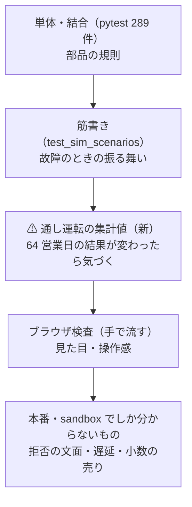
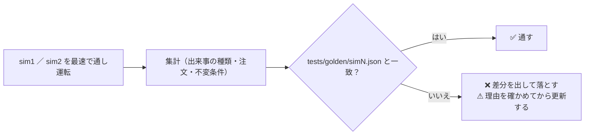

# 自動テストを 1 コマンドにまとめ、通し運転の回帰と抜けている筋書きを足す

作成日: 2026-09-20。利用者の指示（2026-09-20）: **「見た目は分かったので自動でテストを回せるものはある？」→ 提案の 1・2・3 とも「やります」**。
関連: [live-trading.md §0-7](../../specs/experiments/live-trading.md)（シミュレーションの決めごと・筋書き）・[dashboard.md §13-7](../../specs/dashboard.md)。

✅ **2026-09-20 に Phase 1〜4 を実装して閉じた**。仕様の正本は [live-trading.md §0-7 (k)](../../specs/experiments/live-trading.md)。

| 段 | 結果【実測 2026-09-20・Sx360】 |
| --- | --- |
| `./run-tests.sh` | 既定 1 分 34 秒（執行器 31s ／ 管理画面 7s ／ selftest 23s ／ mockrun 33s）・`--fast` 38 秒・`--full` **2 分 3 秒** |
| 黄金の集計値 | `test_sim_golden.py` 12 件（2 本の通し運転で 28 秒）。`tests/golden/sim{1,2}.json` を作った |
| 限界の通し運転 | `test_sim_limits.py` 7 件（6 秒） |
| 執行器の pytest | 115 → **122 件 ＋ skip 12**（黄金は `AIL_GOLDEN=1` のときだけ） |

**検算（§5）も実施**: わざと落ちるテストを混ぜて `run-tests.sh` が ❌ と終了コード 1 を出すこと ／ `sim_a` の θ を 50 → 60 にすると黄金値が落ちること（⚠ どちらも確認後すぐ戻した）。

**プランとの違い（回して分かったこと）**:

| # | 違い | なぜ |
| ---: | --- | --- |
| 1 | ⚠ **`over_budget` は到達できない**ことが分かった | 予算は `target = min(per_symbol, available)` の**丸め**で先に守られる ＝ 枠で 1 株も買えないときは `too_small`。テストは「**出ないこと**」を固定した（消すか別の守りに使うかは**利用者の裁定**） |
| 2 | ⚠ **1 日に 2 つの窓は「15:45〜16:05 ET の中」でしか動かない** | 運転手は何時でも起こせるが、執行器の窓が固定（`run_day.WINDOW_START/END`）。10:00 の窓は `out_of_window` で拒まれる ＝ **C9・D13 に進むときは執行器を広げる必要がある**。その印として「窓の外は拒む」検査を足した |
| 3 | 停止の解除の証拠を「注文が戻る」から「**起動して `halted` が消える** ＋ 売買が戻る」にした | 合図が「毎日買う」だけだと、持ち切った後は解除しても注文が出ない（1 日おきに売買する合図に変えた） |
| 4 | `over_day_cap` は通し運転から確かめられなかった | 運転手は子へ `LT_*` を渡さず、`--max-day-usd` の通し方が無い（⚠ 単体テスト `test_plan.py` にはある。通す口を足すかは別の判断） |
| 5 | ⚠ **テストの隔離漏れをもう 1 件見つけて直した** | `tests/test_sim_run_day.py` が「本物の `MODE` が無い」前提 ＝ **シミュレーション専用機では必ず落ちる**（`dashboard/tests/test_demo.py` と同じ型） |

## 0. 目的・背景 — 「落ちないこと」しか見ていない

いま自動で回っているもの【実測 2026-09-20・Sx360】:

| いま | 件数 ／ 時間 | 何を見ているか |
| --- | ---: | --- |
| 執行器 `experiments/live-trading/tests` | 115 件 ／ 24 秒 | 合成規則・状態機械・予算・鍵・HALT・再送・筋書き 11 個（`test_sim_scenarios.py` 16 件） |
| 管理画面 `dashboard/tests` | 174 件 ／ 7 秒 | 面の判定・JWT・記録と判定・期間・秘密 |
| `selftest.sh`（サンプル） | 23 秒 | 資格情報なしでモックに 6 手順 |
| `mockrun.sh`（執行器） | 34 秒 | モックで 20 営業日 |
| `run-sim.sh`（通し運転） | 64 営業日 | ⚠ **記録の印と秘密の不在だけ**（`simctl.py check`） |

⚠ **穴が 3 つある**:

1. **3 つの venv・5 つのコマンドに散っている** ＝ 全部を回す習慣が作れない
2. ⚠ **通し運転（64 営業日）は「落ちないこと」しか見ていない** — 執行器を触って**振る舞いが変わっても気づかない**（注文が半分になっても、警告が出なくなっても通る）
3. ⚠ **執行器が出しうる出来事 25 種類のうち 13 種類が通し運転で一度も出ていない**【実測】。うち 8 つは**テストにも文字列が無い**（`over_budget`・`no_quote`・`no_signal`・`signal_error`・`ledger_error`・`quote_failed`・`quote_client_failed`・`after_read_failed`）

> この図の主張: 層ごとに「何を守るか」を分け、通し運転には**集計値の回帰**という役目を与える（いまは空白）。

## 1. Phase 1 — `./run-tests.sh`（1 コマンドで全部）

> この図の主張: 段は独立していて、1 つ落ちても最後まで走り、最後に表で報告する。⚠ 本物のモードにも動いている画面にも触らない。

| 決めごと | 中身 |
| --- | --- |
| 置き場 | プロジェクト直下 `run-tests.sh`（`run-server.sh`・`run-sim.sh` と揃える） |
| 既定 | **pytest 2 つ ＋ selftest ＋ mockrun**（約 90 秒【実測の合計】）。⚠ 途中で落ちても**最後まで走る**（どこが壊れたか一度で分かる） |
| `--fast` | pytest 2 つだけ（約 31 秒） |
| `--full` | ＋ 通し運転（`run-sim.sh --fresh --speed max --no-dashboard`）と黄金の集計値（Phase 2） |
| ⚠ 触らないもの | **本物の `MODE`・`run.lock`・記録**（`run-sim.sh` と同じ守り）。⚠ **動いている管理画面（3012）と vibeboard（3010）のポートを奪わない** |
| 報告 | 段ごとに ✅ ／ ❌ ／ ⏭（飛ばした）と秒数の表。1 つでも ❌ なら終了コード 1 |
| 依存が無いとき | venv が無い段は ⏭ にして理由を出す（⚠ **黙って通さない**） |

## 2. Phase 2 — 黄金の集計値（通し運転の回帰）

> この図の主張: 通し運転の結果を数えて、**覚えてある値と突き合わせる**。⚠ 値が変わったら、直す前に「なぜ変わったか」を人が確かめる。

| 何を固定するか | 例 | なぜ |
| --- | --- | --- |
| **筋書きが効いた証拠**（値段に依らない） | `out_of_window` 2（半日立会）・`journal_recovered` 1・`auth_failed` 1・`auth_5xx_retry` 1・起動しなかった日 1・`position_short` は BAC だけ・`drawdown_warning` は `sim_b` だけ | ⚠ **仕込みが静かに効かなくなるのを捕まえる** |
| **決めごとの不変条件**（値段に依らない） | 1 注文 1 トレーダー（`parts` は必ず 1 件）／ 整数株の人の建玉に端数が無い（`QTY_TOL` 内）／ 口座 − 台帳の差が全銘柄 0 ／ 全行に `sim`・`mock`・`test` ／ 秘密が出ていない | ⚠ 2026-09-19 に直した 3 つの穴（§0-7 (j)）の回帰 |
| **集計値**（⚠ 値段に依る） | 種類ごとの件数・トレーダー別の注文数・約定数 | 振る舞いの変化に気づく。⚠ **日足が調整し直されると変わりうる**ので、変わったら理由を確かめてから更新する |
| 更新の仕方 | `AIL_UPDATE_GOLDEN=1` で書き直す（⚠ **既定では書かない**） | ⚠ 落ちたら黙って更新する、を防ぐ |

| 決めごと | 中身 |
| --- | --- |
| 置き場 | `experiments/live-trading/tests/test_sim_golden.py` ＋ `tests/golden/sim1.json`・`sim2.json` |
| 日足が無い機械 | ⚠ **skip**（理由を出す）。日足は git 管理外 |
| 時間 | sim1 ＋ sim2 で約 20〜40 秒【推測】＝ ⚠ **既定の pytest には入れない**（`-m golden`。`run-tests.sh --full` で回す） |
| ⚠ 触らない | `LT_MODE_DIR` を tmp に向ける（本物の `MODE`・`run.lock` に触らない） |

## 3. Phase 3 — 抜けている筋書きを足す

| # | 足すもの | 確かめること | ⚠ 注意 |
| ---: | --- | --- | --- |
| A2 | **予算の上限** | 予算の小さいトレーダーで `over_budget` が出る・上限を超える買いが 1 件も通らない・翌日も同じ | ⚠ **`over_budget` は記録にもテストにも無かった**。⚠ 1 日に何回売買しても上限は同じ（CLAUDE.md の約束） |
| A3 | **1 日に 2 つの窓** | 同じ日に 2 回起きる・⚠ **二重に買わない**（1 回目で持ったら 2 回目は `hold`）・台帳と状態が 1 日 1 行のまま壊れない | TODO の C9・D13（1 日に何度も売買する形）の前提 |
| A1 | **停止と解除の通し運転** | 途中で `HALT` を置くと**その日から** `halted`（rc=3）で注文が出ない → 消すと**翌日から再開**する | ⚠ 1 日ぶんの `halted` は既にテスト済み（`test_sim_run_day.py`）。足すのは**日をまたぐ振る舞い** |

⚠ **`halt` は筋書き（設定）には入れない**（§0-7 (i) の決めごと「人が管理画面の停止ボタンを押す」）。テストは**テスト自身が `HALT` を置く**。

## 4. Phase 4 — 後片付け

- `live-trading.md §0-7` に「自動で回せるもの」の節（どのコマンドが何を守るか）
- `CLAUDE.md` に `./run-tests.sh` を 1 行
- ⚠ **今日直した 2 つのテストの隔離漏れ**（`test_demo.py` の `AIL_MODE_DIR` ／ `test_sim_run_day.py` の「`MODE` が無い」前提）も §0-7 に注意として残す ＝ **シミュレーション専用機ではテストが落ちる**作りだった

## 5. テスト方針（このプラン自身の検算）

| 確かめること | どう見るか |
| --- | --- |
| `run-tests.sh` が壊れた段を見落とさない | わざと落ちるテストを混ぜて ❌ と終了コード 1 を確認（⚠ 手で 1 回） |
| 黄金値が本当に捕まえるか | 執行器を 1 行だけ変えて（例: 閾値）落ちることを確認してから戻す |
| 新しい筋書きが決めごとどおりか | Phase 3 の表の「確かめること」をそのまま assert にする |
| ⚠ 本物に触っていないか | 実行の前後で `MODE`・`run.lock`・`out/`・`state/` が 1 バイトも変わらないこと |

## 6. やらないこと

- ⚠ **ブラウザ検査を pytest に入れない**（`dashboard` に playwright を足さない。既存の方針）
- ⚠ **黄金値を自動で更新しない**（`AIL_UPDATE_GOLDEN=1` を明示したときだけ）
- ⚠ **`halt` を筋書きの設定に足さない**（§0-7 (i)）
- ⚠ **本番・sandbox に繋ぐテストを足さない**（接続先はモックだけ）
