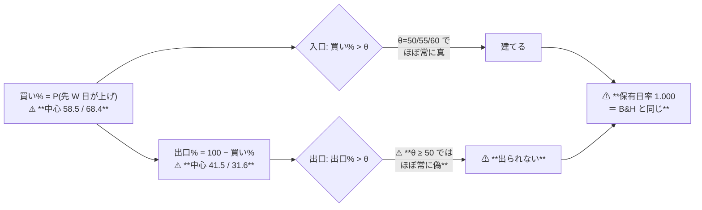

# 買い% の中心と θ の置き方（原因 C）

- 親タスク: `TODO.md`「買い% の中心と θ の置き方を検討する」
- 派生元: [buy-pct-width-collapse.md §4](../../specs/experiments/buy-pct-width-collapse.md)（✅ 2026-09-12 完了。⚠ **原因 A は直した。C は裁定で「触らない」と決めた分**）
- 規約: [rules.md 13-3](../../specs/experiments/feature-discovery/rules.md)（θ の事前固定）／ [13-4](../../specs/experiments/feature-discovery/rules.md)（状態機械）／ [16-1](../../specs/experiments/feature-discovery/rules.md)（出力の契約 2 本）／ [14-9](../../specs/experiments/feature-discovery/rules.md)（構造だけ事前固定）
- 記録（成果物）: `docs/specs/experiments/theta-placement.md`

## 0. 目的 — ⚠ **「θ が高すぎる」ではない。「どんな θ でも出口が出ない」である**

> この図の主張: ⚠ **入口と出口は同じ 1 本の確率から作られており、その確率が丸ごと 50 の上にあると、出口の条件が構造的に成り立たない。**

⚠ **成果物は「θ の置き方をどう定義するか」の裁定と、その実装までとする。**

## 1. いま起きていること【実測 2026-09-12・処置後の再実行】

`trend_scales_1995`（θ=50）の保有日率と取引回数:

| 手法 | fold 1 | fold 2 | fold 3 | fold 4 | fold 5 | 取引回数（fold 3〜5） |
| --- | ---: | ---: | ---: | ---: | ---: | ---: |
| D1 短期 20 日 | 1.000 | 1.000 | 1.000 | 1.000 | 1.000 | 61 / 68 / 63 |
| D2 中期 60 日 | 0.725 | 0.982 | 1.000 | 1.000 | 0.996 | 64 / 64 / 101 |
| D3 長期 200 日 | 0.509 | 0.993 | 0.996 | 1.000 | 1.000 | 72 / 63 / 63 |
| ⚠ **C3 長期 SMA200**（学習しない） | 0.554 | 0.599 | 0.757 | 0.714 | 0.663 | ⚠ **1,194 / 1,361 / 1,352** |

- ⚠ **取引回数 ≈ 63 は「63 銘柄が 1 回ずつ建てて、あとは何もしない」という意味である**（fold 末尾の強制清算まで持つ）
- ⚠ **16 章の 2 出力（`trend_pairs_1995`）でも同じ**: D 系 6 構成のうち 4 構成が fold 2〜5 で保有日率 0.988〜1.000。⚠ **出力を 2 本にしても解けていない**
- ✅ **C 系（学習しない古典フィルタ）だけが普通に売買している** — ⚠ **買い% が 0 か 100 しか取らないので、出口の条件が必ず成り立つから**

## 2. ⚠ **証明: θ ≥ 50 では出口が出ない**

状態機械（[13-4](../../specs/experiments/feature-discovery/rules.md)）と出力の契約（[16-1](../../specs/experiments/feature-discovery/rules.md)）から:

| | 条件 | 買い% に直すと |
| --- | --- | --- |
| 入口 | 入口% > θ | 買い% > θ |
| 出口 | 出口% > θ（出口% = 100 − 買い%） | ⚠ **買い% < 100 − θ** |

⚠ **θ ≥ 50 は [13-3 規約 2](../../specs/experiments/feature-discovery/rules.md) で固定されている**（θ < 50 は買いと売りが同時に立つ）。
⚠ **だから出口は必ず「買い% < 50」以下を要求する。**

⚠ **一方、先 W 営業日が上がる確率は W が長いほど 1 に寄る**（ドリフト）。実測の買い% の中央値は **58.5（60 日）／ 68.4（200 日）**、
θ=50 の上に居る日の割合は fold 2〜5 で **0.982〜1.000**。⚠ **つまり買い% が 50 を割る日がほぼ無い。**

> ⚠ **θ を上げると出口はさらに遠のく**（100 − θ が小さくなる）。⚠ **θ を下げるのは 13-3 が禁じている。**
> ⚠ **したがって、いまの契約のもとでは「出口が出る θ」は存在しない。** ⚠ **これは調整の問題ではなく定義の問題である。**

### 2-1. ⚠ **16 章の 2 出力でも解けない理由**

`pair.py` の出口% は **100 − P(先 W_out 日が上げ)**（[16-3](../../specs/experiments/feature-discovery/rules.md)）。
⚠ **その中心は 100 − 58.5 = 41.5 ／ 100 − 68.4 = 31.6** で、⚠ **θ ≥ 50 を超えない。**
⚠ **窓を替えても、較正が正しいかぎり同じ壁に当たる。**

### 2-2. ⚠ **「中心が高いこと」自体は誤りではない**

⚠ **200 営業日先が上がる確率は本当に高い。** ⚠ **較正は正しく、モデルも正しく、壊れているのは θ の読み方だけである。**
⚠ **だから「直したら成績が良くなる」とは限らない** — ⚠ **「ほとんど持つのが正しい」が答えである可能性が十分ある**（§7 の失敗モード 1）。

## 3. Phase 0: ⚠ **決めごと（利用者の裁定が要る）**

⚠ **θ が何を意味するかを決める。** ⚠ **Claude の判断で水準も定義も動かさない**（[13-3 規約 4](../../specs/experiments/feature-discovery/rules.md)）。

| 案 | θ の定義 | ⚠ 触る規約 | ⚠ 代償 |
| --- | --- | --- | --- |
| **1 何もしない** | 絶対確率 50 / 55 / 60（現状） | — | ⚠ **長期ラベルの検知器は永久に B&H と同じ。** 16 章の 36 試行も同じ壁のまま。⚠ **「効かない」と「測れない」を区別できない** |
| **2 基準からの上乗せ** | θ = **訓練分割の買い% の中央値 ± δ**、δ ∈ {0, 5, 10} 点（入口は ＋δ・出口は −δ） | 13-3（θ の定義） | ⚠ **既存 337 試行が別定義になる。** ⚠ **中央値が 50 の表では今までとほぼ同じ**なので、1 日ラベルの行の変化は小さい【推測】 |
| **3 分位点** | θ = **訓練分割の買い% の 50 / 55 / 60 パーセンタイル** | 13-3 | 同上。⚠ **取引の量を直接そろえられる**が、⚠ **1 日ラベルの行も大きく動く**（いまは θ=55 でほぼ取引ゼロ） |
| **4 出力を中心化** | 買い% を訓練分割の中央値で 50 に寄せる。θ は 50/55/60 のまま | ⚠ **13-2・14-1**（⚠ **出力が「較正した確率」でなくなる**） | ⚠ **門の 2 指標の意味が変わる。** ⚠ **確率としての解釈を捨てる**ので、記録に残す値の意味も変わる |

⚠ **どの案でも共通に守ること**（Claude が勝手に緩めない）:

| # | 規律 | ⚠ 理由 |
| ---: | --- | --- |
| 1 | ⚠ **θ を決める材料は訓練分割の内側だけ**（[14-5](../../specs/experiments/feature-discovery/rules.md) の門と同じ場所。⚠ **検証 fold には特徴量にも触れない**） | ⚠ **検証データで θ を選んだら、それは検証データでの最適化である** |
| 2 | ⚠ **事前固定するのは構造だけ**（δ の 3 水準・どの統計量を使うか）。⚠ **値は訓練が決める**（[14-9](../../specs/experiments/feature-discovery/rules.md)） | ⚠ **手で置いた数値は 1 つずつが自由度** |
| 3 | ⚠ **既存の行は残す・再計算しない・消さない。** 台帳の鍵に列を足して別の試行として数える | ⚠ **2026-09-12 の較正の処置とまったく同じ形**（13-2 の 6） |
| 4 | ⚠ **水準の数は増やさない**（3 水準のまま） | ⚠ **増やした数だけ n_trials が増える**（13-3 規約 4） |

## 4. Phase 1: 測る（⚠ **診断だけ。`n_trials` を動かさない**）

⚠ **裁定の材料を、訓練分割の内側だけから作る。** ⚠ **検証 fold の上乗せは 1 つも見ない。**

| Step | 中身 | 出力 |
| --- | --- | --- |
| 1-1 | `cli/calibdiag.py` に **出口側**の列を足す（`下θ50 / 下θ55 / 下θ60` ＝ 買い% < 100−θ の日の割合） | `out/diag/<時刻>/folds.csv` |
| 1-2 | 訓練分割の内側で、買い% の **中央値・分位点・散らばり**をスケール別（20 / 60 / 200 日）に出す | 同上 |
| 1-3 | 案 2・3 の θ を**訓練分割から**計算し、⚠ **その θ での保有日率を訓練分割の上で見積もる** | `out/diag/<時刻>/theta.csv` |
| 1-4 | ⚠ **1 日ラベル（選別 × モデル）でも同じ表を作る** — ⚠ **案を当てると既存の行がどれだけ動くかを先に知る** | 同上 |
| 1-5 | ⚠ **C 系を同じ表に並べる**（0/100 の出力が案 2・3 でどうなるか。⚠ **分位点だと退化しないか**を確かめる） | 同上 |

⚠ **成功の基準**: 4 案それぞれについて「⚠ **何が動くか・いくつの行が別定義になるか**」が数字で言えること。

## 5. Phase 2: 裁定 → 実装（⚠ **裁定が出てから**）

| # | やること |
| ---: | --- |
| 1 | 選ばれた案を実装する（⚠ **範囲は裁定どおり。勝手に広げない**） |
| 2 | ⚠ **台帳の鍵に「θ の置き方」を足す**（旧 = 絶対 ／ 新 = 選ばれた案）。⚠ **記録の無い実行は「絶対」に寄せる** |
| 3 | ⚠ **`checks.json` に θ の実値を残す**（訓練から決まる値なので、実行ごとに違う） |
| 4 | 単体テスト: ⚠ **中央値が 50 の分布では従来の θ に一致すること**（案 2）／ ⚠ **θ を決めるのに検証分割を読んでいないこと** |

## 6. Phase 3: 回して検算

| # | 検査 | 合格条件 |
| ---: | --- | --- |
| 1 | 既存テスト | 276 件を割らない |
| 2 | ⚠ **既存の台帳** | ⚠ **1 行も消えず、新しい列を除けば 1 バイトも変わらない** |
| 3 | ⚠ **leak 対照** | 跳ねる（⚠ **θ の置き方を変えても配線は壊れていないこと**） |
| 4 | ⚠ **出口が出るようになったか** | ⚠ **保有日率が 1.000 から下がる。** ⚠ **下がらなければ案が効いていない** |
| 5 | `n_trials` | 回した数だけ増える（⚠ **数え落とさない**） |

## 7. ⚠ 先に書く失敗モードと限界

| # | 失敗モード | ⚠ 起きたときの扱い |
| ---: | --- | --- |
| 1 | ⚠ **出口が出るようになったが、成績は悪化する** | ⚠ **想定内であり、むしろ本命の結果。** ⚠ **「ほとんど持つのが正しかった」＝ B&H を超える余地が無いことの実測**になる（軸が 1 つ閉じる） |
| 2 | ⚠ **良くなる** | ⚠ **まず配線を疑う**（[11 章 規約 7](../../specs/experiments/feature-discovery/rules.md)）。⚠ **取引回数と保有日率を必ず併記し、「休んだだけ」でないかを潰す**（13-10） |
| 3 | ⚠ **案 3（分位点）が C 系を壊す** | 0/100 の出力に分位点を当てると θ が 0 か 100 に張り付く。⚠ **Phase 1-5 で先に確かめる** |
| 4 | ⚠ **1 日ラベルの既存の行が大きく動く** | ⚠ **動くこと自体は正しい**（別定義なので別の試行）。⚠ **旧行を消さないので台帳は嘘をつかない** |
| 5 | ⚠ **θ を訓練から決めると fold ごとに θ が違う** | ⚠ **それでよい**（3 章 B の「標本から学ぶ変換」と同じ）。⚠ **fitted に残して次の実行では読み込まない** |
| 6 | ⚠ **本タスクは収益を 1bp も増やさない可能性が高い** | ⚠ **それでよい。** ⚠ **いまは「効かない」と「測れない」が区別できていないので、区別できるようにするのが成果** |
