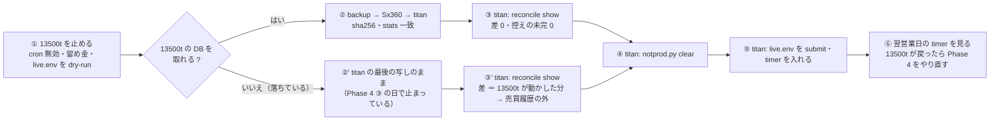
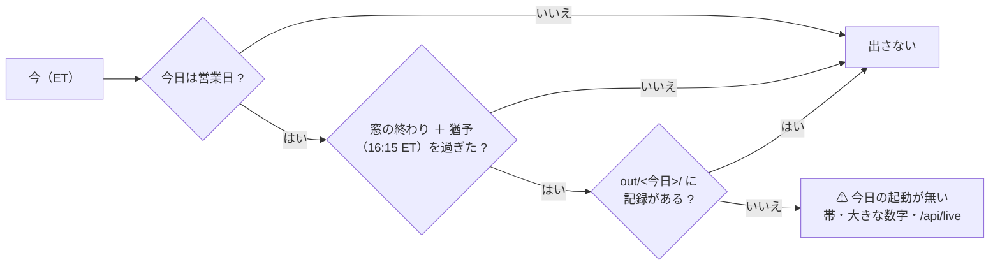

# 戻し方と見張り（3 台の役割分け Phase 5）

> 2026-09-24 作成（titan の Claude）。親プランは [three-machines.md](three-machines.md) の Phase 5（K10）。利用者の指示「TODO の順番を直す。そのあとに作業する」＝ **Phase 4 を待たずに前倒し**（順は 5 → 4）。
> 前提の決定: K4 ＝ 発注するのは常に 1 台 ／ K6 ＝ 記録は切り替えの日に移し、もう片方は読むだけの写し ／ 印 `NOT_PRODUCTION`（Phase 3。[live-trading.md §0-14](../specs/experiments/live-trading.md)）。

## 1. 目的・背景

- Phase 4 の後、**13500t が落ちた日**（常時起動だが、停電・カーネルの入れ替え・cron が起きない）に titan で発注を続けるための**戻し方**を、Phase 4 の逆順として手順書にし、cert の記録と作業用の置き場で 1 往復稽古する。⚠ 戻し方が無いまま切り替えると、落ちた日に「手で何とかする」ことになり、2 台が同時に発注する事故の入口になる
- **見張り** ＝ 「今日の起動が無い」を管理画面が自分で見つけて出す。いまの `board()` の「起動しなかった日」は**記録のある最初の日と最後の日の間**の営業日しか数えないので、⚠ **今日が起きなかったことは、翌日に記録が付くまで出ない**。無人運転の判定（「起動しなかった日を数える」）の穴でもある

## 2. 対応方針

### 2-1. 戻し方（`live-trading.md` §0-14 (d) に書く）

> この図の主張: 戻し方は Phase 4 の逆順。**先に 13500t を止め、DB を titan へ運び、差 0 を見てから titan を開ける**。13500t の DB が取れない日でも、titan は「最後の写し ＋ 口座との突き合わせ」で発注できる（差は推測で割り振らない）。

| 論点 | 決め |
| --- | --- |
| 発注するのは常に 1 台（K4） | 戻す日も同じ。**13500t が止まっていることを確かめる**（cron 無効・`run.sh` の留め金を Phase 2 の形に戻す・`live.env` を dry-run）まで titan の印を外さない。13500t に入れない（落ちている）ときは「入れない ＝ 発注できない」を確かめたことにするが、⚠ **戻ってきた瞬間に cron が発注する**ので、戻ったら最初に止める（Sx360 の Claude） |
| 記録（K6） | 取れるなら 13500t の DB を `backup` で titan へ（Phase 4 ③④ の逆）。取れないなら titan の写し（Phase 4 ③ の日で止まっている）から始め、13500t が動かした分は **口座 − 売買履歴の差 ＝ 「売買履歴の外」**として執行器の 3 段（§0-8）が守る（多いぶんは記録・少ない銘柄はその日は売買しない）。⚠ **差を推測で誰かに割り振らない**。13500t が戻ったら 2 つの DB を突き合わせ、人が `reconcile.py` で合わせる |
| 印 | `notprod.py clear` は ③ の差を見た**後**。戻したあと 13500t 側にも印を置く（`notprod.py set`。Sx360 の Claude）＝ 2 台とも印なしの状態を作らない |
| titan の timer | Phase 4 ① で `disable` した timer を `enable --now` に戻し、`live.env` を submit に（⚠ 利用者）。⚠ 戻す日の 15:40 ET を過ぎていたら**その日は発注しない**（`--wait` は素通り ＝ §1 の落とし穴。timer は翌営業日から） |
| 稽古 | Phase 3 と同じ作業用の置き場（`~/.cache/ai-income-lab-switch/`）で、「13500t 役」の DB を `backup` で「titan 役」へ → `reconcile.py --env cert show` → 印を外す → 通ることを確かめる。本物には触らない |

### 2-2. 見張り「今日の起動が無い」（管理画面）

> この図の主張: 見張りは**記録を読むだけ**で決まる（timer・cron・systemd の状態を読まない ＝ titan でも 13500t のコンテナでも同じ作りで出る）。

| 項目 | 決め |
| --- | --- |
| 定義 | **営業日**（`nyse_calendar`。半日立会も営業日）で、**16:15 ET**（窓の終わり 16:05 ＋ 猶予 10 分。`--wait` → 更新 → 予測 → 執行器が 15:52 ごろに終わる実績【実測 9/23・9/24】に対し十分）を過ぎ、`out/<今日>/` に**記録が 1 行も無い**（`events.jsonl` も `predict.jsonl` も無い）。⚠ 起動して rc≠0 で落ちた日（記録はある）は別の観点 ＝ 「失敗したときに気づける形にする」で決める |
| 出す場所 | 概要の**監視の帯**に赤の印「⚠ 今日の起動が無い」（5 秒ごとの部分更新に乗る）・大きな数字の「起動しなかった日」に今日を足す・`/api/live` に `today_missing`（`date`・`since`・`reason`）。全体の詳細の日次の表にも今日の行を `row-missing` で出す |
| 数える | `board()` の `missing` に、**今日（条件を満たしたとき）を足す**＝「起動しなかった日を数える」の尻尾がふさがる。⚠ 過去の穴（記録の最初の日より前）は数えない（今までどおり） |
| 今日 | 本物は ET の今日（`datetime.now(ET)`）。シミュレーションは仮の時計の今日（`board(today=…)` の引数をそのまま使う） |
| 印・HALT | `NOT_PRODUCTION` がある機械（読むだけの写し）と `HALT` の日は**出さない**（起動しないのが正しい）。⚠ 印は `not_production` の帯で分かる |
| 外へ出す | **出さない**（表示だけ）。メールなど機械の外へ知らせるかは TODO「失敗したときに気づける形にする」の利用者の裁定（⚠ 出すなら秘密が乗らない形） |
| 公開面 | 読むだけの値なので公開面にも出す（監視と停止の範囲） |
| デモ | 執行器のモックの記録（`dashboard/demo/live/`）は過去の日付なので、デモでは**出さない**（`demo` のときは条件から外す。テストは `today` を与えて確かめる） |

### 2-3. 13500t 側

同じ管理画面（g3plus-ops の `ail-dashboard/`。イメージは pull で追従）なので、コードを足せば 13500t のローカル面にも同じ帯が出る。⚠ 13500t の確認は Sx360 の Claude（Phase 4 の後）。

## 3. 影響範囲

- `docs/specs/experiments/live-trading.md` §0-14 (d)（戻し方）・(e)（稽古）
- `dashboard/app/live.py`（`board()` の `missing`・`today_missing`）・`templates/strip_panel.html`・`templates/index.html`（大きな数字）・`templates/overall.html`（日次の表）・`main.py`（`/api/live`）・`glossary.toml`（i マーク）・`tests/test_live.py`
- `docs/specs/dashboard.md` §13（起動しなかった日の定義に「今日」を足す）・CLAUDE.md（見張り）
- `experiments/live-trading/systemd/README.md`（戻し方の 1 行）
- ⚠ 触らない: 執行器・`run-live.sh`・POST の経路（表示だけ）・g3plus-ops（Sx360 の Claude）

## 4. テスト方針

- 戻し方: 作業用の置き場で 13500t 役 → titan 役の `backup`（sha256・`stats` 一致）→ `reconcile.py --env cert show` が通る → `notprod.py clear` で印が消える。本物の `MODE`・`run.lock`・`live.sqlite`・`NOT_PRODUCTION` に触っていないことを `git status` と `notprod.py status` で確かめる
- 見張り: `today` と時刻を与えて 6 通り（営業日 × 窓の前 ／ 後 × 記録あり ／ なし・休場日・印あり）。`/api/live` に `today_missing` が出る ／ 出ない。デモでは出ない。既存の `missing` の数え方が変わらない（過去の穴は今までどおり）
- 回帰: `./run-tests.sh --fast`

## 5. Step

| Step | 何を | だれ |
| --- | --- | --- |
| 5-1 | 戻し方の手順書（§0-14 (d)） | titan の Claude |
| 5-2 | 戻し方の稽古（cert・作業用の置き場） | titan の Claude |
| 5-3 | 見張り（`live.py`・帯・`/api/live`・テスト） | titan の Claude |
| 5-4 | 仕様（`dashboard.md` §13・CLAUDE.md・`systemd/README.md`） | titan の Claude |
| 5-5 | 13500t のローカル面で帯を見る | Sx360 の Claude（Phase 4 の後） |
