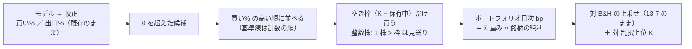

# 保有できる銘柄数に上限を置く（上位 K）— K 5 水準 × 3 モデル × 予算 2 規模を机上で回す

作成日: 2026-09-19。利用者の指示（2026-09-19）: **「１モデルで６３銘柄の買いを閾値で判断する場合に、もっとも高い３銘柄を購入するようなことはできる？」→「テストを回します。保有可能な銘柄数をいくつかのパターンで試します」→「B で進めて」**（案 B ＝ K ∈ {1, 3, 5, 10, 20}）。
追加の指示（同日）: **「$1000 と $10000 の両方を比較できるようにして。$10000 は実際の取引で使えない可能性があるのでそれを明記する」**。
派生元: [B6 のプラン](../live-trading-trader-attributes.md)（実売買の 3 人。$300 ÷ 63 ＝ $4.76 では整数株を 1 株も買えない）。規約の事前登録: [rules.md 17 章](../../specs/experiments/feature-discovery/rules.md)。記録: [topk-holdings.md](../../specs/experiments/topk-holdings.md)。

## 0. 目的・背景

いまの閾値売買は銘柄ごとに独立で、資金の 1/N を各銘柄に固定で割り当てる（rules.md 13-7）。実売買では 1 銘柄の枠が小さすぎて整数株が買えない。
「買い% が θ を超えた銘柄のうち高い順に K 本まで持つ」形にすると 1 銘柄の枠が 予算 ÷ K に広がる。**その形にしたらバックテスト上は何が起きるか**を、実売買に持ち込む前に知っておく。

⚠ **机上の検証だけ**（取得済みの日足・既存の 3 つの表。資金は動かさない）。
⚠ **このテストの結果で実売買の K を選ばない**（結果を見てから構成を選ぶことになる。実売買の K は口座の制約 ＝ 端株が通るかで決める）。
⚠ **規模 B（$10,000）は実際の取引で使えない可能性がある**（口座の残高は $1,000【実測 2026-09-16】）。規模 B の行は手法名に ⚠ を入れ、記録でも必ずそう添える。

## 1. 決めごと（結果を見る前に固定。正本は rules.md 17 章）

| 決めごと | 固定する形 |
| --- | --- |
| 買い | その日に保有していない銘柄のうち、買い% が θ を超えたものを**買い% の高い順**に、空き枠の数だけ買う |
| 売り | 出口% が θ を超えたら売る（いまの閾値売買と同じ。⚠ 順位から落ちただけでは売らない） |
| 枠 | K 本。1 銘柄の枠は 予算 ÷ K の固定（複利にしない）。空いた枠は現金のまま |
| 空いた枠 | ⚠ **翌営業日から使える**（売った日には買い直さない。現金口座の T+1 と、執行器が受渡し待ちの代金を空きから引くのに合わせる） |
| 同点 | 銘柄名の昇順（⚠ 買い% が連続値なので実質起きない） |
| θ | 各モデルで確定済みの 1 水準（T1 50 ／ T2 55 ／ T3 50） |
| K | **1・3・5・10・20**（案 B）。K ＝ 銘柄数（63 ／ 48）は既存の行が対照 |
| 行の種類 | **端数**（理想。予算に依存しない）／ **整数株 A**（1 人 $300）／ **整数株 B ⚠**（1 人 $3,000） |
| 整数株の株価 | 表の `close`（調整済み終値）。⚠ 分割の前の「当時の 1 株の値段」ではなく、**いまの株の単位で見た値段**（限界は §5） |

n_trials: 3 モデル × K 5 × 行の種類 3 ＝ **＋45**（622 → 667 の見込み）。基準線（B&H・乱択上位 K）と leak 対照は数えない。

> この図の主張: 変わるのは「買い% → 売買」の間に銘柄をまたぐ枠の検査が 1 段入ることだけで、モデル・較正・θ・コスト・fold は 1 行も変えない。

## 2. 対応方針

| 部品 | 中身 |
| --- | --- |
| `ail/validation/simulate.py` | `simulate_topk`（純粋関数）を足す。⚠ **既存の `simulate` は 1 行も変えない**。K ＝ 銘柄数・端数のとき、銘柄ごとのポジションが `simulate` と完全に一致する（テストで固定） |
| `cli/run.py` の `evaluate_trading` | `[trading] top_k` があるときだけ、既存の行を作った**後に**上位 K の行を足す。⚠ **`top_k` が無い config は経路が 1 行も変わらない** |
| 手法名 | `全部使う（基準）〔上位3・端数〕` ／ `〔上位3・整数株A〕` ／ `〔上位3・整数株B⚠〕`（構成は手法名に入れる ＝ 16-6 規約 1。鍵に列を足さない） |
| 基準線 | `基準 乱択上位〔…〕`（同じ規則で順位だけ乱数。**種 5 つの平均**）。B&H は既存の `基準 常に上（ドリフト）`（端数・全銘柄の等加重）をそのまま使う ＝ 台帳の判定式は変えない |
| 診断 | `topk.csv`（買いの合図の数・買えた数・枠が無くて見送り・株価で見送り・平均の投下率）。⚠ 採否に使わない |
| `ail/validation/checks.py` | `checks.json` に `topk`（行ごとの 対 B&H ／ 対 乱択 の上乗せ・fold の符号・t）を足す |
| `ail/catalog.py` | 系統と実装の列だけ、`〔…〕` を外した名前で引く（鍵・判定・数え方は変えない） |
| config | `trade_own_ridge_a_topk` ／ `trade_ownex_lgbm_a_topk` ／ `trade_ownseq_ridge_a_topk`（表は作り直さず `features_from`。T3 は検知器を QUANT 1 本に絞る）＋ `config/queue/topk.toml` |

## 3. 影響範囲

- 実験コード: 上の 4 ファイル ＋ config 4 本 ＋ テスト 1 本。既存の config・既存の実行・既存の台帳の行は変わらない（検算する）
- 台帳: n_trials ＋45。既存の行は「実行数」を除いて変わらない（上位 K の実行が出す素の行は同じ鍵にまとまる ＝ 再現の検算）
- 管理画面・vibeboard の検証タブ: 実行が 6 本（本番 3 ＋ leak 3）増える。画面は変えない
- 実売買: ⚠ **変えない**。執行器に上位 K を入れるかは、この結果と `dryrun2` を見てから利用者が決める

## 4. Phase

| Phase | 中身 | 状態 |
| --- | --- | --- |
| 0 | プラン・`TODO.md`・rules.md 17 章に事前登録（⚠ 回す前） | ✅ 2026-09-19 |
| 1 | `simulate_topk` とテスト（K ＝ 銘柄数で既存と一致・枠・翌日から空く・整数株の見送り・乱択の再現・強制清算） | ✅ 2026-09-19（12 本） |
| 2 | `evaluate_trading`・`checks`・`catalog`・config・キュー。合成パネルで端から端まで | ✅ 2026-09-19（6 本。全体 457 本） |
| 3 | 実行（本番 3 ＋ leak 3）→ 台帳の吐き直しと検算（n_trials 622 → 667・既存の行が動かない） | ✅ 2026-09-19（6 本 2 分・既存 899 鍵は動かず） |
| 4 | 記録 `topk-holdings.md`（結果の表・規模 A と B の比較・読み方）・後片付け | ✅ 2026-09-19 |

## 5. ⚠ 先に書く失敗モードと限界

| # | 限界 | 向きと読み方 |
| ---: | --- | --- |
| 1 | K が小さいほど成績は 1〜3 銘柄の運に支配される。fold の符号は割れやすい | 良い数字が出ても 45 本の中の最良。⚠ 多重検定を通していない数字として読む |
| 2 | 買い% の順位にほとんど情報が無い（IC −0.002 ／ ＋0.018 ／ ＋0.007【実測】） | ⚠ **本命の比較は「乱択上位 K」との差**。B&H との差だけでは「集中したこと」と「選んだこと」が分かれない |
| 3 | 整数株の版は調整済み終値で判定する | 過去の株価はいまより安い ＝ 過去ほど多く買える。分割前の実際の 1 株の値段とも違う。⚠ 「いまの株の単位・いまの予算で過去を回したら」という仮の設定 |
| 4 | 整数株の版は安い銘柄に偏る（規模 A の K≥10 はほとんど買えない） | 「執行できた割合」を成績と並べて読む。買えなかった行の純利はほぼ 0 になる ＝ B&H 以下で「落とす」が並ぶのは配線の誤りではない |
| 5 | B&H は端数・全銘柄の等加重のまま | 整数株の行と B&H は同じ制約の下にない。⚠ 整数株の行は「対 端数」の差（同じ K）を主に読む |
| 6 | 較正した買い% は銘柄をまたいで比べる前提で作っていない | 値動きの荒い銘柄が上位に来やすい癖がありうる。`topk.csv` の「買えた銘柄の種類数」で見る |

事前に書く予想: **45 行とも「採る」にならない。乱択上位 K との差は 15 対（端数）とも |t| < 2。**

## 6. テスト方針

- `tests/test_topk.py`: §4 Phase 1 の 6 項目 ＋ 合成パネルで `evaluate_trading` を通し、(a) `top_k` なしの結果が 1 ビットも変わらない (b) 行の数 (c) leak で上乗せが跳ねる
- 全体の pytest が通ること。台帳の検算（n_trials の増分が ＋45 ちょうど・既存の行の数字が動かない）

## 7. 結果（2026-09-19）

採る 0 ／ 保留 37 ／ 落とす 8。予想 (1) は当たり・(2) は外れ（端数の 6 対で 対 乱択の日次 |t| ≥ 2）。⚠ 外れた原因は順位の情報ではなく、荒い銘柄への偏り（T1・T3）と T2 の同点（96% の日で 48 銘柄が同じ買い%）。記録は [topk-holdings.md](../../specs/experiments/topk-holdings.md)。
