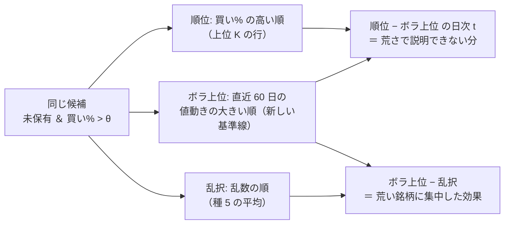

# 上位 K に基準線「ボラ上位 K」を足す — 順位の情報か、荒い銘柄への偏りかを分ける

作成日: 2026-09-19。利用者の指示（2026-09-19）: **「(a) で進めて」**（[topk-holdings.md §5](../../specs/experiments/topk-holdings.md) の次の一手 (a)）。
派生元: [上位 K の机上の検証](topk-holdings.md)。事前登録: [rules.md 17-7](../../specs/experiments/feature-discovery/rules.md)。記録は [topk-holdings.md §6](../../specs/experiments/topk-holdings.md)。

## 0. 目的・背景

上位 K は数字が良く出た（端数の 15 行は全部 対 B&H で正・6 対で 対 乱択の日次 |t| ≥ 2）が、T1・T3 は順位で選ぶと値動きの荒い銘柄に寄っていた（保有日の加重ボラ 250〜265bp/日 対 乱択 160〜170）。
基準線「乱択上位 K」では **「当てた」と「荒い銘柄に集中した」が分かれない**。モデルを使わずに荒さだけで並べる基準線を足して分ける。

⚠ 机上の検証だけ（資金は動かさない）。⚠ **基準線なので n_trials は増えない**（667 のまま）。⚠ **この結果でも実売買の K は選ばない**（17-6 の 4）。

## 1. 決めごと（結果を見る前に固定。正本は rules.md 17-7）

| 決めごと | 固定する形 |
| --- | --- |
| 並べ方 | 候補（その日の始めに未保有で 買い% > θ）は上位 K と**同じ**。並べる値だけを、買い% から **直近 60 営業日の日次対数リターンの標準偏差**に替える（大きい順・同点は銘柄名の昇順） |
| 先読み | リターンは表の `close` の前日比（足 t まで）。⚠ 足 t の終値は執行の時点で分かっている値で、y_t（t → t+1）は使わない。窓は銘柄ごと・fold を跨いで過去へ伸ばす（標本から学ぶ変換ではない ＝ 3 章 A） |
| 窓 | **60 営業日**の 1 水準だけ（最低 20 本。足りない日は最下位）。⚠ 結果を見て動かさない |
| 売り・枠・コスト・fold | 上位 K と同じ（17-1） |
| 名前 | `基準 ボラ上位〔手法・上位K・種類〕`（`基準 ` で始まる ＝ 台帳は基準線として読み、試行に数えない） |
| 行の種類 | 端数 ／ 整数株 A ／ 整数株 B⚠ の 3 つとも出す。⚠ 読むのは端数 |

読み方（事前固定）: 端数の各行について **「順位 − ボラ上位」の日次の対の差の t** を見る。

| 結果 | 読み |
| --- | --- |
| \|t\| < 2 で、ボラ上位 K 自身が 対 乱択で同じくらい正 | 上位 K の上乗せは**荒い銘柄に集中した効果で説明がつく**。順位の情報があるとは言えない |
| t ≥ 2 の行が多い | 荒さでは説明しきれない分が残る。⚠ それでも 45 本の中の数字で、生存バイアス（12-1）は残る |

事前に書く予想: **T1・T3 の端数 10 対とも「順位 − ボラ上位」の日次 |t| < 2。ボラ上位 K は 対 乱択で 10 対とも平均が正。** T2 は同点で順位が銘柄名の昇順になっているので、この比較でも順位の検証にはならない（数字は出すが読まない）。

> この図の主張: 3 本の並べ方は候補も売りも枠も同じで、違うのは「何の順に買うか」だけ。だから差はそのまま並べ方の差として読める。

## 2. 対応方針・影響範囲

| 部品 | 変更 |
| --- | --- |
| `simulate_topk` | 引数 `rank`（並べる値）を足す。省けば今までどおり買い% の順 ＝ 既存の結果は 1 ビットも変わらない |
| `evaluate_trading` | `top_k` があり表に `close` があるとき、銘柄ごとの 60 日ボラを先に作り、`_topk_fold` が基準線の行を足す |
| `checks.topk_table` | `vs_vol`（順位 − ボラ上位）と `vol_vs_random` を足す |
| `catalog` | `ボラ上位〔` で始まる鍵を基準線として引く（系統・実装の列だけ） |
| 実行 | 同じ config 3 本をキュー `topk_vol` で回し直す（本番 3 ＋ leak 3）。上位 K と乱択の行は同じ鍵・同じ数字にまとまる（再現の検算）。⚠ **n_trials は 667 のまま**であることを検算する |

## 3. Phase

| Phase | 中身 | 状態 |
| --- | --- | --- |
| 0 | プラン・`TODO.md`・rules.md 17-7 に事前登録（⚠ 回す前） | ✅ 2026-09-19 |
| 1 | 実装とテスト（`rank` を渡さなければ結果が変わらない ／ ボラの順に買う ／ 先読みしない ／ 行の数 ／ 台帳が数えない） | ✅ 2026-09-19（4 本足して 22 本・全体 461 本） |
| 2 | 実行 → 台帳の検算（667 のまま・既存の行が動かない・上位 K の行が「2 実行・一致」） | ✅ 2026-09-19（667 のまま・既存 989 鍵は動かず） |
| 3 | 記録（topk-holdings.md §6）・rules.md の適用例・後片付け | ✅ 2026-09-19 |

## 4. テスト方針

`tests/test_topk.py` に足す: (a) `rank` の順に買う (b) `rank` が NaN の銘柄は最下位 (c) ボラの列が足 t より先の終値に依存しない（先の `close` を書き換えても足 t までの値が変わらない）(d) `evaluate_trading` にボラ上位の行が出て、既存の行の値が変わらない (e) 台帳の `is_trial` が数えない。全体の pytest。

## 5. 結果（2026-09-19）

予想は 2 つとも当たり。T1・T3 の端数 10 対とも「順位 − ボラ上位」の日次 |t| < 2（9 対は負）、ボラ上位 K は 対 乱択で 10 対とも正。⚠ 上位 K の上乗せは荒い銘柄への集中で説明がつく。記録は [topk-holdings.md §6](../../specs/experiments/topk-holdings.md)。
