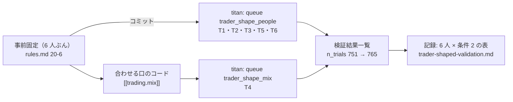

# いまの 3 人と候補の 3 人（T1〜T6）をトレーダーと同じ形で机上にかける

作成 2026-10-01・対象を 6 人に広げた 2026-10-02（Sx360 の Claude）。TODO「予測モデルの検証のようにトレーダーの検証も行う（机上で「トレーダー込みの売り買いのまねごと」を回し、検証結果一覧に足す）」のプラン。

## 0. 目的・背景

- 利用者の指摘（2026-09-26）: 「売買のまねごとは現在のトレーダーが行っている売買と同じ内容か。違うならモデルの検証はトレーダー込みで確認しないと意味がないのではないか」
- 机上の採否は 63 ／ 48 銘柄・等加重・端数・予算なしで見ていて、いまのトレーダー（5 本・整数株・$300）の形では `T1`〜`T3` のモデルを誰も確かめていない
- 器は 2026-10-01 にできた（[rules.md 20 章](../../specs/experiments/feature-discovery/rules.md)・`[[trading.trader]]`）。候補 3 本（F1-7・F2-2・D2）には当てたが、いまの 3 人のモデルにはまだ当てていない
- 利用者の指示（2026-10-01）: 「先に他のＴＯＤＯに残っているタスクを終わらせる」→ **「新しく作られたT4移行とT1-T3も比較したい」→「その案で進めて」**（コミット・push を含む）

## 1. 対応方針

この図の主張: 6 人を同じ器（同じ 5 本・同じ予算・相手は「持ち続ける」）に通して 1 枚の表に並べる。設定だけで回せる 5 人を先に、コードの要る `T4` を後に回す。事前固定は全員ぶんを先にコミットする。

| Step | 中身 | 機械 |
| --- | --- | --- |
| 1 | 事前固定（rules.md 20-6: 対象 6 人・数え方 ＋14・並べ方・`T4` の合わせる口の規約・予想）と設定 5 本 ＋ queue → コミット（⚠ 回す前） | Sx360 |
| 2 | `cli.queue --config trader_shape_people`（本番 5 ＋ leak 5） | titan（Sx360 から ssh） |
| 3 | `[[trading.mix]]` と `[[trading.trader]]` の `methods` を足す（`cli/run.py`・`names.toml`・`catalog.py`・テスト。⚠ `mix` の無い config は経路が変わらない）→ `trader_mix_t4` を回す | Sx360 で書く → titan で回す |
| 4 | 検証結果一覧を吐き直す → 記録に 6 人の表・予想との突き合わせ・読み方 → `dashboard/models.toml` の試した経緯を DB に合わせる | titan ／ Sx360 |
| 5 | テスト → TODO から `DONE.md` へ・このプランを `archive/` へ | — |

各人の机上の形（rules.md 20-6 の 1）:

| 人 | 机上の形 | 手間 |
| --- | --- | --- |
| `T1`〜`T3` | 実売買の設定のモデルと θ | 設定だけ |
| `T4`（ハル） | 3 本の買い% ／ 出口% を行ごとに平均（執行器の `mean`）・θ 50・会社の 48 本 | コードを足す |
| `T5`（ミオ） | 対の検知器「L1 高値20日から−10%で降りる」・θ 50（`unanimous` の机上の写し） | 設定だけ |
| `T6`（ソラ） | F2-2 RFE・θ 50 を 2018 年からの表で（1995 年からの表のぶんは 10/1 に済み） | 設定だけ |

⚠ この結果で実売買の 3 人を止めない・替えない・候補を本番に入れると決めない（続ける・止める・入れるは利用者）。⚠ 順位で人を採らない。

## 2. 影響範囲

- 研究側の設定: `config/experiment/trader_trade_{own_ridge,ownex_lgbm,ownseq_ridge,own_stop_ridge}_a.toml`・`trader_sel_small4_2018.toml`・`trader_mix_t4.toml`・`config/queue/trader_shape_people.toml`・`trader_shape_mix.toml`
- 研究側のコード（`T4` のぶんだけ）: `cli/run.py`（`[[trading.mix]]`・`trader` の `methods`）・`config/names.toml`・`ail/catalog.py`（系統「合成」）・`tests/`。⚠ `cli.run.fold_buy_pct` の中身は変えない（既定の指紋テスト `tests/test_trading_run.py`・`tests/test_predict.py`）
- 文書: `rules.md` 20-6・`trader-shaped-validation.md`・`ledger.md`（生成）・`dashboard/models.toml`（試した経緯のパターン）
- 執行器・管理画面・本番: 変えない

## 3. テスト方針

- 回す前: 設定が `config.resolve_experiment` で読めること（✅ 5 本）
- `T4` のコード: メンバーが 1 本だけの合成はそのメンバーと同じ買い% になる ／ 欠けた行は欠け ／ 切れ目が違えば止まる ／ `mix`・`methods` の無い config は 1 ビットも変わらない（指紋テスト）
- 回した後: 素の行が既存の行と「一致」にまとまる（再現の検算）・leak 対照が跳ねる・既存の行が変わらない
- `dashboard/tests/test_models_tab.py` の `test_real_history_matches_the_db`（titan の DB で）・研究側の pytest（titan）・`./run-tests.sh --fast`

## 4. 結果（✅ 2026-10-02 に全部済ませた。Sx360 の Claude が書き、titan で回した）

| Step | 結果【実測】 |
| --- | --- |
| 1 | 事前固定 ＝ コミット `0e675c3`（00:00 PDT）。回したのはその後（00:01〜） |
| 2 | `trader_shape_people` ＝ 本番 5 ＋ leak 5・1 分 57 秒・失敗 0 |
| 3 | 合わせる口のコード ＝ コミット `ca639fc`（`cli/run.py` の `mix_specs`・`_mix_prepare`・`_mix_fold`・`trader` の `methods`／ `names.toml` の `[mix]`／ `catalog` の系統「合成」／ `tests/test_mix.py` 10 本）→ `trader_shape_mix` ＝ 本番 20 秒 ＋ leak 31 秒。欠けた行 0 |
| 4 | n_trials 751 → 765・**採る 0 ／ 保留 10 ／ 落とす 4**。記録 [trader-shaped-validation.md §5](../../specs/experiments/trader-shaped-validation.md)。`dashboard/models.toml` の試した経緯に 5 行（`aside`）を足し、`stop-exit` の古い行のパターンを絞った |
| 5 | テストは記録の §5-1 と `DONE.md` |

⚠ 残ったもの（利用者の決定）: この比較をどう使うか（候補を本番に入れるか ＝ TODO「トレーダーを『作成 → 実践投入 → 分析』のループで回す」・20 営業日の判定）。
