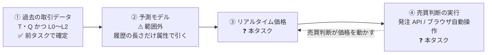
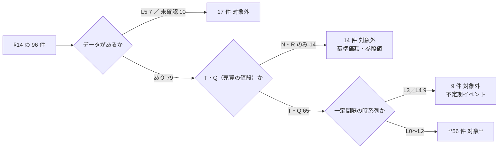
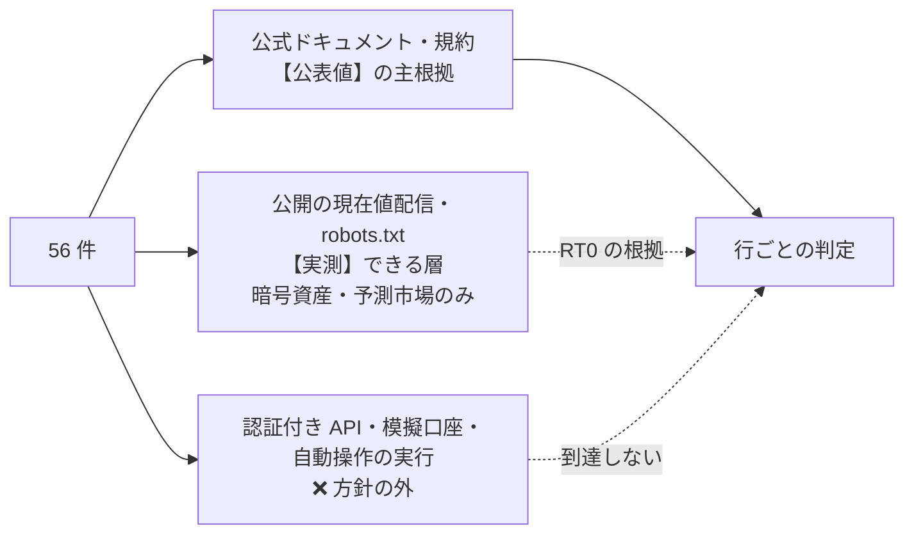
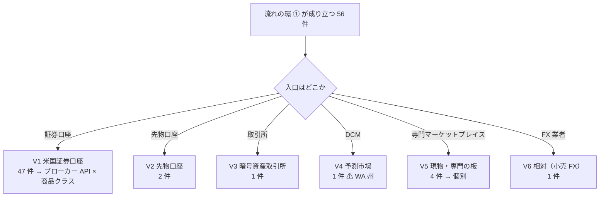
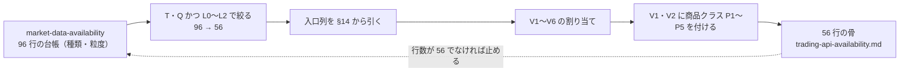
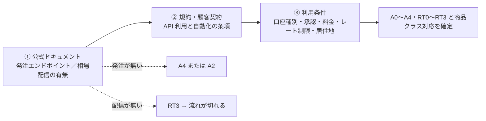
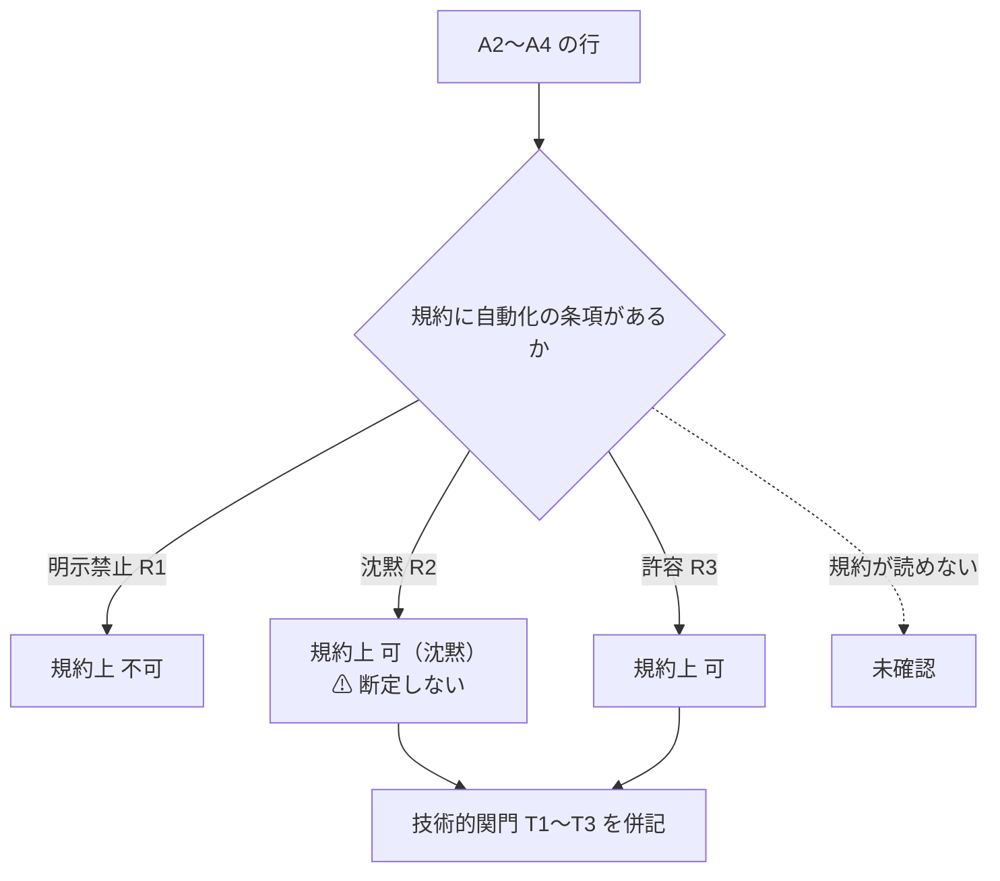

# 「過去の取引データ → 予測モデル → リアルタイム価格 → 売買判断」の流れが成り立つ商品について、API（無ければブラウザ自動操作）で売買できるかを調べる

作成日: 2026-09-01（同日に対象を 96 → 79 → **56 件**へ絞った）。
対象: [docs/specs/market-data-availability.md](../specs/market-data-availability.md) の 96 行のうち、**過去の取引データ（T・Q）が一定間隔の時系列（L0〜L2）で取れると確定した 56 件**（§1-2）。元の一覧は [docs/specs/online-tradable-assets.md](../specs/online-tradable-assets.md) §14（11 分類・96 件）。

TODO の 2 件を **1 プラン・1 成果物**で扱う。

| TODO | 本プランでの位置 |
| --- | --- |
| APIで売買可能な商品を調べる | **Phase 1・2・4・5**（主）|
| APIなしでもブラウザ操作の自動操作で売買できるか調べる | **Phase 3**（Phase 2 で「API 無し」になった行だけが対象）＋ Phase 4・5 |

⚠ 2 件を分けない理由: 後者は前者の「無し」に対する**代替経路の問い**であり、行ごとに「API → ブラウザ → 手動のみ」と落ちていく 1 本の判定になる。別文書にすると同じ 56 行を 2 回持つことになる。

## 1. 目的と背景

### 1-1. 最終的に作りたい流れ

**過去の取引データで予測モデルを作り、リアルタイムの価格から売買判断を行う仕組み**を作ることが目標である。この流れは 4 つの環でできていて、**どれか 1 つでも切れている商品では成り立たない**。

> この図の主張: 流れは 4 環。① は前タスクで確定済み、② は商品固有の問題ではないので本タスクの範囲外、**③ と ④ を本タスクで埋める**。

| 環 | 本タスクでの扱い |
| --- | --- |
| ① 過去の取引データ | `market-data-availability.md` の結果をそのまま使う。**対象の絞り込み条件**になる（§1-2）|
| ② 予測モデル | ⚠ **判定しない。**モデルが作れるかは商品ではなくデータ長・粒度・手法で決まる。前タスクの「履歴」列を属性として引くだけ（上場が新しい行は短い: ILS 2025-04、CLOZ 2023-01）|
| ③ リアルタイム価格 | **本タスクで新たに調べる。**前タスクは過去データの取得可否だけで、**現在値の配信**は見ていない |
| ④ 売買判断の実行 | **本タスクの主題。**発注 API（TODO 1 件目）、無ければブラウザ自動操作（TODO 2 件目）|

⚠ **スコープは「③ と ④ の経路の有無と、その利用条件」まで。**モデルの設計・バックテスト・執行の設計には踏み込まない。

### 1-2. 対象の絞り込み — 流れの環 ① が成り立つ 56 件

**基準: `market-data-availability.md` §4 の「種類」列が T（約定）か Q（気配）を含み、かつ「最小粒度」列が L0〜L2（tick・分足・日足）に確定している行。**

| 落とす理由 | 内容 | 件数 |
| --- | --- | ---: |
| **A** L5 | データが無い | 7 |
| **B** 未確認 | 前タスクで保留 3・打ち切り 7 | 10 |
| **C** T・Q はあるが L3／L4 | 落札・成約の**不定期イベント**で、一定間隔の時系列にならない。⚠ **リアルタイムの価格も存在しない**（NFT・ドメイン・音楽印税・周波数・公売・ワイン等・不動産現物・トークン化不動産・Masterworks）| 9 |
| **D** L0〜L2 だが N・R のみ | **基準価額・参照値は売買の値段ではない。**モデルの学習対象と実際の取引価格がずれる（現物金・銀＝LBMA 基準値、ステーキング＝利回り、未公開株＝参照値、CCLFX＝NAV）| 4 |
| **E** L3／L4 かつ N・R のみ | 値段が動かない・買取式で決まる（I Bonds・EE Bonds・MMF・仕組債・生命保険買取・Fundrise・サイト売買・マイル・水・IPv4）| 10 |
| | **除外** | **40** |
| ✅ **対象** | T・Q かつ L0〜L2 | **56** |

> この図の主張: 96 件は 5 つの理由で 40 件落ち、56 件が残る。**落ちるのはすべて環 ① の欠落**で、儲かるかどうかで落としたものは無い。

**56 件の分類別内訳**: 14-1 **16** / 14-2 **10** / 14-3 **11** / 14-4 **0** / 14-5 **6** / 14-6 **7** / 14-7 **1** / 14-8 **1** / 14-9 **1** / 14-10 **0** / 14-11 **3**。

⚠ **14-4 保険・年金と 14-10 債権・不動産・未公開は 0 件になった。**この 2 分類は「値段が売買で決まらない」か「不定期」のどちらかで、流れの環 ① が成り立たない。

⚠ **再開条件**: 前タスクの保留 3 件（MYGA・トークン化国債・スニーカー）が T・Q かつ L0〜L2 で確定したら追加する。⚠ スニーカー（StockX）は「本物の bid/ask を持つ」ので、**確定すれば入りうる唯一の候補**。他の除外は前タスクの結論が変わらない限り触らない。

### 1-3. 前提の変更履歴（同日）

| 版 | 対象 | 基準 |
| --- | ---: | --- |
| 初版 | 96 | §14 の全件 |
| 2 版 | 79 | 過去データが取れる（L0〜L4、N・R を含む）|
| **3 版（本書）** | **56** | **過去の取引データ（T・Q）が一定間隔（L0〜L2）で取れる** — 流れの環 ① |

2 版で「N・R を含めるか」を保留にしていたが、**3 版の流れの定義で「含めない」に決まった**（学習対象と取引価格が別物になるため）。

## 2. 定義

⚠ **「API で売買できる」「リアルタイム」は人によって指すものがぶれる。**先に固定する。

### 2-1. 何を「発注 API」と呼ぶか（環 ④）

| 含める | 含めない |
| --- | --- |
| **注文の発注・訂正・取消**ができる公式のプログラムインタフェース（REST / WebSocket / FIX / SDK） | 相場データだけの API（環 ③ として別に扱う）|
| 口座保有者（個人）が利用条件を満たせば使えるもの | 口座残高・約定照会だけの API |
| 発注に相当する操作（AWS RI の購入・出品 など） | 非公式ライブラリ・リバースエンジニアリング（⚠ §2-2 の A3。**「無し」と同じ扱い**）|

⚠ **上場商品の発注 API は取引所ではなくブローカーのものである。**個人は NYSE や CME に直接発注できない。したがって V1・V2（§5）の調査対象は**ブローカー各社の API** であり、「その商品を扱うブローカーの API が、その商品クラスの発注に対応しているか」を問う。

### 2-2. API の段階 A0〜A4

| 段階 | 内容 | ⚠ 注意 |
| --- | --- | --- |
| **A0** 公開 | 公式・公開ドキュメント・**口座があればキーを自分で発行できる** | 最も条件が良い |
| **A1** 申請制 | 公式だが**アプリ登録・審査**を経る（個人可） | 審査基準と期間を記録する |
| **A2** 限定 | 公式だが**パートナー・法人・機関限定** | 個人には実質「無し」だが、区別して残す |
| **A3** 非公式のみ | サードパーティの非公認ライブラリ、Web セッションの流用 | ⚠ **本調査では「無し」と数える。**規約違反になりうるため |
| **A4** 無し | 公式 API が存在しない、または「探した範囲で見つからず」 | ⚠ **「無い」と「見つからない」を分ける**（前タスクと同じ線）|

### 2-3. ⚠ 「API がある」と「その商品が API で買える」はずれる

ブローカーの API は**商品クラスごとに対応が違う**。株式・ETF は対応しても、債券の個別銘柄・OTC・外国市場は対応しないことが多い。**V1 の 47 件は「ブローカー × 商品クラス」の行列で判定する。**

| 商品クラス | 56 件での該当 | ⚠ 想定される落とし穴 |
| --- | --- | --- |
| **P1** 上場株・ETF・CEF・優先株・SPAC | 14-1・14-2 の全部、債券 ETF、商品 ETF、バッファー ETF、SPAC、通貨 ETF ほか（**42 行**）| 最も広く対応。⚠ SPAC ワラントは扱わないブローカーがある |
| **P2** 上場オプション | オプション売り（14-6）（1 行）| 対応は広いが**承認レベル**が別に要る |
| **P3** 先物 | 米（rough rice）・§1256（V2、2 行）| 証券口座とは**別の口座種別** |
| **P4** 債券の個別銘柄 | 米国債流通・TIPS・地方債 AAA（3 行）| ⚠ **API 対応が最も薄い層**。Web 画面限定のことが多い。⚠ 過去データは R（利回り曲線）＋T で、**リアルタイムは業者気配**。同一系列でない点を書く |
| **P5** OTC・外国上場 | 物理ウラン SRUUF（OTC）・U.UN（TSX）（1 行）| 対応ブローカーが限られる |

### 2-4. 何を「リアルタイム価格」と呼ぶか（環 ③）

| 段階 | 内容 | 想定される例（⚠ 未確認）|
| --- | --- | --- |
| **RT0** 無登録・無償 | 公開の WebSocket / REST で、アカウント無しに現在値が取れる | 暗号資産取引所、予測市場 |
| **RT1** 口座があれば無償 | ブローカー・運営の口座を持てば追加費用なしで配信される | ブローカーの無償フィード（⚠ **IEX のみ等、部分的な板**のことがある）|
| **RT2** 有償購読 | 取引所の配信料・ベンダの月額が要る | SIP 全市場、CME、オプション |
| **RT3** 無し | 現在値がプログラムから取れない。画面表示のみ・日次更新のみ | 専門マーケットプレイスの一部 |

記録する属性: **配信方式**（ストリーミング / ポーリング）・**遅延**（リアルタイム / 15 分遅延）・**板の範囲**（全市場 / 単一取引所）・**登録要否**・**費用**。⚠ 前タスクの §3 と同じく、**米国株は無償でも必ず登録が要る**見込みで、環 ③ で無登録なのは暗号資産・予測市場だけと予想する。

### 2-5. ブラウザ自動操作の判定軸（Phase 3）

⚠ **本プロジェクトは自動操作を実行しない（§3）。**判定は**規約**を主軸に、技術的関門は公表情報の補助にとどめる。

| 軸 | 段階 | 内容 |
| --- | --- | --- |
| **R** 規約 | R1 明示禁止 | 利用規約・顧客契約に「自動化された手段（robot / script / scraper / automated means）」の禁止条項がある |
| | R2 沈黙 | 該当する条項が見つからない |
| | R3 許容 | 条件付きで認めている（実質 API 提供と同じ）|
| **T** 技術 | T1 強い関門 | MFA 必須・CAPTCHA・bot 検出ベンダの導入が**公表情報で**確認できる |
| | T2 ログインのみ | 通常のログインだけ |
| | T3 ログイン不要 | 発注にアカウントが要らない（オンチェーン等）|

行ごとの判定は **「規約上 可 / 不可 / 未確認」** の 3 値。⚠ **技術的関門は判定に使わない**（時間で変わる・公表情報が薄い）。「規約上は可だが T1」のように併記する。

⚠ **AI エージェント（computer use 型）によるブラウザ操作も「自動化された手段」に含めて読む。**2025 年以降、AI エージェントを名指しで禁じる規約が増えているので、**該当条項の有無を確認項目に入れる**。

⚠ **ブラウザ自動操作は環 ④ だけの代替であり、環 ③ の代替にはならない。**画面をスクレイピングして現在値を取ることは、前タスクの線（規約の確認まで・収集はしない）に従い判定しない。環 ③ が RT3 の行は、④ がどうであれ**流れが切れる**。

### 2-6. 成果物の表の列

| 列 | 内容 |
| --- | --- |
| 商品 | 前タスクの台帳の行と 1:1（56 行）。⚠ 対象外 40 行は表に載せず、§1-2 の一覧で持つ |
| 入口 | §14 の「買う場所」列をそのまま引く |
| 束 | V1〜V6（§5）|
| 商品クラス | P1〜P5（§2-3）。V1・V2 のみ |
| 履歴 | 前タスクの「履歴」列を引く（環 ② の属性）|
| **③ リアルタイム価格** | 提供元・RT0〜RT3・配信方式・遅延・板の範囲・費用 |
| ④ 発注 API の提供元 | ブローカー名 / 取引所名 / 運営名。V1 は**対応ブローカーを複数**書く |
| ④ API 段階 | A0〜A4（§2-2）。V1 は「商品クラスに対応する最良の段階」 |
| ⚠ 利用条件 | 口座種別・承認レベル・料金・レート制限・**居住地（WA 州）の制約** |
| 規約（自動化） | R1〜R3。⚠ **API 提供元でも、API 以外の自動化を禁じていることがある**ので全行に付ける |
| ブラウザ自動操作 | 規約上 可 / 不可 / 未確認 ＋ T1〜T3。**A0・A1 の行は「不要」** |
| **流れの判定** | ③ と ④ の両方が通って初めて `成立`。それ以外は `③ で切れる` / `④ で切れる` / `未確認` |
| 出典 | URL・取得日・【公表値】/【推測】/【実測】 |

## 3. プロジェクト方針との関係（⚠ 先に確認）

CLAUDE.md の 2026-08-27 方針変更により、**登録・契約・課金・実行は行わない**。この調査では次の線を引く。

| 行為 | 可否 | 帰結 |
| --- | --- | --- |
| 公式の API ドキュメント・料金表・利用規約・顧客契約を読む | ✅ 行う | **判定の主根拠** |
| `robots.txt`・利用規約ページを 1 回取得する | ✅ 行う | 前タスク（Stooq）と同じ手順 |
| **無登録・無認証**の公開エンドポイント（WebSocket を含む）から現在値を 1 回取り、遅延・配信方式を目視する | ⚠ 規約を確認したうえで、**前タスクで既に実測した経路**（Kraken・Kalshi・Polymarket）に限る | 環 ③ で RT0 と書ける唯一の【実測】 |
| アカウント登録・API キー取得・**ペーパー（模擬）口座の開設** | ❌ 行わない | ⚠ **模擬口座も「登録」にあたる**。Alpaca paper / IBKR demo 等は使わない |
| API を実際に叩く（認証付きエンドポイント）| ❌ 行わない | 発注 API とブローカーの相場配信は全て認証付きなので、**V1・V2 に【実測】は存在しない** |
| ブラウザ自動操作を**どのサイトに対しても**動かす | ❌ 行わない | 自分の口座が無いうえ、規約確認前の実行は前タスクの線に反する |
| 公開のログインページを**手動相当で 1 回**開き、bot 検出ベンダのスクリプト名を目視する | ⚠ `robots.txt` で許可されている場合のみ・**フォーム送信はしない** | T1 の根拠に使える【実測】。任意 |

> この図の主張: 環 ③ ④ とも、米国株は認証の壁の向こうにあり【公表値】でしか書けない。【実測】が届くのは暗号資産・予測市場の公開配信だけ。

## 4. 成果物

| 項目 | 内容 |
| --- | --- |
| ファイル | `docs/specs/trading-api-availability.md`（新規） |
| 本体 | **56 行の表**（§2-6 の 13 列）。§14 の 11 分類の並びを保つ。冒頭に対象外 40 行の一覧（§1-2）を置く |
| 付録 A | **発注 API・相場配信のカタログ** — 提供元ごとに 1 行（A 段階・RT 段階・対応商品クラス・口座条件・料金・レート制限・規約・出典）。V1 は**ブローカー × 商品クラスの行列**を別表で置き、各セルに「発注」と「現在値」の 2 つの印を持つ |
| 付録 B | **規約の抜粋** — 自動化に関する条項を、サイトごとに引用（URL・取得日・該当箇所）。⚠ 判断せず引用で残す |
| 付録 C | **流れが切れる行の一覧** — ③ で切れる / ④ で切れる / 未確認 と、その理由 |
| 付録 D | **法的枠組みの整理** — 米国での自動アクセスの法的位置づけ（CFAA・規約違反）を 1 節。⚠ **助言はしない。**判例・条文の引用にとどめる |
| 図 | 各 Phase に最低 1 枚（CLAUDE.md のドキュメント規約）|

⚠ **元文書（`online-tradable-assets.md`）・スライド（`.html`）・`market-data-availability.md` は書き換えない。**前タスクと同じく別ファイルで横に並べ、行の対応は「§14-x の n 行目」で持つ。

## 5. 方針: 56 件を個別に調べず、「入口の型」で束ねる

**環 ③ ④ の経路は商品ではなく“どこで買うか”で決まる。**前タスクの束（S1〜S7）は識別子で切ったが、本タスクは**入口の場所**で切り直す。

> この図の主張: 56 件は入口で 6 束に落ちる。**V1 の 47 件は「ブローカー API × 商品クラス」の 1 つの行列**で片付き、個別調査が要るのは V5・V6 の 5 件だけ。

| 束 | 件数 | 該当（§14 の分類） | 当たり方 | ⚠ 想定される着地（すべて未確認） |
| --- | ---: | --- | --- | --- |
| **V1** 米国証券口座 | **47** | 14-1（16）・14-2（10）・14-3 の流通国債〜ILS（11）・14-5 の ETF・SRUUF（5）・14-6 の 5 件 | **ブローカー各社の API を横断で 1 回**調べ、商品クラス P1〜P5 との行列にする。**発注と現在値配信を同じ行列で見る** | P1（42 行）は複数社で A0・RT1。⚠ **P4 債券 3 行・P5 OTC/TSX 1 行は対応社が 1〜2 社か無し** |
| **V2** 先物口座 | **2** | 14-5（米）・14-6（§1256）| 先物ブローカーの API | A0 が複数あるはず。⚠ 現在値は CME の配信料（RT2）|
| **V3** 暗号資産取引所 | **1** | 14-7（現物）| 取引所の公開 API 仕様 | A0・**RT0**。前タスクの D20（Kraken 公開 API）と整合させる。⚠ **WA 州での提供可否**を確認 |
| **V4** 予測市場 | **1** | 14-11 | Kalshi ほかの API 仕様 | A0・RT0 だが ⚠ **WA 州で取引できない**（§14 の属性を引く。再調査しない）。**環 ④ が居住地で切れる** |
| **V5** 現物・専門マーケットプレイス | **4** | 14-8（REC / SREC）・14-9（トレーディングカード）・14-11（AWS RI・ゲーム内アイテム）| サイトごとに個別 | ⚠ **AWS RI は公式 API が購入・出品・出品一覧とも揃う見込み**（A0・RT1）。SREC は現在値配信が無い見込み（RT3）。トレーディングカードは TCGplayer API 停止済み・eBay は購入 API が限定。ゲーム内は**規約違反の市場**（§14-11）|
| **V6** 相対（小売 FX） | **1** | 14-6 | FX 業者の API 仕様 | A0・RT1 の見込み（業者がストリーミング配信）。⚠ CFD は米国リテール向け提供が未確認のまま打ち切り済み（DONE 2026-09-01）。再調査しない |
| | **56** | | | |

⚠ **束の割り当ては初期案。**Phase 1 で 56 行に確定させる。⚠ 2 版にあった V3 TreasuryDirect（I Bonds・EE Bonds）は、環 ① で落ちたため束ごと消えた。

## Phase 1 — 母集団を確定し、入口の束に割り当てる（見積もり 1h）

前タスクが `CATS` から機械抽出した 96 行の台帳（`market-data-availability.md` §4）を起点にし、**種類列と粒度列で 56 行に絞ってから、入口列で V1〜V6 を付ける**。

> この図の主張: 前タスクの台帳を継承し、種類と粒度で絞り、束の軸だけを「識別子」から「入口」に差し替える。行数 96 の保証は前タスクの検算を引き継ぎ、56 への絞り込みは 2 列から機械的に出す。

- **Step 1-1**: 96 行の台帳から種類列・粒度列で 56 行を機械的に抜き、除外 40 行が §1-2 の理由 A〜E に割れることを確認する
- **Step 1-2**: 56 行に §14 の入口列と前タスクの「履歴」列を写し、V1〜V6 を付ける。§5 の初期案（47/2/1/1/4/1）と突き合わせ、ずれたら §5 を直す
- **Step 1-3**: V1・V2 の全行に商品クラス P1〜P5 を付ける。⚠ **1 行に複数の入口があるもの**（米国債「TreasuryDirect・証券口座」、米「CBOT 先物 / ETN の RJA」）は**API がある可能性の高い側を主**にし、もう一方を備考に残す

## Phase 2 — 束ごとに環 ③ ④ を一次情報で当たる（見積もり 9.5h）

> この図の主張: どの束も「公式ドキュメント → 規約 → 利用条件」の順に当たり、**発注と現在値配信を同じ提供元で同時に見る**。⚠ 認証付きの実測はしないので、根拠はすべて文書になる。

### Step 2-1: V1（47 件）— ブローカー API × 商品クラスの行列（5h）

**1 回の横断調査で 47 件が片付く**ので、ここを最優先で厚くやる。

⚠ 下の候補は**すべて未確認**。Phase 2 で公式ドキュメントを当てて確定させる。

| 候補ブローカー | 想定される段階 | 確認したいこと |
| --- | --- | --- |
| Interactive Brokers（TWS API / Client Portal Web API / FIX）| A0・RT2 | ⚠ **商品クラスの対応が最も広い可能性**（P4 債券・P5 外国市場）。**TWS API はデスクトップアプリの常駐が前提**という構成上の制約。相場配信は**取引所ごとの購読料** |
| Alpaca（Trading API）| A0・RT1 | P1・P2 のみで **P4・P5 は非対応**の見込み。無償の現在値は **IEX のみ**（前タスク D5: 米国出来高の約 2.5%）。⚠ **板の範囲が学習データ（SIP 全市場）と違う**点を書く |
| Charles Schwab（Trader API – Individual）| A1 | ⚠ **開発者ポータルの仕様がログイン無しで読めるか**。読めなければ「未確認」 |
| E*TRADE、Tradier、tastytrade、Webull、Public、Robinhood、moomoo | A0〜A1 | 発注エンドポイント・ストリーミング配信の有無と商品クラス。⚠ Robinhood は暗号資産だけの見込み |

- 成果物は **付録 A の「ブローカー × P1〜P5」行列**。各セルに「発注 ✅ / ❌ / 未確認」と「現在値 RT0〜RT3」を並べ、出典を付ける
- ⚠ **自動化に固有の利用条件を必ず拾う**: パターンデイトレーダー規制（FINRA 4210・$25,000）、現金口座の決済違反、ブローカー側の「過剰な API 利用」条項、レート制限、**市場データの非専門家（non-professional）区分が API 利用・自動売買で変わるか**（⚠ 配信料が跳ねる要因）
- ⚠ **居住地の制約は §14 の属性を引く**（WA 州で口座が開けるか）。再調査はしない
- ⚠ **A3（非公式ライブラリ）は数えない。**Robinhood 株式向け等の非公認ライブラリが多数あるが、規約上の位置づけを付録 B に引用するだけにとどめる

### Step 2-2: V2（2 件）— 先物口座（1h）

- 先物ブローカー（IBKR・Tradovate・tastytrade・NinjaTrader ほか）の発注 API と、**米（rough rice）の取扱有無**（⚠ 建玉が小さく、扱わないブローカーがありうる）
- ⚠ **先物は証券口座と別の口座種別・別の承認**。V1 で A0 のブローカーでも先物は別条件でありうる。現在値は CME の配信料（RT2）が本命

### Step 2-3: V3（1 件）— 暗号資産取引所（1h）

- 取引所（Kraken・Coinbase ほか）の発注 API の段階・**WA 州での提供可否**・レート制限
- 環 ③ は前タスクで REST を実測済み（D20）。**WebSocket の公開配信**を規約確認のうえ 1 回取り、RT0 を【実測】で確定する（§3）
- ⚠ **取引所ごとに値段が違う。**学習データと現在値を**同じ取引所**で揃える必要がある点を書く

### Step 2-4: V4（1 件）— 予測市場（0.5h）

- Kalshi ほかの発注 API の段階・利用条件・公開配信（環 ③ は前タスクで実測済み）
- ⚠ **WA 州の差止め**は §14 の属性を引くだけで、API の有無とは分けて書く。**流れの判定は「④ が居住地で切れる」**

### Step 2-5: V5（4 件）— 現物・専門マーケットプレイス（1.5h）

**サイトごとに個別に当たる束。⚠ 環 ③（現在値配信）が無い行はここで流れが切れる。**

| 対象 | ⚠ 論点 |
| --- | --- |
| **AWS RI Marketplace** | 公式 API で**出品一覧の取得（現在値に相当）・購入・出品**が揃う見込み（A0・RT1）。利用条件（アカウント・地域・出品資格）を確定させる。⚠ **値段が Q＝出品価格で、需給で動く市場かは別問題**。属性として書くにとどめる |
| REC / SREC（Flett Exchange） | 現在値配信の有無（RT3 の見込み）・入札 API の有無 |
| トレーディングカード（TCGplayer / eBay） | TCGplayer は API 新規発行停止（前タスク B-4）。**eBay は出品 API と購入 API で段階が違う**見込み。現在値は日次の市場価格（L2）で、ストリーミングは無い見込み |
| ゲーム内アイテム | ⚠ **規約違反の市場**（§14-11）。bot 禁止条項を付録 B に引用。A4・R1 の見込み |

### Step 2-6: V6（1 件）— 小売 FX（0.5h）

- FX 業者（OANDA ほか）の個人向け発注 API とストリーミング配信（A0・RT1 の見込み）。**米国居住者向けの提供可否**（CFTC 規制下の RFED）を確認
- ⚠ **前タスクの結論「1 業者の建値であって市場価格ではない」を引く。**学習データ（Dukascopy 等の bid/ask）と取引する業者の建値が**別の系列**である点を書く

## Phase 3 — API が無い行について、ブラウザ自動操作の可否を規約で判定する（見積もり 3h）

対象は Phase 2 で **A2・A3・A4** になった行だけ。A0・A1 の行は「不要」と書く。⚠ **環 ③ が RT3 の行は、ここで可と出ても流れは切れる**（§2-5）。

> この図の主張: 判定は規約が決める。技術的関門は併記するが判定を動かさない。実行はしない。

- **Step 3-1 規約の収集**: 各サイトの利用規約・顧客契約（証券会社は Customer Agreement と Website Terms の**両方**）から、自動化・bot・scraper・**AI エージェント**に関する条項を引用して付録 B に置く。⚠ **判断せず引用で残す**（前タスクの線）
- **Step 3-2 技術的関門**: MFA 必須・CAPTCHA・bot 検出ベンダの導入を**公表情報**（ヘルプページ・セキュリティ告知）で拾う。⚠ 任意で、`robots.txt` が許可する公開ログインページを 1 回開いてスクリプト名を目視する（§3）。**フォーム送信はしない**
- **Step 3-3 法的枠組み（付録 D）**: 米国での自動アクセスの法的位置づけを 1 節に整理する。⚠ **助言ではなく、条文・判例の引用にとどめる。**規約違反が「契約違反」か「不正アクセス」かは判例で揺れている点を書く
- **Step 3-4 判定**: 行ごとに 規約上 可 / 不可 / 未確認 を付け、T1〜T3 を併記する。⚠ **R2（沈黙）を「可」と断定しない。**「禁止条項は見つからず」と書く

⚠ 主な対象になる見込み: **P4 債券 3 行（ブローカー API が対応しない場合の Web 画面）・P5 SRUUF/U.UN・SREC・トレーディングカード・ゲーム内アイテム**。2 版で最重要対象だった TreasuryDirect は環 ① で落ちたため対象外。

## Phase 4 — 集計と結論（見積もり 2h）

- **Step 4-1**: 流れの判定（`成立` / `③ で切れる` / `④ で切れる` / `未確認`）の件数を出す。前タスクの「L0 49 件のうち 42 件は同じ 1 経路」に相当する **「1 つのブローカー API で③ ④ とも片付く件数」** を出す
- **Step 4-2**: ⚠ **「板がある」「過去データがある」「現在値が配信される」「API で発注できる」の 4 つのずれ**を表にする。過去 L0 なのに RT3（例: SREC・トレーディングカード）、④ が居住地で切れる（予測市場）、③ ④ とも通るが**学習データと現在値の系列が違う**（Alpaca IEX vs SIP、FX の建値、P4 債券）を拾う
- **Step 4-3**: 付録 C（流れが切れる行の一覧）に、理由を「③ 配信なし / ④ API なし・規約 / 居住地 / 未確認」で分けて書く
- **Step 4-4**: ⚠ **環 ③ の費用を【推測】で置く。**A0・RT1〜RT2 の経路で実際に現在値を取り続けるなら、配信料・API 料金・口座条件で月いくらか。契約はしない

## Phase 5 — 成果物にまとめる（見積もり 3h）

- **Step 5-1**: `docs/specs/trading-api-availability.md` を書く（§4 の構成）
- **Step 5-2**: 全行に出典 URL と取得日を入れ、**【公表値】/【推測】/【実測】**を付ける。⚠ 【実測】は暗号資産・予測市場の公開配信、`robots.txt`、公開ログインページに限る
- **Step 5-3**: ⚠ **56 行が前タスクの台帳の「T・Q かつ L0〜L2」行と 1:1 で対応しているかを機械的に検算する**（行数・分類 ID・商品名・除外 40 行の理由 A〜E）。束 S1〜S7 → V1〜V6 の対応表も残す
- **Step 5-4**: `overview.md` の成果物一覧に 1 行追加。TODO.md → DONE.md、プランを `docs/plans/archive/` へ

## 6. 影響範囲

| 対象 | 扱い |
| --- | --- |
| `docs/specs/trading-api-availability.md` | ✅ **新規作成**（唯一の成果物） |
| `docs/specs/overview.md` | ✅ 成果物一覧に 1 行追加 |
| `docs/specs/online-tradable-assets.md` | ❌ **書き換えない** |
| `docs/specs/online-tradable-assets-slides.html` | ❌ 書き換えない |
| `docs/specs/market-data-availability.md` | ❌ 書き換えない。台帳・種類・粒度・履歴・D 番号を参照するだけ |
| `TODO.md` / `DONE.md` | ✅ 更新 |
| コード | ❌ 変更なし。⚠ 自動操作のコード・予測モデルは**書かない・動かさない**。行抽出の一時スクリプトはスクラッチ領域に置き、リポジトリに残さない |

## 7. 検証方針

**実行しないプロジェクトなので「テスト」は無い。**代わりに次の 6 点で確からしさを担保する。

| # | 検証 | 方法 |
| --- | --- | --- |
| 1 | **母集団のずれが無い** | 行数 **56**、分類内訳 **16/10/11/0/6/7/1/1/1/0/3** が前タスクの種類列・粒度列から機械的に再現できる。束 V1〜V6 の合計が 56。除外 40 行が理由 A〜E（7/10/9/4/10）に割れる |
| 2 | **段階に根拠がある** | A0〜A2 は**公式ドキュメントの発注エンドポイントの記述**、RT0〜RT2 は**配信仕様の記述**を出典に持つ。A4・RT3 は運営の記述か「探した範囲」の明示。⚠ **A3 を「あり」に数えていない** |
| 3 | **⚠ 商品クラスの対応を飛ばしていない** | V1 の 47 行すべてに P1〜P5 が付き、付録 A の行列のセル（発注・現在値の両方）と一致する |
| 4 | **⚠ 流れの判定が ③ ④ の両方に基づく** | `成立` の行はすべて RT0〜RT2 かつ A0〜A1（またはブラウザ規約上可）である |
| 5 | **⚠ 規約は引用で残す** | Phase 3 の R1〜R3 は付録 B の引用（URL・取得日・該当箇所）を必ず持つ。R2 を「可」と断定していない |
| 6 | **⚠ 断定と推測を分ける** | 認証付き API・自動操作は一切実測していないので、**【実測】は公開配信・`robots.txt`・公開ページに限られている**ことを確認 |

## 8. 作業量とコストの見積もり

| Phase | 内容 | 見積もり |
| --- | --- | --- |
| 1 | 母集団の絞り込みと入口の束 | 1h |
| 2 | 束ごとの環 ③ ④ 調査（V1 5h / V2 1h / V3 1h / V4 0.5h / V5 1.5h / V6 0.5h） | 9.5h |
| 3 | ブラウザ自動操作の規約判定（A2〜A4 の行のみ） | 3h |
| 4 | 集計と結論 | 2h |
| 5 | 成果物のまとめと検算 | 3h |
| | **合計** | **約 18.5h**【推測】 |

| 費目 | 金額 |
| --- | --- |
| 調査の実施コスト | **0 円**。⚠ 登録・契約・課金・実行を行わないため（§3） |
| 副産物として出す試算 | Step 4-4 の環 ③ の月額と、「A0 の経路で実際に自動発注するなら口座条件・API 料金で月いくらか」を**【推測】として付録 A に置く**。⚠ 契約はしない |

## 9. 未確定・リスク

| # | 内容 | 扱い |
| --- | --- | --- |
| 1 | ⚠ **環 ② を判定しない**ため、「流れが成立」と書いても**モデルが作れる・儲かる**とは言っていない | §1-1 で範囲外と明記。「履歴」列を属性として引くにとどめる |
| 2 | ⚠ **学習データと現在値の系列が違う**行がある（Alpaca IEX vs SIP、FX の建値、P4 債券の利回り曲線 vs 業者気配） | Step 4-2 で明示し、`成立` に注記を付ける。判定は変えない |
| 3 | ⚠ **API ドキュメントがログインの向こうにある**ブローカーがある（Schwab ほか） | 読めない範囲は「未確認」。§3 の線を守る |
| 4 | ⚠ **模擬口座を使えないため、公表仕様と実際の挙動のずれを検出できない** | 【公表値】と明示する |
| 5 | ⚠ **規約が長く、自動化条項の有無を「無い」と言い切りにくい** | 検索した語（robot / bot / script / scraper / automated / crawl / AI agent）を付録 B に列挙し、R2 は「見つからず」と書く |
| 6 | ⚠ **法的枠組み（付録 D）が助言に見える** | 条文・判例の引用と「本書は助言ではない」の明記にとどめる |
| 7 | ⚠ **束の軸を前タスクと変えるため、S1〜S7 と V1〜V6 の対応が混乱する** | Step 5-3 で対応表を残す |
| 8 | **提供元の変化**（前タスク 3-3: Polygon → Massive、FRGE の上場廃止、TCGplayer API 停止） | 取得日を必ず書き、変化が既知のものは前タスクを参照する |
| 9 | ⚠ **前タスクの保留 3 件（特に StockX）が確定すると対象が増える** | §1-2 の再開条件で扱う。本タスク中は追わない |
