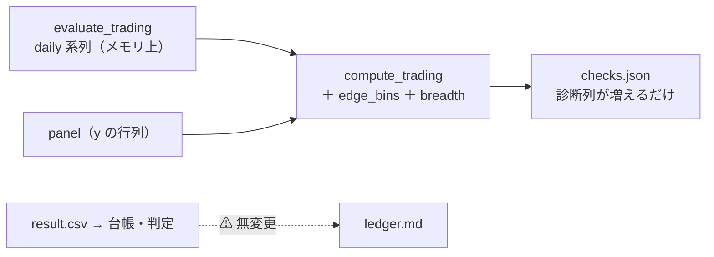

# 閾値売買の checks に診断列を足す（fold 2 等分の上乗せ符号・実効系列数)

作成日: 2026-09-11。派生元: [TODO「検証方式の改善の反映と実装」](../../../TODO.md)の子タスク。
規約: [rules.md 14-3](../../specs/experiments/feature-discovery/rules.md)（診断列 — ⚠ **採否には使わない**）／ 実測の根拠: [validation-power.md §3-1・§3-5](../../specs/experiments/feature-discovery/validation-power.md)。

## 1. 目的・背景

rules.md 14-3 が定めた 2 つの診断を、実行のたびに `checks.json` へ自動で残す。

1. **fold を日数 2 等分した上乗せ符号列**（5 fold なら 10 bin）— 偶然の全符号正 3.1% → 0.098%。保留の「割れ方」を読みやすくする
2. **実効系列数**（63 → 実測 4.71 本）— per_symbol の「勝ち銘柄 58/63」を独立な 58 勝と読み違える事故を防ぐ

⚠ **採否の判定（13-7 の 5 fold ＋ DSR）は一切変えない。** 台帳の列も変えない（checks.json だけ）。

> この図の主張: ⚠ **診断は実行時に 1 度だけ計算して checks.json に足す。** 判定の経路（result → 台帳）には触れない。

## 2. 対応方針

- `ail/validation/checks.py` の `compute_trading` に足す:
  - `edge_bins`: 最良手法の日次上乗せ（対 B&H。`daily` の fold 系列の差）を **fold 内で日数 2 等分**して集計。`{per_fold: 2, pattern, positive, bins, values, mean_bp, t}` を閾値ごとの entry に入れる。⚠ **fold 境界（強制清算の位置）を bin がまたがない**
  - `breadth`: 引数に `panel=None` を足し、y の ts × symbol 行列から `stats.effective_breadth` を 1 回計算して doc の最上位に入れる（閾値に依らない）。⚠ **n_obs は従来どおり検証日数のまま**（実効系列数は読み違え防止の併記であり、DSR の入力は変えない）
  - ⚠ **計算できないときは鍵ごと省く**（既存の原則。0 や null で埋めない）
- `cli/run.py`: `compute_trading(...)` に `panel=panel` を渡す（閾値売買は間引かないので panel = 全量）
- `cli/report.py` の `--recheck`: ⚠ **閾値売買の実行はとばす**（`checks.compute` は閾値で行が割れた result を pivot できず落ちる。日次系列も保存されていないので後埋めできない — 既存の落とし穴の明文化）
- ⚠ **既存 10 実行の checks.json は書き換えない**（日次系列が無く後埋め不能。重要 4 実行ぶんの 10・15 bin の実測は validation-power.md §3-1 に記録済み）。診断はこれから回す実行に付く

## 3. 影響範囲

| 対象 | 触るか |
| --- | :-: |
| `ail/validation/checks.py`（`compute_trading`） | 書く |
| `cli/run.py`（panel を渡す 1 行）／ `cli/report.py`（recheck のとばし） | 書く |
| `tests/test_trading.py` | 書く（追加のみ） |
| 判定（`catalog.judge`）・台帳・`runs/`・dashboard | ⚠ **触らない**（dashboard は checks.json の知らない鍵を無視する） |

## 4. テスト方針

- 単体: 合成 2 fold の daily で (1) bin が fold 内で切れて値の合計が fold 合計と一致 (2) pattern・positive・t の値 (3) B&H 系列が無い・長さ不一致では省く
- `compute_trading`: panel を渡すと `breadth` が付き、渡さなければ付かない。`edge_bins` が 3 閾値とも付く
- ⚠ **実データ検算**: 保存済み `trade_own_ridge_a` の result・summary・per_symbol ＋ 再現した daily 系列（scratchpad に保存済み）で `compute_trading` を呼び、`edge_bins` が validation-power.md §3-1 の実測（雑音行 10 bin: 00＋＋−−0000・2/10・t 0.18）と一致することを確かめる（リポジトリには残さない検算）
- 既存テストが全件そのまま通ること（`compute_trading` の引数追加は後方互換）
