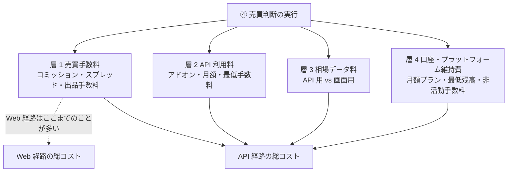
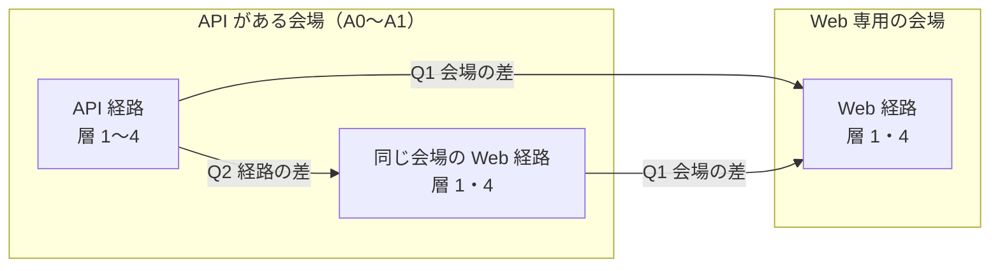
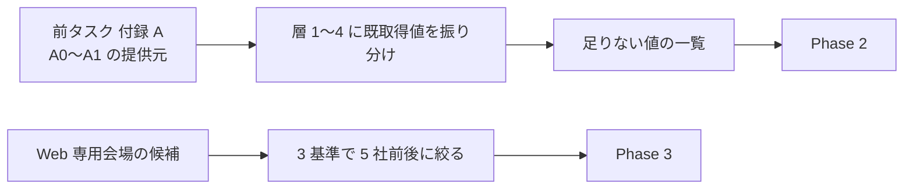
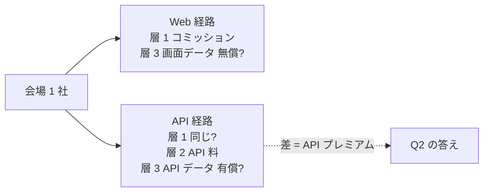

# API で売買可能なサービスの手数料と、Web の多くのサービスの手数料を比較する

作成日: 2026-09-02。
対象: [docs/specs/trading-api-availability.md](../../specs/trading-api-availability.md) 付録 A で **発注 API が A0〜A1** になった提供元（API 側）と、**Web 画面だけで売買する主要サービス**（Web 側）。商品クラスは同文書の P1〜P5 ＋ V3〜V6 の区分を引き継ぐ。

## 1. 目的と背景

### 1-1. 何を知りたいか

前タスクで「過去の取引データ → 予測モデル → リアルタイム価格 → 売買判断」の流れが **56 件中 51 件で成立**すると分かった。次に効くのは**コスト**である。API で発注できる経路が Web 画面の経路より高いなら、予測モデルの優位はそのプレミアムを上回って初めて意味を持つ。

問いは 2 つ。

| 問い | 中身 | 答えの形 |
| --- | --- | --- |
| **Q1** 会場の差 | 同じ商品クラスで、API がある会場の手数料は Web 専用の会場より高いか、安いか | 商品クラスごとの比較表と、差の中央値【公表値】 |
| **Q2** 経路の差 | 同じ会場の中で、**API 経路**は Web 経路より余計にかかるか（API 利用料・API 用データ料・プラン条件） | 会場ごとの「API プレミアム」【公表値】と、標準シナリオでの月額【推測】 |

⚠ **Q2 は前タスクで既に兆しが出ている。**IBKR は「data on the API is considered off-platform」で API 経由の相場は有償購読が必須（画面は無償）、Webull は OpenAPI 用の相場購読が別売り、Tradovate は API Access が有料アドオン、AMP の Rithmic API は $125/月。**「売買手数料が同じでも、API を使った瞬間にデータ料と API 料が乗る」**構造を数字で確かめる。

> この図の主張: 手数料は 4 層あり、Web 経路は上 1 層だけで済むことが多いが、API 経路は下 3 層が乗る。比較はこの 4 層を揃えてから行う。

### 1-2. 既に取れている値と、足りない値

前タスクの付録 A に手数料が散らばっている。**新規取得の前に、既取得分を層ごとに写す。**

| 提供元 | 既に取れている【公表値】 | 足りない |
| --- | --- | --- |
| Tradier | Lite $0/月（株 $0.35/取引・オプション $0.35/契約）、Pro $10/月、Pro Plus $35/月。先物は CQG $10/月・Rithmic $25/月 | — |
| tastytrade | 株 $0、株式オプション $1/契約 open（$10 上限/leg）・$0 close、先物 $1/契約、マイクロ $0.75、先物オプション $1.25、指数オプション $1、暗号資産 1% | — |
| Tradovate | $1.29/side（Free）、$0.99（Monthly $99）、$0.59（Lifetime $1,499）。ZR の清算 $0.19・取引所 $2.15・NFA $0.01 | API Access アドオンの正式料金（利用者投稿 $25/月は未確認） |
| AMP / Rithmic / CQG | Rithmic $100 ＋ $25/月 ＋ $0.10/契約。CQG IC $595 ＋ API Trading $245 ＋ Streaming $45/月。CME データ L1 $5・バンドル $15 | AMP の売買手数料 |
| IBKR | FIX 最低手数料 $1,500/月。データ: Network A/B/C 各 $1.50、OPRA $1.50、CME $1.55、TSX CAD 9.00、OTC $8.00。口座に $500 ＋ 購読料 | **売買手数料（Pro / Lite、株・オプション・先物・債券・FX）** |
| Alpaca | 発注 $0、SIP データ $99/月 | 暗号資産の手数料 |
| Public | API $0、暗号資産 0.60%→0.10%（ティア）、オプションは API 経由リベート $0.06/契約 | 債券・OTC の手数料 |
| Webull | 「API に追加料金なし」、相場購読は別売り | **OpenAPI 用の相場購読の金額**（ログイン後）、アプリ側の手数料 |
| moomoo | 「API に追加料金なし」、米国株データはプロモ中無償 | プロモ終了後の価格、アプリ側の手数料 |
| E*TRADE | API $0 | 売買手数料 |
| Robinhood | 暗号資産 API はティア制 | ティアの数値、MCP（Agentic 口座）の手数料 |
| Kraken / Coinbase | — | **maker / taker のティア表** |
| Kalshi / Polymarket US | — | **手数料の式**（Kalshi は約定額に比例する式） |
| OANDA / IBKR FX / tastyfx / FOREX.com | IBKR 0.08〜0.20 bps ＋ スプレッドなし | OANDA のスプレッド（主要ペア）と API License Fees の有無 |
| AWS RI | 売り手手数料 12% | — |
| Flett Exchange | NJ: DIY Seller $2.50/REC、REC Manager $6.50/REC、Buyer $5.00/REC | 他州 |
| eBay / TCGplayer / Steam / DMarket | Steam 5%（＋ゲーム側） | eBay の final value fee、TCGplayer の出品手数料、DMarket の手数料 |
| 取引所データ | CTA $1、UTP $1、Nasdaq Basic $0.50〜1、TotalView $15、OPRA $1.25、IEX TOPS $500 | — |

## 2. 定義

### 2-1. 手数料の 4 層

| 層 | 含めるもの | 含めないもの | 単位 |
| --- | --- | --- | --- |
| **層 1** 売買手数料 | コミッション（株あたり・契約あたり・取引あたり）、スプレッド（FX・暗号資産の simple 経路）、maker / taker、出品・落札・決済手数料 | ⚠ **規制費**（SEC Section 31・FINRA TAF・OCC・NFA）は会場によらず同額なので、**別表に 1 回だけ**書き比較からは外す | 1 取引あたり、または約定額に対する % |
| **層 2** API 利用料 | API アドオン、API 専用の月額プラン、FIX の最低手数料、サードパーティ経路（Rithmic・CQG）の月額 | — | 月額 |
| **層 3** 相場データ料 | **API 経路で現在値を受けるのに要る**購読料。画面（Web / アプリ）で同じデータが無償なら、その差を「API プレミアム」に数える | 遅延データ（15 分）は無償が普通なので数えない | 月額（非専門家） |
| **層 4** 口座・プラットフォーム維持費 | 月額プラン（Tradier Pro 等）、最低残高、非活動手数料、データ購読に要る残高条件（IBKR $500） | 税金・為替手数料・出金手数料 | 月額または条件 |

⚠ **スプレッドはコミッションと直接比較できない。**約定額 × スプレッド（片道）で金額に換算し、その前提（銘柄・時間帯・公表スプレッド）を必ず書く。⚠ **PFOF（注文回送の対価）は隠れたコスト**だが、金額を個人が取れないので**属性（受け取っているか否か、SEC Rule 606 報告の有無）として記録し、比較には入れない**。

### 2-2. 比較の単位 — 商品クラスごとに「代表取引」を 1 つ決める

比較は「1 取引あたり」と「月額」の 2 本立て。1 取引の代表を先に固定する。

| クラス | 代表取引【推測・仮置き】 | 理由 |
| --- | --- | --- |
| P1 上場株・ETF | 100 株・$50 の株を往復（約定額 $5,000 × 2） | 株あたり課金（IBKR）と取引あたり課金（Tradier）と $0 を同じ土俵に乗せる |
| P2 上場オプション | 1 契約を売って買い戻す（open ＋ close） | open / close で料金が違う社（tastytrade）がある |
| P3 先物 | ES 1 枚往復、マイクロ 1 枚往復 | 取引所・清算・NFA 費を分けて書く |
| P4 債券個別 | 米国債 $10,000 額面を買う | 額面あたりのマークアップか手数料か |
| P5 OTC・外国上場 | 1,000 株の OTC 株、100 株の TSX 株 | 外国株の別料金 |
| V3 暗号資産 | BTC $5,000 を成行で買って成行で売る（taker）、指値（maker）も併記 | maker / taker と simple 経路の差 |
| V4 予測市場 | $0.50 の契約 100 枚を買って決済まで持つ | 手数料が価格に依存する式 |
| V6 小売 FX | EUR/USD 10,000 通貨を往復 | スプレッド換算 |
| V5 専門マーケット | 1 件の出品と 1 件の購入 | 出品・落札・決済の 3 段 |

### 2-3. 月額シナリオ【推測】

前提条件（元手 $100,000・週 5〜15 時間）を引き継ぎ、取引頻度を 3 段で置く。

| シナリオ | 頻度 | 用途 |
| --- | --- | --- |
| **低** | 代表取引 ×4/月 | 日次〜週次の売買判断 |
| **中** | ×40/月 | 日次で複数銘柄 |
| **高** | ×400/月 | 日中の売買判断（⚠ 非表示利用・レート制限の条件に触れる領域） |

⚠ シナリオは比較のための物差しで、**実際の取引量を約束するものではない**。

## 3. 母集団

### 3-1. API 側 — 前タスクで A0〜A1 になった提供元

| クラス | 提供元 | 段階（前タスク） |
| --- | --- | --- |
| P1〜P2 | IBKR・Alpaca・Tradier・tastytrade・E*TRADE・Public・moomoo | A0 |
| P1〜P2 | Webull・Schwab | A1（⚠ Schwab は仕様がログイン壁の向こう。手数料は Web と同じとみなす） |
| P3 | IBKR・tastytrade・Tradovate（＋ AMP / Rithmic・Ironbeam は A1） | A0 / A1 |
| P4 | IBKR・Public | A0 |
| P5 | IBKR・Public・E*TRADE | A0 |
| V3 | Kraken・Coinbase・（Robinhood Crypto API） | A0 |
| V4 | Kalshi・Polymarket US | A0 |
| V6 | OANDA・IBKR・tastyfx（・FOREX.com A1） | A0 / A1 |
| V5 | AWS RI（購入 A0・出品 A1）・eBay（出品 A0）・DMarket（A0） | — |

### 3-2. Web 側 — 「多くのサービス」の選び方

⚠ **「多くの」を定義しないと終わらない。**次の基準で商品クラスごとに **5 社前後**に絞る。

| 基準 | 内容 |
| --- | --- |
| 1 | Web 画面（またはアプリ）で個人が売買でき、**個人向け発注 API を持たない**か、API があっても前タスクで A2〜A4 だった会場 |
| 2 | 手数料表が**ログイン無しで一次情報として読める** |
| 3 | 規模の上位（預かり資産・口座数・出来高の公表値、または業界団体の集計）。⚠ 順位の出典を書く。⚠ **2026-09-02 の Phase 1 で変更**: 各社の IR ページが 403/404 で Phase 1 では取れなかったため、規模の数字は Phase 3 で各社ページから付け、付かない社は落とさず「規模未確認」と書く |

候補（Phase 1 で確定。⚠ Ally は手数料表を切り出せず落とし、Gemini は API を持つので除外）: P1〜P2 は Schwab・Fidelity・Vanguard・Merrill Edge・Robinhood（アプリ）・SoFi；P3 は Schwab（thinkorswim）・E*TRADE（先物は Web のみ）・Plus500 US・Optimus Futures・NinjaTrader（デスクトップ）；P4 は Fidelity・Schwab・Vanguard・E*TRADE・TreasuryDirect；P5 は Fidelity・Schwab・E*TRADE・Vanguard；V3 は Coinbase（simple）・Robinhood・Cash App・PayPal・Kraken（simple）；V4 は Kalshi（Web。API 側と同一）・Polymarket US（Web）・Robinhood の予測市場；V6 は FOREX.com・tastyfx・OANDA（Web）・Schwab・IBKR（Web）；V5 は eBay・StockX・TCGplayer・Flett Exchange・Steam・Skinport・CSFloat・DMarket（Web）。⚠ Coinbase・FOREX.com・TCGplayer help・Kalshi の現行 PDF は 403/429 で取得経路が未確定（Phase 2・3 で別 URL を当て、読めなければ基準 2 で落とす）。

⚠ **同じ会場が両側に出るのは正しい。**Q2（経路の差）はまさに「同じ会場の API 経路と Web 経路」を比べる問いであり、IBKR・Webull・tastytrade・Kraken・Coinbase は両側に置く。

> この図の主張: 母集団は「会場 × 経路」の 2 軸。Q1 は横（会場の差）、Q2 は縦（経路の差）を読む。

## 4. 方針との関係

CLAUDE.md の 2026-08-27 方針変更により、**登録・契約・課金・実行は行わない**。この調査では次の線を引く。

| 行為 | 可否 | 帰結 |
| --- | --- | --- |
| 公式の手数料表・料金ページ・規約・606 報告を読む | ✅ 行う | **判定の主根拠**。すべて【公表値】（URL・取得日） |
| ログイン後にしか出ない料金（Webull OpenAPI 相場購読、Tradovate API Access、Schwab 開発者ポータル） | ❌ 取りに行かない | 「未確認」と書く。第三者の投稿は【未確認・利用者投稿】として別欄 |
| 実際に取引して手数料を【実測】する | ❌ 行わない | 本タスクに【実測】は存在しない |
| 規制費（SEC Section 31 等）の現行値 | ✅ 公表値を取る | 別表に 1 回 |

## 5. 成果物

| 項目 | 内容 |
| --- | --- |
| ファイル | `docs/specs/trading-fee-comparison.md`（新規） |
| 本体 | **商品クラス別の比較表**（会場 × 経路 × 層 1〜4、代表取引 1 回の金額と月額シナリオ 3 段） |
| §結論 | Q1・Q2 の答え。**API プレミアム**（API 経路 − Web 経路）の月額をクラスごとに【推測】で置く |
| 付録 A | 会場ごとの手数料カタログ（層 1〜4 の原文・URL・取得日） |
| 付録 B | 規制費の表（SEC Section 31・FINRA TAF・OCC・NFA・CME 取引所費）と、スプレッド換算の前提 |
| 付録 C | 取れなかった値（ログイン壁・未公表）の一覧と、第三者情報の別欄 |
| 図 | 各 Phase に最低 1 枚（CLAUDE.md のドキュメント規約） |

⚠ **前タスクの成果物（`trading-api-availability.md`）は書き換えない。**付録 A の値を写し、追加取得分を新文書に置く。前タスクと数値がずれたら新文書側に「取得日が新しい」と書いて両方残す。

## Phase 1 — 定義と母集団を固定する（見積もり 1.5h）

- **Step 1-1**: §2-2 の代表取引と §2-3 の月額シナリオを確定する。前提条件（$100,000・週 5〜15 時間）との整合を書く
- **Step 1-2**: API 側の提供元を前タスク付録 A から機械的に写し（A0〜A1 のみ）、既取得の手数料（§1-2）を層 1〜4 に振り分ける
- **Step 1-3**: Web 側を §3-2 の基準で商品クラスごとに 5 社前後に確定する。順位の出典を書く。⚠ 手数料表が読めない社はここで落とす

> この図の主張: 母集団は前タスクの付録 A を起点にし、Web 側だけ新しく選ぶ。既取得の値を先に写してから足りない分を取りに行く。

## Phase 2 — API 側の手数料を一次情報で埋める（見積もり 3h）

- **Step 2-1**: 層 1 — 各社の手数料表（IBKR Pro / Lite、E*TRADE、Webull、moomoo、Alpaca 暗号資産、Public 債券・OTC、Kraken / Coinbase の maker-taker ティア、Kalshi・Polymarket US の式、OANDA のスプレッド、eBay・TCGplayer・DMarket）
- **Step 2-2**: 層 2 — API 利用料（Tradovate API Access、Rithmic・CQG、IBKR FIX、OANDA License Fees の有無）。ログイン後の値は「未確認」
- **Step 2-3**: 層 3 — API 経路の相場データ料を前タスク付録 A-7 から写し、**同じ会場の画面経路で無償かどうか**を各社のヘルプで確認する（IBKR「off-platform」、Webull「OpenAPI 用は別売り」が既知）
- **Step 2-4**: 層 4 — プラン月額・最低残高・非活動手数料
- **Step 2-5**: 規制費（SEC Section 31 の現行料率、FINRA TAF、OCC、NFA、CME の取引所・清算費）を公表値で 1 回取る

## Phase 3 — Web 側の手数料を一次情報で埋める（見積もり 3h）

- **Step 3-1**: Phase 1 で確定した Web 専用会場の層 1・4 を取る
- **Step 3-2**: 両側にいる会場（IBKR・Webull・tastytrade・Kraken・Coinbase・Kalshi・eBay 等）の **Web 経路**の層 1・3・4 を取る（⚠ Coinbase は simple と Advanced で層 1 が違う。Kraken も同様）
- **Step 3-3**: PFOF の属性（受領の有無・606 報告の URL）を P1〜P2 の会場について記録する。⚠ 比較には入れない

> この図の主張: 同じ会場の 2 経路は、層 1 が同じでも層 2・3 で差が出る。ここが Q2 の答えになる。

## Phase 4 — 比較と試算（見積もり 2h）

- **Step 4-1**: 商品クラスごとに「代表取引 1 回」の金額を会場 × 経路で並べる。スプレッドは §2-1 の換算で金額にする
- **Step 4-2**: 月額シナリオ 3 段で層 1〜4 を合算し、**API プレミアム**（API 経路 − 同クラスで最安の Web 経路）を出す【推測】
- **Step 4-3**: Q1・Q2 の答えを 1 行ずつ書く。⚠ 「高い / 安い」は代表取引とシナリオの前提付きで書き、断定しない
- **Step 4-4**: 前タスクの「成立 51 件」に**コストの注記**を付けられるか検討する（例: P1 42 件は最安 Web 経路と API 経路の差が月 $X）。⚠ 前タスクの文書は書き換えず、新文書側に対応表を置く

## Phase 5 — 成果物にまとめる（見積もり 1.5h）

- **Step 5-1**: `docs/specs/trading-fee-comparison.md` を §5 の構成で書く
- **Step 5-2**: 全数値に URL・取得日・【公表値】/【推測】/【未確認】を付ける。ログイン後の値と第三者投稿は付録 C に隔離する
- **Step 5-3**: 検算 — API 側の提供元が前タスク付録 A の A0〜A1 と 1:1、Web 側が §3-2 の 3 基準を満たす、月額の合算がシナリオ × 層の積になっている
- **Step 5-4**: `overview.md` に 1 行追加。TODO.md → DONE.md、プランを `docs/plans/archive/` へ

## 6. 影響範囲

| 対象 | 扱い |
| --- | --- |
| `docs/specs/trading-fee-comparison.md` | ✅ **新規作成**（唯一の成果物） |
| `docs/specs/overview.md` | ✅ 1 行追加 |
| `docs/specs/trading-api-availability.md` | ❌ 書き換えない。付録 A の値を参照するだけ |
| `docs/specs/market-data-availability.md`・`online-tradable-assets.md` | ❌ 書き換えない |
| `TODO.md` / `DONE.md` | ✅ 更新 |
| コード | ❌ 変更なし。試算はスクラッチ領域の一時スクリプトで行い、リポジトリに残さない |

## 7. 検証方針

**実行しないプロジェクトなので「テスト」は無い。**代わりに次の 5 点で確からしさを担保する。

| # | 検証 | 方法 |
| --- | --- | --- |
| 1 | **母集団のずれが無い** | API 側が前タスク付録 A の A0〜A1 と 1:1。Web 側が §3-2 の 3 基準を満たし、落とした社に理由がある |
| 2 | **層を混ぜていない** | 各値が層 1〜4 のどれか 1 つに入り、規制費は別表にだけある。スプレッドは換算前提つき |
| 3 | **同じ物差しで比べている** | 代表取引と月額シナリオが全会場で同じ。open / close・maker / taker の区別を落としていない |
| 4 | **断定と推測を分ける** | 手数料の値はすべて【公表値】（URL・取得日）。月額と API プレミアムは【推測】。ログイン後の値は【未確認】で付録 C |
| 5 | **前タスクと矛盾しない** | 付録 A から写した値が原文と一致。ずれたら取得日つきで両方残す |

## 8. 作業量とコストの見積もり

| Phase | 内容 | 見積もり |
| --- | --- | --- |
| 1 | 定義と母集団 | 1.5h |
| 2 | API 側の手数料（層 1〜4 ＋ 規制費） | 3h |
| 3 | Web 側の手数料と同一会場の Web 経路 | 3h |
| 4 | 比較と試算 | 2h |
| 5 | 成果物と検算 | 1.5h |
| | **合計** | **約 11h**【推測】 |

| 費目 | 金額 |
| --- | --- |
| 調査の実施コスト | **0 円**。登録・契約・課金・取引を行わないため（§4） |

## 9. 未確定・リスク

| # | 内容 | 扱い |
| --- | --- | --- |
| 1 | ⚠ **ログイン後にしか出ない料金がある**（Webull OpenAPI 相場購読、Tradovate API Access、Schwab 開発者ポータル） | 「未確認」。第三者投稿は付録 C に隔離し、比較表の本体には入れない |
| 2 | ⚠ **スプレッドとコミッションの換算に前提が要る** | §2-1 の換算式と、使った公表スプレッド（銘柄・時間帯）を必ず併記 |
| 3 | ⚠ **PFOF は金額が取れない** | 属性として記録し、比較に入れない |
| 4 | ⚠ **代表取引と月額シナリオは仮置き**で、結論が前提に依存する | 3 段のシナリオで感度を示す。「高い / 安い」を前提なしに断定しない |
| 5 | ⚠ **「多くのサービス」の範囲が広がりすぎる** | §3-2 の 3 基準で商品クラスごとに 5 社前後に固定し、Phase 1 で確定してから動かさない |
| 6 | 手数料表の改定が速い（前タスクでも PDT 廃止・eBay UA 改定・IEX 値上げがあった） | 取得日を必ず書く |
| 7 | ⚠ 前タスクの付録 A と数値がずれる可能性 | 新文書側に取得日つきで両方残し、前タスクの文書は書き換えない |
