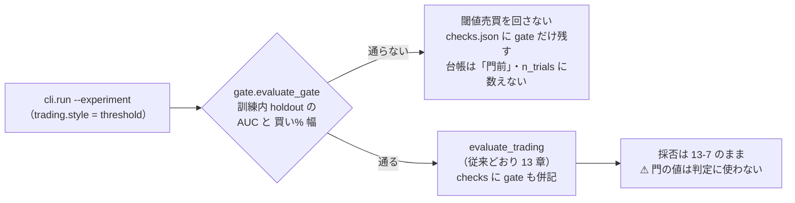

# 前置きの門の実装（rules.md 14-5）

作成 2026-09-11。派生元: TODO「検証方式の改善の反映と実装」の子タスク。
検討記録: [validation-power.md §5](../../specs/experiments/feature-discovery/validation-power.md)（指標の実測・水準の由来・n_trials の理屈）／ 規約: [rules.md 14-5](../../specs/experiments/feature-discovery/rules.md)（正本。水準は利用者決定で**事前固定**）。

## 目的・背景

閾値売買の追試 24 試行は、訓練内 holdout の 2 指標（AUC・買い% 幅)を見れば **1 つも回さずに済んだ**（validation-power.md §5-3）。無駄な試行は n_trials を増やし、以後の全手法の DSR を下げる。そこで「確率に情報が無い手法は閾値売買を回さない」門を実装する。

- 水準（**事前固定**・2026-09-11 利用者決定）: **holdout AUC ≥ 0.52 かつ 買い% p05-p95 幅 ≥ 20 点**（5 fold の中央値）。以後、結果を見て動かさない
- **門前で落ちた手法は n_trials に数えない**（利用者決定）。規律 3 つ: (1) 門が先・門前の検証は回さない (2) 門前も台帳に残す (3) 後から回したら普通に数える

> この図の主張: ⚠ **門は「回すかどうか」の足切りにだけ使い、採否には使わない。**

## 対応方針

### Phase 1: 門の計算（`ail/validation/gate.py`）

- 新モジュール `ail/validation/gate.py`。水準はモジュール定数 `AUC_MIN = 0.52` / `WIDTH_MIN_PT = 20.0`（事前固定。テストで値を釘付けにする）
- fold は `evaluate_trading` と同じ `splits.date_edges` ＋ `folds_by_dates`。**各 fold の訓練分割だけ**を使い、⚠ **検証 fold には特徴量にも触れない**（テストで「最終 fold の検証区間を壊しても門の値が変わらない」ことを確かめる）
- fold ごとに: 選別 → `tail_holdout`（較正と同じ場所。13-2 の 2）→ head で fit した予測を tail に出し、
  - **AUC** = `roc_auc_score(y_holdout > 0, pred)`（片側ラベルで計算できない fold は None）
  - **買い% 幅** = holdout 予測に Platt を当てた買い% の p95 − p05（Platt は `calibrate.fit` と同じ計算を切り出して共有する）
- 手法（基準線以外の selector）ごとに 5 fold の中央値 → 両方の水準を満たせば通過
- ⚠ **門は (A) プール形式で 1 回だけ計算する**（§5-1。(B) 銘柄別の実験でもプールで測る）
- ⚠ holdout が 1 fold も切れない（訓練が薄い）ときは**素通し**（注記を残す。回せば普通に試行として数えるので DSR が甘くなる向きではない）

### Phase 2: `cli/run.py` の gate 節

- trading 分岐の先頭で `gate.evaluate_gate` を呼ぶ
  - 全手法が門前 → **`evaluate_trading` を回さず**、checks.json に `gate` だけ書いて終える（summary.csv / result.csv は書かない ＝ 検証の数字を持たない）
  - 一部が門前 → 通った手法だけ selectors に残して回す。**n_trials に足すのは通った手法 × 閾値数だけ**
  - 通った実行でも checks.json に `gate`（指標の実測値）を併記する（⚠ 採否には使わない）
- `--ignore-gate` フラグ（規律 3 の「後から回す」用）: 門の値は記録するが全手法を回す。回した手法は**普通に試行として数える**（門前の行は作られない ＝ summary に載るから）

### Phase 3: 台帳の「門前」判定（`ail/catalog.py`・`cli/ledger.py`）

- `_read_run` が checks.json も読む。summary.csv が無くても **gate で全手法が落ちた実行は拾う**（隠さない）
- `_run_trials`: gate の blocked にあり summary に載っていない手法に、数字なし（閾値 "—"）の **門前の行**を足す
- `judge` / `_judge_trading`: 門前の行は判定 **「門前」**・理由に実測値と水準・「n_trials に数えない」を書く
- `is_trial`: 門前の行は **False**（数えない）
- `JUDGE_RULES` に門前の行を追加（台帳 §1 の表に載る）
- `cli/ledger.py`: §0・§2 の行数の内訳に「門前」を分けて出す（0 件なら文言を足さない ＝ 既存の台帳は変わらない）
- rules.md 付録の実装対応表の 14 の行を更新（14-3 診断列 ＋ 14-5 門は実装済みに）

### 影響範囲

| 対象 | 変更 | 既存への影響 |
| --- | --- | --- |
| `ail/models/calibrate.py` | Platt の fit を `fit_from_predictions` に切り出し | 挙動不変（既存テストで確認） |
| `ail/validation/gate.py` | 新規 | — |
| `cli/run.py` | trading 分岐に gate 節・`--ignore-gate` | 門を通る実験は従来と同じ結果 ＋ checks に `gate` が増える |
| `ail/catalog.py` | checks 読み・門前の行・判定・is_trial | ⚠ **既存 91 試行・判定は 1 行も変わらない**（テストで確認） |
| `cli/ledger.py` | 行数の内訳に門前 | 門前 0 件なら生成物は §1 の表 1 行の追加だけ |
| dashboard | 変更なし | 門前の実行（summary 無し）は `load_run` が None を返し検証として数えない（現状の仕様どおり） |

## テスト方針（Phase 4）

`tests/test_gate.py` を新設。

1. **水準の釘付け**: `AUC_MIN == 0.52` / `WIDTH_MIN_PT == 20.0`（事前固定。動かすなら rules.md 14-5 に追記してから）
2. **雑音は落ち、先読みは通る**（§5-1 の形）: 雑音パネル → 門前、`LEAK_y` 入りパネル → 通過
3. **検証 fold に触れない**: 最終 fold の検証区間の y を壊しても門の値が変わらない
4. **catalog**: 門前の行が立つ・判定「門前」・`is_trial` False・台帳の markdown に出る・summary に載った手法には門前の行が立たない（`--ignore-gate` 相当）
5. **後方互換**: 既存の全テスト（門前 0 件の実 runs/ で 91 試行・判定不変）が通る
6. 仕上げに `cli.report --catalog` で ledger.md を再生成（差分は §1 の判定表 1 行のみのはず）
