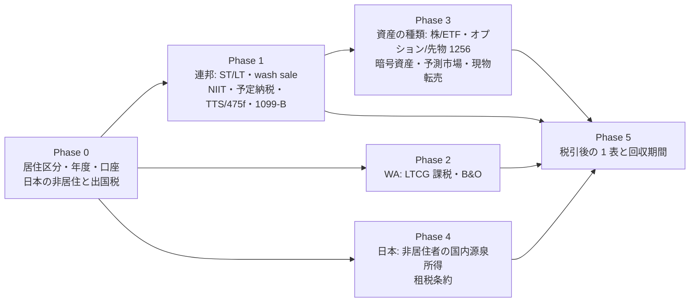

# オンラインで売買したときの納税を調べる（米国連邦 ＋ WA 州）

作成: 2026-09-07

## 目的・背景

[trading-fee-comparison.md](../../specs/trading-fee-comparison.md) は手数料を 4 層で比べたが、税は 1 層も入っていない。
手数料 $0 の会場でも税引後の手取りは変わるので、[online-tradable-assets.md](../../specs/online-tradable-assets.md) の出口比較と
回収期間の試算に「税」の層を足す。**税務助言ではなく調査資料**として書き、金額・税率は【公表値】に出典（URL・取得日）、
当てはめは【推測】と明示する。

前提: 税務上の居住地は米国・ワシントン州シアトル（overview §6）。日本は非居住（2026-09-05 本人申告。住民票は除票済み）。

## 対応方針

税は「誰が（居住区分）→ 何を（資産の種類）→ いつ（保有期間・年度）→ どこに（連邦 / WA / 日本）」で決まる。
この順に一次情報を当て、最後に手数料 4 層へ「税」を足した税引後の表にする。

- 一次情報の範囲: IRS（Publication 519 / 550 / 544 / 505、Topic 409 / 429、Form 8949 / Schedule D / 6781 / 8960 / 1099-B / 1099-DA の説明）、
  WA DOR（capital gains tax、B&O）、RCW 82.87、日本の所得税法（2 条・3 条・60 条の 2・161 条・164 条）と国税庁のタックスアンサー、日米租税条約
- 調べ方: 4 系統（連邦の骨格 / WA 州 / 日本側 / 資産の種類ごとの差）に分けて並行で当たり、URL と取得日、引用した数値を控える
- 成果物: `docs/specs/trading-tax.md`（1 ファイル）。Phase ごとに節を置き、各節に最低 1 枚の図。一覧と属性は表
- 利用者の事実（citizen / resident alien の別、対象年度、日本に残る資産の有無）は本人にしか分からないので、**分岐として書き、確認欄を残す**

## 影響範囲

新規 `docs/specs/trading-tax.md`。既存の [trading-fee-comparison.md](../../specs/trading-fee-comparison.md) と
[online-tradable-assets.md](../../specs/online-tradable-assets.md) には、税の層への参照を 1 行ずつ足すだけ。overview §7 に成果物を 1 行。

## テスト方針

- 数値は必ず【公表値】＋出典か【推測】の印を持つ。出典の無い数値を残さない
- 税引後の表は、手数料比較と同じ前提（同じ売買回数・同じ金額）で並べ、回収期間がどれだけ動くかを 1 行で言える形にする
- 最後に「利用者が確認する事項」の表を置き、そこが埋まれば判定が閉じる構造にする
