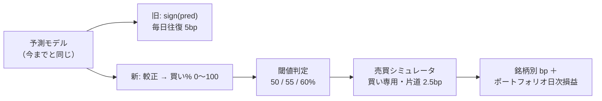
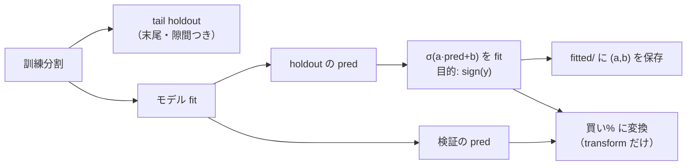
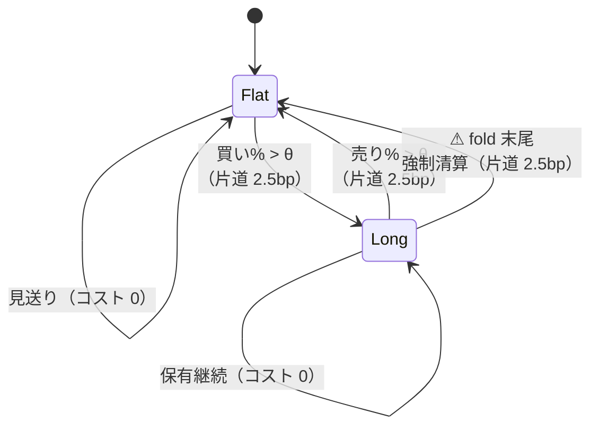
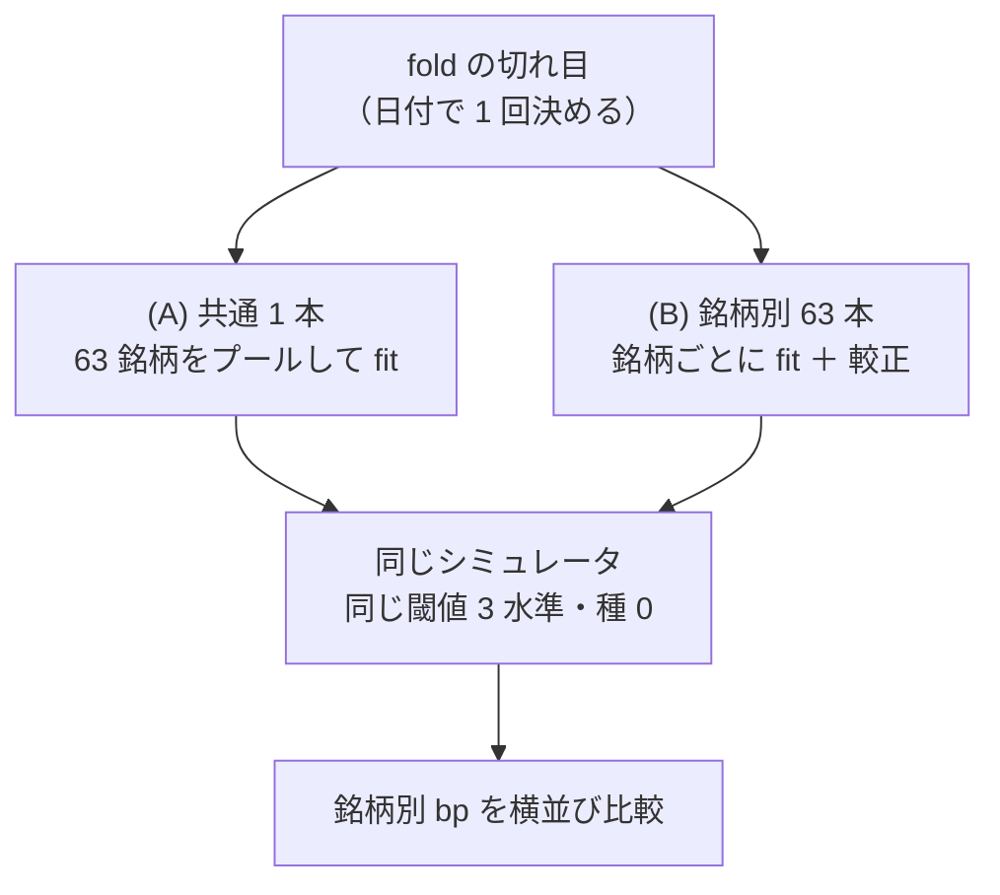
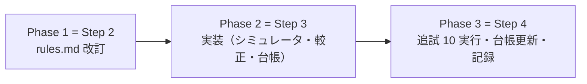

# 検証の仕方を実際の取引に近づける（閾値つき売買・買い専用・銘柄別 bp）

作成日: 2026-09-10。派生元: [TODO](../../TODO.md) の同名タスク（利用者の指示 2026-09-10 ＋ 追記 4 件）。
規約の正本: [rules.md](../specs/experiments/feature-discovery/rules.md) ／ 台帳: [ledger.md](../specs/experiments/feature-discovery/ledger.md) ／ 直近の検証: [gpu-models.md](../specs/experiments/gpu-models.md)。

> ⚠ **これは検証方式の変更であり、資金は動かさない**（2026-08-27 の方針）。データは取得済みの日足だけを使う。

## 0. 目的・背景

いまの検証（`ail/validation/metrics.py`）は **毎日必ず符号どおりに張り、毎日往復 5bp を引く**。実際の取引と乖離が大きい。
利用者の指示に従い、次の 5 点を変える（親タスクの ①〜⑤）。

| # | 今 | 変更後 |
| ---: | --- | --- |
| ① | 毎日必ず張る | **閾値を超えた日だけ売買**（見送りができる）。閾値は 3 パターンを事前固定 |
| ② | 空売りあり | **買い専用**。売り指標は保有中の手仕舞いにだけ効く |
| ③ | 出力は符号だけ | **買い / 売りの強さを 0〜100% で出す** |
| ④ | 全セルの単純平均 bp | **銘柄ごとの bp**（期末に全ポジションを清算してから確定） |
| ⑤ | 入力は own_ 中心 | **63 銘柄横断 ＋ 外生（経済指標・天気など）**。モデルは (A) 共通 1 本と (B) 銘柄別 63 本の両方 |

> この図の主張: ⚠ **変わるのは「予測の後ろ」である。** 予測を確率にし、閾値で建て、売買した日だけコストを引く。予測モデル・分割・パージは変えない。

前提の実測（2026-09-10、`data/features/own_2018/d.parquet`）:
日足パネル 135,962 行・63 銘柄・銘柄あたり中央値 **2,161 日**・上昇日率 **P(y > 0) = 0.524**【実測】。
walk-forward 5 fold なら 1 fold ≈ 360 日、⚠ **(B) の最初の fold の訓練は約 360 日/銘柄しかない**（消せない薄さ。§1-6）。

---

## 1. 設計の決定（TODO の論点への答え）

### 1-1. 閾値 — 同じ値の組 3 つ（3 × 3 = 9 にしない）。値は 50 / 55 / 60%

| 決定 | 中身 |
| --- | --- |
| 振り方 | ⚠ **買いと売りは同じ閾値 θ**。θ ∈ **{50, 55, 60}%** を事前固定して 3 つとも回し、⚠ **3 つとも台帳に載せる**（rules 11 章 規約 4） |
| 意味 | 買い% > θ で建てる（未保有のとき）／ 売り% > θ で手仕舞う（保有中のとき）。売り% = 100 − 買い%（§1-2）なので、θ=55 は「買い% > 55 で建て、買い% < 45 で手仕舞い、45〜55 は何もしない」＝ ヒステリシス帯 |

理由:

| # | 理由 |
| ---: | --- |
| 1 | 売り% = 100 − 買い% と決めた（§1-2）ので、売り閾値を独立に振る自由度は「保有帯の非対称化」だけで、そこに仮説が無い。⚠ **3 × 3 = 9 にすると n_trials が 3 倍に膨らむ**だけ |
| 2 | ⚠ **θ ≥ 50 なら買いと売りの条件が同時に立たない**（買い% > θ と 100 − 買い% > θ は排他）。θ < 50 は同じ日に両方が立ち、優先規則という新たな自由度が要る。TODO の例の 30% を採らないのはこのため |
| 3 | 値の根拠: 較正後の確率は 0.5 近傍に集中する見込み【推測。根拠は既存の実測 — 的中率 0.52 前後・IC 0.03 前後・P(y>0) = 0.524】。70% は取引ゼロになる公算が大きく、比較にならない。50 は「符号どおり」に相当する下限、55・60 で「見送り」の効果を見る |

⚠ **事前固定であり、結果を見て動かさない。** 後から水準を足すなら、その数だけ n_trials に足す（良かった閾値だけ報告すると必ず甘くなる）。

### 1-2. 確率化 — 分類モデルに替えず、回帰値を Platt 較正する

| 決定 | 中身 |
| --- | --- |
| 変換 | 買い% = σ(a·pred + b) を **P(y > 0) の較正**として fit（Platt スケーリング＝ ロジスティック回帰 1 変数）。**売り% = 100 − 買い%** |
| どこで fit | ⚠ **訓練分割の内側だけ**（rules 3 章 B）。木系は in-sample 予測が過信になるので、`ail/models/holdout.py` の **tail holdout の末尾**で fit する。holdout が取れないほど訓練が薄いとき（(B) の最初の fold）は訓練予測で代用し、⚠ **どちらで fit したかを記録に残す** |
| 再現 | 係数 (a, b) は `runs/<実行>/fitted/` に残す。⚠ **次の実行では読み込まない** |
| (B) では | 較正も銘柄ごと（モデルと同じ粒度） |

⚠ **分類モデル（predict_proba）に替えない理由**: モデルの軸が動くと「検証方式の変更」と交絡し、既存実行（Ridge / LightGBM / MLP の回帰）と比べられなくなる。モデルを替えるのは別の処置＝ 別の試行であり、本タスクの処置は**検証方式だけ**にする。

> この図の主張: ⚠ **較正は「標本から学ぶ変換」である。** fit は訓練の内側、検証には transform だけ（rules 3 章 B と同じ形）。

### 1-3. 売買シミュレータ — 買い専用の状態機械・コストは売買した日だけ片道ずつ

> この図の主張: ⚠ **ポジションは 0 か 1 の 2 状態だけ。** 買い増しなし・空売りなし・期末は強制清算。

| # | 規約 | 理由 |
| ---: | --- | --- |
| 1 | 足 t の特徴量 → 足 t の終値で執行 → その日のポジションは y_t（t → t+1 終値の対数リターン）を得る | 旧方式の `sign(pred) × y` と同じ時間の向き。先読みしない |
| 2 | ポジションは銘柄ごとに 0 か 1。⚠ **買い増し・空売りなし**。未保有で売り指標が立っても何もしない | 利用者の指示 ②。「持っていなければ売れない」 |
| 3 | コストは `cost_bp / 2` = **2.5bp を建てた日と手仕舞った日にだけ**引く（`cost_bp` = 5.0【推測。E8 §1-4 の往復値】は config のまま） | 利用者の指示。「実際に売買した日だけ片道ずつ」 |
| 4 | ⚠ **fold の末尾で強制清算**（売り指標に関係なく手仕舞い、片道コストを引く） | 利用者の指示。「検証期間の最終ではポジションを全て売る」。fold は独立した検証期間なのでポジションを跨がせない |
| 5 | 銘柄 s・fold f の**銘柄別純利 bp = 日次純利（対数、bp）の合計**。あわせて取引回数・保有日率・見送り日数を記録 | 利用者の指示 ④。「1 つの予想モデルでそれぞれの銘柄を売買したときの bp」 |
| 6 | ⚠ **閾値 3 水準は同じ fit を使い回す**（閾値は予測の後ろにしか効かない）。1 fold 1 fit で 3 通りをシミュレートする | 計算量を 3 倍にしない。⚠ **ただし試行としては 3 つと数える**（§1-7） |

### 1-4. 基準線 — 「期初に買って期末に売るだけ」を同じシミュレータで回す

| 基準線 | 実装 | 何を潰すか |
| --- | --- | --- |
| **期初買い・期末売り（B&H）** | ⚠ **買い% を常に 100 にした定数指標**としてシミュレータに流す（別実装を作らない） | ドリフト。⚠ **これを超えない手法は「何も学んでいない」**（TODO の指示） |
| 直前リターンの符号 | 買い% = own_ret_1 > 0 なら 100、そうでなければ 0 | 素朴なモメンタム。回転が多い＝ コストの効き方の対照 |

- 旧「常に上」との対応: ポジション系列は B&H と同じで、⚠ **コストだけが正しくなった形**（旧方式では「ほとんど回転しないのに毎日往復 5bp を引かれる」歪みがあり、注記で補っていた。新方式では 1 fold あたり片道 2 回 = 5bp しか払わないので、注記が要らなくなる）
- 乱択・「全部使う」の扱いは従来どおり（選別の基準線。基準線は試行に数えない）

### 1-5. 採否の物差し — 判定はポートフォリオの「上乗せ」で行い、銘柄別 bp は成果物として残す

⚠ **銘柄別 bp は独立でない**（同じ日の 63 銘柄は相関。SPY は 48 社を丸ごと含む）。63 本の bp で採否を測ると多重検定になり、
勝った銘柄だけを見る誘惑は生存バイアス（rules 12 章 限界 1）も踏む。だから:

| 量 | 定義 | 使いみち |
| --- | --- | --- |
| 銘柄別 bp | 銘柄 × fold × 閾値ごとの累計純利 bp（§1-3 の 5） | ⚠ **成果物**（利用者の求める出力）。`per_symbol.csv` に全部残し、中央値・四分位・勝ち銘柄数を summary に載せる。⚠ **採否には使わない** |
| ポートフォリオ日次純利 | 63 銘柄の日次純利 bp の**等加重平均**（銘柄別系列を横に平均した 1 本） | ⚠ **採否はこれで測る。** 等加重にまとめた時点で銘柄間の相関は織り込まれるので、標本数は「検証日数」で数える（行数 63 × 日数 を使わない。旧方式の実効標本の割引と同じ向きで、より保守的） |
| **上乗せ** | fold ごとの（手法のポートフォリオ純利 bp − B&H のポートフォリオ純利 bp） | ⚠ **fold の符号と t はこれで見る。** 新方式では B&H でも純利が正になりうる（ドリフト）ので、⚠ **純利そのものの符号では「買って持っただけ」と区別できない** |
| DSR | SR はポートフォリオ日次純利系列（fold 連結）から。⚠ **歪度・尖度も系列から実測して渡す**（旧実装は 0 / 3 の既定値だった）。n_obs = 検証日数（≈ 1,800【推測。2,161 × 5/6】）、n_trials = 台帳の数（§1-7） | 多重検定の割引 |

判定規則（新方式の行に適用。`catalog.judge` の新表）:

| 条件 | 判定 | 備考 |
| --- | --- | --- |
| 上乗せ > 0 かつ fold の上乗せ符号が全部正 | 採る | ⚠ **DSR を通すまでは根拠「中」が上限**（rules 11 章 規約 3） |
| 上乗せ > 0 だが符号が割れる | 保留 | 平均だけ正（規約 5） |
| 上乗せ ≤ 0 | 落とす | ⚠ **基準線以下 = 何も学んでいない** |

> この図の主張: ⚠ **採否の流れは旧方式と同じ 3 段で、測る量だけが「対 B&H の上乗せ」に変わる。**

### 1-6. (A) 共通 1 本と (B) 銘柄別 63 本 — 同じシミュレータ・同じ fold・同じ種

| # | 決定 |
| ---: | --- |
| 1 | ⚠ **fold の切れ目は「日付」で 1 回決めて両形式に配る。** 今の `walk_forward` は行 rank で切るので、(B)（1 銘柄のパネル）と (A)（63 銘柄のパネル）で境目がずれうる。全銘柄共通の日付集合から edge を先に決め、両形式ともその日付で切る |
| 2 | (A) 共通 1 本: 今の形（63 銘柄をプールして 1 モデル）。入力は銘柄ごとなので指標は銘柄ごとに違う |
| 3 | (B) 銘柄別: 対象銘柄の行だけで fit ＋ 較正（× 63 × fold）。⚠ **最初の fold の訓練は約 360 日/銘柄**【実測から計算】。LightGBM は `min_child_samples=100` で退化しうるが、⚠ **ハイパーパラメータは動かさない**（振った水準の数だけ n_trials が増える。gpu-models プラン §1 と同じ決定）。薄さは消せない限界としてそのまま記録する |
| 4 | 種は seed = 0（既存と同じ）。パージ・エンバーゴも既存と同じ（横断入力の実行はエンバーゴ 1 本） |
| 5 | 銘柄別 bp を (A)(B) で横並びに比べる表を成果物にする（同じ銘柄・同じ fold・同じ閾値のセルどうし） |

> この図の主張: ⚠ **(A) と (B) で違うのは fit の範囲だけ。** fold・種・シミュレータ・閾値・較正の手順は共有する。

### 1-7. n_trials の数え方 — 形式も閾値も処置として数える

| 決定 | 中身 |
| --- | --- |
| 1 試行の単位 | ⚠ **手法 × モデル × 形式 (A/B) × 閾値 × 特徴量の層 × 粒度 × 地平 × 検証方式**。形式と閾値はどちらも「選べた自由度」なので処置として数える（数え落とすと必ず甘くなる） |
| 台帳の鍵 | `catalog.KEY` に **検証方式**（毎日往復 / 閾値売買）・**形式**（共通 / 銘柄別）・**閾値** の 3 列を足す。旧実行は（毎日往復・共通・—）として読む。⚠ **既存の台帳 67 試行が 1 行も変わらないことをテストで確認する**（gpu-models §2-3 と同じ後方互換の手順） |
| `catalog.is_trial` | 新方式の行は閾値 1 水準ごとに 1 試行。基準線（B&H・直前符号・乱択）は数えない。「全部使う × モデル」は従来どおりモデルが処置なら数える |
| 見積り | Phase 3 の追試で **2 モデル × 2 形式 × 3 閾値 × 2 入力 = 24 試行**追加 → n_trials は 67 → **91**【推測】。DSR はさらに厳しくなるが、それが正しい向き |

### 1-8. leak 対照 — 新シミュレータでも毎回通す

`LEAK_` 列を混ぜた表で回し、⚠ **上乗せが跳ね上がる**（未来を知っていれば上がる日だけ持てるので、B&H を大きく超える）ことを確認する。
⚠ **跳ねなければシミュレータの配線（較正 → 閾値 → 状態機械のどこか）が壊れている**。旧方式の的中率 99% に相当する検査。

---

## 2. 対応方針（Phase 分け）

TODO の Step 2〜4 に 1 対 1 で対応する。

> この図の主張: ⚠ **規約 → 実装 → 追試の順を崩さない。** 規約より先に実装すると、数字が出てから物差しを決めることになる。

### Phase 1（= TODO Step 2）: rules.md の改訂

- rules.md に新章「**13. 閾値つき売買の検証（2026-09-10）**」を足す。中身は本プラン §1 の決定（閾値・較正・シミュレータ・基準線・物差し・n_trials）を規約の言葉で書く
- ⚠ **旧指標との対応表**を入れる: 旧「純利 bp（毎日往復）」と新「ポートフォリオ純利 bp（閾値売買）」は**別の物差しで、数字を直接比べない**。橋渡しは「同じモデル・同じ表で両方式を回した対」（Phase 3 の 4a）だけで行う
- 台帳の新旧の区別: 「検証方式」列で分ける。旧行は再計算しない・消さない
- rules.md 冒頭の変更規約（変えるときは「なぜ変えたか」と「変える前の結果をどう扱うか」を同時に書く）に従い、なぜ = 利用者の指示・実際の取引への接近、変える前の結果 = 残す（無効化しない）を明記する

### Phase 2（= TODO Step 3）: 実装

| # | 作るもの | 中身 |
| ---: | --- | --- |
| 1 | `ail/validation/simulate.py`（新規） | §1-3 の状態機械。入力 = 買い% 系列・y・閾値、出力 = 日次純利系列・取引記録。⚠ **純粋関数にして単体テストを厚くする** |
| 2 | `ail/models/calibrate.py`（新規） | §1-2 の Platt 較正。`tail_holdout` を使い回す。(a, b) と fit 元（holdout / train）を返す |
| 3 | `ail/validation/splits.py` | 日付基準の fold edge（§1-6 の 1）を足す。⚠ **既存の `walk_forward` は触らない**（旧実験の再現用） |
| 4 | `cli/run.py` | config の `[trading]` 節（`style = "threshold"` / `thresholds = [50, 55, 60]` / `form = "shared" | "per_symbol"`）があれば新方式で評価。⚠ **無ければ従来どおり**（後方互換） |
| 5 | 記録形式 | `result.csv` に 閾値 列を足す（行 = 手法 × fold × 閾値）。**`per_symbol.csv`（新規）**: 行 = 手法 × 閾値 × fold × 銘柄（純利 bp・取引回数・保有日率）。`summary.csv` は 手法 × 閾値 で集約 |
| 6 | `ail/validation/checks.py` | 新方式の checks.json: `style` / 閾値ごとの {best・fold（上乗せ）・`edge_vs_bh`・dsr・取引回数} ＋ 銘柄別 bp の要約（中央値・四分位・勝ち銘柄数）。⚠ **重い計算は実行時に 1 度だけ**（管理画面は読むだけ、の原則を守る） |
| 7 | `ail/catalog.py` | §1-7 の鍵拡張・`is_trial`・新 judge 表（§1-5） |
| 8 | 管理画面の表示 | `dashboard/app/experiments.py`・`dashboard/vibetab.py` が `edge_vs_bh` と閾値・銘柄別要約を表示できるようにする（⚠ **checks.json の写しを出すだけ。画面側で数え直さない**） |
| 9 | config | `config/experiment/` に 8 本: `trade_{own,ownex}_{ridge,lgbm}_{a,b}.toml`（§Phase 3 の表）。⚠ **TOML の平の key はテーブルより上**（rules 10 章 規約 1） |

### Phase 3（= TODO Step 4）: 既存の最良手法を新検証で追試する

実行の一覧（全部 日足 2018・地平 1 日・5 fold・種 0・選別は「全部使う」1 本に絞る。⚠ **選別の優劣は決着済みで、本タスクの処置は検証方式**）:

| # | 入力 | モデル | 形式 | ねらい |
| ---: | --- | --- | --- | --- |
| 1〜4 | own_（35 本） | Ridge / LightGBM | (A) / (B) | ⚠ **橋渡し**。旧最良（LightGBM 全部使う ＋1.52bp【実測】）と同じ表・同じ fold で、差を「検証方式だけの差」として読む |
| 5〜8 | own_ ＋ cs_ ＋ rel_ ＋ ex_（横断＋外生） | Ridge / LightGBM | (A) / (B) | ⚠ **本命**（利用者の指示 ⑤ の形）。ex_ は既存の取得済み系列（ecb・treasury・noaa・usgs。天気は noaa）。⚠ **ll_ は N² の列爆発、im_ は偽薬と区別できず終了済みなので入れない**。エンバーゴ 1 本 |
| 9〜10 | own_ の leak 表 | LightGBM | (A) / (B) | ⚠ **配線の検査**（§1-8）。両形式で跳ねること |

- MLP は追試しない（own_ で LightGBM と同型・断面で悪化が実測済み。増やすだけ n_trials が甘くなる）
- 計算量【推測】: (B) は 63 銘柄 × 5 fold の fit だが 1 fit の行数が 360〜1,800 行と小さく、1 実行 数分〜数十分。GPU 不要
- 終わったら: 台帳を吐き直し（n_trials 67 → 91 前後）、結果を **`docs/specs/experiments/threshold-trading.md`（新規）** に記録（gpu-models.md と同じ構成: 配線 → 結果 → 検査 → 判定）。旧指標との差は橋渡しの対（1〜4）の表で残す

---

## 3. 影響範囲

| 場所 | 触るもの | ⚠ 触らないもの |
| --- | --- | --- |
| `experiments/feature-discovery` | `ail/validation/{simulate(新),checks,splits}.py`・`ail/models/calibrate.py(新)`・`ail/catalog.py`・`cli/run.py`・`config/experiment/trade_*.toml(新 8 本)`・`tests/` | ⚠ **`ail/validation/metrics.py`（旧方式の再現用に残す）・既存の実験 TOML・`data/` の各層・既存の `runs/`** |
| `docs` | `rules.md`（§13 追加）・`ledger.md`（再生成）・`threshold-trading.md`（新規）・`feature-discovery.md`（入口にリンク 1 行） | 既存の結果の数字 |
| `dashboard` | `app/experiments.py`・`vibetab.py`（`edge_vs_bh`・閾値・銘柄別要約の表示）・対応するテスト | ⚠ **読むだけの原則（pandas / scipy を入れない）・vibeboard 本体（3010）** |

## 4. テスト方針

| 対象 | テスト |
| --- | --- |
| シミュレータ（単体） | 手作りの確率系列で: 閾値未満は取引しない ／ 未保有の売り指標は何もしない（買い専用） ／ コストは建てた日・手仕舞った日だけ片道 2.5bp ／ fold 末尾の強制清算 ／ θ ≥ 50 で買いと売りが同時に立たない ／ 閾値を上げると取引回数が単調に減る |
| 較正 | fit は訓練の内側だけ（検証の行を渡すと落ちる引数検査） ／ 単調性（pred が大きいほど買い% が大きい） ／ 決定性（同じ種でビット一致） |
| 基準線 | B&H のポジション系列が「全期間 1」＋ 期末清算になり、コストが 1 fold あたりちょうど 5bp であること |
| 配線 | leak 表で上乗せが跳ねる（(A)(B) 両形式） ／ (A) と (B) の fold 境界の日付が一致する |
| 台帳 | ⚠ **既存 67 試行が 1 行も変わらない**（後方互換） ／ 新方式の行が 閾値 × 形式 で割れて数えられる ／ 新 judge 表の 3 分岐 |
| 回帰 | 既存の pytest（130 件）と dashboard の pytest が全部通ること |

## 5. 予想される結果の形（過大解釈しないための注記）

- 較正後の確率は 0.5 近傍に集中する見込み【推測】→ θ=55 / 60 は取引が少なく B&H に漸近し、θ=50 は旧方式の符号売買に近づく
- ⚠ **「どの閾値でも B&H と区別がつかない」は §9 の結論（価格だけからは方向が出ない）と整合的な帰結であり、それ自体が成果**（検証方式を実際の取引に近づけても結論が変わらないことの確認）
- ⚠ **跳ねて良くなったら、まず配線を疑う**（rules 11 章 規約 7）。特に「θ が高いほど良い」は「取引しない = コストを払わないだけ」の可能性を先に潰す（取引回数を必ず併記する）
